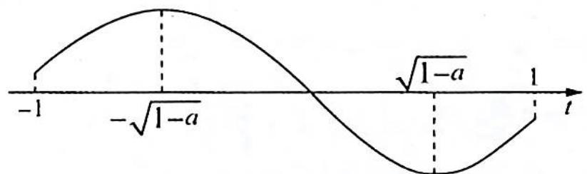
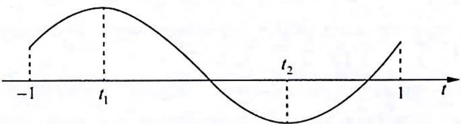

> [!faq]- 《高考数学培优40讲》例题解析
>
> > [!success]- **【答案】** 详见解析
>
> > [!note]- **【分析】**
> > 本题未单列分析。
>
> > [!note]- **【解析】**
> > 解析 (1)要证明 $f(x)$ 的图像关于点(0,1)对称,等价于证明 $f(x) + f(-x) = 2$ .
> > 由 $f(x) = x^{3} + 3(a - 1)x + 1, f(-x) = -x^{3} - 3(a - 1)x + 1, f(x) + f(-x) = 2$ ，因此函数 $f(x)$ 的图像关于点 $(0,1)$ 对称。
> > $$
> > g (x) = f (x - 1) = (x - 1) ^ {3} + 3 (a - 1) (x - 1) + 1, x \in [ 0, 2 ].
> > $$
> > 令 $t = x - 1 \in [-1, 1]$ , 得 $g(t) = t^3 + 3(a - 1)t + 1, t \in [-1, 1], g'(t) = 3t^2 + 3(a - 1) = 3(t^2 + a - 1), t \in [-1, 1]$ .
> > - **①**：当 $a \geqslant 1$ 时, $g'(t) \geqslant 0$ , 此时 $g(t)$ 在 $[-1, 1]$ 上单调递增, 所以 $\left|g(t)\right|_{\max} = \max \left\{\left|g(-1)\right|, \left|g(1)\right|\right\}$ , 又 $\left|g(-1)\right| = \left|-3(a - 1)\right| = 3(a - 1), \left|g(1)\right| = 3a - 1$ , 且 $3a - 1 > 3(a - 1)$ , 所以, 此时 $\left|g(t)\right|_{\max} = 3a - 1$ .
> > - **②**：当 $a \leqslant 0$ 时, $g'(t) \leqslant 0$ , 此时 $g(t)$ 在 $[-1, 1]$ 上单调递减, 所以 $|g(t)|_{\max} = \max \{|g(-1)|, |g(1)|\} = \max \{3 - 3a, 1 - 3a\} = 3 - 3a$ .
> > - **③**：当 $0 < a < 1$ 时, 令 $g'(t) = 0$ , 得 $t_1 = -\sqrt{1 - a}, t_2 = \sqrt{1 - a}$ , 因此 $g(t)$ 在 $(-1, -\sqrt{1 - a})$ , $(\sqrt{1 - a}, 1)$ 上单调递增, 在 $(- \sqrt{1 - a}, \sqrt{1 - a})$ 上单调递减.
> > 且 $g(-1) = 3(1 - a) > 0, g(1) = 3a - 1, g(t_1) = g(-\sqrt{1 - a}) > g(-1) > 0, g(t_2) =$ $g(\sqrt{1 - a}) = -2(1 - a)\sqrt{1 - a} + 1.$ 如图(a)所示.
> > (i) 若 $g(1) = 3a - 1 \leqslant 0$ ，即 $0 < a \leqslant \frac{1}{3}$ ，此时 $|g(t_1)| = 2(1 - a)\sqrt{1 - a} + 1, |g(t_2)| = 2(1 - a)\sqrt{1 - a} - 1$ ，显然 $|g(t_1)| = g(t_1) > |g(t_2)|$ ，此时， $|g(t)|_{\max} = |g(t_1)| = 2(1 - a) \cdot \sqrt{1 - a} + 1$ .
> > (ii) 若 $g(1) = 3a - 1 > 0$ ，即 $\frac{1}{3} < a < 1$ ，此时 $|g(t)|_{\max} = \max \{ |g(t_1)|, |g(t_2)|, |g(1)|\} = \max \{ 2(1 - a)\sqrt{1 - a} + 1, |-2(1 - a)\sqrt{1 - a} + 1 |, 3a - 1 \}$ . 如图(b)所示.
> > 
> > 图(a)
> > 
> > 图(b)
> > 又 $g(t_{1}) - |g(t_{2})| = 2(1 - a)\sqrt{1 - a} +1 - |1 - 2(1 - a)\sqrt{1 - a}| > 0$ ，所以只需比较 $g(t_{1})$ 和 $|g(1)|$ 的大小关系.
> > $$
> > h (a) = g (- \sqrt {1 - a}) - g (1) = 2 (1 - a) \sqrt {1 - a} - 3 a + 2, \frac {1}{3} <   a <   1, h ^ {\prime} (a) = - 2 \sqrt {1 - a} +
> > $$
> > $2(1-a)\cdot\frac{1}{2}\cdot\frac{-1}{\sqrt{1-a}}-3=-3\sqrt{1-a}-3<0$ ，函数 $h(a)$ 在 $\left(\frac{1}{3},1\right)$ 上单调递减，且 $h\left(\frac{1}{3}\right)>0$ ， $h(1)=-1<0,h\left(\frac{3}{4}\right)=2\times\frac{1}{4}\times\frac{1}{2}+2-\frac{9}{4}=0$ ，因此当 $\frac{1}{3}<a<\frac{3}{4}$ 时， $h(a)>0$ ，即 $g(-\sqrt{1-a})>g(1)$ ，此时 $\left|g(t)\right|_{\max}=g(-\sqrt{1-a})=2(1-a)\sqrt{1-a}+1$ ；当 $\frac{3}{4}\leqslant a<1$ 时， $h(a)\leqslant0$ ，即 $g(-\sqrt{1-a})\leqslant g(1)$ ，此时 $\left|g(t)\right|_{\max}=g(1)=3a-1.$
> > 综上所述， $\left|f(x-1)\right|_{\max}=\left|g(t)\right|_{\max}=\begin{cases}3-3a,&a\leqslant0\\2(1-a)\sqrt{1-a}+1,&0<a<\frac{3}{4}\\3a-1,&a\geqslant\frac{3}{4}\end{cases}$
> > ## 评注
> > 本题说难也难, 种类多, 过程长, 计算量大; 但本题说简单也简单, 思路很容易想到, 计算处理也没有太大的难度, 唯一的难点是判断 $2(1 - a) \sqrt{1 - a} - 3a + 2$ 的正负. 但就算想不到分子有理化的技巧, 老老实实利用平方, 比较 $2(1 - a) \sqrt{1 - a}$ 的平方和 $3a - 2$ 的平方的大小, 也不算繁杂. 通过这道题, 我们可以对分类讨论的方法朴实和功能强大有一个清醒的认识.
> > 设连续函数 $f(x)$ 在 $[a, b]$ 上的最小值为 $m$ ，最大值为 $n$ ，即 $m \leqslant f(x) \leqslant n$ ，则 $\left|f(x)\right|_{\max} = \max \{|m|, |n|\}$ ，本例给 $f(x)$ 整体加绝对值，实质是研究 $f(x)$ 的单调性及函数的最大与最小值问题。
