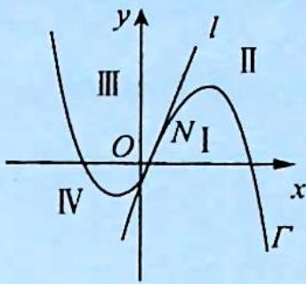
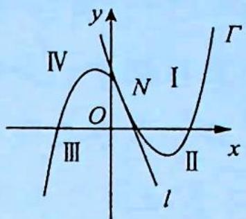

## 4.3 切线问题

## 研究密钥

1. 过三次曲线的对称中心且与该三次曲线相切的直线有且仅有一条, 而过三次曲线上除对称中心外的任一点与该三次曲线相切的直线有两条.

由于三次曲线都是中心对称曲线,因此,将其对称中心移至坐标原点,便可将三次函数的解析式简化为 $f(x)=ax^{3}+bx$ .

若 $M(x_{1},y_{1})$ 是三次曲线 $f(x)=ax^{3}+bx$ 上的任一点，设过 M 的切线与曲线 $y=f(x)$ 相切于 $(x_{0},y_{0})$ ，则切线方程为 $y-y_{0}=f'(x_{0})(x-x_{0})$ 。因点 M 在此切线上，故 $y_{1}-y_{0}=f'(x_{0})\cdot(x_{1}-x_{0})$ ，又 $y_{0}=ax_{0}^{3}+bx_{0},y_{1}=ax_{1}^{3}+bx_{1}$ ，所以 $ax_{1}^{3}+bx_{1}-(ax_{0}^{3}+bx_{0})=(3ax_{0}^{2}+b)\cdot(x_{1}-x_{0})$ ，整理得 $(x_{0}-x_{1})^{2}(2x_{0}+x_{1})=0$ ，解得 $x_{0}=x_{1}$ 或 $x_{0}=-\frac{x_{1}}{2}$ 。

综上所述, 当点 $M$ 是对称中心即 $x_{1} = 0$ 时, 过点 $M$ 作曲线的切线切点是唯一的, 且为 $M$ , 故只有一条切线; 当点 $M$ 不是对称中心即 $x_{1} \neq 0$ 时, 过点 $M$ 作曲线的切线可产生两个不同的切点, 故必有两条切线, 其中一条就是以 $M$ 为切点 (亦即曲线在点 $M$ 处) 的切线.

由此可见,不仅切线与曲线的公共点可以多于一个,而且过曲线上点的切线也不一定唯一.

2. 求以曲线上的点 $(x_{0}, f(x_{0}))$ 为切点的切线方程的求解步骤: ①求出函数 $f(x)$ 的导数 $f'(x)$ ; ②求切线的斜率 $f'(x_{0})$ ; ③写出切线方程 $y - f(x_{0}) = f'(x_{0})(x - x_{0})$ , 并化简.

3. 问题延伸: 过三次函数 $f(x) = ax^{3} + bx^{2} + cx + d$ 的图像外一点 $P(x_{0}, y_{0})$ 可以作几条切线?

设 $f(x)=ax^{3}+bx^{2}+cx+d(a>0)$ 在对称中心 $N\left(-\frac{b}{3a},f\left(-\frac{b}{3a}\right)\right)$ 处的切线为 l，曲线 $\Gamma$ 及 l 把坐标平面分成 I、II、III、IV 四个区域，如图 1 (a<0)、图 2 (a>0) 所示.

(1) 当定点 $P$ 在对称中心 $N$ 或在 I 和 III 区域时, 过点 $P$ 的切线有且仅有一条;

(2)当定点 $P$ 在曲线上或在切线 $l$ 上且不在对称中心 $N$ 时, 过点 $P$ 的切线有两条;

(3)当定点 $P$ 在 $\mathrm{II}$ 和 $\mathrm{IV}$ 区域时, 过点 $P$ 的切线有三条.

$a <   0$
图1

$a > 0$
图 2
![[高中/总复习/专题/高考数学培优40讲/高考数学培优40讲-01-函数与导数/第4讲_三次函数的图像与性质/三次函数的性质/4_3_切线问题/例题/Q00010126.md]]
