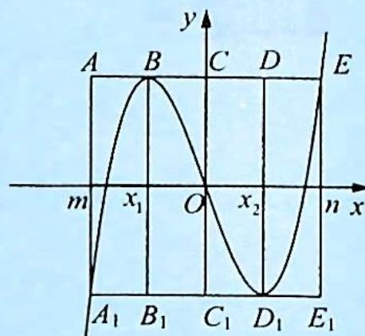

## 4.4 等分面积

## 研究密钥

由于三次函数 $f(x)=ax^{3}+bx^{2}+cx+d(a\neq0)$ 总可以通过配方或平移变为 $f(x)=px^{3}+qx$ 的形式, 不妨设 p>0, $f'(x)=3px^{2}+q=0$ , 令 $\Delta=-12pq>0$ , 即 q<0, 则 $x_{1}=-\sqrt{-\frac{q}{3p}}$ , $x_{2}=\sqrt{-\frac{q}{3p}}$ . 如图所示.

令 $f(x_{1}) = f(n), f(x_{2}) = f(m), x_{1} \neq n, x_{2} \neq m.$

$f(m)=f(x_{2})$ ，即 $pm^{3}+qm=px_{2}^{3}+qx_{2}, p(m^{3}-x_{2}^{3})+q(m-x_{2})=0$ ，则 $p(m-x_{2})(m^{2}+mx_{2}+x_{2}^{2})+q(m-x_{2})=0$ ，即 $(m-x_{2})[p(m^{2}+mx_{2}+x_{2}^{2})+q]=0.$

因为 $m \neq x_{2}$ ，所以 $p(m^{2} + mx_{2} + x_{2}^{2}) + q = 0, p(m^{2} + mx_{2} + x_{2}^{2}) - \sqrt{A_{1} B_{1} C_{1}}$ 3 $px_{2}^{2} = 0$ ，则 $m^{2} + mx_{2} + x_{2}^{2} - 3x_{2}^{2} = 0$ ，即 $m^{2} + mx_{2} - 2x_{2}^{2} = 0$ ，有 $(m + 2x_{2})(m - x_{2}) = 0$ 。

而 $m \neq x_2$ ，故 $m = -2x_2$ 。同理 $n = -2x_1$ 。

又 $x_{1} = -x_{2}$ ，则 $m = 2x_{1}, n = 2x_{2}, |x_{1} - m| = |x_{1}| = |x_{2}| = |n - x_{2}|$ . 故 $S_{\text{矩形} ABB_1A_1} = S_{\text{矩形} BCC_1B_1} = S_{\text{矩形} CDD_1C_1} = S_{\text{矩形} DEE_1D_1}$ .

![[高中/总复习/专题/高考数学培优40讲/高考数学培优40讲-01-函数与导数/第4讲_三次函数的图像与性质/三次函数的性质/4_4_等分面积/例题/Q00010127.md]]
![[高中/总复习/专题/高考数学培优40讲/高考数学培优40讲-01-函数与导数/第4讲_三次函数的图像与性质/三次函数的性质/4_4_等分面积/例题/Q00010128.md]]
