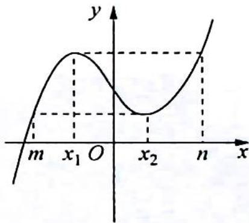

> [!faq]- 《高考数学培优40讲》例题解析
>
> > [!success]- **【答案】** D
>
> > [!note]- **【分析】**
> > 分析 ▶ 根据 $f(x)=x^{3}+ax+b$ 的单调性可得对任意的 $x\in[m,n]$ , $f(x)_{\min}=f(m)$ ,$f(x)_{\max}=f(n), x_{1}=-\sqrt{-\frac{a}{3}}$ 为函数 $f(x)$ 的极大值点， $x_{2}=\sqrt{-\frac{a}{3}}$ 为函数 $f(x)$ 的极小值点，由 $f(x_{1})=f(n)$ ，将 $x_{1}$ 和n代入函数，化简可得 $n+2x_{1}$ 为定值，同理可得 $m+2x_{2}$ 为定值。
>
> > [!note]- **【解析】**
> > 解析 当 $a \geqslant 0$ 时, $f'(x) = 3x^2 + a \geqslant 0$ , 此时, 函数 $f(x)$ 在 $\mathbf{R}$ 上为增函数.
> > 当 $x_{1}, x_{2} \in (m, n)$ 时， $f(x_{1}) < f(n), f(x_{2}) > f(m)$ ，不合乎题意，所以， $a < 0$ 。由 $f'(x) = 0$ 可得 $x = \pm \sqrt{-\frac{a}{3}}$ 。
> > 当 $x < -\sqrt{-\frac{a}{3}}$ 或 $x > \sqrt{-\frac{a}{3}}$ 时， $f'(x) > 0$ ；当 $-\sqrt{-\frac{a}{3}} < x < \sqrt{-\frac{a}{3}}$ 时， $f'(x) < 0$ .
> > 所以, 函数 $f(x)$ 的单调递增区间为 $\left(-\infty, -\sqrt{-\frac{a}{3}}\right), \left(\sqrt{-\frac{a}{3}}, +\infty\right)$ , 单调递减区间为 $\left(-\sqrt{-\frac{a}{3}}, \sqrt{-\frac{a}{3}}\right)$ .
> > 如图所示,对任意的 $x \in [m, n]$ ，恒有 $f(m) \leqslant f(x) \leqslant f(n)$ ， $f(x)_{\min} = f(m)$ ， $f(x)_{\max} = f(n)$ 。又当 $x_{1}, x_{2} \in (m, n)$ 且满足 $f(x_{1}) = f(n)$ ， $f(x_{2}) = f(m)$ ，所以， $x_{1}$ 为函数 $f(x)$ 的极大值点， $x_{2}$ 为函数 $f(x)$ 的极小值点，则 $x_{1} = -\sqrt{-\frac{a}{3}}$ ， $x_{2} = \sqrt{-\frac{a}{3}}$ 。
> > 
> > 由 $f(x_{1}) = f(n)$ 可知 $x_{1}^{3} + ax_{1} + b = n^{3} + an + b$ ，故 $(x_{1}^{3} - n^{3}) + a(x_{1} - n) = 0$ ，即 $(x_{1} - n)\cdot$ $(x_{1}^{2} + nx_{1} + n^{2} + a) = 0$ ，又 $x_{1}\neq n$ ，故 $x_{1}^{2} + nx_{1} + n^{2} + a = 0.$
> > 因为 $x_{1} = -\sqrt{\frac{-a}{3}}$ ，可知 $a = -3x_1^2$ ，所以 $n^2 +nx_1 - 2x_1^2 = 0$ ，即 $(n - x_{1})(n + 2x_{1}) = 0$ ，得 $n+$ $2x_{1} = 0.$ 同理 $m + 2x_{2} = 0.$
> >
> > 故选 **D**.
