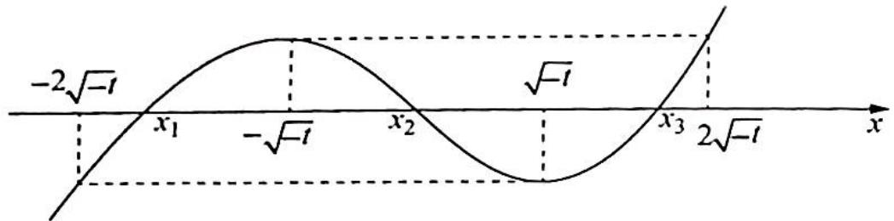

> [!faq]- 《高考数学培优40讲》例题解析
>
> > [!success]- **【答案】** 详见解析
>
> > [!note]- **【分析】**
> > 本题未单列分析。
>
> > [!note]- **【解析】**
> > 解析 (1)由题意得 $f'(x) = x^2 + t$ .
> > - **①**：当 $t \geqslant 0$ 时, $f'(x) \geqslant 0$ , 则 $f(x)$ 在 $\mathbf{R}$ 上单调递增, 无单调递减区间;
> > - **②**：当 t<0 时， $f(x)$ 在 $(- \sqrt{-t}, \sqrt{-t})$ 上单调递减，在 $(-∞, -√-t), (√-t, +∞)$ 上单调递增.
> > (2)如下图所示,由(1)知函数 $f(x)$ 有三个零点,因此 t<0.
> > 因为 $f(x)$ 在 $(- \sqrt{-t}, \sqrt{-t})$ 上单调递减，在 $(- \infty, -\sqrt{-t}), (\sqrt{-t}, +\infty)$ 上单调递增，且 $f(x)$ 有三个不同的零点 $x_{1}, x_{2}, x_{3}$ ，所以 $f(x)$ 的极大值为 $f(-\sqrt{-t}) = t - \frac{2}{3} t \sqrt{-t}$ ，令 $t - \frac{2}{3} t \sqrt{-t} > 0$ 得 $t < -\frac{9}{4}$ . 故 $t$ 的取值范围为 $\left(-\infty, -\frac{9}{4}\right)$ .
> > 
> > 依题意知 $-2\sqrt{-t} < x_{1} < -\sqrt{-t} < x_{2} < \sqrt{-t} < x_{3} < 2\sqrt{-t}$ , 且 $f(x)$ 在 $(- \sqrt{-t}, \sqrt{-t})$ 上单调递减, $f(x_{2}) = 0$ , $f(0) = t < 0$ , 则 $f(0) < f(x_{2})$ , 所以 $x_{2} < 0$ .
> > 那么 $x_{1} + 2x_{2} + 3x_{3} = x_{1} + x_{2} + x_{3} + x_{2} + 2x_{3} <   0 + x_{2} + 2x_{3} <   2x_{3} <   4\sqrt{-l}.$
