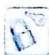

## 4.5 单调性与最值

## 研究密钥

三次函数的导数为二次函数,根据二次函数的正负判断三次函数的单调性,根据二次函数的零点可得三次函数的极值点,比较区间端点值和极值可得最值.

![[高中/总复习/专题/高考数学培优40讲/高考数学培优40讲-01-函数与导数/第4讲_三次函数的图像与性质/三次函数的性质/4_5_单调性与最值/例题/Q00010129.md]]
![[高中/总复习/专题/高考数学培优40讲/高考数学培优40讲-01-函数与导数/第4讲_三次函数的图像与性质/三次函数的性质/4_5_单调性与最值/例题/Q00010130.md]]
![[高中/总复习/专题/高考数学培优40讲/高考数学培优40讲-01-函数与导数/第4讲_三次函数的图像与性质/三次函数的性质/4_5_单调性与最值/例题/Q00010131.md]]
