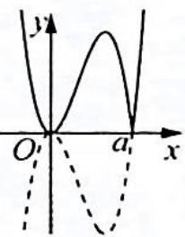
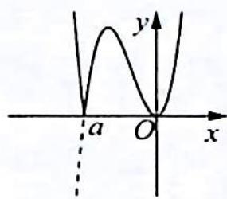

> [!faq]- 《高考数学培优40讲》例题解析
>
> > [!success]- **【答案】** 详见解析
>
> > [!note]- **【分析】**
> > 分析 ▶ 函数 $f(x)$ 的一个极值点是 x=0，对 a 分类讨论 $f(x)=x^{2}|x-a|$ 的单调递增区间.
>
> > [!note]- **【解析】**
> > 解析 $f(x)=x^{2}|x-a|=\left\{\begin{aligned}x^{2}(x-a),&x\geqslant a\\ -x^{2}(x-a),&x<a\end{aligned}\right.$
> > - **①**：当 $a > 0$ 时, 如图1所示, 由 $f'(x) = -3x^2 + 2ax = 0$ 得 $x = 0$ 或 $x = \frac{2a}{3}$ , 欲使函数 $f(x) = x^2 |x - a|$ 在区间[0,2]上单调递增, 只需 $x = \frac{2a}{3} \geqslant 2$ , 即 $a \geqslant 3$ .
> > - **②**：当 a<0 时,如图2所示, $f(x)=x^{2}|x-a|$ 在区间 $[0,2]$ 上单调递增,满足题意.
> > - **③**：当 $a=0, f(x)=x^{3}$ 区间 $[0,2]$ 上单调递增显然成立.
> > 综上可知,实数 a 的取值范围是 $(-∞,0]∪[3,+∞)$ .
> > 
> > 图1
> > 
> > 图2
