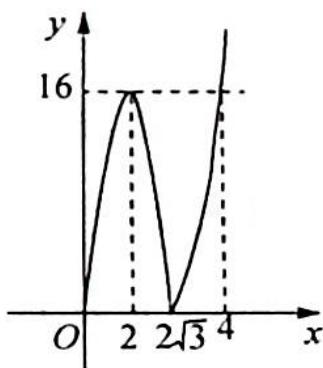

> [!faq]- 《高考数学培优40讲》参考答案
>
> > [!success]- **【答案】** 详见解析
>
> > [!note]- **【分析】**
> > 本题未单列分析。
>
> > [!note]- **【解析】**
> > 解法一: 易知当 $0 \leqslant x \leqslant 2$ 时, $f(x)$ 单调递增; 当 $2 \leqslant x \leqslant 2\sqrt{3}$ 时, $f(x)$ 单调递减; 当 $x \geqslant 2\sqrt{3}$ 时, $f(x)$ 单调递增, 且 $f(2) = f(4) = 16$ .
> > (1) 当 $0 < m \leqslant 2$ 时, $f(x)$ 在区间 $[0, m]$ 上单调递增, 所以 $-m(m^2 - 12) = am^2$ , $a = -m + \frac{12}{m} \in [4, +\infty)$ .
> > (2) 当 $2 < m \leqslant 4$ 时, $am^2 = 16, a = \frac{16}{m^2} \in [1, 4)$ .
> > (3) 当 $m > 4$ 时, $m(m^2 - 12) = am^2$ , $a = m - \frac{12}{m} \in (1, +\infty)$ .
> > 综上所述， $a \geqslant 1$ .
> > 解法二:仅考虑函数 $f(x)$ 在 $x \geqslant 0$ 时的情况, 可知 $f(x) = \begin{cases} 12x - x^{3}, & 0 \leqslant x < 2\sqrt{3} \\ x^{3} - 12x, & x \geqslant 2\sqrt{3} \end{cases}$ ,
> > 函数 $f(x)$ 在 $x = 2$ 时取得极大值16. 令 $x^{3} - 12x = 16$ , 解得 $x = 4$ , 作出函数的图像如图所示.
> > 函数 $f(x)$ 的定义域为 $[0, m]$ , 值域为 $[0, am^2]$ , 分为以下情况考虑:
> > (1) 当 0 < m < 2 时，函数的值域为 $[0, m(12 - m^{2})]$ ，有 $m(12 - m^{2}) = am^{2}$ ，
> > 所以 $a=\frac{12}{m}-m$ ，又 0<m<2，所以 a>4。
> > 
> > (2) 当 $2 \leqslant m \leqslant 4$ 时, 函数的值域为 $[0, 16]$ , 有 $am^2 = 16$ , 所以 $a = \frac{16}{m^2}$ , 因为 $2 \leqslant m \leqslant 4$ , 所以 $1 \leqslant a \leqslant 4$ .
> > (3) 当 $m > 4$ 时, 函数的值域为 $[0, m(m^2 - 12)]$ , 有 $m(m^2 - 12) = am^2$ , 所以 $a = m - \frac{12}{m}$ , 又 $m > 4$ , 所以 $a > 1$ .
> > 综上所述,实数 a 的取值范围是 $a \geqslant 1$ .
