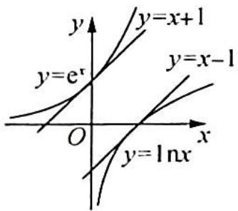

> [!faq]- 《高考数学培优40讲》例题解析
>
> > [!success]- **【答案】** 详见解析
>
> > [!note]- **【分析】**
> > 分析 ▶ 思路一(分而治之): 含指数、对数函数形式的不等式证明常分离指、对函数, 分离 $e^{x}$ 和 $\ln x$ 后 $e^{x} > \ln x + 2$ , 两边分别再与幂函数配对, 使其函数极值点可求, 证明左边函数的最小值大于等于右边函数的最大值即可.
> >
> > 思路二(合而歼之): 不分离 $e^{x}$ 和 $\ln x$ ，由于对 $e^{x}-\ln x$ 求导后 $e^{x}-\frac{1}{x}=0$ 是超越方程，求不出具体的解，通过虚设零点可以将 $e^{x}$ 和 $\ln x$ 转化成 $\frac{1}{x_{0}}$ 和 $-x_{0}$ ，再使用基本不等式即可证明。
> >
> > 另外,本题也可以使用切线不等式放缩来证明.
>
> > [!note]- **【解析】**
> > 解析 从数与形的数学观来分析和求解.
> > 解法一(数的观点:分而治之): 分离 $e^{x}$ 和 $\ln x$ , 即 $e^{x} > \ln x + 2$ , $e^{x} - x > \ln x - x + 2$ .
> > 令 $f_{1}(x) = \mathrm{e}^{x} - x, f_{2}(x) = \ln x - x + 2, f_{1}'(x) = \mathrm{e}^{x} - 1 > 0$ ，函数 $f_{1}(x)$ 在 $(0, +\infty)$ 上单调递增，则 $f_{1}(x) > f_{1}(0) = 1$ .
> > $f_{2}^{\prime}(x)=\frac{1}{x}-1=\frac{1-x}{x}$ ，函数 $f_{2}(x)$ 在 $(0,1)$ 上单调递增，在 $(1,+\infty)$ 上单调递减， $f_{2}(x)_{\max}=f_{2}(1)=1$ ，因此 $f_{1}(x)>f_{2}(x)$ ，即 $e^{x}>\ln x+2$ 。
> > 也可在不等式 $e^{x} > \ln x + 2$ 两边同除以 x，即 $\frac{e^{x}}{x} > \frac{\ln x + 2}{x}$ .
> > 令 $g_{1}(x)=\frac{\mathrm{e}^{x}}{x}, g_{2}(x)=\frac{\ln x+2}{x}$ ，则 $g'_{1}(x)=\frac{\mathrm{e}^{x}\cdot x-\mathrm{e}^{x}}{x^{2}}=\frac{\mathrm{e}^{x}(x-1)}{x^{2}}, g_{1}(x)$ 在 $(0,1)$ 上单调递减，在 $(1,+\infty)$ 上单调递增，于是 $g_{1}(x)_{\min}=g_{1}(1)=\mathrm{e}. g'_{2}(x)=\frac{\frac{1}{x}\cdot x-(\ln x+2)}{x^{2}}=\frac{-\ln x-1}{x^{2}}$ ，令 $g'_{2}(x)=0$ 得 $x=\frac{1}{e}$ ，所以函数 $g_{2}(x)$ 在 $\left(0,\frac{1}{e}\right)$ 上单调递增，在 $\left(\frac{1}{e},+\infty\right)$ 上单调递减，则 $g_{2}(x)_{\max}=g_{2}\left(\frac{1}{e}\right)=\mathrm{e}$ 。故 $g_{1}(x)>g_{2}(x)$ ，即 $\frac{e^{x}}{x}>\frac{\ln x+2}{x}$ ，因此 $e^{x}>\ln x+2$ 。
> > 解法二(数的观点:合而歼之.虚设零点,设而不求,整体代换):
> > 令 $g(x)=\mathrm{e}^{x}-\ln x$ ，则 $g'(x)=\mathrm{e}^{x}-\frac{1}{x}$ ，显然 $g'(x)$ 单调递增，且易知 $g'(x)$ 有且仅有一个零点 $x_{0}$ 。则 $e^{x_{0}}=\frac{1}{x_{0}}$ ，两边取对数，得 $x_{0}=-\ln x_{0}, x_{0}\neq1$ 。
> > 由单调性可知 $g^{\prime}(x)$ 在 $(0,x_0)$ 上小于0，在 $(x_0, + \infty)$ 上大于0，所以 $g(x)$ 在 $(0,x_0)$ 上单调递减，在 $(x_0, + \infty)$ 上单调递增， $g(x)_{\min} = g(x_0) = e^{x_0} - \ln x_0 = \frac{1}{x_0} + x_0.$
> > 因为 $x_0 \neq 1$ 且 $x_0 > 0$ , 所以 $\frac{1}{x_0} + x_0 > 2$ , 即证 $\mathrm{e}^x - \ln x > 2$ .
> > 解法三(形的观点:切线放缩):由经典不等式 $e^{x} \geqslant x + 1, \ln x \leqslant x - 1$ 可得 $e^{x} - \ln x \geqslant x + 1 - (x - 1) = 2$ , 且等号不同时取得, 所以 $e^{x} - \ln x > 2$ .
> > ## 评注
> > 解法三的几何直观是切线分割. 如图所示.
> > 在证明本题时, 因为 $\mathrm{e}^{x} > x + 1, \ln x \leqslant x - 1, \mathrm{e}^{x} - \ln x \geqslant (x + 1) - (x - 1) = 2$ (等号不能取得), 则 $\mathrm{e}^{x} - \ln x > 2$ .
> > 无论是从代数角度还是从几何角度,本质是反映数学问题的不同方面.
> > 
