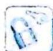

## 5.4 设而不求隐零点

## 研究密钥

含指数、对数混合形式的不等式证明之所以难,其根本原因在于指数与对数是“水火不容”的,其导函数的零点一般不可求,我们称此种情况为“零点不可求——隐零点”问题,隐零点虽然不能求出,但是有价值,领导函数值为0,利用这一等式,将隐零点代回到原函数中后,我们往往可以进行整体代换,将不便操作的指数或对数函数,转化为我们熟悉并容易把握的幂函数.用隐零点转化上要注意三点:

## 1. 隐零点对应的方程

这个方程的目的是作为中间桥梁去转化求最值,一般有三种形式:①幂函数、指数混合;②幂函数、对数混合;③指数、对数混合.前两者直接利用隐零点的方程将指、对幂上转,但对于第3种形式,不能直接将指数、对数向幂函数的方向上转化,如何实现指数、对数形式向幂函数形式转化,第3种形式需要进行同构降阶,如隐零点对应方程为

$x_0^2\mathrm{e}^{x_0} + \ln x_0 = 0\Leftrightarrow x_0\mathrm{e}^{x_0} + \frac{1}{x_0}\ln x_0 = 0\Leftrightarrow x_0\mathrm{e}^{x_0} = \frac{1}{x_0}\ln \frac{1}{x_0} = \ln \frac{1}{x_0}\mathrm{e}^{\ln \frac{1}{x_0}}$ ，构造函数 $f(x) = xe^{x}$ ，则 $f(x_0) = f\left(\ln \frac{1}{x_0}\right)$ ，再通过单调性降阶为 $x_0 = \ln \frac{1}{x_0} = -\ln x_0$ ，此时可简洁地将 $\ln x_0$ 和 $\mathrm{e}^{x_0}$ 向幂函数形式转化，如 $\ln x_0 = -x_0,\mathrm{e}^{x_0} = \frac{1}{x_0}$

还有一类情况也需要注意操作的方法:若隐零点对应的方程是含参数的情形,要运用处理代数问题的一般方法:消参.消参是将二元(含隐零点 $x_{0}$ 和参数的形式)问题转化为只含有隐零点的形式.

## 2. 隐零点所在的区间

隐零点虽不能直接解出,但对隐零点区间的估计是证明不等式的关键,常需要根据所证

明的目标对隐零点的区间作合理的限定.

## 3. 转化路径: 指、对幂上转

指、对幂上转,即将指数和对数形式向幂函数转化,转化的本质在于将指、对复杂形式转化为熟悉且易于求导的幂函数形式.

![[高中/总复习/专题/高考数学培优40讲/高考数学培优40讲-01-函数与导数/第5讲_含指数_对数函数形式的变形技巧/含有___ln_x__e_x__混合形式的不等式的变形技巧/5_4_设而不求隐零点/例题/Q00010146.md]]
![[高中/总复习/专题/高考数学培优40讲/高考数学培优40讲-01-函数与导数/第5讲_含指数_对数函数形式的变形技巧/含有___ln_x__e_x__混合形式的不等式的变形技巧/5_4_设而不求隐零点/例题/Q00010147.md]]
![[高中/总复习/专题/高考数学培优40讲/高考数学培优40讲-01-函数与导数/第5讲_含指数_对数函数形式的变形技巧/含有___ln_x__e_x__混合形式的不等式的变形技巧/5_4_设而不求隐零点/例题/Q00010148.md]]
