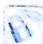

# 第6讲

# 导数中含有三角函数形式的处理策略

长期以来,导数解答题被指数函数、对数函数占据,但近年来随着新高考对这类题目的不断探索与创新,含三角函数的导数题也逐渐成为近年高考及各类模拟考试的常考题型.

三角函数、导数都是高考的必考内容,一个侧重基础,一个侧重压轴,旨在考查考生的数学基础水平与思维深度.二者的交汇融合的题型,其命题立意常考常新.由于函数表达式为三角函数与其他初等函数的复合,无论怎么求导函数,都会出现含三角函数的较为复杂的函数表达式.解决此类问题,需要利用三角函数性质、分离参数、分类讨论、构造函数等方法来处理,涉及函数隐零点、极值点偏移等相关知识与技巧.

本讲归纳总结了此类问题的有效解题思路与方法,能够帮助考生破解困惑,拓宽数学视野,同时也能践行新高考从“能力立意”向“素养导向”转变的理念与要求,提升考生的数学学科素养.

![[高中/总复习/专题/高考数学培优40讲/高考数学培优40讲-01-函数与导数/第6讲_导数中含有三角函数形式的处理策略/6_1_借助导数研究三角函数性质/6_1_借助导数研究三角函数性质.md]]
![[高中/总复习/专题/高考数学培优40讲/高考数学培优40讲-01-函数与导数/第6讲_导数中含有三角函数形式的处理策略/6_2__三看_原则/6_2__三看_原则.md]]
![[高中/总复习/专题/高考数学培优40讲/高考数学培优40讲-01-函数与导数/第6讲_导数中含有三角函数形式的处理策略/6_3_含三角函数不等式的证明/6_3_含三角函数不等式的证明.md]]
![[高中/总复习/专题/高考数学培优40讲/高考数学培优40讲-01-函数与导数/第6讲_导数中含有三角函数形式的处理策略/6_4_三角函数不等式恒成立问题/6_4_三角函数不等式恒成立问题.md]]
![[高中/总复习/专题/高考数学培优40讲/高考数学培优40讲-01-函数与导数/第6讲_导数中含有三角函数形式的处理策略/训练_6/训练_6.md]]
