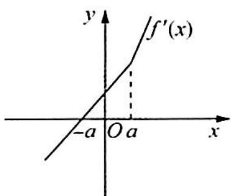
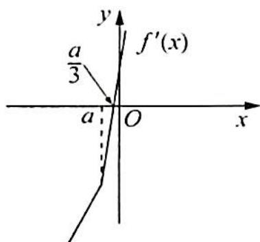

> [!faq]- 《高考数学培优40讲》例题解析
>
> > [!success]- **【答案】** 详见解析
>
> > [!note]- **【分析】**
> > 分析 ▶ 观察形式,本题为常规多项式函数,可利用绝对值函数的导数公式求导.求导后,根据极值可疑点划分区间分类讨论.
>
> > [!note]- **【解析】**
> > 解析 $f'(x)=4x+|x-a|+(x-a)\frac{x-a}{|x-a|}=4x+2|x-a|=\begin{cases}6x-2a,&x>a\\2x+2a,&x<a\end{cases}.$
> > 令 $f'(x)=0$ ，得 $\left\{\begin{aligned}x<a \\ x=-a\end{aligned}\right.$ 或 $\left\{\begin{aligned}x>a \\ x=\frac{a}{3}\end{aligned}\right.$ ，因此 $f(x)$ 的所有极值可疑点为 $x_{1}=-a, x_{2}=\frac{a}{3}$ ， $x_{3}=a.$
> > (1)当 $a > 0$ 时, $f'(x)$ 的图像如图1所示, 因此 $f(x)$ 在 $(- \infty, -a)$ 上单调递减, 在 $(-a, +\infty)$ 上单调递增, $f(x)_{\min} = f(-a) = -2a^2$ .
> > (2) 当 $a < 0$ 时, $f'(x)$ 的图像如图 2 所示, 因此 $f'(x)$ 在 $\left(-\infty, \frac{a}{3}\right)$ 上单调递减, 在 $\left(\frac{a}{3}, +\infty\right)$ 上单调递增, $f(x)_{\min} = f\left(\frac{a}{3}\right) = \frac{2a^2}{3}$ .
> > 
> > 图 1
> > 
> > 图 2
> > (3) 当 $a = 0$ 时, $f(x) = \begin{cases} 3x^2, & x \geqslant 0 \\ x^2, & x < 0 \end{cases}$ , $f(x)_{\min} = 0$ .
> > 综上可知， $f(x)_{\min} = \left\{ \begin{array}{ll}\frac{2a^2}{3}, & a <   0\\ -2a^2,a\geqslant 0 \end{array} \right.$
> > ## 评注
> > 掌握绝对值函数的导数公式后,关键在于处理导函数的零点,运用图像的方法可以直观分析导函数的图像和导函数的符号,从而确定函数的单调性和最值.
