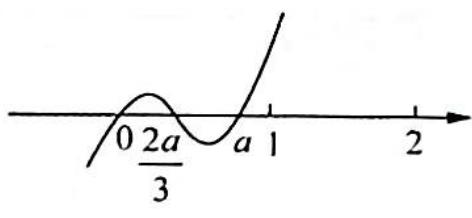
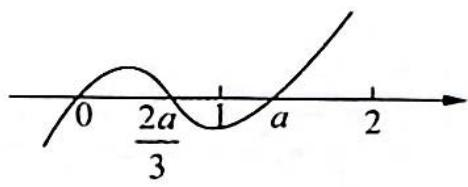
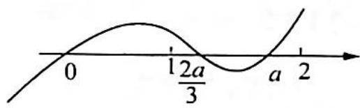
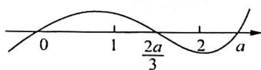
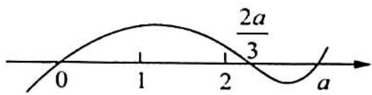

> [!faq]- 《高考数学培优40讲》例题解析
>
> > [!success]- **【答案】** 详见解析
>
> > [!note]- **【分析】**
> > 分析 ▶ 本题为多项式函数加绝对值,可利用绝对值函数的导数公式求导. 求导后,对极值可能点分类讨论,再按分界点分段讨论.
>
> > [!note]- **【解析】**
> > 解析 $f^{\prime}(x) = 2x|x - a| + x^{2}\frac{x - a}{|x - a|} = \frac{2x(x - a)^{2} + x^{2}(x - a)}{|x - a|} = \frac{x(x - a)(3x - 2a)}{|x - a|}$ $(x\neq a)$ .
> > 令 $f^{\prime}(x) = 0$ ，得 $x_{1} = 0, x_{2} = \frac{2a}{3}$ 而 $x = a$ 为导数不存在的可能点，所以 $f(x)$ 的所有极值可能点为 $x_{1} = 0, x_{2} = \frac{2a}{3}, x_{3} = a.$
> > (1) 当 $a \leqslant 0$ 时, $f'(x) = x (3x - 2a) > 0$ , $x \in [1, 2]$ , $f(x)$ 在 $[1, 2]$ 上单调递增, 所以 $f(x)_{\min} = f(1) = |1 - a| = 1 - a$ .
> > (2) 当 a > 0 时，有 $a > \frac{2a}{3} > 0$ .
> > 
> > (i) 当 $0 < \frac{2a}{3} < a \leqslant 1$ 时, 即 $0 < a \leqslant 1$ , 如图 1 所示. 此时 $f'(x)$ 在 $[1, 2]$ 上恒大于 0 , 所以 $f(x)$ 单调递增, $f(x)_{\min} = f(1) = |1 - a| = 1 - a$ .
> > 图1
> > (ii) 当 $0 < \frac{2a}{3} \leqslant 1 < a$ 时, 即 $1 < a \leqslant \frac{3}{2}$ , 如图 2 所示. 此时 $f(x)$ 在 (1, a) 上单调递减, 在 $(a, 2)$ 上单调递增, $f(x)_{\min} = f(a) = 0$ .
> > 
> > 图2
> > (iii) 当 $1 < \frac{2a}{3} < a < 2$ 时, 即 $\frac{3}{2} < a < 2$ , 如图 3 所示. 此时 $f(x)$ 在 $\left(1, \frac{2a}{3}\right), (a, 2)$ 上单调递增, 在 $\left(\frac{2a}{3}, a\right)$ 上单调递减, 所以 $f(x)$ 在 $[1, 2]$ 上的最小值为 $\min \{f(1), f(a)\}$ .
> > 
> > 又 $f(1) = |1 - a| = a - 1, f(a) = 0$ ，且 $f(1) - f(a) = a - 1 > 0$ ，因此 $f(x)_{\min} = f(a) = 0$ .
> > 图3
> > (iv) 当 $1 < \frac{2a}{3} < 2 \leqslant a$ 时, 即 $2 \leqslant a < 3$ , 如图 4 所示. 此时 $f(x)$ 在 $\left(1, \frac{2a}{3}\right)$ 上单调递增, 在 $\left(\frac{2a}{3}, 2\right)$ 上单调递减, 因此 $f(x)_{\min} = \min \{f(1), f(2)\} = \min \{|1 - a|, 4|2 - a|\} = \min \{a - 1, 4a - 8\}$ .
> > 
> > 图4
> > 又 $(a - 1) - (4a - 8) = 7 - 3a$ ，当 $7 - 3a\geqslant 0$ 时，
> > 即 $2 \leqslant a \leqslant \frac{7}{3}, f(x)_{\min} = 4(a - 2)$ ; 当 $\frac{7}{3} < a < 3$ 时, $f(x)_{\min} = a - 1$ .
> > (V) 当 $\frac{2a}{3} \geqslant 2$ 时, 即 $a \geqslant 3$ , 如图 5 所示. 此时 $f(x)$ 在 $[1, 2]$ 上单调递增, 因此 $f(x)_{\min} = f(1) = |1 - a| = a - 1$ .
> > 
> > 图5
> > 综上所述， $f(x)_{\min} = \left\{ \begin{array}{ll}|1 - a|, & a\leqslant 1\text{或} a > \frac{7}{3}\\ 0, & 1 <   a\leqslant 2\\ 4(a - 2), & 2 <   a\leqslant \frac{7}{3} \end{array} \right.$
> > ## 评注
> > 本题若用零点分段,去绝对值,化为分段函数,然后求导数,非常烦琐.利用绝对值函数的导数公式,我们可以省去大量步骤,在求导时不必分类分段,相较而言更简便实用.运用此种方法,尽管思路不复杂,但解题时需要始终保持清醒的头脑,具有明确的目标.
