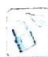

> [!faq]- 《高考数学培优40讲》例题解析
>
> > [!success]- **【答案】** 详见解析
>
> > [!note]- **【分析】**
> > 分析 从已知条件出发,利用导数,研究 $f(x)$ 的单调性,去掉绝对值,再利用恒成立条件,转化为最值问题来求参数范围.
>
> > [!note]- **【解析】**
> > 解析 $f^{\prime}(x) = 2x - \frac{m}{x} = \frac{2x^{2} - m}{x}$ , 因为 $-2 \leqslant m < 0$ , 所以当 $x \in (0,2]$ 时, $f^{\prime}(x) > 0$ , 即 $f(x)$ 在 $(0,2]$ 上单调递增, 所以不妨设 $x_{1} \geqslant x_{2}$ , 则 $f(x_{1}) \geqslant f(x_{2})$ , 且 $\frac{1}{x_{1}} - \frac{1}{x_{2}} = \frac{x_{2} - x_{1}}{x_{1}x_{2}} \leqslant 0$ , 因此 $|f(x_{1}) - f(x_{2})| \leqslant t\left|\frac{1}{x_{1}} - \frac{1}{x_{2}}\right| \Leftrightarrow f(x_{1}) - f(x_{2}) \leqslant t\left(\frac{1}{x_{2}} - \frac{1}{x_{1}}\right) \Leftrightarrow f(x_{1}) + \frac{t}{x_{1}} \leqslant f(x_{2}) + \frac{t}{x_{2}}$ .
> > 构造函数 $g(x)=f(x)+\frac{t}{x},0<x\leqslant2$ , 则 $g(x)$ 在 $(0,2]$ 上单调递减.
> > $g'(x)=f'(x)-\frac{t}{x^{2}}=2x-\frac{m}{x}-\frac{t}{x^{2}}$ ，所以 $2x-\frac{m}{x}-\frac{t}{x^{2}}\leqslant0$ 在 $(0,2]$ 上恒成立 $\Leftrightarrow2x^{3}-mx-t\leqslant0$ 在 $(0,2]$ 上恒成立 $\Leftrightarrow t\geqslant(2x^{3}-mx)_{\max}, x\in(0,2]$ .
> > 将 $2x^{3} - mx$ 视为关于 $m$ 的一次函数 $h(m)$ , 则因为 $x \in (0, 2]$ , 所以 $h(m)$ 单调递减, 又
> > $-2 \leqslant m < 0$ ，所以 $h(m)_{\max} = h(-2) = 2x^3 + 2x$ ，显然 $(2x^3 + 2x)_{\max} = 20, x \in (0, 2]$ .
> > 故 t 的取值范围为 $[20, +\infty)$ .
> > ## 评注
> > 本题非常精巧,首先,利用单调性,去掉绝对值符号;其次,将恒成立条件改为函数的单调性,从而将两个变量变回只有一个变量;最后,再利用更换主元法,将 $2x^{3}-mx$ 视为关于m的一次函数,从而轻松得解.本题需要对形式具有深刻的洞察力,对函数的性质和方法了然于胸.如果被形式所困,纠结于对数函数的处理,或是踌躇于两个变量,或者执着于变量分离法,那么就是雾里看花,水中看月,也就不得要领,无从得解了.
> > ## 2. 利用分类讨论求解
> > 
> > ## 研究密钥
> > 在求解函数极值问题中,已论述了分类讨论法,这里再次提及,也佐证了分类讨论法的重要性、强大性和基本性.
> > 在专题“导数中的不等式恒成立问题”中,我们已经指出,高考为了体现区分度,几乎不再出现可使用分离变量法等类似方法“一步到位”的题目,往往需要分多种情况,细致深入地讨论.尽管分类讨论法备受“嫌弃”,但所谓大智若愚,大勇若怯,数学有时并没有捷径,甚至“自古华山一条道”.如果连区区三五种分类情形都不能搞定,而是畏首畏尾、瞻前顾后,我们又如何能站在人生的交叉口,迈出勇往直前的一步?
