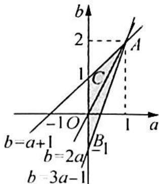

> [!faq]- 《高考数学培优40讲》例题解析
>
> > [!success]- **【答案】** 详见解析
>
> > [!note]- **【分析】**
> > 分析 $f(x)$ 为三次函数, 利用导数, 可以清楚完备地研究其单调性和单调区间以及极值点; 本题中有两个参数 $a, b$ , 要适时考虑能否将参数视为主元, 从而大大简化计算及证明过程. 在问题 (i)(ii) 以及问题 (2) 之间预计存在关联, 要利用好已知条件和已证明的结论.
>
> > [!note]- **【解析】**
> > 解析 $f^{\prime}(x) = 12ax^{2} - 2b, x \in [0,1]$ .
> > (1)(i)①当 $b \leqslant 0$ 时, $f'(x) > 0$ , 此时 $f(x)$ 在 $[0,1]$ 上单调递增, 所以 $f(x)_{\max} = f(1) = 3a - b = |2a - b| + a$ .
> > - **②**：当 $b > 0$ 时，令 $f^{\prime}(x) = 0, x = \sqrt{\frac{b}{6a}}$ ，则 $f(x)$ 在 $\left[0, \sqrt{\frac{b}{6a}}\right]$ 上单调递减，在 $\left(\sqrt{\frac{b}{6a}}, +\infty\right)$ 上单
> > 调递增,所以 $f(x)_{\max}=\max\{f(0),f(1)\}=\max\{b-a,3a-b\}=\left\{\begin{aligned}&b-a,&b\geqslant2a\\ &3a-b,&b<2a\end{aligned}\right.=\left|2a-b\right|+a.$
> > 综上所述，当 $x \in [0,1]$ 时， $f(x)_{\max} = |2a - b| + a$ .
> > (ii) 将 b 视为主元.
> > 当 $b \leqslant 2a$ 时， $f(x) + |2a - b| + a = 4ax^3 - 2bx + 2a \geqslant 4ax^3 - 4ax + 2a = 2a(2x^3 - 2x + 1)$ ；
> > 当 $b > 2a$ 时， $f(x) + |2a - b| + a = 4ax^3 + 2b(1 - x) - 2a > 4ax^3 + 4a(1 - x) - 2a = 2a(2x^3 - 2x + 1)$ .
> > 设 $g(x)=2x^{3}-2x+1, x\in[0,1]$ ，则 $g'(x)=6x^{2}-2$ ，其零点 $x_{0}=\frac{\sqrt{3}}{3}, g'(x)$ 与 $g(x)$ 随 x 的变化情况列表如下：
> > <table><tr><td>x</td><td>0</td><td> $(0, x_0)$ </td><td> $x_0$ </td><td> $(x_0, 1)$ </td><td>1</td></tr><tr><td> $g'(x)$ </td><td></td><td>-</td><td>0</td><td>+</td><td></td></tr><tr><td> $g(x)$ </td><td>1</td><td>↘</td><td>极小值</td><td>↗</td><td>1</td></tr></table>
> > 所以 $g(x)_{\min} = g(x_0) = 1 - \frac{4\sqrt{3}}{9} >0,f(x) + |2a - b| + a = 2a(2x^3 -2x + 1) > 0.$
> > (2)由(i)知, $f(x)_{\max}=|2a-b|+a$ ,结合条件 $|f(x)|\leqslant1$ ,可得 $|2a-b|+a\leqslant1$ .
> > 又当 $\left| {{2a} - b}\right|  + a \leq  1$ 时,由(ii)知, $f\left( x\right)  \geq   - \left| {{2a} - b}\right|   - a \geq   - 1$ . 所以 $\left| {f\left( x\right) }\right|  \leq  1$ 对
> > $x \in [0,1]$ 恒成立的充要条件为 $\left\{ \begin{array}{l} |2a - b| + a \leqslant 1 \\ a > 0 \end{array} \right.$ , 即 $\left\{ \begin{array}{l} b \leqslant 2a \\ a > 0 \\ 3a - b \leqslant 1 \end{array} \right.$ 或 $\left\{ \begin{array}{l} b > 2a \\ a > 0 \\ b - a \leqslant 1 \end{array} \right.$ , 作图如图
> > 
> > 所示. 不等式表示图中阴影部分, 不包括线段 $BC$ , 作一组平行线 $a + b = t$ , 可知 $-1 < t \leqslant 3$ . 所以 $a + b$ 的取值范围为 $(-1, 3]$ .
> > ## 评注
> > 本题第一问(ii)的参考答案,是研究函数 $f(x)+|2a-b|+a$ ,通过零点来划界讨论,过程烦琐,当然也不失为一种朴素的方法.而上述的解法,利用更换主元的思想,将 $f(x)+|2a-b|+a$ 视为关于 $b$ 的含绝对值形式的一次函数,立即取得了极大的简化,而且分类讨论的情形也大大缩小,只需要分别考虑 $b \leqslant 2a$ 和 $b>2a$ 两种情况即可.由此可见,分类讨论法和其他好方法相配合,才能取长补短,取得“ $1+1>2$ ”的效果.
