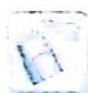

## 8.3 含参对数型函数的零点赋值

## 研究密钥

对于含对数型 $(\ln x)$ 的函数零点赋值, 常采用 $\ln x \leqslant x - 1$ (当且仅当 $x = 1$ 时取“=”), 但放缩不限于该不等式, 有时将 $\ln x$ 放得更小, 即合理把握放缩的度, 让放缩更宜于调节. 如 $\ln x = \ln (x^{\frac{1}{a}})^{a} = a \ln x^{\frac{1}{a}} \leqslant a (x^{\frac{1}{a}} - 1) \leqslant a x^{\frac{1}{a}} - 1 (\alpha \geqslant 1)$ , 可以将 $\ln x$ 向 $x^{\frac{1}{a}} (\alpha \geqslant 1)$ 方向转化.

![[高中/总复习/专题/高考数学培优40讲/高考数学培优40讲-01-函数与导数/第8讲_函数零点问题的研究/分类讨论结合放缩法/8_3_含参对数型函数的零点赋值/例题/Q00010192.md]]
![[高中/总复习/专题/高考数学培优40讲/高考数学培优40讲-01-函数与导数/第8讲_函数零点问题的研究/分类讨论结合放缩法/8_3_含参对数型函数的零点赋值/例题/Q00010193.md]]
![[高中/总复习/专题/高考数学培优40讲/高考数学培优40讲-01-函数与导数/第8讲_函数零点问题的研究/分类讨论结合放缩法/8_3_含参对数型函数的零点赋值/例题/Q00010194.md]]
