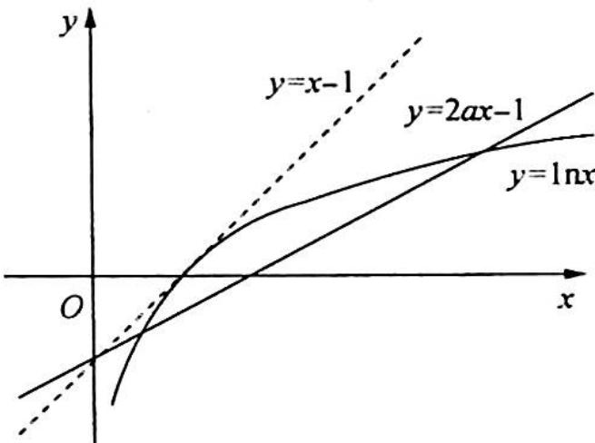

> [!faq]- 《高考数学培优40讲》例题解析
>
> > [!success]- **【答案】** 详见解析
>
> > [!note]- **【分析】**
> > 分析 可导函数的极值点即为导函数的零点, 因此 $f'(x)$ 存在两个零点, 将问题转化为函数的零点问题; 要研究 $f'(x)$ 的零点个数, 往往要考查函数的单调性, 所以我们还需研究并考查 $f''(x)$ .
>
> > [!note]- **【解析】**
> > 解析 ▶ 解法一(对数放缩,插值):由题意知, $f'(x)=\ln x-2ax+1$ 在区间 $(0,+\infty)$ 内有两个不同的变号零点, $f''(x)=\frac{1}{x}-2a,x>0$ .
> > 当 $a \leqslant 0$ 时, $f''(x) > 0$ , 所以 $f'(x)$ 在区间 $(0, +\infty)$ 上单调递增, 至多存在一个零点;
> > 当 $a > 0$ 时, 令 $f''(x) = 0$ , $x = \frac{1}{2a}$ , 易知 $f'(x)$ 在 $x = \frac{1}{2a}$ 时取得最大值.
> > 要使 $f'(x)$ 在区间 $(0, +\infty)$ 内有两个不同的变号零点，则 $f'\left(\frac{1}{2a}\right) > 0$ ，得 $0 < a < \frac{1}{2}$ .
> > 以下只需在 $\frac{1}{2a}$ 的两侧各找一个点,使 $f'(x)<0$ 即可.
> > 可以利用插值法(注意到 $f'(0^{+}) < 0, f' (+\infty) < 0$ ), 但本题的函数比较简单, 直接利用放缩法和尝试法更为简便.
> > $f'\left(\frac{1}{e}\right)=-\frac{2a}{e}<0$ ，结合单调性，所以 $f'(x)$ 在 $\left(\frac{1}{e},\frac{1}{2a}\right)$ 上恰有1个零点，由 $\ln x=\ln(x^{\frac{1}{a}})^{a}=$ $\alpha\ln x^{\frac{1}{a}}\leqslant\alpha(x^{\frac{1}{a}}-1)<\alpha x^{\frac{1}{a}}-1(\alpha>1)$ 得 $\ln x<\alpha x^{\frac{1}{a}}-1(\alpha>1)$ .
> > 若在 $\left(\frac{1}{2a}, +\infty\right)$ 上找到 $x_0$ 使得 $f'(x_0) < 0$ ，即 $\ln x_0 - 2ax_0 + 1 < 0$ ，因为 $\ln x_0 < 2x_0^{\frac{1}{2}} - 1$ ，所以 $\ln x_0 - 2ax_0 + 1 < 2x_0^{\frac{1}{2}} - 1 - 2ax_0 + 1 = 2x_0^{\frac{1}{2}} (1 - ax_0^{\frac{1}{2}})$ .
> > 令 $1 - ax_0^{\frac{1}{2}} = 0$ ，得 $x_0 = \frac{1}{a^2}$ ，且 $\frac{1}{a^2} -\frac{1}{2a} = \frac{2 - a}{2a^2} >0\left(0 <   a <   \frac{1}{2}\right)$ ，所以 $f^{\prime}\left(\frac{1}{a^{2}}\right) <   0$ ，结合单调性，可知 $f^{\prime}(x)$ 在 $\left(\frac{1}{2a},\frac{1}{a^2}\right)$ 上恰有1个零点.
> > 综上所述，a 的取值范围为 $\left(0, \frac{1}{2}\right)$ .
> > 解法二(数形结合,零点转化为交点个数): 函数 $f(x)$ 定义域为 $(0,+\infty)$ , $f'(x)=\ln x-2ax+1$ .
> > 已知函数 $f(x)$ 有两个极值点, 等价于 $f'(x)=\ln x-2ax+1$ 有两个不同的变号零点.
> > 在同一直角坐标系中, 画出 $y=\ln x$ 与 y=2ax-1 的图像, 如图所示:
> > 由图可得, 当 $a \leqslant 0$ 时, 两图像最多只有一个交点, 所以 $a > 0$ .
> > (1) 当 $a = \frac{1}{2}$ 时, 直线 $y = 2ax - 1$ 与 $y = \ln x$ 的图像相切, 只有一个交点;
> > 
> > (2) 当 $0 < a < \frac{1}{2}$ 时, 直线 $y = 2ax - 1$ 与 $y = \ln x$ 的图像有两个交点, 此时 $f'(x)$ 有两个不同的变号零点;
> > (3) 当 $a > \frac{1}{2}$ 时, 直线 $y = 2ax - 1$ 与 $y = \ln x$ 的图像没有交点. 综上所述, $a$ 的取值范围为 $\left(0, \frac{1}{2}\right)$ .
> > ## 评注
> > 本题的难点在于赋值, 如果利用 $\ln x \leqslant x - 1$ , 那么 $\ln x - 2ax + 1 \leqslant x - 2ax = (1 - 2a)x$ , 又因为 $(1 - 2a)x > 0$ , 不合要求, 反思过程, 会发现是放大了. 因此, 我们自然想到降低幂次, 利用 $\ln x \leqslant x - 1$ 的变换, 将 $\ln x = \ln (x^{\frac{1}{a}})^{a} = a\ln x^{\frac{1}{a}} \leqslant a (x^{\frac{1}{a}} - 1) = a x^{\frac{1}{a}} - a < a x^{\frac{1}{a}} - 1 (\alpha > 1)$ , 令 $\alpha = 2$ , 可得 $\ln x < 2x^{\frac{1}{2}} - 1$ , 这道题就迎刃而解了.
