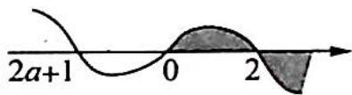
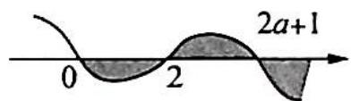
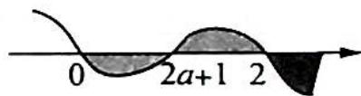

> [!faq]- 《高考数学培优40讲》例题解析
>
> > [!success]- **【答案】** 详见解析
>
> > [!note]- **【分析】**
> > 分析 ▶ 思路一: 分离参数, 通过求最值的方法求出参数的取值范围; 思路二: 构造函数, 根据讨论导函数的零点 $2a+1$ 与 $0,2$ 的大小关系来分区间讨论, 求参数 $a$ 的取值范围.
>
> > [!note]- **【解析】**
> > 解析 ▶ 解法一(分离自变量与参变量): $f(x) \geqslant \frac{1}{2}x^{3} + 1 \Leftrightarrow e^{x} + ax^{2} - x \geqslant \frac{1}{2}x^{3} + 1$ .
> > 当 x=0 时, 不等式成立.
> > 当 $x > 0$ 时，原不等式等价于 $a \geqslant \frac{\frac{1}{2} x^3 + x + 1 - \mathrm{e}^x}{x^2}$ .
> > 令 $g(x) = \frac{\frac{1}{2}x^3 + x + 1 - \mathrm{e}^x}{x^2} (x > 0)$ ，则 $g'(x) = \frac{(x - 2)(x^2 + 2x - 2\mathrm{e}^x + 2)}{2x^3}$ .
> > 令 $h(x) = x^{2} + 2x - 2\mathrm{e}^{x} + 2(x > 0)$ ，则 $h^{\prime}(x) = 2x + 2 - 2\mathrm{e}^{x} = -2(\mathrm{e}^{x} - x - 1)$ .
> > 易证当 $x > 0$ 时, $\mathrm{e}^{x} > x + 1$ , 所以 $h'(x) < 0$ , 则 $h(x)$ 在 $(0, +\infty)$ 上单调递减, 所以 $h(x) < h(0) = 0$ .
> > 令 $g'(x)=0 \Rightarrow x=2$ 。当 0 < x < 2 时， $g'(x) > 0$ ；当 x > 2 时， $g'(x) < 0$
> > 所以 $g(x)$ 在 $(0,2)$ 上单调递增，在 $(2,+\infty)$ 上单调递减，则 $g(x)_{\max}=g(2)=\frac{7-e^{2}}{4}$ ，从而可得 $a\geqslant\frac{7-e^{2}}{4}$ ，即 a 的取值范围为 $\left[\frac{7-e^{2}}{4},+\infty\right)$ .
> > 解法二(不分离自变量与参变量): $e^{x}+ax^{2}-x\geqslant\frac{1}{2}x^{3}+1\Rightarrow\frac{\frac{1}{2}x^{3}-ax^{2}+x+1}{e^{x}}-1\leqslant0$ 恒成立.
> > 设 $g(x) = \frac{\frac{1}{2}x^3 - ax^2 + x + 1}{\mathrm{e}^x} - 1, g'(x) = \frac{-x(x - 2)[x - (2a + 1)]}{2\mathrm{e}^x}$ .
> > (1) ${2a} + 1 \leq  0$ ,即 $a \leq   - \frac{1}{2}$ 时, ${g}^{\prime }\left( x\right)$ 的示意图如图 1 所示.
> > 
> > 所以 $g(x)$ 在 $(0,2)$ 上单调递增，在 $(2,+\infty)$ 上单调递减， $g(x)_{\max}=$ 图1 $g(2)=\frac{7-4a}{e^{2}}-1\leqslant0$ ，解得 $a\geqslant\frac{7-e^{2}}{4}$ ，则 $a\in\varnothing$ 。
> > (2) $2a+1\geqslant2$ ，即 $a\geqslant\frac{1}{2}$ 时， $g'(x)$ 的示意图如图2所示.
> > 
> > $g(x)$ 在 $(0,2)$ 上单调递减，在 $(2,2a+1)$ 上单调递增，在 $(2a+1,+\infty)$ 上单调递减。
> > $$
> > g (0) = 0, g (2 a + 1) \leqslant 0 \Rightarrow \frac {\frac {1}{2} (2 a + 1) ^ {3} - a (2 a + 1) ^ {2} + (2 a + 1) + 1}{\mathrm{e} ^ {2 a + 1}} - 1 = \frac {\frac {1}{2} (2 a + 1) ^ {2} + (2 a + 1) + 1}{\mathrm{e} ^ {2 a + 1}} -
> > $$
> > $1 \leqslant 0$ . 令 $t = 2a + 1 (t \geqslant 2)$ , 则 $h(t) = \frac{\frac{1}{2} t^2 + t + 1}{e^t} - 1, h'(t) = \frac{-t^2}{2 e^t} < 0$ , 所以 $h(t)$ 在 $[2, +\infty)$ 上单调递减, 则 $h(t) \leqslant h(2) < 0$ 恒成立. 故 $a \geqslant \frac{1}{2}$ 满足题意.
> > (3) $0 < {2a} + 1 < 2$ ,即 $- \frac{1}{2} < a < \frac{1}{2}$ 时. ${g}^{\prime }\left( x\right)$ 的示意图如图 3 所示.
> > 
> > 图3
> > $g(x)$ 在 $(0,2a+1)$ 上单调递减， $(2a+1,2)$ 上单调递增， $(2,+\infty)$ 上单调递减。 $g(0)=0$ ， $g(2)=\frac{7-4a}{e^{2}}-1\leqslant0$ ，所以 $\frac{7-e^{2}}{4}\leqslant a<\frac{1}{2}$ 。
> > 综上所述， $a$ 的取值范围为 $\left[\frac{7 - \mathrm{e}^2}{4}, + \infty\right)$
