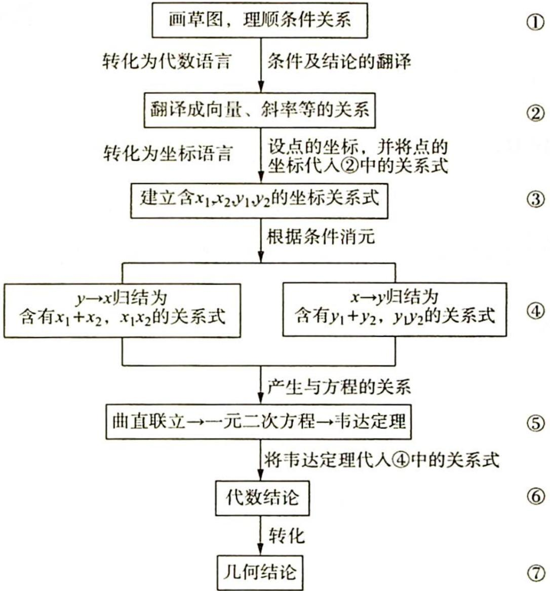

# 第15讲

# 以数化形——圆锥曲线中几何条件的转化策略

解析几何的本质是用代数方法解决几何问题,因此解决解析几何解答题无外乎做三项工作:(1)将几何关系转化为代数运算(坐标、方程、函数、不等式等);(2)用代数规则对代数简化后的问题进行处理;(3)经过代数运算后,把运算结果转化为几何结论.在这个基本思路的指导下,我们希望能将以往大量的、零碎的、彼此之间看似没有多少联系的问题,通过高度统一的方法解决,因此下面我们研究直线与圆锥曲线综合这一大类问题的通解方法.这个通解方法的解题思路流程如下:

在这个流程中,②是思维难点,③④⑥是计算难点,⑤是解题套路. 思考过程应用了分析法,以目标为导向. 贯穿全局的转化思想是核心,坐标和方程是工具.

解析几何最重要的思想就是转化,即将几何关系转化为代数运算,这个过程就需要将几何语言翻译为代数语言. 常见翻译转化,并建立问题的解决模式如下.

(1)点在曲线上 $\rightarrow$ 点的坐标满足曲线方程.

(2) 直线与二次曲线的交点 $\rightarrow$ $\left\{ \begin{array}{l} \text{点坐标满足直线方程} \\ \text{点坐标满足曲线方程} \\ x_{1} + x_{2} = \dots, x_{1}x_{2} = \dots \\ y_{1} + y_{2} = \dots, y_{1}y_{2} = \dots \end{array} \right.$

(3) $A, B, C$ 共线 $\rightarrow \left\{ \begin{array}{l} \overrightarrow{AB} // \overrightarrow{BC} \\ k_{AB} = k_{BC} \\ C \text{满足直线 } AB \text{ 的方程} \end{array} \right.$ .

(4) 点 A 与 B 关于直线 l 对称 $\rightarrow$ $\left\{\begin{aligned} 中: &AB 的中点 \in l \\ 垂: &AB \perp l \end{aligned}\right.$ .

(5)直线与曲线相切→{圆:d=r
一般二次曲线:二次项系数≠0且Δ=0.

(6)点 $(x_0, y_0)$ 在曲线的一侧、内部或外部 $\rightarrow$ 代入后 $f(x_0, y_0)$ 的符号.

(7) $\angle ABC$ 为锐角或零角 $\rightarrow\overrightarrow{BA}\cdot\overrightarrow{BC}>0.$

(8)以 $AB$ 为直径的圆过点 $C \to \left\{ \begin{array}{l} \overrightarrow{CA} \cdot \overrightarrow{CB} = 0 \\ |CA|^2 + |CB|^2 = |AB|^2 \end{array} \right.$ .

(9) $AD$ 平分 $\angle BAC \rightarrow \left\{ \begin{array}{l} AD \perp x \text{ 轴或 } AD \perp y \text{ 轴时: } k_{BA} = -k_{AC} \\ AD \text{ 上的点到直线 } AB, AC \text{ 的距离相等} \end{array} \right.$ .

(10)点 $A, B, C$ 共线 $\rightarrow \frac{|AB|}{|AC|} = \frac{x_B - x_A}{x_C - x_A} = \frac{y_B - y_A}{y_C - y_A}$ .

(11)等式恒成立→系数为0或对应项系数成比例.

![[高中/总复习/专题/高考数学培优40讲/高考数学培优40讲-02-解析几何/01_第15讲/15_1_以向量为背景的转化/15_1_以向量为背景的转化.md]]
![[高中/总复习/专题/高考数学培优40讲/高考数学培优40讲-02-解析几何/01_第15讲/15_2_以斜率为背景的转化/15_2_以斜率为背景的转化.md]]
![[高中/总复习/专题/高考数学培优40讲/高考数学培优40讲-02-解析几何/01_第15讲/15_3_以几何图形为背景的转化/15_3_以几何图形为背景的转化.md]]
