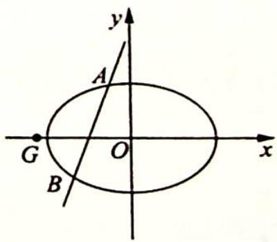

## 15.1 以向量为背景的转化

## 研究密钥

不管是大题还是小题,题目必将给出较为核心的条件,解题的过程便是考查我们如何将其进行合理的代数化翻译,建立与其目标信息之间的关系.在这个过程中,可以把几何条件转化为向量关系,然后用向量知识来解决,这样通过几何特征—向量—向量的坐标表示—方程这一桥梁,就能实现几何条件向代数的转化.对于诸如垂直、平行、共线等问题,均可转化为向量形式.

例 15.1 过抛物线 $y^{2}=2px(p>0)$ 的焦点 F 作直线交抛物线于 A, B 两点，点 O 为坐标原点，M 为 AB 的中点.

(1) 求证: $\overrightarrow{OA} \cdot \overrightarrow{OB} < 0$ ;

(2) 探究 $\left|\overrightarrow{OM}\right|$ 与 $\frac{\left|\overrightarrow{AB}\right|}{2}$ 的大小关系.

分析 ▶ 解析几何核心思想是数形结合思想。从画图入手，图文并茂，以形助数；观察图形，深入分析图形中的几何特征，把解题动态情境过程形象化，寻求解题的突破口。本题先画图，在图形中分析。若直接计算 $|\overrightarrow{OM}|$ 与 $\frac{|\overrightarrow{AB}|}{2}$ ，计算量较大，可结合中线向量公式，将 $\overrightarrow{OM}$ 与 $\frac{\overrightarrow{AB}}{2}$ 用基底向量 $\overrightarrow{OA},\overrightarrow{OB}$ 表示，然后通过向量运算判断其大小关系。

解析 ▶ (1) 设 $A(x_{1}, y_{1}), B(x_{2}, y_{2})$ , 抛物线 $y^{2} = 2px (p > 0)$ 的焦点坐标为 $F\left(\frac{p}{2}, 0\right)$ , 依题意知直线 $AB$ 的斜率不为零且斜率可以不存在, 设 $AB$ 的直线方程 $x = ty + \frac{p}{2}$ .

联立直线 $AB$ 的方程与抛物线的方程得 $\left\{ \begin{array}{l} x = ty + \frac{p}{2} \\ y^2 = 2px \end{array} \right.$ ，消去 $x$ ，建立关于 $y$ 的一元二次方程 $y^2 - 2py - p^2 = 0$ ，即 $\left\{ \begin{array}{l} \Delta = 4p^2t^2 + 4p^2 > 0 \\ y_1 + y_2 = 2pt \\ y_1y_2 = -p^2 \end{array} \right.$ ，则 $\overrightarrow{OA} \cdot \overrightarrow{OB} = x_1x_2 + y_1y_2 = (ty_1 + \frac{p}{2})(ty_2 + \frac{p}{2}) + y_1y_2 = (t^2 + 1)y_1y_2 + \frac{pt}{2}(y_1 + y_2) + \frac{p^2}{4} = (t^2 + 1)(-p^2) + \frac{pt}{2} \cdot 2pt + \frac{p^2}{4} = -p^2t^2 - p^2 + p^2t^2 + \frac{p^2}{4} = -\frac{3p^2}{4} < 0.$

(2)解法一(转化为向量运算): 因为 M 为 AB 的中点, 所以 $\overrightarrow{OM} = \frac{\overrightarrow{OA} + \overrightarrow{OB}}{2}, \frac{\overrightarrow{AB}}{2} = \frac{\overrightarrow{OB} - \overrightarrow{OA}}{2}$ , $\overrightarrow{OM}^{2} - \left(\frac{\overrightarrow{AB}}{2}\right)^{2} = \left(\frac{\overrightarrow{OA} + \overrightarrow{OB}}{2}\right)^{2} - \left(\frac{\overrightarrow{OB} - \overrightarrow{OA}}{2}\right)^{2} = \frac{(\overrightarrow{OA}^{2} + \overrightarrow{OB}^{2} + 2\overrightarrow{OA} \cdot \overrightarrow{OB}) - (\overrightarrow{OA}^{2} + \overrightarrow{OB}^{2} - 2\overrightarrow{OA} \cdot \overrightarrow{OB})}{4}$ $= \overrightarrow{OA} \cdot \overrightarrow{OB}.$

因此通过 $\overrightarrow{OA}\cdot\overrightarrow{OB}$ 的符号来判断 $|\overrightarrow{OM}|$ 与 $\frac{|\overrightarrow{AB}|}{2}$ 之间的大小关系.

由(1)可知 $\overrightarrow{OA} \cdot \overrightarrow{OB} < 0$ ，所以 $|\overrightarrow{OM}| < \frac{|\overrightarrow{AB}|}{2}$ ，即在钝角 $\triangle OAB$ 中，长边 $AB$ 上的中线小于 $\frac{1}{2} |AB|$ .

解法二(转化为坐标运算): 设 AB 的中点 M 的坐标为 $(x_{0}, y_{0})$ ，由(1)中的韦达定理知，$y_{0}=pt,x_{0}=pt^{2}+\frac{p}{2}$ ，则 $|OM|^{2}=\left(pt^{2}+\frac{p}{2}\right)^{2}+p^{2}t^{2}=\left(t^{4}+2t^{2}+\frac{1}{4}\right)p^{2},\left|AB\right|=\sqrt{1+t^{2}}\left|y_{1}-y_{2}\right|=2p(t^{2}+1)$ .

又因为 $|OM|^2 - \frac{|AB|^2}{4} = (t^4 + 2t^2 + \frac{1}{4})p^2 - p^2 (t^2 + 1)^2 = -\frac{3}{4}p^2 < 0$ ，所以 $|OM|^2 < \frac{|AB|^2}{4}$ ，即 $|\overrightarrow{OM}| < \frac{|\overrightarrow{AB}|}{2}$ .

解后反思

## 向量角度看三角形中线的一个结论

(1)本题将一个几何问题转化为向量问题,通过向量的运算再得出一个几何性的结论,向量在其中起到了“桥梁”的作用.假若没有第(1)问的限制,我们可以得到结论:

①当 $\overrightarrow{OA} \cdot  \overrightarrow{OB} < 0$ 时, $\left| {\overrightarrow{OM}}\right|  < \frac{\left| {\overrightarrow{AB}}\right| }{2}$ ,即在钝角 $\bigtriangleup  {OAB}$ 中,长边 ${AB}$ 上的中线长小于 $\frac{1}{2}\left| {AB}\right|$ ；

②当 $\overrightarrow{OA} \cdot \overrightarrow{OB} = 0$ 时, $|\overrightarrow{OM}| = \frac{|\overrightarrow{AB}|}{2}$ , 即在直角 $\triangle OAB$ 中, 斜边 $AB$ 上的中线长等于 $\frac{1}{2} |\overrightarrow{AB}|$ ;

③当 $\overrightarrow{OA}\cdot\overrightarrow{OB}>0$ 时, $|\overrightarrow{OM}|>\frac{|\overrightarrow{AB}|}{2}$ ,即在锐角 $\triangle OAB$ 中,边AB上的中线长大于 $\frac{1}{2}|AB|$ .
这与我们平面几何的结论是一致的.

(2)更为特别地,我们有如下重要结论,熟记这些重要结论会为相关题目的求解带来极大的方便,有兴趣的读者也可以自己证明.

① 过点 $M(t,0)(t > 0)$ 的直线交抛物线 $y^{2} = 2px (p > 0)$ 于 $A, B$ 两点.

当 $0 < t < 2p$ 时, $\angle AOB$ 为钝角; 当 $t = 2p$ 时, $\angle AOB$ 为直角; 当 $t > 2p$ 时, $\angle AOB$ 为锐角.

② 过点 $M(0,t)(t>0)$ 的直线交抛物线 $x^{2}=2py(p>0)$ 于 A, B 两点.

当 $0 < t < 2p$ 时， $\angle AOB$ 为钝角；当 $t = 2p$ 时， $\angle AOB$ 为直角；当 $t > 2p$ 时， $\angle AOB$ 为锐角。

③ 抛物线 $y^{2}=2px(p>0)$ 上异于原点 O 的动点 A, B 满足 $\overrightarrow{OA} \perp \overrightarrow{OB}$ ，则直线 AB 必过定点 $(2p,0)$ ，反之亦成立.

④ 抛物线 $x^{2} = 2py (p > 0)$ 上异于原点 $O$ 的动点 $A, B$ 满足 $\overrightarrow{OA} \perp \overrightarrow{OB}$ , 则直线 $AB$ 必过定点 $(0, 2p)$ , 反之亦成立.

变式① 已知椭圆 $C: x^{2} + 2y^{2} = 9$ ，点 $P(2,0)$ .

(1)求椭圆 C 的短轴长和离心率；

(2) 过 (1,0) 的直线 $l$ 与椭圆 $C$ 相交于点 $M, N$ , 设 $MN$ 的中点为 $T$ , 判断 $|TP|$ 与 $|TM|$ 的大小, 并证明你的结论.

分析 ▶ 若直接计算弦长 $|\overrightarrow{TP}|$ 与 $|\overrightarrow{TM}|$ , 计算量很大, 将几何条件转化为向量关系, 用向量表示 $\overrightarrow{PT}$ 和 $\overrightarrow{MT}$ . 若比较 $|\overrightarrow{PT}|$ 与 $|\overrightarrow{MT}|$ 的大小, 即比较 $|\overrightarrow{PT}|^{2}-|\overrightarrow{MT}|^{2}=\left(\frac{\overrightarrow{PM}+\overrightarrow{PN}}{2}\right)^{2}-\left(\frac{\overrightarrow{PN}-\overrightarrow{PM}}{2}\right)^{2}=\overrightarrow{PM}\cdot\overrightarrow{PN}$ 与 0 的大小, 运用坐标表示 $\overrightarrow{PM}$ 和 $\overrightarrow{PN}$ 及 $\overrightarrow{PM}\cdot\overrightarrow{PN}$ , 这样实现几何问题代数化.

解析 ▶ (1) 易得椭圆 $C: \frac{x^2}{9} + \frac{y^2}{\frac{9}{2}} = 1$ ，故 $a^2 = 9, b^2 = \frac{9}{2}$ ，则 $c^2 = \frac{9}{2}, a = 3, b = c = \frac{3\sqrt{2}}{2}$ . 所以椭圆的短轴长为 $2b = 3\sqrt{2}$ ，离心率 $e = \frac{c}{a} = \frac{\sqrt{2}}{2}$ .

(2) 已知 $P(2,0)$ , 设 $M(x_1, y_1), N(x_2, y_2), l: x = ty + 1$ , 联立 $\left\{ \begin{array}{l} x = ty + 1 \\ x^2 + 2y^2 = 9 \end{array} \right.$ , 消去 $x$ 得 $(t^2 + 2)y^2 + 2ty - 8 = 0$ .

因为 $(2t)^{2} - 4(t^{2} + 2)\times (-8) = 4t^{2} + 32(t^{2} + 2) = 36t^{2} + 64 > 0$ ，由韦达定理可得 $y_{1} + y_{2} =$ $\frac{-2t}{t^2 + 2},y_1y_2 = \frac{-8}{t^2 + 2}.$

由 $\overrightarrow{PM}=(x_{1}-2,y_{1})$ , $\overrightarrow{PN}=(x_{2}-2,y_{2})$ ，所以 $\overrightarrow{PM}\cdot\overrightarrow{PN}=(x_{1}-2)\cdot(x_{2}-2)+y_{1}y_{2}=$ $(ty_{1}-1)\cdot(ty_{2}-1)+y_{1}y_{2}=(t^{2}+1)y_{1}y_{2}-t(y_{1}+y_{2})+1=\frac{-8(t^{2}+1)}{t^{2}+2}+\frac{2t^{2}}{t^{2}+2}+1=\frac{-5t^{2}-6}{t^{2}+2}<0.$ 又 $\overrightarrow{PT}=\frac{\overrightarrow{PM}+\overrightarrow{PN}}{2},\frac{\overrightarrow{MN}}{2}=\frac{\overrightarrow{PN}-\overrightarrow{PM}}{2},\overrightarrow{PT}^{2}-\left(\frac{\overrightarrow{MN}}{2}\right)^{2}=\frac{(\overrightarrow{PM}+\overrightarrow{PN})^{2}-(\overrightarrow{PN}-\overrightarrow{PM})^{2}}{4}=$ $\overrightarrow{PM}\cdot\overrightarrow{PN}$ ，所以 $|PT|^{2}-|TM|^{2}=\overrightarrow{PT}^{2}-\left(\frac{\overrightarrow{MN}}{2}\right)^{2}=\overrightarrow{PM}\cdot\overrightarrow{PN}<0$ ，即 $|TP|<|TM|$ .

## 评注

本题同样体现了以几何条件为背景的转化和翻译, 将几何问题转化为坐标、方程来求解, 体现了向量运算的优越性.

变式 2 已知椭圆 $E: \frac{x^{2}}{a^{2}} + \frac{y^{2}}{b^{2}} = 1 (a > b > 0)$ 过点 $(0, \sqrt{2})$ ，且离心率 $e = \frac{\sqrt{2}}{2}$ .

(1)求椭圆 E 的方程；

(2) 设直线 $l: x = my - 1 (m \in \mathbf{R})$ 交椭圆 $E$ 于 $A, B$ 两点, 判断点 $G\left(-\frac{9}{4}, 0\right)$ 与以线段 $AB$ 为直径的圆的位置关系, 并说明理由.

分析 ▶ 思路一: 判断点 G 与以线段 AB 为直径的圆的位置关系, 即判断点 G 与 AB 的中点间的距离与 $\frac{1}{2}AB$ 的大小关系. 比较两者大小, 可根据坐标利用两点间距离公式表示出来, 但这样计算量较大; 思路二: 判断点 G 与以线段 AB 为直径的圆的位置关系转化为判断向量 $\overrightarrow{GA}, \overrightarrow{GB}$ 夹角的大小, 进一步转化为数量积 $\overrightarrow{GA} \cdot \overrightarrow{GB}$ 与 0 的大小比较.

解析 (1) 由已知得 $\left\{ \begin{array}{l} b = \sqrt{2} \\ \frac{c}{a} = \frac{\sqrt{2}}{2} \\ a^2 = b^2 + c^2 \end{array} \right.$ , 解得 $\left\{ \begin{array}{l} a = 2 \\ b = \sqrt{2}, \text{所以椭圆 } E \text{ 的方程为 } \frac{x^2}{4} + \frac{y^2}{2} = 1. \\ c = \sqrt{2} \end{array} \right.$

(2)解法一(借助坐标运算比较距离大小):设点 $A(x_{1},y_{1}),B(x_{2},y_{2}),AB$ 的中点为 $H(x_0,y_0)$ . 由 $\left\{\begin{aligned}x=my-1\\ \frac{x^2}{4}+\frac{y^2}{2}=1\end{aligned}\right.$ 得 $(m^{2}+2)y^{2}-2my-3=0$ , 所以 $y_{1}+y_{2}=\frac{2m}{m^{2}+2}$ , $y_{1}y_{2}=-\frac{3}{m^{2}+2}$ , 从而 $y_{0}=\frac{m}{m^{2}+2}$ .
则 $|GH|^{2}=\left(x_{0}+\frac{9}{4}\right)^{2}+y_{0}^{2}=\left(my_{0}+\frac{5}{4}\right)^{2}+y_{0}^{2}=(m^{2}+1)y_{0}^{2}+\frac{5}{2}my_{0}+\frac{25}{16},\frac{|AB|^{2}}{4}=$ $\frac{(x_{1}-x_{2})^{2}+(y_{1}-y_{2})^{2}}{4}= \frac{(1+m^{2})(y_{1}-y_{2})^{2}}{4}= \frac{(1+m^{2})[(y_{1}+y_{2})^{2}-4y_{1}y_{2}]}{4}=$ $(1+m^{2})(y_{0}^{2}-y_{1}y_{2})$ , 即 $|GH|^{2}-\frac{|AB|^{2}}{4}=\frac{5}{2}my_{0}+(1+m^{2})y_{1}y_{2}+\frac{25}{16}=\frac{5m^{2}}{2(m^{2}+2)}-\frac{3(1+m^{2})}{m^{2}+2}+\frac{25}{16}=\frac{17m^{2}+2}{16(m^{2}+2)}>0$ , 所以 $|GH|>\frac{|AB|}{2}$ .

故点 $G\left(-\frac{9}{4},0\right)$ 在以 AB 为直径的圆外.

解法二(借助向量运算判断夹角): 设点 $A(x_{1}, y_{1})$ , $B(x_{2}, y_{2})$ ，则 $\overrightarrow{GA} = \left(x_{1} + \frac{9}{4}, y_{1}\right)$ , $\overrightarrow{GB}=\left(x_{2}+\frac{9}{4},y_{2}\right)$ .

由 $\left\{ \begin{array}{l} x = my - 1 \\ \frac{x^2}{4} + \frac{y^2}{2} = 1 \end{array} \right.$ 得 $(m^2 + 2)y^2 - 2my - 3 = 0$ ，所以 $y_1 + y_2 = \frac{2m}{m^2 + 2}, y_1y_2 = -\frac{3}{m^2 + 2}$ ，从而 $\overrightarrow{GA} \cdot \overrightarrow{GB} = (x_1 + \frac{9}{4})(x_2 + \frac{9}{4}) + y_1y_2 = (my_1 + \frac{5}{4})(my_2 + \frac{5}{4}) + y_1y_2 = (m^2 + 1)y_1y_2 + \frac{5}{4}m(y_1 + y_2) + \frac{25}{16} = \frac{-3(m^2 + 1)}{m^2 + 2} + \frac{\frac{5}{2}m^2}{m^2 + 2} + \frac{25}{16} = \frac{17m^2 + 2}{16(m^2 + 2)} > 0$ ，所以 $\cos\langle\overrightarrow{GA},\overrightarrow{GB}\rangle > 0$ 。又 $\overrightarrow{GA}$ ，

$\overrightarrow{GB}$ 不共线, 所以 $\angle AGB$ 为锐角.

故点 $G\left(-\frac{9}{4},0\right)$ 在以 AB 为直径的圆外.

例 15.2 已知抛物线 C 的焦点 F 到准线 l 的距离为 2，点 P 是直线 l 上的动点，若点 A 在抛物线 C 上，且 $\left|AF\right|=5$ ，过点 A 作 PF 的垂线，垂足为 H，则 $\left|PH\right|\left|PF\right|$ 的最小值为 \_\_\_\_。

分析 ▶ 将 $\left| PH \right| \left| PF \right|$ 这个几何量转化为用向量的语言表示, 即 $\left| PH \right| \left| PF \right| = \overrightarrow{PA} \cdot \overrightarrow{PF}$ , 利用向量的坐标形式来求数量积, 再求其最值.

解析 ▶ 依题意, 抛物线方程为 $y^{2} = 4x$ . 如图所示, 过点 $A$ 作 $PF$ 的垂线, 垂足为 $H$ , 则 $|\overrightarrow{PH}| |\overrightarrow{PF}| = \overrightarrow{PA} \cdot \overrightarrow{PF}$ .

设 $P(-1, t), A(4, 4), F(1, 0), \overrightarrow{PA} = (5, 4 - t), \overrightarrow{PF} = (2, -t), \overrightarrow{PA} \cdot \overrightarrow{PF} = 10 - t(4 - t) = t^2 - 4t + 10 = (t - 2)^2 + 6 \geqslant 6.$

所以 $|PH||PF|$ 的最小值为6.

变式1 如图所示, 已知抛物线 $x^{2} = y$ . 点 $A\left(-\frac{1}{2}, \frac{1}{4}\right)$ , $B\left(\frac{3}{2}, \frac{9}{4}\right)$ , 抛物线上的点 $P(x, y)\left(-\frac{1}{2} < x < \frac{3}{2}\right)$ , 过点 $B$ 作直线 $AP$ 的垂线, 垂足为 $Q$ .

(1)求直线 $AP$ 斜率的取值范围；

(2)求 $|PA||PQ|$ 的最大值.

分析 ▶ (1) 将 $AP$ 的斜率 $k$ 表示为 $x$ 的函数求取值范围; (2) 可从目标函数法与向量法两个角度考虑. 函数角度: 将 $|PA||PQ|$ 表示为 $AP$ 的斜率 $k$ 的函数, 将问题转化为求函数最值; 向量角度: 直接表示 $|PA|$ , $|PQ|$ 会比较复杂, 从 $|\overrightarrow{PA}||\overrightarrow{PQ}| = -\overrightarrow{PA} \cdot \overrightarrow{PB}$ , 即转化为数量积入手求解会大大简化.

解析 (1) 设直线 $AP$ 的斜率为 $k$ , 已知 $A\left(-\frac{1}{2}, \frac{1}{4}\right), P(x, y)$ , 则 $k = \frac{y - \frac{1}{4}}{x + \frac{1}{2}} = \frac{x^2 - \frac{1}{4}}{x + \frac{1}{2}} =$

$$
x - \frac {1}{2}.
$$

因为 $-\frac{1}{2} < x < \frac{3}{2}$ , 所以 $-1 < x - \frac{1}{2} < 1$ , 则直线 $AP$ 斜率的取值范围是 $(-1, 1)$ .

(2)解法一(目标函数法): 因为直线 $AP \perp BQ$ , 且 $B\left(\frac{3}{2}, \frac{9}{4}\right)$ , 所以直线 BQ 的方程为 $y - \frac{9}{4} = -\frac{1}{k} \left(x - \frac{3}{2}\right)$ .

联立直线 $AP$ 与 $BQ$ 的方程 $\left\{ \begin{array}{l} kx - y + \frac{1}{2} k + \frac{1}{4} = 0 \\ x + ky - \frac{9}{4} k - \frac{3}{2} = 0 \end{array} \right.$ ，解得点 $Q$ 的横坐标是 $x_{Q} = \frac{-k^{2} + 4k + 3}{2(k^{2} + 1)}$ . 又 $|PA| = \sqrt{1 + k^{2}} \left| x + \frac{1}{2} \right| = \sqrt{1 + k^{2}} (k + 1) (-1 < k < 1)$ ， $|PQ| = \sqrt{1 + k^{2}} |x_{Q} - x| = -\frac{(k - 1)(k + 1)^{2}}{\sqrt{1 + k^{2}}} (-1 < k < 1)$ ，所以 $|PA||PQ| = -(k - 1)(k + 1)^{3} (-1 < k < 1)$ .

令 $f(k) = -(k - 1)(k + 1)^3 (-1 < k < 1)$ , 因为 $f'(k) = -(4k - 2)(k + 1)^2$ , 则当 $-1 < k < \frac{1}{2}$ 时, $f'(k) > 0$ ; 当 $\frac{1}{2} < k < 1$ 时, $f'(k) < 0$ , 所以 $f(k)$ 在 $\left(-1, \frac{1}{2}\right)$ 上单调递增, 在 $\left(\frac{1}{2}, 1\right)$ 上单调递减. 故当 $k = \frac{1}{2}$ 时, $|PA||PQ|$ 取得最大值 $\frac{27}{16}$ .

解法二(极化恒等式): 直接表示 $\left|PA\right|$ , $\left|PQ\right|$ 会比较复杂, 利用 $\left|\overrightarrow{PA}\right|\left|\overrightarrow{PQ}\right|=-\overrightarrow{PA}\cdot\overrightarrow{PB}$ 会大大简化, 设 AB 中点为 M, 则 $M\left(\frac{1}{2},\frac{5}{4}\right)$ .

由 $|\overrightarrow{PA}||\overrightarrow{PQ}| = -\overrightarrow{PA}\cdot \overrightarrow{PB} = -\left(\overrightarrow{PM^2} -\frac{1}{4}\overrightarrow{AB^2}\right) = \frac{1}{4}\overrightarrow{AB^2} -\overrightarrow{PM^2}$ ，又 $|\overrightarrow{AB}|^2 = \left(-\frac{1}{2} -\frac{3}{2}\right)^2+$ $\left(\frac{1}{4} -\frac{9}{4}\right)^2 = 8$ ，所以 $|\overrightarrow{PA} ||\overrightarrow{PQ}| = 2 - \overrightarrow{PM^2}$

又 $\overrightarrow{PM^2} = \left(x_0 - \frac{1}{2}\right)^2 +\left(y_0 - \frac{5}{4}\right)^2 = \left(x_0 - \frac{1}{2}\right)^2 +\left(x_0^2 -\frac{5}{4}\right)^2 = x_0^4 -\frac{3}{2} x_0^2 -x_0 + \frac{29}{16}$ ，令 $f(x) =$ $x^{4} - \frac{3}{2} x^{2} - x + \frac{29}{16}\left(-\frac{1}{2} <  x <   \frac{3}{2}\right),f^{\prime}(x) = 4x^{3} - 3x - 1 = (x - 1)(2x + 1)^{2},$ 因此 $f(x)$ 在 $\left(-\frac{1}{2},1\right)$ 上单调递减，在 $\left(1,\frac{3}{2}\right)$ 上单调递增， $f(x)_{\min} = f(1) = \frac{5}{16}.$

故 $|\overrightarrow{PA}| |\overrightarrow{PQ}|$ 的最大值为 $2 - \frac{5}{16} = \frac{27}{16}$ .

解法三(几何方法,圆幂定理):依题意得 $QA \perp QB$ , 则以 AB 为直径的圆 $O'$ 过点 Q, 如图所示.

由相交弦定理知 $|PA||PQ| = |PC||PD| = (r + |PO'|)\cdot (r - |PO'|) = r^2 -|PO'|^2 =$ $\left(\frac{|AB|}{2}\right)^2 -|PO'|^2 = 2 - |PO'|^2.$

设 $P(x_0, x_0^2)$ , $O'\left(\frac{1}{2}, \frac{5}{4}\right)$ , $2 - |PO'|^2 = 2 - \left[\left(x_0 - \frac{1}{2}\right)^2 + \left(x_0^2 - \frac{5}{4}\right)^2\right] = 2 - \left(x_0^2 - x_0 + \frac{1}{4} + x_0^4 - \frac{5}{2}x_0^2 + \frac{25}{16}\right) = 2 - \left(x_0^4 - \frac{3}{2}x_0^2 - x_0 + \frac{29}{16}\right) = -x_0^4 + \frac{3}{2}x_0^2 + x_0 + \frac{3}{16}\left(-\frac{1}{2} < x_0 < \frac{3}{2}\right)$ .

$$
f (x _ {0}) = - x _ {0} ^ {4} + \frac {3}{2} x _ {0} ^ {2} + x _ {0} + \frac {3}{1 6} \left(- \frac {1}{2} <   x _ {0} <   \frac {3}{2}\right), f ^ {\prime} (x _ {0}) = - 4 x _ {0} ^ {3} + 3 x _ {0} + 1 = - 4 (x _ {0} ^ {3} - 1) +
$$

$3x_{0} - 3 = (2x_{0} + 1)^{2}(1 - x_{0}), f(x_{0})$ 在 $\left(-\frac{1}{2}, 1\right)$ 上单调递增，在 $\left(1, \frac{3}{2}\right)$ 上单调递减， $f(x_{0})_{\max} = f(1) = \frac{27}{16}$ .

