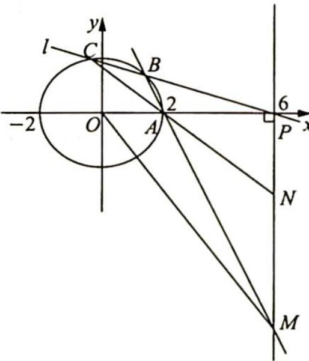

## 15.2 以斜率为背景的转化

## 研究密钥

斜率是解析几何中常用的知识和工具. 证明角相等的方法, 一是可以考虑角平分线性质, 即证明点到角两边的距离相等; 二是可以考虑三角形内角平分线性质; 三是可以考虑夹角公式; 四是证明两条直线关于 $x$ 轴对称, 故只需证明两条直线的斜率之和为 0 . 对于证明角度相等转化为斜率关系是通法.

例 15.3 如图所示, 已知椭圆 $C: \frac{x^{2}}{a^{2}} + \frac{y^{2}}{b^{2}} = 1 (a > b > 0)$ 的短轴长为 $2\sqrt{3}$ , 右焦点为 $F(1,0)$ , 点 $M$ 是椭圆 $C$ 上异于左、右顶点 $A, B$ 的一点.

(1) 求椭圆 C 的方程；

(2) 若直线 $AM$ 与直线 $x = 2$ 交于点 $N$ , 线段 $BN$ 的中点为 $E$ . 证明: 点 $B$ 关于直线 $EF$ 的对称点在直线 $MF$ 上.

分析 ▶ (1)根据短轴长可得 b，根据焦点坐标可得 c，根据 $a^{2}=b^{2}+c^{2}$ 可得 a；(2)如果用纯代数的方法，需求出点 B 关于 EF 的对称点及直线 MF 的方程，计算量较大，如果分析一下几何性质，将点 B 关于 EF 的对称点在直线 MF 上转化为 EF 平分 $\angle MFB$ ，再进一步挖掘几何性质知点 E 到 MF 的距离等于 BE。这样经过分析出几何特征降低了计算难度。

解析 (1)由题意得 $2b = 2\sqrt{3}$ , 则 $b = \sqrt{3}, c = 1, a^2 = b^2 + c^2 = 4$ , 所以椭圆方程为 $\frac{x^2}{4} + \frac{y^2}{3} = 1$ .

(2)证法一(通过点到直线距离相等证明角平分线): 点 B 关于直线 EF 的对称点在直线 MF 上等价于 EF 平分 $\angle MFB$ .

设直线 AM 的方程为 $y = k(x + 2)(k \neq 0)$ ，则 $N(2, 4k)$ ， $E(2, 2k)$ ，联立 $\left\{\begin{aligned}\frac{x^{2}}{4} + \frac{y^{2}}{3} &= 1 \\ y &= k(x + 2)\end{aligned}\right.$ ，消 y 得 $(4k^{2} + 3)x^{2} + 16k^{2}x + 16k^{2} - 12 = 0$ .

设 $M(x_0, y_0)$ , 由韦达定理可知 $-2x_0 = \frac{16k^2 - 12}{3 + 4k^2}, x_0 = \frac{-8k^2 + 6}{3 + 4k^2}, y_0 = k(x_0 + 2) = \frac{12k}{3 + 4k^2}$ .

①当直线 $MF \perp x$ 轴时, $x_0 = 1, k = \pm \frac{1}{2}, M(1, \pm \frac{3}{2}), N(2, \pm 2), E(2, \pm 1)$ , 此时点 $E$ 在 $\angle BFM$ 的角平分线所在的直线 $y = x - 1$ 或 $y = -x + 1$ 上, 即 $EF$ 平分 $\angle MFB$ .

②当直线 $MF$ 斜率存在时, $k \neq \pm \frac{1}{2}$ , 直线 $MF$ 的斜率 $k_{MF} = \frac{y_0}{x_0 - 1} = \frac{4k}{1 - 4k^2}$ , 直线 $MF$ 的方程为 $4kx + (4k^2 - 1)y - 4k = 0$ . 点 $E$ 到 $MF$ 的距离 $d = \frac{|8k + (4k^2 - 1) \cdot 2k - 4k|}{\sqrt{16k^2 + (4k^2 - 1)^2}} = \frac{|2k(4k^2 + 1)|}{4k^2 + 1} = |2k| = |BE|$ , 即 $EF$ 为 $\angle BFM$ 的平分线, 所以点 $B$ 关于直线 $EF$ 的对称点在直线 $MF$ 上.

综上所述,点 B 关于直线 EF 的对称点在 MF 上.

证法二(通过二倍角公式证明角平分线): 若证明点 B 关于直线 EF 的对称点在直线 MF 上, 则需证明 EF 平分 $\angle BFM$ .

设 $\theta = \angle BFE$ ，则 $\tan 2\theta = \frac{2\tan\theta}{1 - \tan^2\theta}$ ，依题意得 $A(-2,0),AM:y = k(x + 2)(k\neq 0)$ ，令 $x = 2$ 得 $N(2,4k),F(1,0),E(2,2k),k_{EF} = \tan \theta = 2k$ ，得 $\tan 2\theta = \frac{4k}{1 - 4k^2}.$

以下求点 $M$ 的坐标, 同解法一同样步骤可得 $M\left(\frac{6 - 8k^2}{3 + 4k^2}, \frac{12k}{3 + 4k^2}\right), F(1,0)$ , 所以 $k_{MF} = \frac{\frac{12k}{3 + 4k^2}}{\frac{6 - 8k^2}{3 + 4k^2} - 1} = \frac{\frac{12k}{3 + 4k^2}}{\frac{3 - 12k^2}{3 + 4k^2}} = \frac{12k}{3 - 12k^2} = \frac{4k}{1 - 4k^2} = \tan 2\theta$ , 因此 $\tan \angle BFM = \tan 2\theta = \tan 2\angle BFE$ ,

即 $\angle BFM = 2\angle BFE.$

故 $\angle {BFE} = \angle {MFE}$ ,点 $B$ 关于直线 ${EF}$ 的对称点在直线 ${MF}$ 上.

变式(1) (2021八省联考第21题)双曲线 $C: \frac{x^2}{a^2} - \frac{y^2}{b^2} = 1 (a > 0, b > 0)$ 的左顶点为 $A$ , 右焦点为 $F$ , 动点 $B$ 在 $C$ 上. 当 $BF \perp AF$ 时, $|AF| = |BF|$ .

(1)求 $C$ 的离心率；

(2) 若 B 在第一象限, 证明: $\angle BFA = 2\angle BAF$ .

解析 (1) 当 $BF \perp AF$ 时, $|AF| = |BF|$ , 此时设 $B(c, y_B)$ , 则 $\frac{c^2}{a^2} - \frac{y_B^2}{b^2} = 1$ , 所以 $y_B^2 = b^2\left(\frac{c^2}{a^2} - 1\right) = \frac{b^4}{a^2}$ .

因为 $|BF| = |y_B| = \frac{b^2}{a} = |AF| = a + c$ ，即 $b^2 = a^2 + ac$ ，又 $b^2 = c^2 - a^2$ ，所以 $c^2 - a^2 = a^2 + ac$ ，则 $c^2 - ac - 2a^2 = 0, e^2 - e - 2 = 0, (e - 2)(e + 1) = 0$ ，解得 $e = 2, e = -1$ （舍去）.

故 $C$ 的离心率为 2.

(2) 解法一(坐标法): 如图所示, 设 $B(x_0, y_0)$ , 则 $x_0 > a, y_0 > 0$ .

由(1)知， $e = 2$ ，所以 $\frac{c}{a} = 2, c = 2a, b = \sqrt{3} a$ ，则渐近线方程为 $y = \pm \frac{b}{a} x = \pm \sqrt{3} x, \angle BAF < 60^{\circ}, \angle BFA < 120^{\circ}$ .

①当 $x_0 = c$ 时，由(1)知， $\angle BFA = 90^\circ, \angle BAF = 45^\circ$ ，所以 $\angle BFA = 2\angle BAF$ .

② 当 $x_0 \neq c$ 时, $\tan \angle BFA = \frac{-y_0}{x_0 - c}$ , $\tan \angle BAF = \frac{y_0}{x_0 + a}$ , 所以

\(\tan 2 \angle BAF = \frac{2\tan \angle BAF}{1 - \tan^2 \angle BAF} = \frac{\frac{2y\_0}{x\_0 + a}}{1 - \left(\frac{y\_0}{x\_0 + a}\right)^2} = \frac{2y\_0(x\_0 + a)}{(x\_0 + a)^2 - y\_0^2} = \frac{2y\_0(x\_0 + a)}{(x\_0 + a)^2 + b^2\left(1 - \frac{x\_0^2}{a^2}\right)} = \frac{2y\_0(x\_0 + a)}{(x\_0 + a)^2 + b^2\left(1 - \frac{x\_0^2}{a^2}\right)} = \frac{2y\_0(x\_0 + a)}{(x\_0 + a)^2 + b^2\left(1 - \frac{x\_0^2}{a^2}\right)} = \frac{2y\_0(x\_{0} + a)}{(x\_{0} + a)^{2} + b^{2}\left(1 - \frac{x\_{0}^2}{a^{2}}\right)} = \frac{2y\_0(x\_{0} + a)}{(x\_{0} + a)^{2} + b^{2}\left(1 - \frac{x\_{0}^2}{a^{2}}\right)} = \frac{2y\_0(x\_{0} + a)}{(x\_{0} + a)^{2} + b^{2}\left(1 - \frac{x\_{0}^2}{a^{4}}\right)} = \frac{2y\_0(x\_{0} + a)}{(x\_{0} + a)^{2} + b^{2}\left(1 - \frac{x\_{0}^2}{a^{4}}\right)} = \frac{2y\_0(x\_{0} + a)}{(x\_{0} + a)^{2} + b^{2}\left(1 - \frac{x\_{0}^2}{b^{4}}\right)} = \frac{2y\_0(x\_{0} + a)}{(x\_{0} + a)^{2} + b^{2}\left(1 - \frac{x\_{0}^2}{b^{4}}\right)} = \frac{2y\_0(x\_{0} + a)}{(x\_{0} + a)^{2} + b^{2}\left(1 - \frac{x\_{0}^3}{b^{4}}\right)} = \frac{2y\_0(x\_{0} + a)}{(x\_{0} + a)^{2} + b^{2}\left(1 - \frac{x\_{0}^3}{b^{4}}\right)} = \frac{2y\_0(x\_{0} + a)}{(x\_{0} + a)^{2} + b^{2}\left(1 - \frac{x\_{0}}{b^{4}}\right)} = \frac{2y\_0(x\_{0} + a)}{(x\_{0} + a)^{2} + b^{2}\left(1 - \frac{x\_{0}}{b^{4}}\right)} = \frac{2y\_0(x\_{0} + a)}{(x\_{0} + a)^{2} + b^{2}\left(1 - \frac{x\_{0}}{b ^{4}}\right)} = \frac{2y\_0(x\_{0} + a)}{(x\_{0} + a)^{2} + b^{2}\left(1 - \frac{x\_{0}}{b^{4}}\right)} = \frac{2y\_0(x\_{0} + a)}{(x\_{0} + a)^{2} + b^{2}\left(1 - \frac{x\_{0}}{b^{4}}, 1 - \frac{x\_{0}}{b^{4}}\right)} = \frac{2y\_0(x\_{0} + a)}{(x\_{0} + a)^{2} + b^{2}\left(1 - \frac{x\_{0}}{b^{4}}\right)} = \frac{2y\_0(x\_{0} + a)}{(x\_{0} + a)^{2} + b^{2}\left(1 + x\_{0}\right)} = \frac{2y\_0(x\_{0} + a)}{(x\_{0} + a)^{2} + b^{2}\left(1 - x\_{0}\right)} = \frac{2y\_0(x\_{0} + a)}{(x\_{0} + a)^{2} + b^{2}\left(1 - x\_{0}\right)} = \frac{2y\_0(x\_{0} + a)}{(x\_{0} + a)^{2} + b^{2}\left(1 - x\_{0}\right)} = \frac{2y\_0(x\_{0}, 1) - y\_0}{(x\_0 - 1) / (x\_0 - 1) / (x\_0 - 1) / (x\_0 - 1) / (x\_0 - 1) / (x\_0 - 1) / (x\_0 - 1) / (x\_0 - 1) / (x\_0 - 1) / (x\_0 - 1) / (x\_0 - 1) / (x\_0 - 1) / (5, 5) / (5, 5) / (5, 5) / (5, 5) / (5, 5) / (5, 5) / (5, 5) / (5, 5) / (5, 5) / (5, 5) / (5, 5) / (5, 5) / (5, 5) / (5, 5) / (5, 5)

又 $\angle BFA<120^{\circ}$ , 所以 $\angle BFA=2\angle BAF$ .

综合①②可得 $\angle BFA=2\angle BAF$ .

解法二(几何法):如图所示,由(1)知 e=2,设直线 $l: x=\frac{a^{2}}{c}=\frac{a}{2}$ (右准线)与 x 轴交于点

$H\left(\frac{a}{2},0\right)$ ，和AB交于点P，连接PF，易知 $\triangle PAF$ 为等腰三角形，且 $\angle BAF=\angle PFA.$

欲证 $\angle BFA = 2\angle BAF$ , 即证 $\angle PFA = \angle PFB$ , 也就是 $PF$ 为 $\angle BFA$ 的平分线.

由角平分线定理可知, 若 $\angle PFA = \angle PFB$ , 则 $\frac{PA}{PB} = \frac{FA}{FB} (\ast)$ , 即 $\frac{d(A,l)}{d(B,l)} =$

$\frac{FA}{FB}\Leftrightarrow\frac{FA}{d(A,l)}=\frac{FB}{d(B,l)}$ ，由双曲线的第二定义，得 $\frac{|FA|}{d(A,l)}=\frac{|FB|}{d(B,l)}=e=2$ ，即 $(*)$ 式成立.

由角平分线定理的逆定理, 可知 ${PF}$ 为 $\angle {BFA}$ 的平分线,命题得证.

例 15.4 (2022 北京东城二模) 已知椭圆 $E: \frac{x^2}{a^2} + \frac{y^2}{b^2} = 1 (a > b > 0)$ 的右顶点为 $A(2,0)$ , 离心率为 $\frac{1}{2}$ . 过点 $P(6,0)$ 与 $x$ 轴不重合的直线 $l$ 交椭圆 $E$ 于不同的两点 $B, C$ , 直线 $AB, AC$ 分别交直线 $x = 6$ 于点 $M, N$ .

(1) 求椭圆 E 的方程；

(2) 设 O 为原点. 求证: $\angle PAN + \angle POM = 90^{\circ}$ .

分析 ▶ (1)由题得到关于 $a, c$ 的方程组, 解方程组即可得解; (2)将条件 $\angle PAN + \angle POM = 90^{\circ}$ 转化为有关斜率的关系式, 通过坐标法解决. 如图所示, 设 $M(6, m), N(6, n)$ , 将角度条件转化为 $m, n$ 的关系式. 设直线 $l$ 的方程为 $y = k(x - 6)$ , 联立椭圆方程 $\frac{x^{2}}{4} + \frac{y^{2}}{3} = 1$ 得韦达定理, 根据 $A, B, M$ 三点共线得到 $m = \frac{4y_{1}}{x_{1} - 2}, n = \frac{4y_{2}}{x_{2} - 2}$ , 求出 $m, n$ 的关系式即得证.

解析 (1)由题得 $a = 2, \frac{c}{a} = \frac{1}{2}$ , 所以 $a = 2, c = 1, b = \sqrt{3}$ , 故椭圆 $E$ 的方程为 $\frac{x^2}{4} + \frac{y^2}{3} = 1$ .

(2)要证 $\angle PAN+\angle POM=90^{\circ}$ ,只需证明 $\angle PAN=90^{\circ}-\angle POM$ ,两边取正切得 $\tan\angle PAN=\frac{1}{\tan\angle POM},\tan\angle PAN\cdot\tan\angle POM=1$ ,即 $k_{AN}\cdot k_{OM}=1$ .

设 $M(6,m)$ , $N(6,n)$ ，只需证明 $\frac{n}{6-2} \cdot \frac{m}{6}=1, mn=24.$

设直线 l 的方程为 $y = k(x - 6)$ , $k \neq 0$ ，联立椭圆方程与直线方程 $\left\{\begin{aligned}\frac{x^{2}}{4} + \frac{y^{2}}{3} &= 1 \\ y &= k(x - 6)\end{aligned}\right.$ ，得

$$
(3 + 4 k ^ {2}) x ^ {2} - 4 8 k ^ {2} x + 1 4 4 k ^ {2} - 1 2 = 0.
$$

设 $B(x_{1},y_{1}),C(x_{2},y_{2})$ ，所以 $\Delta >0,x_1 + x_2 = \frac{48k^2}{3 + 4k^2},x_1x_2 = \frac{144k^2 - 12}{3 + 4k^2}.$

又 $A, B, M$ 三点共线，所以 $\frac{m}{4} = \frac{y_1}{x_1 - 2}, m = \frac{4y_1}{x_1 - 2}$ ，同理 $n = \frac{4y_2}{x_2 - 2}$ ，则 $mn = \frac{4y_1}{x_1 - 2} \cdot \frac{4y_2}{x_2 - 2} = \frac{16k^2(x_1 - 6)(x_2 - 6)}{(x_1 - 2)(x_2 - 2)} = \frac{16k^2[x_1x_2 - 6(x_1 + x_2) + 36]}{x_1x_2 - 2(x_1 + x_2) + 4}$ ，也就是 $mn = \frac{16k^2\left[\frac{144k^2 - 12}{3 + 4k^2} - 6 \cdot \frac{48k^2}{3 + 4k^2} + 36\right]}{\frac{144k^2 - 12}{3 + 4k^2} - 2 \cdot \frac{48k^2}{3 + 4k^2} + 4} = \frac{16k^2 \cdot 96}{64k^2} = 24.$ 故 $\angle PAN + \angle POM = 90^\circ$ .

变式(1) 已知椭圆 $C: \frac{x^{2}}{a^{2}} + \frac{y^{2}}{b^{2}} = 1 (a > b > 0)$ 过点 $P(2,1)$ , 且离心率为 $\frac{\sqrt{3}}{2}$ .

(1) 求 $C$ 的方程；

(2)已知直线 l 不经过点 P，且斜率为 $\frac{1}{2}$ ，若 l 与 C 交于两个不同点 A, B，且直线 PA, PB 的倾斜角分别为 $\alpha, \beta$ ，试判断 $\alpha + \beta$ 是否为定值，若是，求出该定值；否则，请说明理由。

解析 ▶ (1) 离心率为 $e = \frac{c}{a} = \frac{\sqrt{3}}{2}, a = 2k, c = \sqrt{3}k, b = k, k > 0$ ，由 $\frac{4}{4k^2} + \frac{1}{k^2} = 1$ ，得 $k^2 = 2$ ，故椭圆的方程为 $\frac{x^2}{8} + \frac{y^2}{2} = 1$ .

(2) 设直线 $l: y = \frac{1}{2} x + m (m \neq 0), A(x_1, y_1), B(x_2, y_2)$ ，由 $\left\{ \begin{array}{l} x - 2y + 2m = 0 \\ \frac{x^2}{8} + \frac{y^2}{2} = 1 \end{array} \right.$ ，消去 $y$ 得 $x^2 + 2mx + 2m^2 - 4 = 0$ ，又 $\Delta = 4m^2 - 4(2m^2 - 4) > 0$ ，故 $m \in (-2, 0) \cup (0, 2), x_1 + x_2 = -2m, x_1x_2 = 2m^2 - 4$ .

根据题意可得 PA 与 PB 的斜率存在, 所以 $\alpha, \beta \neq \frac{\pi}{2}$ .

设直线 $PA, PB$ 的斜率分别为 $k_{1}, k_{2}$ , 则 $k_{1} = \frac{y_{1} - 1}{x_{1} - 2}, k_{2} = \frac{y_{2} - 1}{x_{2} - 2}$ .

$$
\begin{array}{r l} \text {故} k _ {1} + k _ {2} & = \frac {y _ {1} - 1}{x _ {1} - 2} + \frac {y _ {2} - 1}{x _ {2} - 2} = \frac {(y _ {1} - 1) (x _ {2} - 2) + (y _ {2} - 1) (x _ {1} - 2)}{(x _ {1} - 2) (x _ {2} - 2)} \\ & = \frac {\left(\frac {1}{2} x _ {1} + m - 1\right) (x _ {2} - 2) + \left(\frac {1}{2} x _ {2} + m - 1\right) (x _ {1} - 2)}{(x _ {1} - 1) (x _ {2} - 1)} \\ & = \frac {x _ {1} x _ {2} + (m - 2) (x _ {1} + x _ {2}) - 4 (m - 1)}{(x _ {1} - 2) (x _ {2} - 2)} \end{array}
$$

$$
= \frac {2 m ^ {2} - 4 + (m - 2) (- 2 m) - 4 (m - 1)}{(x _ {1} - 2) (x _ {2} - 2)} = 0.
$$

又 $\tan \alpha + \tan \beta = 0$ ，故 $\alpha + \beta = \pi$ .

变式2: (2022 新课标全国甲卷理 20 文 21) 设抛物线 $C: y^{2} = 2px (p > 0)$ 的焦点为 $F$ , 点 $D(p,0)$ , 过 $F$ 的直线交 $C$ 于 $M, N$ 两点. 当直线 $MD$ 垂直于 $x$ 轴时, $|MF| = 3$ .

(1) 求 C 的方程；

(2)设直线 $MD, ND$ 与 $C$ 的另一个交点分别为 $A, B$ , 记直线 $MN, AB$ 的倾斜角分别为 $\alpha$ , $\beta$ . 当 $\alpha - \beta$ 取得最大值时, 求直线 $AB$ 的方程.

解析 ▶ (1) 当直线 $MD$ 垂直于 $x$ 轴时, $M(p, \sqrt{2} p)$ , 则 $|MF| = p + \frac{p}{2} = 3$ , 解得 $p = 2$ , 故抛物线 $C$ 的方程为 $y^2 = 4x$ .

(2)由题意知, $F(1,0)$ , $D(2,0)$ .

① 当 $MN \perp x$ 轴时，易知 $AB \perp x$ 轴，此时 $\alpha = \beta = 90^{\circ}$ ，则 $\alpha - \beta = 0$ ；

② 当直线 $MN$ 的斜率存在时, 如图所示, 设直线 $MN$ 的斜率为 $k_{1}, AB$ 的斜率为 $k_{2}$ .

由题意可知 $k_{1}k_{2} > 0$ ，则根据对称性，不妨考虑 $k_{1} > 0, k_{2} > 0$ 的情况.

若 $\alpha - \beta$ 取得最大值, 则 $\tan (\alpha - \beta) = \frac{k_1 - k_2}{1 + k_1k_2}$ 取得最大值.

设 $MN$ 的直线方程为 $x = t_{1}y + 1$ (其中 $t_1 = \frac{1}{k_1}$ ), $M(x_1, y_1)$ , $N(x_2, y_2)$ , $A(x_A, y_A)$ , $B(x_B, y_B)$ , 联立直线 $MN$ 的方程与抛物线 $\left\{ \begin{array}{l} x = t_1y + 1 \\ y^2 = 4x \end{array} \right.$ , 可得 $y^2 - 4t_1y - 4 = 0$ , 则 $y_1y_2 = -4$ , 所以 $x_1x_2 = \frac{y_1^2}{4} \cdot \frac{y_2^2}{4} = 1$ .

因为 AM, BN 均过 D(2,0)，则按同样方法可得 $x_{1}x_{A}=4, x_{A}=\frac{4}{x_{1}}; y_{1}y_{A}=-8, y_{A}=-\frac{8}{y_{1}}$ 且 $x_{B}=\frac{4}{x_{2}}, y_{B}=-\frac{8}{y_{2}}$ ，所以 $k_{1}=\frac{y_{1}-y_{2}}{x_{1}-x_{2}}=\frac{y_{1}-y_{2}}{\frac{y_{1}^{2}}{4}-\frac{y_{2}^{2}}{4}}=\frac{4}{y_{1}+y_{2}}, k_{2}=\frac{y_{A}-y_{B}}{x_{A}-x_{B}}=\frac{-8\left(\frac{1}{y_{1}}-\frac{1}{y_{2}}\right)}{4\left(\frac{1}{x_{1}}-\frac{1}{x_{2}}\right)}=$ $\frac{y_{2}-y_{1}}{\frac{y_{2}^{2}}{2}-\frac{y_{1}^{2}}{2}}=\frac{2}{y_{1}+y_{2}}$ ，则 $k_{1}=2k_{2},\tan(\alpha-\beta)=\frac{k_{1}-k_{2}}{1+k_{1}k_{2}}=\frac{k_{2}}{1+2k_{2}^{2}}=\frac{1}{\frac{1}{k_{2}}+2k_{2}}\leqslant\frac{1}{2\sqrt{2}}$ ，当且仅当 $\frac{1}{k_{2}}=$ $2k_{2}$ ，即 $k_{2}=\frac{\sqrt{2}}{2}$ 时等号成立，故当 $\alpha-\beta$ 取得最大值时， $k_{2}=\frac{\sqrt{2}}{2}$ .

设直线 AB 的方程为 $x=t_{2}y+n=\sqrt{2}y+n$ ，联立直线 AB 与抛物线方程可得 $y^{2}-4\sqrt{2}y-4n=0$ ，因为 $y_{A}y_{B}=\frac{64}{y_{1}y_{2}}=-16=-4n$ ，则 n=4，故直线 AB 的方程为 $x-\sqrt{2}y-4=0$ 。

## 评注

本题考查抛物线中的运算能力,主要涉及抛物线中韦达定理的快速计算(单割线定理)及倾斜角与斜率的转化关系.若注意到直线 $MN$ , $AM$ (或 $BN$ )均过定点,可迅速判断横坐标及纵坐标之积为定值,进而构造四点坐标间的联系,不难发现 $AB$ 也过定点;否则,不断地设直线并与曲线联立,需要考生具备较强的逻辑推理能力.同时本题也考查学生对倾斜角与斜率的转化能力,注意到 $\alpha - \beta$ ,可采用分析法取正切值将角度差的最大值转化为含斜率形式的函数最大值,从而可以有效地将点的坐标引入进来.如果对本题研习较深,则会对角度与斜率的转化方法具有较高的敏感度.
