## 15.3 以几何图形为背景的转化

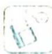

## 研究密钥

通常情况下,图形都具有形象、直观、简洁、易懂的特性,但对于某些特定题目的演算,特别是对于那些特别复杂的图形时,原本图形的那些优点特性或许就无法帮助我们进行快速有效的分析。而数学运算具有可操作性与严谨性,所以,这时候我们就要通过缜密的逻辑思维将那些特别复杂的图形中的几何关系转化为形式简洁的数学表达式,将原本的图形蕴含的信息完整地表达出来,再通过代数运算得出结论,最后转化为图形语言来解决问题。

例 15.5 (2022 北京海淀二模) 椭圆 $M: \frac{x^2}{a^2} + \frac{y^2}{b^2} = 1 (a > b > 0)$ 的左顶点为 $A(-2,0)$ , 离心率为 $\frac{\sqrt{3}}{2}$ .

(1) 求椭圆 M 的方程；

(2)已知经过点 $\left[0, \frac{\sqrt{3}}{2}\right]$ 的直线 $l$ 交椭圆 $M$ 于 $B, C$ 两点， $D$ 是直线 $x = -4$ 上一点。若四边形 $ABCD$ 为平行四边形，求直线 $l$ 的方程。

分析 ▶ (1) 直接由顶点和离心率求出椭圆方程即可; (2) 将四边形 ABCD 为平行四边形这一条件转化为向量相等, 即 $\overrightarrow{AD} = \overrightarrow{BC}$ , 再进一步转化为坐标相等; 或将四边形 ABCD 为平行四边形这一条件转化为对边相等, 其目的都是求出所设的参数值, 即可求得直线 l 的方程.

解析 (1)由题意知: $a = 2, \frac{c}{a} = \frac{\sqrt{3}}{2}$ , 则 $b^{2} = a^{2} - c^{2} = 1$ , 故椭圆 $M$ 的方程为 $\frac{x^{2}}{4} + y^{2} = 1$ .

(2)当直线 l 的斜率不存在时, 四边形 ABCD 不可能为平行四边形; 当直线 l 的斜率存在时, 如图所示, 设 $D(-4, t)$ , $B(x_{1}, y_{1})$ , $C(x_{2}, y_{2})$ , 又 $A(-2, 0)$ , 故 $k_{AD} = -\frac{t}{2} = k_{BC}$ .

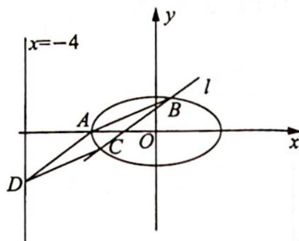

又直线 l 经过点 $\left(0, \frac{\sqrt{3}}{2}\right)$ ，故 l 的方程为 $y = -\frac{t}{2}x + \frac{\sqrt{3}}{2}$ .

联立直线与椭圆方程 $\left\{\begin{aligned}y&=-\frac{t}{2}x+\frac{\sqrt{3}}{2}\\ &\frac{x^{2}}{4}+y^{2}&=1\end{aligned}\right.$ ，消 y 可得 $(1+t^{2})x^{2}-2\sqrt{3}tx-1=0(*)$ .

以下可分两种解法.

解法一(利用边长相等):由(\*)式,显然 $\Delta>0,x_{1}+x_{2}=\frac{2\sqrt{3}t}{1+t^{2}},x_{1}x_{2}=-\frac{1}{1+t^{2}}$ , 则 $|BC|=$ $\sqrt{1+\left(-\frac{t}{2}\right)^{2}}\sqrt{(x_{1}+x_{2})^{2}-4x_{1}x_{2}}=\sqrt{1+\frac{t^{2}}{4}}\sqrt{\left(\frac{2\sqrt{3}t}{1+t^{2}}\right)^{2}+\frac{4}{1+t^{2}}}=\frac{\sqrt{(4+t^{2})(4t^{2}+1)}}{1+t^{2}}.$

又 $|AD|=\sqrt{4+t^{2}}$ ，由 $|BC|=|AD|$ ，可得 $\frac{\sqrt{(4+t^{2})(4t^{2}+1)}}{1+t^{2}}=\sqrt{4+t^{2}}$ ，解得t=0或 $t=\pm\sqrt{2}$ ，故直线l的方程为 $y=\frac{\sqrt{3}}{2}$ 或 $y=\pm\frac{\sqrt{2}}{2}x+\frac{\sqrt{3}}{2}$ .

解法二（利用向量相等）： $\Delta=(2\sqrt{3}t)^{2}+4(1+t^{2})=16t^{2}+4>0,\quad x_{1}=\frac{2\sqrt{3}t+\sqrt{\Delta}}{2(1+t^{2})},$ $x_{2}=\frac{2\sqrt{3}t-\sqrt{\Delta}}{2(1+t^{2})}.$

因为 ABCD 为平行四边形, 所以 $\overrightarrow{AD} = \overrightarrow{BC}$ , 即 $(-2, t) = (x_{2} - x_{1}, y_{2} - y_{1})$ , 则 $x_{2} - x_{1} = -2$ ,
即 $\frac{2\sqrt{3}t-\sqrt{\Delta}}{2(1+t^{2})}-\frac{2\sqrt{3}t+\sqrt{\Delta}}{2(1+t^{2})}=-\frac{\sqrt{\Delta}}{1+t^{2}}=-\frac{\sqrt{16t^{2}+4}}{1+t^{2}}=-2$ , 解得 t=0 或 $t=\pm\sqrt{2}$ , 故直线 l 的方程为 $y=\frac{\sqrt{3}}{2}$ 或 $y=\pm\frac{\sqrt{2}}{2}x+\frac{\sqrt{3}}{2}$ .

变式 1 已知椭圆 $C: \frac{x^2}{a^2} + \frac{y^2}{b^2} = 1 (a > b > 0)$ 过点 $M(2,1)$ , 且离心率为 $\frac{\sqrt{3}}{2}$ .

(1)求椭圆 C 的方程；

(2)若过原点的直线 $l_{1}$ 与椭圆 $C$ 交于 $P, Q$ 两点, 且在直线 $l_{2}: x - y + 2\sqrt{6} = 0$ 上存在点 $M$ , 使得 $\triangle MPQ$ 为等边三角形, 求直线 $l_{1}$ 的方程.

解析 (1)由题意可知,椭圆的离心率 $e = \frac{c}{a} = \sqrt{1 - \frac{b^2}{a^2}} = \frac{\sqrt{3}}{2}$ , 即 $a^2 = 4b^2$ .

由椭圆 $C: \frac{x^2}{a^2} + \frac{y^2}{b^2} = 1 (a > b > 0)$ 过点 $M(2,1)$ , 代入可知 $\frac{4}{4b^2} + \frac{1}{b^2} = 1$ , 解得 $b^2 = 2$ , 则 $a^2 = 8$ , 故椭圆 $C$ 的方程为 $\frac{x^2}{8} + \frac{y^2}{2} = 1$ .

(2) 显然, 直线 $l_{1}$ 的斜率 $k$ 存在, 设 $P(x_{0}, y_{0})$ , 则 $Q(-x_{0}, -y_{0})$ .

(i) 当 $k = 0$ , 直线 $PQ$ 的垂直平分线为 $y$ 轴, $y$ 轴与直线 $l_{2}$ 的交点为 $M(0,2\sqrt{6})$ .

由 $|PO| = 2\sqrt{2}$ , $|MO| = 2\sqrt{6}$ , 所以 $\angle MPO = 60^{\circ}$ , 则 $\triangle MPQ$ 为等边三角形, 此时直线 $l_{1}$ 的方程为 $y = 0$ .

(ii) 当 $k \neq 0$ 时, 设直线 $l_{1}$ 的方程为 $y = kx$ , 则 $\left\{ \begin{array}{l} y = kx \\ \frac{x^{2}}{8} + \frac{y^{2}}{2} = 1 \end{array} \right.$ , 整理得 $(1 + 4k^{2})x^{2} = 8$ , 解得 $|x_{0}| = \sqrt{\frac{8}{1 + 4k^{2}}}$ , 则 $|PO| = \sqrt{1 + k^{2}} \cdot \sqrt{\frac{8}{1 + 4k^{2}}}$ , $PQ$ 的垂直平分线为 $y = -\frac{1}{k} x$ .

联立 $\left\{ \begin{array}{l} x - y + 2\sqrt{6} = 0 \\ y = -\frac{1}{k}x \end{array} \right.$ , 解得 $\left\{ \begin{array}{l} x = -\frac{2\sqrt{6}k}{k + 1} \\ y = \frac{2\sqrt{6}}{k + 1} \end{array} \right.$ , 则 $M(-\frac{2\sqrt{6}k}{k + 1}, \frac{2\sqrt{6}}{k + 1})$ , 所以 $|MO| = \sqrt{\frac{24(k^2 + 1)}{(k + 1)^2}}$ .

又 $\triangle MPQ$ 为等边三角形, 则 $|MO| = \sqrt{3} |PO|$ , 所以 $\sqrt{\frac{24(k^2 + 1)}{(k + 1)^2}} = \sqrt{3} \cdot \sqrt{1 + k^2} \cdot \sqrt{\frac{8}{1 + 4k^2}}$ , 解得 $k = 0$ (舍去) 或 $k = \frac{2}{3}$ , 所以直线 $l_1$ 的方程为 $y = \frac{2}{3} x$ .

综上可知, 直线 $l_{1}$ 的方程为 y=0 或 $y=\frac{2}{3}x$ .

例15.6 直线 $y = kx + m (m \neq 0)$ 与 $W: \frac{x^2}{4} + y^2 = 1$ 相交于 $A, C$ 两点， $O$ 是坐标原点.

(1)当点 $B$ 的坐标为(0,1)，且四边形 $OABC$ 为菱形时，求 $AC$ 的长；

(2)当点 B 在 W 上且不是 W 的顶点时,证明四边形 OABC 不可能为菱形.

分析 (1)由菱形的对角线互相垂直平分可知 $M\left(0, \frac{1}{2}\right), l_{AC}: y = \frac{1}{2}$ , 如图所示.

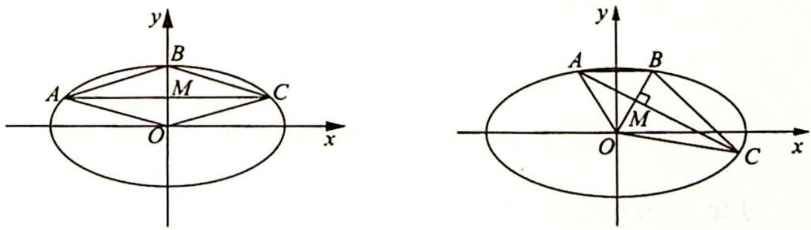

(2)如图所示,设 $AC \cap OB = M$ , 由菱形的几何性质可知 $k_{OB} \cdot k_{AC} = -1$ . 由中点弦结论可知 $k_{OM} \cdot k_{AC} = -\frac{b^2}{a^2} = -\frac{1}{4}$ , 矛盾. 故四边形 OABC 不可能为菱形.

解析 (1) 因为四边形 $OABC$ 为菱形, 则 $AC$ 与 $OB$ 相互垂直平分.

由于 $O(0,0), B(0,1)$ , 所以设点 $A\left(t, \frac{1}{2}\right)$ , 代入椭圆方程得 $\frac{t^2}{4} + \frac{1}{4} = 1$ , 则 $t = \pm \sqrt{3}$ , 故 $|AC| = 2\sqrt{3}$ .

(2)证明:假设四边形 OABC 为菱形,因为点 B 不是 W 的顶点,且 $AC \perp OB$ ,设 AC 的斜率为 k,所以 $k \neq 0$ .

由 $\left\{\begin{aligned}x^{2}+4y^{2}=4\\ y=kx+m\end{aligned}\right.$ 消去y并整理得 $(1+4k^{2})x^{2}+8kmx+4m^{2}-4=0.$

设 $A(x_{1},y_{1}),C(x_{2},y_{2})$ ，则 $\frac{x_1 + x_2}{2} = -\frac{4km}{1 + 4k^2},\frac{y_1 + y_2}{2} = k\cdot \frac{x_1 + x_2}{2} +m = \frac{m}{1 + 4k^2}$ ，所以AC的中点为 $M\left(\frac{-4km}{1 + 4k^2},\frac{m}{1 + 4k^2}\right).$

又 $M$ 为 $AC$ 和 $OB$ 的交点, 且 $m \neq 0, k \neq 0$ , 所以直线 $OB$ 的斜率为 $-\frac{1}{4k}$ . 因为 $k \cdot \left(-\frac{1}{4k}\right) = -\frac{1}{4} \neq -1$ , 所以 $AC$ 与 $OB$ 不垂直. 故四边形 $OABC$ 不是菱形, 与假设矛盾.

综上,当点 $B$ 在 $W$ 上且不是 $W$ 的顶点时,四边形 $OABC$ 不可能是菱形.

变式(1) 已知 $A,B,C$ 是抛物线 $W : {y}^{2} = {4x}$ 上的三个点, $D$ 是 $x$ 轴上的点.

(1)当点 $B$ 是 $W$ 的顶点,且四边形 ${ABCD}$ 为正方形时,求此正方形的面积；

(2)当点 $B$ 不是 $W$ 的顶点时, 判断四边形 $ABCD$ 是否可能为正方形, 并说明理由.

分析 (1)正方形 $ABCD$ 中, $AC$ 与 $BD$ 垂直平分, 设 $AC \cap BD = E$ , 如图 1 所示, 则点 $(x_{E}, x_{E})$ 在抛物线上; (2)正方形 $\Leftrightarrow$ 对角线互相垂直、平分, 且对角线相等, 若 $B$ 不是 $W$ 的顶点, 可由垂直平分得出矛盾, 如图 2 所示.

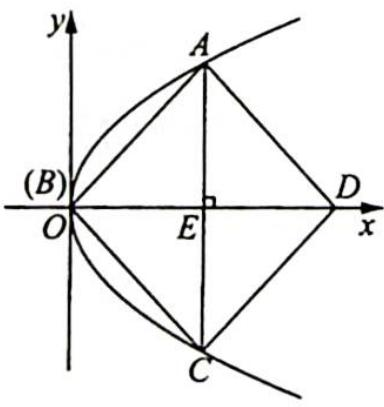  
图1

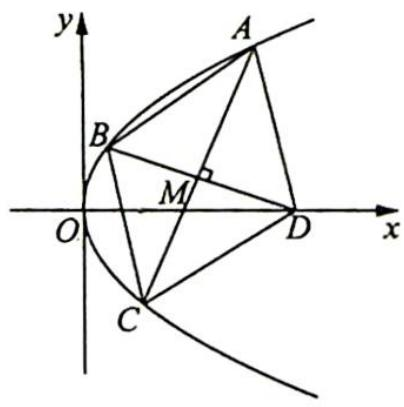  
图 2

解析 ▶ (1)当点 B 是 W 的顶点时, 设 AC 与 BD 相交于点 E, 则 $\left|EA\right| = \left|EB\right|$ , 不妨设点 A 在 x 轴上方, 则 A 的坐标为 $(x_{E}, x_{E})$ .

代入抛物线方程得 $x_{E}=4$ ，此时正方形的边长为 $4\sqrt{2}$ ，所以正方形的面积为 $(4\sqrt{2})^{2}=32$ 。

(2)四边形 $ABCD$ 不可能为正方形. 理由如下:

当点 $B$ 不是 $W$ 的顶点时, 直线 $AC$ 的斜率一定存在, 设其方程为 $y = kx + m (k \neq 0, m \neq 0)$ , $A, C$ 坐标分别为 $(x_{1}, y_{1}), (x_{2}, y_{2})$ , 联立 $\left\{ \begin{array}{l} y^{2} = 4x \\ y = kx + m \end{array} \right.$ , 则 $k^{2}x^{2} + (2km - 4)x + m^{2} = 0$ , 所以 $\left\{ \begin{array}{l} x_{1} + x_{2} = \frac{4 - 2km}{k^{2}} \\ x_{1}x_{2} = \frac{m^{2}}{k^{2}} \end{array} \right.$ . 又 $y_{1} + y_{2} = k(x_{1} + x_{2}) + 2m = \frac{4}{k}$ , 因此, $AC$ 的中点 $M$ 的坐标为 $\left(\frac{2 - km}{k^2}, \frac{2}{k}\right), |AC| = \sqrt{1 + k^2}|x_1 - x_2| = \frac{\sqrt{1 + k^2} \cdot \sqrt{16 - 16km}}{k^2}$ .

若四边形 ABCD 为正方形, 则 BD 的中点也是 M, $k_{BD} = -\frac{1}{k_{AC}} = -\frac{1}{k}$ , 因为点 D 在 x 轴上,
所以 $y_{D}=0, y_{B}=2\times\frac{2}{k}=\frac{4}{k}$ ，代入 $y^{2}=4x$ ，得 $x_{B}=\frac{4}{k^{2}}$ ，即 $B\left(\frac{4}{k^{2}},\frac{4}{k}\right)$ ，则 $k_{BD}=k_{BM}=\frac{\frac{4}{k}-\frac{2}{k}}{\frac{4}{k^{2}}-\frac{2-km}{k^{2}}}=\frac{2k}{2+km}=-\frac{1}{k}$ ，整理得 $2k^{2}+km+2=0$ ①.

$$
\vert B D \vert = 2 \vert B M \vert = 2 \sqrt {\left(\frac {4}{k ^ {2}} - \frac {2 - k m}{k ^ {2}}\right) ^ {2} + \left(\frac {4}{k} - \frac {2}{k}\right) ^ {2}} = 2 \sqrt {\frac {4 + 4 k m + k ^ {2} m ^ {2} + 4 k ^ {2}}{k ^ {4}}}
$$

$$
\vert A C \vert =
$$

$$
\vert B D \vert
$$

$$
(1 + k ^ {2}) (1 6 - 1 6 k m) = 4 (4 + 4 k m + k ^ {2} m ^ {2} + 4 k ^ {2})
$$

$$
8 + 4 k ^ {2} + k m = 0
$$

由①②得 $k^{2} + 3 = 0$ , 此时 $k$ 无解, 故四边形 $ABCD$ 不可能为正方形.

变式2: 已知 A, B 是椭圆 $C: 2x^{2} + 3y^{2} = 9$ 上两点，点 M 的坐标为 $(1,0)$ .

(1)当 $A, B$ 两点关于 $x$ 轴对称, 且 $\triangle MAB$ 为等边三角形时, 求 $AB$ 的长;

(2)当 $A,B$ 两点不关于 $x$ 轴对称时,证明： $\bigtriangleup  {MAB}$ 不可能为等边三角形.

分析 ▶ (1) 如图所示, 由对称性可知, $\angle AMO = \angle A'Mx = 30^{\circ}, k_{A'M} = \frac{\sqrt{3}}{3}, k_{AM} = -\frac{\sqrt{3}}{3}$ , 故 $AB$ 长有两解.

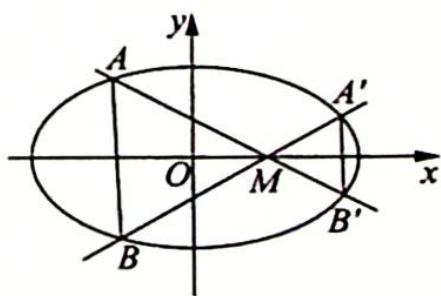

(2) $\triangle MAB$ 不可能为等边三角形 $\Leftrightarrow |MA| \neq |MB| \Leftrightarrow |MA| = f(x_A)$ 是单调函数, 推出矛盾.

解析 ▶ 设 $A(x_{0}, y_{0})$ ， $B(x_{0}, -y_{0})$ ，因为 $\triangle ABM$ 为等边三角形，所以 $|y_{0}| =$

$$
\frac {\sqrt {3}}{3} \left| x _ {0} - 1 \right|.
$$

又点 $A(x_0, y_0)$ 在椭圆上，所以 $\left\{ \begin{array}{l} |y_0| = \frac{\sqrt{3}}{3} |x_0 - 1| \\ 2x_0^2 + 3y_0^2 = 9 \end{array} \right.$ ，消去 $y_0$ ，得到 $3x_0^2 - 2x_0 - 8 = 0$ ，解得 $x_0 = 2$ 或 $x_0 = -\frac{4}{3}$ .

当 $x_0 = 2$ 时， $|AB| = \frac{2\sqrt{3}}{3}$ ；当 $x_0 = -\frac{4}{3}$ 时， $|AB| = \frac{14\sqrt{3}}{9}$ .

(2) 设 $A(x_{1}, y_{1})$ , 则 $2x_{1}^{2} + 3y_{1}^{2} = 9$ , 且 $x_{1} \in \left[-\frac{3\sqrt{2}}{2}, \frac{3\sqrt{2}}{2}\right]$ , 所以 $|MA| = \sqrt{(x_{1} - 1)^{2} + y_{1}^{2}} = \sqrt{(x_{1} - 1)^{2} + 3 - \frac{2}{3}x_{1}^{2}} = \sqrt{\frac{1}{3}(x_{1} - 3)^{2} + 1}$ .

设 $B(x_{2},y_{2})$ ，同理可得 $\vert MB\vert = \sqrt{\frac{1}{3} (x_2 - 3)^2 + 1}$ ，且 $x_{2}\in \left[-\frac{3\sqrt{2}}{2},\frac{3\sqrt{2}}{2}\right]$

因为 $y = \frac{1}{3} (x - 3)^2 + 1$ 在 $\left[-\frac{3\sqrt{2}}{2}, \frac{3\sqrt{2}}{2}\right]$ 上单调，所以有 $x_1 = x_2 \Leftrightarrow |MA| = |MB|$ ，又 $A, B$ 不关于 $x$ 轴对称，所以 $x_1 \neq x_2, |MA| \neq |MB|$ .

故 $\triangle MAB$ 不可能为等边三角形.

例 15.7 (2022 新高考全国Ⅱ卷 21) 已知双曲线 $C: \frac{x^2}{a^2} - \frac{y^2}{b^2} = 1 (a > 0, b > 0)$ 的右焦点为 $F(2,0)$ , 渐近线方程为 $y = \pm \sqrt{3} x$ .

(1) 求 C 的方程；

(2) 过 $F$ 的直线与 $C$ 的两条渐近线分别交于 $A, B$ 两点, 点 $P(x_{1}, y_{1}), Q(x_{2}, y_{2})$ 在 $C$ 上, 且 $x_{1} > x_{2} > 0, y_{1} > 0$ . 过 $P$ 且斜率为 $-\sqrt{3}$ 的直线与过 $Q$ 且斜率为 $\sqrt{3}$ 的直线交于点 $M$ . 从下面①②③中选取两个作为条件, 证明另外一个成立.

①M 在 AB 上；②PQ//AB；③|MA|=|MB|.

注：若选择不同的组合分别解答，则按第一个解答计分.

分析 ▶ 先分析得到直线 AB 的斜率存在且不为零, 设直线 AB 的斜率为 k, $M(x_{0}, y_{0})$ , 由③ $|AM| = |BM|$ 等价分析得到 $x_{0} + ky_{0} = \frac{8k^{2}}{k^{2} - 3}$ ; 由直线 PM 和 QM 的斜率得到直线方程, 结合双曲线的方程, 得到直线 PQ 的斜率 $m = \frac{3x_{0}}{y_{0}}$ , 由② $PQ \parallel AB$ 等价转化为 $ky_{0} = 3x_{0}$ , 由① M 在直线 AB 上等价于 $ky_{0} = k^{2}(x_{0} - 2)$ , 然后选择两个作为已知条件一个作为结论, 进行证明即可.

解析 ▶ (1)由题意可知,右焦点为 $F(2,0)$ , 所以 c=2, 又渐近线方程为 $y=\pm\sqrt{3}x$ , 所以 $\frac{b}{a}=\sqrt{3}$ , $b=\sqrt{3}a$ , $c^{2}=a^{2}+b^{2}=4a^{2}=4$ , 则 a=1, $b=\sqrt{3}$ .

故 C 的方程为 $x^{2}-\frac{y^{2}}{3}=1$ .

(2)解法一:由已知得直线 $PQ$ 的斜率存在且不为零, 直线 $AB$ 的斜率不为零.

若选由①②推③或选由②③推①:由②成立可知直线AB的斜率存在且不为零.

若选①③推②, 则 $M$ 为线段 $AB$ 的中点, 假若直线 $AB$ 的斜率不存在, 则由双曲线的对称性可知 $M$ 在 $x$ 轴上, 即为焦点 $F$ , 此时由对称性可知 $P, Q$ 关于 $x$ 轴对称, 从而 $x_{1} = x_{2}$ , 与已知不符; 总之, 直线 $AB$ 的斜率存在且不为零.

设直线 $AB$ 的斜率为 $k (k \neq 0)$ , 直线 $AB$ 方程为 $y = k(x - 2)$ , 两渐近线的方程合并为 $3x^{2} - y^{2} = 0$ , 联立消去 $y$ 并化简整理得: $(k^{2} - 3)x^{2} - 4k^{2}x + 4k^{2} = 0$ .

设 $A(x_{3},y_{3}),B(x_{4},y_{4})$ ，线段AB中点为 $N(x_{N},y_{N})$ ，则 $x_{N} = \frac{x_{3} + x_{4}}{2} = \frac{2k^{2}}{k^{2} - 3},y_{N} =$ $k(x_N - 2) = \frac{6k}{k^2 - 3}.$

设 $M(x_0, y_0)$ , 则条件 ① $M$ 在 $AB$ 上, 等价于 $y_0 = k(x_0 - 2) \Leftrightarrow ky_0 = k^2(x_0 - 2)$ ; 条件 ③ $|AM| = |BM|$ 等价于 $(x_0 - x_3)^2 + (y_0 - y_3)^2 = (x_0 - x_4)^2 + (y_0 - y_4)^2$ .

移项并利用平方差公式整理得: $(x_{3} - x_{4})[2x_{0} - (x_{3} + x_{4})] + (y_{3} - y_{4})[2y_{0} - (y_{3} + y_{4})] = 0, [2x_{0} - (x_{3} + x_{4})] + \frac{y_{3} - y_{4}}{x_{3} - x_{4}} [2y_{0} - (y_{3} + y_{4})] = 0$ , 即 $x_{0} - x_{N} + k(y_{0} - y_{N}) = 0$ , 即 $x_{0} + ky_{0} = \frac{8k^{2}}{k^{2} - 3}$ .

由题意知直线 PM 的斜率为 $-\sqrt{3}$ ，直线 QM 的斜率为 $\sqrt{3}$ ，所以由 $y_{1}-y_{0}=-\sqrt{3}(x_{1}-x_{0})$ ， $y_{2}-y_{0}=\sqrt{3}(x_{2}-x_{0})$ ，则 $y_{1}-y_{2}=-\sqrt{3}(x_{1}+x_{2}-2x_{0})$ .

直线 $PQ$ 的斜率 $m = \frac{y_1 - y_2}{x_1 - x_2} = -\frac{\sqrt{3}(x_1 + x_2 - 2x_0)}{x_1 - x_2}$ , 直线 $PM$ 的方程为 $y = -\sqrt{3}(x - x_0) + y_0$ , 即 $y = y_0 + \sqrt{3}x_0 - \sqrt{3}x$ , 代入双曲线方程 $3x^2 - y^2 - 3 = 0$ , 即 $(\sqrt{3}x + y)(\sqrt{3}x - y) = 3$ 中, 得 $(y_0 + \sqrt{3}x_0)[2\sqrt{3}x - (y_0 + \sqrt{3}x_0)] = 3$ , 解得 $P$ 的横坐标 $x_1 = \frac{1}{2\sqrt{3}}\left(\frac{3}{y_0 + \sqrt{3}x_0} + y_0 + \sqrt{3}x_0\right)$ .

同理 $x_{2} = -\frac{1}{2\sqrt{3}}\left(\frac{3}{y_{0} - \sqrt{3}x_{0}} +y_{0} - \sqrt{3} x_{0}\right)$ ，所以 $x_{1} - x_{2} = \frac{1}{\sqrt{3}}\left(\frac{3y_0}{y_0^2 - 3x_0^2} +y_0\right),x_1 + x_2 - 2x_0 =$ $-\frac{3x_0}{y_0^2 - 3x_0^2} -x_0$ ，则 $m = \frac{3x_0}{y_0}$ ，即条件② $PQ / / AB$ 等价于 $m = k\Leftrightarrow ky_0 = 3x_0$

综上所述,条件①M 在 AB 上,等价于 $ky_{0}=k^{2}(x_{0}-2)$ ; 条件②PQ//AB 等价于 $ky_{0}=3x_{0}$ ;

条件③ $|AM|=|BM|$ 等价于 $x_{0}+ky_{0}=\frac{8k^{2}}{k^{2}-3}$ .

选①②推③:由①②解得 $x_{0}=\frac{2k^{2}}{k^{2}-3}$ ，则 $x_{0}+ky_{0}=4x_{0}=\frac{8k^{2}}{k^{2}-3}$ ，③成立；

选①③推②:由①③解得 $x_{0}=\frac{2k^{2}}{k^{2}-3}, ky_{0}=\frac{6k^{2}}{k^{2}-3}$ ，则 $ky_{0}=3x_{0}$ ，②成立；

选②③推①:由②③解得 $x_{0}=\frac{2k^{2}}{k^{2}-3}, ky_{0}=\frac{6k^{2}}{k^{2}-3}$ ，所以 $x_{0}-2=\frac{6}{k^{2}-3}$ ，则 $ky_{0}=k^{2}(x_{0}-2)$ ，
①成立.

解法二:从几何角度来看.

由①③推②, 若 M 在 AB 上, 且 $\left|MA\right| = \left|MB\right|$ , 则 $PQ \parallel AB$ .

设 PM 与渐近线 OA 相交于 $P'$ 点, QM 与渐近线 OB 相交于 $Q'$ 点. 如图 1 所示.

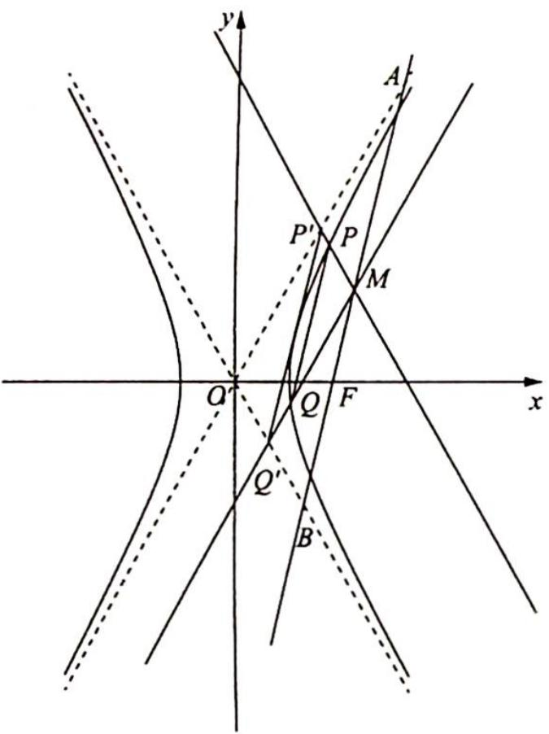  
图1

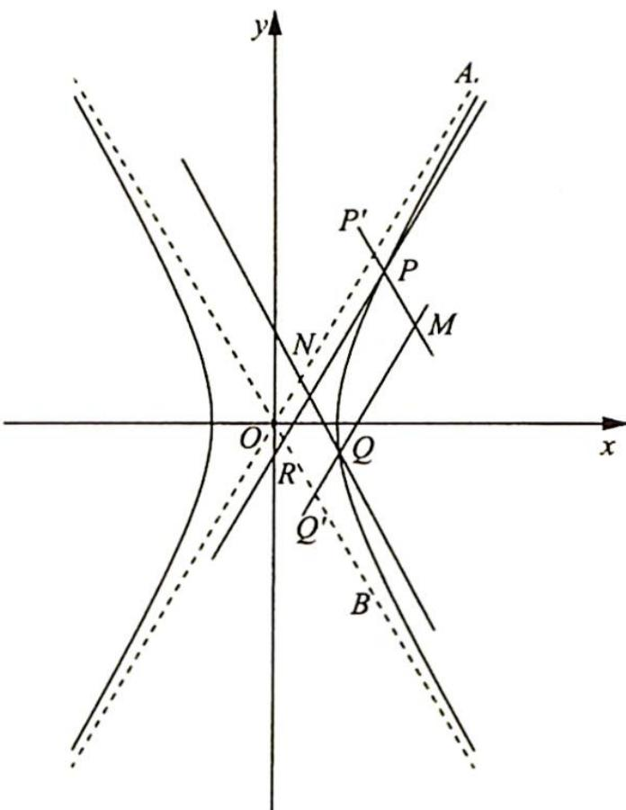  
图 2

由题意知, $PM \parallel OB$ , $M$ 为 $AB$ 的中点, 得 $P'$ 为 $OA$ 的中点, 同理, $Q'$ 为 $OB$ 的中点, 所以 $P'Q' \parallel AB$ .

若证明 $AB \parallel PQ$ , 只需证明 $PQ \parallel P'Q'$ .

在双曲线 $\frac{x^2}{a^2} - \frac{y^2}{b^2} = 1 (a > 0, b > 0)$ 中，过双曲线上的两点 $P(x_1, y_1), Q(x_2, y_2)$ ，作两条渐近线的平行线与渐近线所形成的平行四边形 $OP'PR$ 和平行四边形 $ONQQ'$ 的面积相等。如图2所示。

设渐近线方程分别为 $y = \frac{b}{a} x$ 和 $y = -\frac{b}{a} x$ ，联立 $\left\{ \begin{array}{l} y = \frac{b}{a} x \\ y - y_1 = -\frac{b}{a} (x - x_1) \end{array} \right.$ ，得 $x_{P'} =$ $\frac{1}{2}\left(x_{1}+\frac{a}{b}y_{1}\right)$ , 同理 $x_{R}=\frac{1}{2}\left(x_{1}-\frac{a}{b}y_{1}\right)$ , 设 $\angle A O x=\theta$ , 则 $S_{\square O P^{\prime} P R}=|O P^{\prime}| |O R|\sin 2\theta=\sqrt{1+\frac{b^{2}}{a^{2}}}\cdot\sqrt{x_{P^{\prime}}^{2}}\cdot\sqrt{1+\frac{b^{2}}{a^{2}}}\sqrt{x_{R}^{2}}\cdot\sin 2\theta=\left(1+\frac{b^{2}}{a^{2}}\right)\cdot x_{P^{\prime}}x_{R}\cdot\sin 2\theta=\left(1+\frac{b^{2}}{a^{2}}\right)\cdot\frac{1}{4}\left(x_{1}^{2}-\frac{a^{2}}{b^{2}}y_{1}^{2}\right)\cdot\frac{2\tan\theta}{1+\tan^{2}\theta}=\frac{1}{2}\cdot\frac{b}{a}\cdot\left(x_{1}^{2}-\frac{a^{2}}{b^{2}}y_{1}^{2}\right).$

又 $\frac{x_1^2}{a^2} -\frac{y_1^2}{b^2} = 1$ ，得 $x_{1}^{2} - \frac{a^{2}}{b^{2}} y_{1}^{2} = a^{2}$ ，则 $S_{\square OP^{\prime}PR} = \frac{1}{2}\cdot \frac{b}{a}\cdot a^2 = \frac{ab}{2}$ 为定值.

因此 $S_{\square OP'PR} = S_{\square OQ'QN}$ , 即 $|OP'| |OR| \sin 2\theta = |ON||OQ'| \sin 2\theta$ , 亦即 $|OP'| |OR| = |OQ'| |ON|$ , 故 $\frac{|OP'|}{|ON|} = \frac{|OQ'|}{|OR|}$ .

对于本题而言， $\frac{|OP'|}{|ON|} = \frac{|MQ'|}{|QQ'|} = \frac{|OQ'|}{|OR|} = \frac{|MP'|}{|PP'|}$ ，即 $\frac{|MQ'|}{|QQ'|} = \frac{|MP'|}{|PP'|}$ ，得 $PQ \parallel P'Q'$ ，又 $P'Q' \parallel AB$ ，故 $PQ \parallel AB$ 。

本题蕴含着丰富的性质,总结归纳如下:

推论: 若直线 l 与双曲线 $C: \frac{x^{2}}{a^{2}} - \frac{y^{2}}{b^{2}} = 1 (a > 0, b > 0)$ 的渐近线分别交于点 A, B, M 是 AB 中点，则 $k_{AB} \cdot k_{OM} = \frac{b^{2}}{a^{2}} = e^{2} - 1$ .

定理 1: 若斜率为 k 的直线 l 与双曲线 $C: \frac{x^{2}}{a^{2}} - \frac{y^{2}}{b^{2}} = 1 (a > 0, b > 0)$ 的渐近线分别交于点 A, B, N 是 AB 中点，则点 N 的轨迹方程为 $y = \frac{b^{2}}{ka^{2}}x = \frac{e^{2} - 1}{k}x$ .

【证明】设 $N(x, y)$ , 由推论知 $k_{AB} \cdot k_{ON} = \frac{b^2}{a^2} = e^2 - 1$ , 即 $\frac{y}{x} k = \frac{b^2}{a^2} = e^2 - 1$ , 所以点 $N$ 的轨迹方程为 $y = \frac{b^2}{ka^2} x = \frac{e^2 - 1}{k} x$ .

定理2: 若斜率为 $m (m \neq 0)$ 的直线 $l$ 与双曲线 $C: \frac{x^2}{a^2} - \frac{y^2}{b^2} = 1 (a > 0, b > 0)$ 交于点 $P, Q$ , 过 $P$ 且斜率为 $-\frac{b}{a}$ 的直线与过 $Q$ 且斜率为 $\frac{b}{a}$ 的直线交于点 $M$ , 则点 $M$ 的轨迹方程为 $y = \frac{b^2}{ma^2} x = \frac{e^2 - 1}{m} x$ .

【证明】设 $P(x_{1},y_{1})$ , $Q(x_{2},y_{2})$ , $M(x_{0},y_{0})$ , 如图所示.

## 评注

则直线 $PM, QM$ 的方程分别为 $y - y_0 = -\frac{b}{a} (x - x_0), y - y_0 = \frac{b}{a} (x - x_0)$ ，所以直线 $PQ$ 的斜率 $m = \frac{y_1 - y_2}{x_1 - x_2} = \frac{\left[y_0 - \frac{b}{a}(x_1 - x_0)\right] - \left[y_0 + \frac{b}{a}(x_2 - x_0)\right]}{x_1 - x_2} = -\frac{b(x_1 + x_2 - 2x_0)}{a(x_1 - x_2)}.$ 联立 $\begin{cases} y = -\frac{b}{a} (x - x_0) + y_0 \\ \frac{x^2}{a^2} - \frac{y^2}{b^2} = 1 \end{cases}$ ，得 $x_1 = \frac{a}{2b}\left[\frac{a^2b^2}{y_0 + \frac{b}{a}x_0} + y_0 + \frac{b}{a}x_0\right].$

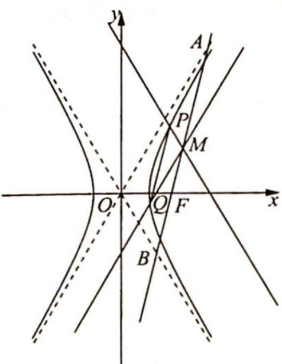

同理: $x_{2} = -\frac{a}{2b}\left[\frac{a^{2}b^{2}}{y_{0} - \frac{b}{a}x_{0}} + y_{0} - \frac{b}{a}x_{0}\right]$ , 所以 $x_{1} - x_{2} = \frac{a}{b}\left[\frac{a^{2}b^{2}y_{0}}{y_{0}^{2} - \frac{b^{2}}{a^{2}}x_{0}^{2}} + y_{0}\right], x_{1} + x_{2} - 2x_{0} = -\frac{a^{2}b^{2}x_{0}}{y_{0}^{2} - \frac{b^{2}}{a^{2}}x_{0}^{2}} - x_{0}$ , 则 $m = \frac{b^{2}x_{0}}{a^{2}y_{0}} = \frac{(e^{2} - 1)x_{0}}{y_{0}}$ , 故点 $M$ 的轨迹方程为 $y = \frac{b^{2}}{ma^{2}}x = \frac{e^{2} - 1}{m}x$ .

定理3: 若过 $T(t,0)(t \neq 0)$ 且斜率为 $k$ 的直线与双曲线 $C: \frac{x^2}{a^2} - \frac{y^2}{b^2} = 1 (a > 0, b > 0)$ 的两条渐近线分别交于 $A, B$ 两点，斜率为 $m$ 的直线 $l$ 与双曲线 $C: \frac{x^2}{a^2} - \frac{y^2}{b^2} = 1 (a > 0, b > 0)$ 交于点 $P(x_1, y_1), Q(x_2, y_2)$ ，且 $x_1 > x_2 > 0, y_1 > 0$ ，过 $P$ 且斜率为 $-\frac{b}{a}$ 的直线与过 $Q$ 且斜率为 $\frac{b}{a}$ 的直线交于点 $M$ ，则：

(1) 当 M 在 AB 上, $PQ \parallel AB$ 时, $|MA| = |MB|$ ;

(2) 当 M 在 AB 上, $\left|MA\right| = \left|MB\right|$ 时, $PQ \parallel AB$ ;

(3) 当 $PQ \parallel AB, |MA| = |MB|$ 时, $M$ 在 $AB$ 上.

【证明】直线 $PQ$ 与直线 $AB$ 的斜率均不为零. 因为 $|AM| = |BM|$ , 所以点 $M(x_0, y_0)$ 在 $AB$ 的中垂线 $y - y_N = -\frac{1}{k} (x - x_N)$ 上, 即 $y_0 - y_N = -\frac{1}{k} (x_0 - x_N)$ . (其中 $N$ 为 $AB$ 的中点) 又由定理 1、定理 2 可知 $k = \frac{b^2 x_N}{a^2 y_N}, m = \frac{b^2 x_0}{a^2 y_0}$ , 所以 $\left(m + \frac{b^2}{a^2} k\right)y_0 - \left(1 + \frac{b^2}{a^2}\right)ky_N = 0$ .

(1)当 $M$ 在 $AB$ 上， $PQ \parallel AB$ 时， $|MA| = |MB|$ .

因为 $M$ 在 $AB$ 上, 所以 $y_0 = k(x_0 - t)$ . 又 $PQ \parallel AB$ , 所以 $k = m$ , 即 $\frac{b^2 x_N}{a^2 y_N} = \frac{b^2 x_0}{a^2 y_0}$ , 则 $\frac{x_N}{k(x_N - t)} = \frac{x_0}{k(x_0 - t)}, x_N = x_0, y_N = y_0$ , 故 $\left(m + \frac{b^2}{a^2} k\right) y_0 - \left(1 + \frac{b^2}{a^2}\right) ky_N = \left(1 + \frac{b^2}{a^2}\right) k(y_0 - y_N) = 0$ , 即 $|MA| = |MB|$ .

(2) 当 $M$ 在 $AB$ 上, $|MA| = |MB|$ 时, $PQ \parallel AB$ .

因为 $M$ 在 $AB$ 上， $|MA| = |MB|$ ，所以点 $M, N$ 重合， $\frac{b^2 x_N}{a^2 y_N} = \frac{b^2 x_0}{a^2 y_0}$ ，即 $k = m$ ，故 $PQ \parallel AB$ .

(3) 当 $PQ \parallel AB, |MA| = |MB|$ 时, $M$ 在 $AB$ 上.

因为 $PQ \parallel AB$ ，所以 $k = m$ ，又 $|MA| = |MB|$ ，所以 $\left(m + \frac{b^2}{a^2} k\right)y_0 - \left(1 + \frac{b^2}{a^2}\right)ky_N = \left(1 + \frac{b^2}{a^2}\right)k(y_0 - y_N) = 0.$

又 $k \neq 0$ ，所以 $y_0 = y_N$ 。因为 $k = m$ ，即 $\frac{b^2 x_N}{a^2 y_N} = \frac{b^2 x_0}{a^2 y_0}$ ，所以 $x_0 = x_N$ ，故点 $M, N$ 重合， $M$ 在 $AB$ 上。

## 训练 15

1. 已知动圆过定点 $A(4,0)$ , 且在 $y$ 轴上截得的弦 $MN$ 的长为 8.

(1)求动圆圆心的轨迹 C 的方程；

(2)已知点 $B(-3,0)$ , 设不垂直于 $x$ 轴的直线 $l$ 与轨迹 $C$ 交于不同的两点 $P, Q$ , 若 $x$ 轴是 $\angle PBQ$ 的角平分线, 证明: 直线 $l$ 过定点.

2. 已知抛物线 $C: y^{2} = 2x$ , 过点 $(2,0)$ 的直线 $l$ 交 $C$ 于 $A, B$ 两点, 圆 $M$ 是以线段 $AB$ 为直径的圆.

(1)求证:坐标原点 O 在圆 M 上;

(2)设圆 $M$ 过点 $P(4, - 2)$ , 求直线 $l$ 与圆 $M$ 的方程.

3. 在平面直角坐标系 $xOy$ 中, $A, B$ 两点的坐标分别为 $(-2,0)$ , $(2,0)$ , 直线 $AM, BM$ 相交于点 $M$ 且它们的斜率之积是 $-\frac{3}{4}$ , 记动点 $M$ 的轨迹为曲线 $E$ .

(1)求曲线 E 的方程；

(2)已知点 $F(1,0)$ , 直线 $l: x=4$ 交 $x$ 轴于 $D$ , 直线 $A M$ 与直线 $l$ 交于点 $N$ , 是否存在常数 $\lambda$ , 使得 $\angle M F D = \lambda \angle N F D$ ? 若存在, 求出 $\lambda$ 的值; 若不存在, 说明理由.

4. 设椭圆 $\frac{x^2}{a^2} + \frac{y^2}{3} = 1 (a > \sqrt{3})$ 的右焦点为 $F$ , 右顶点为 $A$ , 已知 $\frac{1}{|OF|} + \frac{1}{|OA|} = \frac{3e}{|FA|}$ , 其中 $O$ 为原点, $e$ 为椭圆的离心率.

(1)求椭圆的方程；

(2)设过点 $A$ 的直线 $l$ 与椭圆交于 $B(B$ 不在 $x$ 轴上), 垂直于 $l$ 的直线与 $l$ 交于点 $M$ , 与 $y$ 轴交于点 $H$ , 若 $BF \perp HF$ , 且 $\angle MOA \leqslant \angle MAO$ , 求直线 $l$ 的斜率的取值范围.

5. 已知抛物线 $C_{1}: x^{2} = 4y$ 的焦点 $F$ 也是椭圆 $C_{2}: \frac{y^{2}}{a^{2}} + \frac{x^{2}}{b^{2}} = 1 (a > b > 0)$ 的一个焦点, $C_{1}$ 与 $C_{2}$ 的公共弦的长为 $2\sqrt{6}$ .

(1)求椭圆 $C_2$ 的方程；

(2)经过点 $(-1,0)$ 作斜率为k的直线l与曲线 $C_{2}$ 交于A,B两点,O是坐标原点,是否存在实数k,使O在以AB为直径的圆外?若存在,求k的取值范围;若不存在,请说明理由.

6. 已知抛物线 $C_{1}: x^{2} = 4y$ 和椭圆 $C_{2}: \frac{y^{2}}{9} + \frac{x^{2}}{8} = 1$ . $C_{1}$ 的焦点为 $F$ , 过点 $F$ 的直线 $l$ 与 $C_{1}$ 相交于 $A, B$ 两点, 与 $C_{2}$ 相交于 $C, D$ 两点, 且 $\overrightarrow{AC}$ 与 $\overrightarrow{BD}$ 同向.

(1) 若 $\left|AC\right| = \left|BD\right|$ ，求直线 l 的斜率；

(2)设 $C_1$ 在点 $A$ 处的切线与 $x$ 轴的交点为 $M$ , 证明: 直线 $l$ 绕点 $F$ 旋转时, $\triangle MFD$ 总是钝角三角形.

7. 如图所示, 已知抛物线 $C_{1}: x^{2} = 4y$ 和抛物线 $C_{2}: x^{2} = -y$ 的焦点分别为 $F$ 和 $F'$ , $N$ 是抛物线 $C_{1}$ 上一点, 过 $N$ 且与 $C_{1}$ 相切的直线 $l$ 交 $C_{2}$ 于 $A, B$ 两点, $M$ 是线段 $AB$ 的中点.

(1) 求 $\left|FF'\right|$ ;

(2)若点 F 在以线段 MN 为直径的圆上, 求直线 l 的方程.

注: 直线与抛物线有且只有一个公共点, 且与抛物线的对称轴不平行, 则该直线与抛物线相切, 称该公共点为切点.

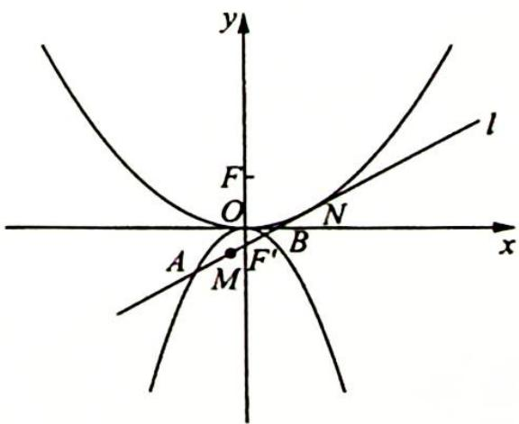

8. 已知椭圆 $E: x^{2} + 9y^{2} = m^{2} (m > 0)$ , 直线 $l$ 不过原点 $O$ 且不平行于坐标轴, $l$ 与 $E$ 有两个交点 $A, B$ , 线段 $AB$ 的中点为 $M$ .

(1)若 $m = 3$ , 点 $K$ 在椭圆 $E$ 上, $F_{1}, F_{2}$ 分别为椭圆的两个焦点, 求 $\overrightarrow{KF_1} \cdot \overrightarrow{KF_2}$ 的范围;

(2)证明:直线 OM 的斜率与 l 的斜率的乘积为定值;

(3)若 $l$ 过点 $(m, \frac{m}{3})$ , 射线 $OM$ 与椭圆 $E$ 交于点 $P$ , 四边形 $OAPB$ 能否为平行四边形? 若能, 求此时直线 $l$ 的斜率; 若不能, 说明理由.

9. 如图所示, 已知点 $A_{1}, A_{2}$ 分别是椭圆 $C_{1}: \frac{x^{2}}{4} + y^{2} = 1$ 的左、右顶点, 点 $P$ 是椭圆 $C_{1}$ 与抛物线 $C_{2}: y^{2} = 2px (p > 0)$ 的交点, 直线 $A_{1}P, A_{2}P$ 分别与抛物线 $C_{2}$ 交于 $M, N$ 两点 ( $M, N$ 不同于 $P$ ).

(1)求证:直线 MN 垂直于 x 轴;

(2)设坐标原点为 O，分别记 $\triangle OPM, \triangle OMN$ 的面积为 $S_{1}, S_{2}$ ，当 $\angle OPA_{2}$ 为钝角时，求 $\frac{S_{1}}{S_{2}}$ 的最大值.

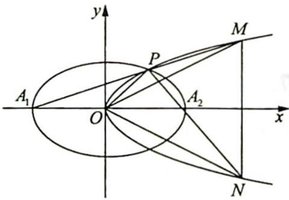
