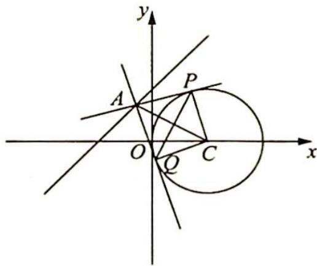
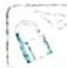

## 16.1 动点在已知轨迹上求最值

## 研究密钥

直线与圆动态问题中的“动”涉及点动、线动和圆动,本研究课题讨论在直线与圆是定的状态下,动点在其上面运动所产生的最值和取值范围问题.解决此类问题的关键是建立动点与圆心或弦中点的关系,充分利用圆的几何性质进行转化.在解题角度上,既可以从几何的角度来探索它们的位置关系,又可以从函数角度来解决一些度量问题,体现用代数方法研究几何问题的思想.

例 16.1 在平面直角坐标系 ${xOy}$ 中,已知圆 $C : {\left( x - 2\right) }^{2} + {y}^{2} = 4$ ,点 $A$ 是直线 $x - y + 2 =$ 0 上的一个动点. 直线 ${AP},{AQ}$ 分别切圆 $C$ 于 $P,Q$ 两点,则线段 ${PQ}$ 长的取值范围为

分析 ▶ 圆与直线是定的, 直线上的点是动的, PQ 的长随 A 点的运动而变化. $PQ = 2 \times \frac{AP \cdot PC}{AC}$ , 这里面 PC 为定值, AP 可由 AC 表示, 所以引入 AC 这一变量, 设为 x, 将 PQ 的长表示为 x 的函数, 通过求函数值域求出 PQ 长的取值范围.

解析 由圆的方程可知圆心 $C(2,0)$ , 半径 $r=2$ , 设 $AC=x$ , 则 $x \geqslant \frac{|2-0+2|}{\sqrt{2}} = 2\sqrt{2}$ .

如图所示, 因为 $AP, AQ$ 为圆 $C$ 的切线, 所以 $CP \perp AP, CQ \perp AQ$ , $AP = AQ = \sqrt{AC^2 - r^2} = \sqrt{x^2 - 4}$ , 又 $AC$ 是 $PQ$ 的垂直平分线, 则 $PQ = 2 \times \frac{AP \cdot PC}{AC} = \frac{4\sqrt{x^2 - 4}}{x} = 4\sqrt{1 - \frac{4}{x^2}}$ .

因为 $x \geqslant 2\sqrt{2}$ , 所以 $\frac{1}{2} \leqslant 1 - \frac{4}{x^2} < 1$ , 也就是 $2\sqrt{2} \leqslant PQ < 4$ , 即线段 $PQ$ 长的取值范围为 $[2\sqrt{2}, 4)$ .

评注
本题动点在直线上,引入长度变量.

变式 1 已知圆 $M: x^{2} + y^{2} - 2x - 2y - 2 = 0$ , 直线 $l: 2x + y + 2 = 0, P$ 为 $l$ 上的动点, 过点 $P$ 作圆 $M$ 的切线 $PA, PB$ , 切点为 $A, B$ , 则 $|PM||AB|$ 的最小值为 \_\_\_\_.

解析 ▶ 由 $x^{2} + y^{2} - 2x - 2y - 2 = 0$ 得 $(x - 1)^{2} + (y - 1)^{2} = 4$ ，所以圆心 $M(1,1)$ ，半径 $r = 2$ .

又 $|PA|=|PB|$ ， $|MA|=|MB|$ ，所以PM为线段AB的垂直平分线， $|PM||AB|=$

$2S_{\text{四边形}PAMB} = 4S_{\triangle PAM} = 2|PA| \cdot r = 4\sqrt{|PM|^2 - 4}$ , 所以若 $|PM||AB|$ 最小, 则 $|PM|$ 最小.

因为 $|PM|_{\min} = \frac{|2 + 1 + 2|}{\sqrt{4 + 1}} = \sqrt{5}$ ，所以 $(|PM||AB|)_{\min} = 4$ .

## 评注

本题动点在直线上,通过研究几何性质确定最值.

## 显现隐圆,研究最值

对于动点运动轨迹不明的问题,即隐圆问题还是需根据动点运动特征确定其轨迹,定性分析、定量计算,实现“以定制动”,将复杂问题化归为简单问题处理.

解决此类问题的关键是让“圆”显现出来,然后转化为直线与圆或者圆与圆的位置关系来求解.如何显现此圆主要体现在以下几点:

(1)根据圆的基本性质确定圆；

(2)符合“蒙日圆”的条件；

(3)符合“阿波罗尼斯圆”的条件.
