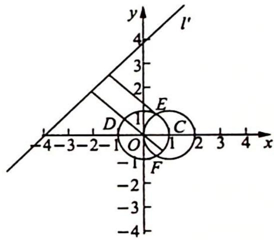

## 16.2 模型一: $90^{\circ}$ 的圆周角

## 研究密钥

因为圆的直径所对的圆周角为直角, 所以动点 $P$ 对两定点 $A, B$ 的张角为 $90^{\circ}$ , 即 $k_{PA} \cdot k_{PB} = -1$ 时, 可确定动点 $P$ 的轨迹为隐形圆.

例 16.2 (2018 北大) 已知实数 $a, b, c$ 成公差非 0 的等差数列, 在平面直角坐标系中, 点 $P$ 的坐标为 $(-3, 2)$ , 点 $N$ 的坐标为 $(2, 3)$ . 过点 $P$ 作直线 $ax + by + c = 0$ 的垂线, 垂足为点 $M$ , 则 $M, N$ 间的距离的最大值与最小值的乘积是 ( ).

A. 10 B. 72 C. 32 D. $6 \sqrt{2}$

分析 ▶ 由等差中项性质可得直线 $ax + by + c = 0$ 过定点 $Q$ . 由于 $PM \perp QM$ , 所以点 $M$ 在以 $PQ$ 为直径的圆上运动, 因此将 $M, N$ 间的距离的最大值与最小值转化为圆外一点到圆上一点距离的最大值与最小值问题.

解析 由等差中项性质得 $a + c = 2b$ ，则直线 $ax + by + c = 0$ 为 $a(x + \frac{1}{2}y) + c(\frac{1}{2}y + 1) =$

0, 所以 $\left\{\begin{aligned} x+\frac{1}{2}y=0 \\ \frac{1}{2}y+1=0 \end{aligned}\right.$ ，解得 $\left\{\begin{aligned} x=1 \\ y=-2 \end{aligned}\right.$ ，可见直线 $ax+by+c=0$ 过定点 $Q(1,-2)$ .

设垂足 $M(x_0, y_0)$ , 则 $PM \perp QM \Leftrightarrow \overrightarrow{PM} \cdot \overrightarrow{QM} = 0 \Rightarrow (x_0 + 1)^2 + y_0^2 = 8$ , 即点 $M$ 在圆 $T: (x + 1)^2 + y^2 = 8$ 上.

点 N 到圆心 T 的距离 $\left|NT\right|=3\sqrt{2}$ ，所以 $\left|MN\right|_{\max}\left|MN\right|_{\min}=(\left|NT\right|+2\sqrt{2})(\left|NT\right|-2\sqrt{2})=\left|NT\right|^{2}-8=10.$ 故选 A.

变式(1) 已知直线 $l_{1}:mx - y - 3m + 1 = 0$ 与直线 $l_{2}:x + my - 3m - 1 = 0$ 相交于点 $P$ , 线段 $AB$ 是圆 $C: (x + 1)^{2} + (y + 1)^{2} = 4$ 的一条动弦, 且 $|AB| = 2\sqrt{3}$ , 则 $|\overrightarrow{PA} + \overrightarrow{PB}|$ 的最大值为 ( ). A. $3\sqrt{2}$ B. $8\sqrt{2}$ C. $5\sqrt{2}$ D. $8\sqrt{2} + 2$

分析 ▶ 由两直线方程形式知 $l_{1} \perp l_{2}$ , 构造隐形圆, 找到动点轨迹, 转化距离.

解析 ▶ 由题意得圆 C 的圆心为 $(-1,-1)$ ，半径 r=2，易知直线 $l_{1}:mx-y-3m+1=0$ 恒过点 $(3,1)$ ，直线 $l_{2}:x+my-3m-1=0$ 恒过点 $(1,3)$ ，且 $l_{1}\perp l_{2}$ ，所以点 P 的轨迹为 $(x-2)^{2}+(y-2)^{2}=2$ ，圆心为 $(2,2)$ ，半径为 $\sqrt{2}$ .

若点 D 为弦 AB 的中点, 位置关系如图所示, 所以 $\overrightarrow{PA} + \overrightarrow{PB} = 2\overrightarrow{PD}$ . 连接 CD, 由 $|AB| = 2\sqrt{3}$ 易知 $|CD| = \sqrt{4 - (\sqrt{3})^2} = 1$ , 则 $|\overrightarrow{PD}|_{\max} = |PC|_{\max} + |CD| = \sqrt{3^2 + 3^2} + \sqrt{2} + 1 = 4\sqrt{2} + 1$ .
所以 $\left|\overrightarrow{PA}+\overrightarrow{PB}\right|_{\max}=2\left|\overrightarrow{PD}\right|_{\max}=8\sqrt{2}+2.$ 故选 D.

变式(2) 在平面直角坐标系 $xOy$ 中, 已知点 $A(-4,0), B(0,4)$ , 从直线 $AB$ 上一点 $P$ 向圆 $x^{2}+y^{2}=4$ 引两条切线 $PC, PD$ , 切点分别为 $C, D$ . 设线段 $CD$ 的中点为 $M$ , 则线段 $AM$ 长的最大值为 \_\_\_\_.

分析 ▶ 求出切点弦 CD 的方程为 $ax + (a + 4)y = 4$ ，易知 CD 过定点，总有 $OM \perp CD$ ，所以 M 的轨迹为一个定圆，问题转化为求圆外一点到圆上一点的距离的最大值。

解析 ▶ 解法一(构造隐形圆): 因为直线 $AB$ 的方程为 $y = x + 4$ , 所以可设 $P(a, a + 4)$ , $C(x_1, y_1), D(x_2, y_2)$ , 则 $PC$ 方程为 $x_1x + y_1y = 4$ , $PD: x_2x + y_2y = 4$ .

将 $P(a,a+4)$ 分别代入 PC, PD 方程, 得 $\left\{\begin{aligned} ax_{1}+(a+4)y_{1}&=4 \\ ax_{2}+(a+4)y_{2}&=4\end{aligned}\right.$ ，则直线 CD 的方程为 $ax+(a+4)y=4$ ，即 $a(x+y)=4-4y$ ，所以直线 CD 过定点 $N(-1,1)$ ，又因为 $OM\perp CD$ ，所以点 M 在以 ON 为直径的圆上（除去原点）。

又以 $ON$ 为直径的圆的方程为 $\left(x + \frac{1}{2}\right)^2 +\left(y - \frac{1}{2}\right)^2 = \frac{1}{2}$ ，则 $AM$ 的最大值为

$\sqrt{\left(-4 + \frac{1}{2}\right)^2 + \left(\frac{1}{2}\right)^2} + \frac{\sqrt{2}}{2} = 3\sqrt{2}$ .

解法二(参数法): 因为直线 AB 的方程为 $y = x + 4$ , 所以可设 $P(a, a + 4)$ , 同解法一可知直线 CD 的方程为 $ax + (a + 4)y = 4$ , 即 $a(x + y) = 4 - 4y$ , 得 $a = \frac{4 - 4y}{x + y}$ .

又因为 O, P, M 三点共线, 所以 $ay - (a + 4)x = 0$ , 得 $a = \frac{4x}{y - x}$ .

因为 $a=\frac{4-4y}{x+y}=\frac{4x}{y-x}$ ，所以点 M 的轨迹方程为 $\left(x+\frac{1}{2}\right)^{2}+\left(y-\frac{1}{2}\right)^{2}=\frac{1}{2}$ （除去原点），故 AM 的最大值为 $\sqrt{\left(-4+\frac{1}{2}\right)^{2}+\left(\frac{1}{2}\right)^{2}}+\frac{\sqrt{2}}{2}=3\sqrt{2}$ .

例 16.3 已知直线 $l: mx + y + m = 0$ 交圆 $C: (x - 1)^2 + y^2 = 1$ 于 $A(x_1, y_1), B(x_2, y_2)$ 两点，则 $\vert x_1 - y_1 + 4 \vert + \vert x_2 - y_2 + 4 \vert$ 的取值范围为 \_\_\_\_.

分析 ▶ 设法转化 $|x_{1}-y_{1}+4|+|x_{2}-y_{2}+4|$ 这个式子, 使解题有的放矢. 由此式联想到点到直线距离公式, 所以作如下转化: $|x_{1}-y_{1}+4|+|x_{2}-y_{2}+4|= \sqrt{2}\left(\frac{|x_{1}-y_{1}+4|}{\sqrt{2}}+\frac{|x_{2}-y_{2}+4|}{\sqrt{2}}\right)=2\sqrt{2}d$ , 其中 d 为 AB 中点到直线 $x-y+4=0$ 的距离, 接下来研究这个 AB 中点的轨迹. 由圆心与弦中点连线垂直于弦可知 AB 中点的轨迹为圆, 这样问题转化为圆上一点到一定直线距离的范围问题.

解析 ▶ 设 AB 中点为 $M(x, y)$ ，圆 $C: (x-1)^{2} + y^{2} = 1$ ，圆心 $C(1,0)$ ， $l: mx + y + m = 0$ 化为 $y = -m(x+1)$ ，则直线 l 过定点 $D(-1,0)$ ，所以 $MD \perp CM$ ，则点 M 的轨迹为以 CD 为直径的圆在圆 C 内的圆弧。

联立 $\left\{\begin{aligned}(x-1)^{2}+y^{2}=1\\ x^{2}+y^{2}=1\end{aligned}\right.$ ，解得 $x=\frac{1}{2}$ ，则 $E\left(\frac{1}{2},\frac{\sqrt{3}}{2}\right),F\left(\frac{1}{2},-\frac{\sqrt{3}}{2}\right)$

所以 M 的轨迹方程为 $x^{2} + y^{2} = 1 \left( \frac{1}{2} < x \leqslant 1 \right)$ ，圆心 O 到直线 $l' : x - y + 4 = 0$ 的距离为 $\frac{4}{\sqrt{2}} = 2\sqrt{2}$ .

过点 O 与直线 $l'$ 垂直的直线方程为 y = -x，它与圆 $x^{2} + y^{2} = 1$ 的交点为 $\left(\frac{\sqrt{2}}{2}, -\frac{\sqrt{2}}{2}\right)$ ， $\left(-\frac{\sqrt{2}}{2},\frac{\sqrt{2}}{2}\right)$ ，又点 $\left(\frac{\sqrt{2}}{2},-\frac{\sqrt{2}}{2}\right)$ 在点M轨迹上，点 $\left(-\frac{\sqrt{2}}{2},\frac{\sqrt{2}}{2}\right)$ 不在点M轨迹上，所以M到直线 $l'$ 的距离的最大值为 $2\sqrt{2}+1$ ，点 $E\left(\frac{1}{2},\frac{\sqrt{3}}{2}\right)$ 到直线 $l'$ 的距离为 $\frac{9-\sqrt{3}}{2\sqrt{2}}$ .

设点 $M$ 到直线 $l'$ 的距离为 $d$ , 则 $\frac{9 - \sqrt{3}}{2\sqrt{2}} < d \leqslant 2\sqrt{2} + 1, |x_1 - y_1 + 4| + |x_2 - y_2 + 4| = \sqrt{2}\left[\frac{|x_1 - y_1 + 4|}{\sqrt{2}} + \frac{|x_2 - y_2 + 4|}{\sqrt{2}}\right] = 2\sqrt{2}d, |x_1 - y_1 + 4| + |x_2 - y_2 + 4| \in (9 - \sqrt{3}, 2\sqrt{2} + 8]$ , 故答案为 $(9 - \sqrt{3}, 2\sqrt{2} + 8]$ .

变式(1) 已知实数 $x_{1}, x_{2}, y_{1}, y_{2}$ 满足 $x_{1}^{2} + y_{1}^{2} = 1, x_{2}^{2} + y_{2}^{2} = 1, x_{1}x_{2} + y_{1}y_{2} = \frac{1}{2}$ , 则 $\frac{|x_1 + y_1 - 1|}{\sqrt{2}} + \frac{|x_2 + y_2 - 1|}{\sqrt{2}}$ 的最大值为 \_\_\_\_.

解析 如图所示, $\frac{|x_1 + y_1 - 1|}{\sqrt{2}}$ 和 $\frac{|x_2 + y_2 - 1|}{\sqrt{2}}$ 分别表示动点 $A(x_1, y_1), B(x_2, y_2)$ 到直线 $x + y - 1 = 0$ 的距离. $\frac{|x_1 + y_1 - 1|}{\sqrt{2}} + \frac{|x_2 + y_2 - 1|}{\sqrt{2}} = d_1 + d_2 = 2d$ ( $d$ 表示线段 $AB$ 的中点 $M$ 到直线 $x + y - 1 = 0$ 距离).

因为 $x_{1}x_{2}+y_{1}y_{2}=\frac{1}{2}$ ，即 $\overrightarrow{OA}\cdot\overrightarrow{OB}=|\overrightarrow{OA}||\overrightarrow{OB}|\cos\angle AOB=\frac{1}{2}$ ，所以 $\angle AOB=60^{\circ}$ ，则 OM= $\frac{\sqrt{3}}{2}$ ，故动点 M 的轨迹方程为 $x^{2}+y^{2}=\frac{3}{4}$ ，动点到直线的距离 $d_{max}=\frac{\sqrt{2}}{2}+\frac{\sqrt{3}}{2}$ ，因此 $d_{1}+d_{2}$ 的最大值为 $\sqrt{2}+\sqrt{3}$ .

两道题在命题角度上,均考查了点到直线的距离,探究动点的轨迹到定直线的距离.

例 16.4 在平面直角坐标系中，A, B 是直线 l: $x + y = m$ 上的两点，且 $|AB| = 10$ 。若对于任意点 $P(\cos\theta, \sin\theta) (0 \leqslant \theta < 2\pi)$ ，存在 A, B 使 $\angle APB = 90^{\circ}$ 成立，则 m 的最大值为（）。
A. $2\sqrt{2}$ B. 4
C. $4\sqrt{2}$ D. 8

分析 ➤ 思路一: A, B 是直线 $x + y = m$ 上的两动点, 且 $|AB| = 10$ . 因为存在 A, B 使 $\angle APB = 90^{\circ}$ 成立, 转化为以 AB 为直径的圆与单位圆有交点, 即对于单位圆 O 上的任意一点 P, 总能找到一点 M, 使 $|PM| = 5$ , 所以应满足圆上点到直线的最远距离小于等于 5. 思路二: 点

P 和线段 AB 都是动的, 首先对它们分别进行考虑. 作以 AB 为直径的圆 M, 因为对于单位圆上的任意点 P, 都存在 A, B 使 $\angle APB = 90^{\circ}$ 成立, 所以圆 M 应该包含圆 O. 求 m 的最大值就是向上平移直线, 使圆 O 内切于圆 M. 若再向上平移直线 l, 就会有圆 O 上的点 P 不合题意的情况了.

解析 ▶ 解法一(转化为直线与圆的位置关系): 如图所示, 设 $P(x, y)$ , 则 $x = \cos \theta$ , $y = \sin \theta$ , 满足 $x^{2} + y^{2} = 1$ . 又因为 $\angle A P B = 90^{\circ}$ , 所以点 $P$ 在以 $A B$ 为直径的圆上.

设 AB 中点为 M，由题意知，对于单位圆 O 上的任意一点 P，总能找到一点 M，使 $\left|PM\right|=5$ ，则圆上点 P 到直线 AB 的距离 $\left|PM'\right|\leqslant5$ ，所以应满足圆上点到直线的最远距离小于等于 5，即 $d(O,AB)+r\leqslant5$ ，则只需满足 $\frac{|m|}{\sqrt{2}}+1\leqslant5$ ，解得 $m\in\left[-4\sqrt{2},4\sqrt{2}\right]$ 。故选 C。

解法二(转化为圆与圆的位置关系): 点 $P$ 和线段 $AB$ 都是动的, 首先对它们分别进行考虑. 以 $AB$ 为直径作圆, 设圆心为 $M$ , 因为对于单位圆上的任意点 $P$ , 都存在 $A, B$ 使 $\angle APB = 90^\circ$ 成立, 所以圆 $M$ 应该包含圆 $O$ , 若是其他情况, 总会存在点 $P$ 及 $A, B$ 使 $\angle APB \neq 90^\circ$ . 求 $m$ 的最大值就是平移直线 $l$ , 使圆 $O$ 内切于圆 $M$ , 此时是临界状态, 再向上平移直线 $l$ , 就会有圆 $O$ 上的点 $P$ 在圆 $M$ 外的情况, 不合题意. 圆 $O$ 内切于圆 $M$ , 此时 $OM = 5 - 1 = 4$ , 则 $m = 4\sqrt{2}$ , 即 $m$ 的最大值为 $4\sqrt{2}$ . 故选 C.

变式(1) 在平面直角坐标系 $xOy$ 中, 已知圆 $O: x^{2} + y^{2} = r^{2} (r > 0)$ 与直线 $l: x + y - 5 = 0$ , 若对圆 $O$ 上任意一点 $P$ , 在直线 $l$ 上均存在两点 $E, F$ , 使得 $PE = \sqrt{2}PF$ , 且 $EF = 8$ , 则 $r$ 的取值范围为 \_\_\_\_.

解析 ▶ 圆 O 的圆心到直线 l 的距离为 $\frac{5\sqrt{2}}{2}$ .

我们先不考虑题中的坐标系, 以 $EF$ 中点 $O'$ , $EF$ 所在直线为 $x'$ 轴建立平面直角坐标系 $x'O'y'$ , 因为 $EF = 8$ , 故可设 $E(-4,0), F(4,0)$ .

现计算在 $x^{\prime}O^{\prime}y^{\prime}$ 坐标系下满足 $PE = \sqrt{2} PF$ 的点的轨迹是何种曲线.

由直译法易得轨迹是一个半径为 $8 \sqrt{2}$ 的圆.

另外,我们也可以通过阿波罗尼斯圆满足的条件判断出 $P$ 点轨迹是一个半径为 $8\sqrt{2}$ 的圆.

再回到原问题中,在平面直角坐标系 $xOy$ 中,对于确定位置的 $E,F$ ,如图所示,可得满足

$PE = \sqrt{2} PF$ 的 $P$ 的轨迹是以 $P_{0}$ 为圆心， $8\sqrt{2}$ 为半径的圆，其中 $P_{0}$ 在直线 $l$ 上；当 $E, F$ 在直线 $l$ 上滑动时， $P$ 点的轨迹为宽度为 $16\sqrt{2}$ 的带状区域。由题意可得，让此区域包含圆 $O$ 即可。

因为 $O$ 到 $l$ 的距离为 $\frac{5\sqrt{2}}{2}$ , 所以 $r \leqslant 8\sqrt{2} - \frac{5\sqrt{2}}{2} = \frac{11\sqrt{2}}{2}$ , 即 $r \in \left[0, \frac{11\sqrt{2}}{2}\right]$ .
