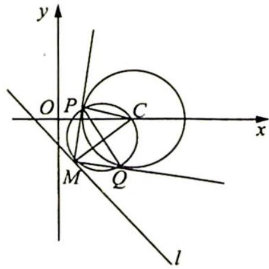
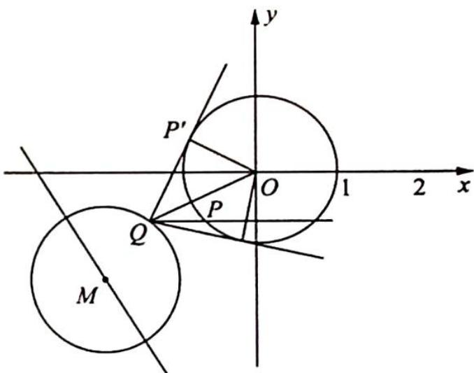

## 16.3 模型二:蒙日圆

## 研究密钥

对于一个圆或椭圆, 任意两条相互垂直的切线的交点都在同一个圆上, 即交点轨迹为一个圆, 圆心即为圆或椭圆的中心. 这个圆就是蒙日圆. 蒙日圆亦称“准圆”, 属于“筷子夹汤圆”的一种, 我们可以抓住此特征构造隐形圆 (蒙日圆).

例 16.5 设直线 $l:3x+4y+a=0$ ，圆 $C:(x-2)^{2}+y^{2}=2$ ，若在直线 l 上存在一点 M，使得过 M 的圆 C 的切线 MP, MQ(P, Q 为切点) 满足 $\angle PMQ=90^{\circ}$ ，则 a 的取值范围是 \_\_\_\_.

分析 ➤ 在直线 l 上存在一点 M 满足 $\angle PMQ = 90^{\circ}$ ，那么以 PQ 为直径的圆（隐形圆）与直线 l 相切或相交。通过 $\triangle CMP, \triangle CMQ$ 为等腰直角三角形，计算出相切时 CM 的长度，由此转化为圆心到直线的距离小于或等于此长度。

解析 ▶ 圆 $C: (x - 2)^{2} + y^{2} = 2$ , 圆心为 $C(2,0)$ , 半径为 $\sqrt{2}$ , 因为在直线 $l$ 上存在一点 $M$ ,使得过 $M$ 的圆 $C$ 的切线 $MP, MQ(P, Q$ 为切点) 满足 $\angle PMQ = 90^{\circ}$ , 也即以 $PQ$ 为直径的圆 (隐

形圆)与直线 l 相切或相交. 如图所示.

相切时, 切点为 $M, MC = \sqrt{2}PC = \sqrt{2}r = 2$ , 所以要想使以 $PQ$ 为直径的圆与 $l$ 有公共点, 必须使得圆心 $C$ 到直线 $l$ 的距离小于或等于 2 , 即 $\frac{|3\times 2 + 4\times 0 + a|}{\sqrt{3^2 + 4^2}}\leqslant 2$ , 解得 $-16\leqslant a\leqslant 4$ .

故 a 的取值范围是 $[-16,4]$ .

变式(1) 已知圆 $O: x^{2} + y^{2} = 1$ , 圆 $M: (x - a)^{2} + (y - a + 4)^{2} = 1$ . 若圆 $M$ 上存在点 $P$ , 过点 $P$ 作圆 $O$ 的两条切线, 切点为 $A, B$ , 使得 $\angle APB = 60^{\circ}$ , 则实数 $a$ 的取值范围为 \_\_\_\_.

解析 由题意得圆心 $M(a, a - 4)$ 在直线 $x - y - 4 = 0$ 上运动, 所以动圆 $M$ 是圆心在直

线 x-y-4=0 上, 半径为 1 的圆, 如图所示.

又因为圆 $M$ 上存在点 $P$ , 使经过点 $P$ 作圆 $O$ 的两条切线, 使 $\angle APB = 60^\circ$ , 所以 $OP = 2$ , 即点 $P$ 在圆 $x^2 + y^2 = 4$ 上, 所以圆 $M$ 与圆 $x^2 + y^2 = 4$ 相交或相切, 于是 $2 - 1 \leqslant \sqrt{a^2 + (a - 4)^2} \leqslant 2 + 1$ , 即 $1 \leqslant \sqrt{a^2 + (a - 4)^2} \leqslant 3$ , 解得实数 $a$ 的取值范围是 $\left[2 - \frac{\sqrt{2}}{2}, 2 + \frac{\sqrt{2}}{2}\right]$ .

变式(2) 在平面直角坐标系 $xOy$ 中, 圆 $O: x^{2} + y^{2} = 1$ , 圆 $M: (x + a + 3)^{2} + (y - 2a)^{2} = 1$ ( $a$ 为实数). 若圆 $O$ 与圆 $M$ 上分别存在点 $P, Q$ , 使得 $\angle OQP = 30^{\circ}$ , 则 $a$ 的取值范围为 \_\_\_\_.

分析 ▶ 本题中在两个圆上分别存在点 P, Q, 使得 $\angle OQP = 30^{\circ}$ 是本题的关键. 首先对于圆 O, 可以根据 $\angle OQP = 30^{\circ}$ 得出点 Q 的轨迹, 再将点 Q 的存在性问题转化为点 Q 的轨迹与圆 M 有公共点, 从而求出参数 a 的取值范围.

解析 如图所示, 过 $Q$ 点作圆 $O$ 的切线, 设切点为 $P'$ , 在圆 $O$ 上要存在点 $P$ 满足 $\angle OQP = 30^\circ$ , 即 $\angle OQP' \geqslant 30^\circ$ , 又 $\sin \angle OQP' = \frac{OP'}{OQ} \geqslant \frac{1}{2}$ , 即 $OQ \leqslant 2$ . 设 $Q(x, y)$ , 所以 $x^2 + y^2 \leqslant 4$ .

又点 $Q$ 在圆 $M$ 上, 即圆 $M$ 与 $x^{2} + y^{2} \leqslant 4$ 有公共点, 则有 $1 \leqslant (-a - 3)^{2} + (2a)^{2} \leqslant 9$ , 解得 $a \in \left[-\frac{6}{5}, 0\right]$ .

变式(3) 已知圆 $(x-2)^{2}+y^{2}=4$ ，线段 EF 在直线 $l: y=x+1$ 上运动，点 P 为线段 EF 上任意一点，若圆 C 上存在两点 A, B，使得 $\overrightarrow{PA} \cdot \overrightarrow{PB} \leqslant 0$ ，则线段 EF 长度的最大值为 \_\_\_\_.

解析 由 $\overrightarrow{PA} \cdot \overrightarrow{PB} \leqslant 0$ 可知 $\angle APB \geqslant 90^{\circ}$ . 圆外一点与圆上两点所成角度最大的时候就是过圆外一点做圆的两条切线,两切点与圆外一点的夹角.

如图所示,所以保证相切时的角度 $\angle APB \geqslant 90^{\circ}$ ,则 $\angle APC \geqslant 45^{\circ}$ ,则 $\frac{|CA|}{|PC|} \geqslant \frac{\sqrt{2}}{2}$ .

又 $|CA|=2$ ，则 $|PC|\leqslant2\sqrt{2}$ ，由于圆的对称性，直线上有两个点到点C的距离为 $2\sqrt{2}$ ，而当这两个点就是E,F时， $|EF|$ 取最大值.

由圆心 $C$ 到直线的距离 $d = \frac{|2 + 1 - 0|}{\sqrt{1^2 + (-1)^2}} = \frac{3\sqrt{2}}{2}$ ，则 $|EF|_{\max} = 2\sqrt{|PC|_{\max}^2 - d^2} = \sqrt{14}$ .

故线段 EF 长度的最大值为 $\sqrt{14}$ .

