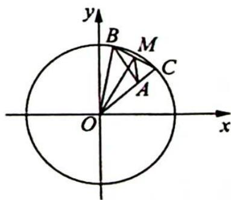

## 16.5 模型四:矩形性质

## 研究密钥

若矩形所在平面上任意一点到对角线上的两个定点的距离的平方和相等, 以此列方程探寻动点轨迹, 由于动点到定点的距离定长, 所以该动点的轨迹为圆, 可以此为特征确定隐形圆.

例 16.7 在平面直角坐标系 $xOy$ 中, 已知 $B, C$ 为圆 $x^{2} + y^{2} = 4$ 上两点, 点 $A(1,1)$ , 且 $AB \perp AC$ , 则线段 $BC$ 的长的取值范围为 \_\_\_\_.

分析 ▶ 思路一: 转化 BC 的长. 设 BC 中点 M, 由已知 $AB \perp AC$ , 所以 BC = 2AM. 接下来求 M 的轨迹, 其轨迹为圆, 问题继续转化为定点到圆上一点的距离范围问题. 思路二: 转化 BC 的长, 以 AB, AC 为邻边作矩形 BACN, 则 BC = AN, 由矩形的几何性质 (矩形所在平面上任意一点到其对角线上的两个定点的距离的平方和相等), 可知 N 的轨迹为一个圆, 问题转化为定点到圆上一点距离的范围问题.

解析 ▶ 解法一: 如图所示, 设 BC 的中点为 $M(x, y)$ , 因为 $OB^{2} = OM^{2} + BM^{2} = OM^{2} + AM^{2}$ , 所以 $4 = x^{2} + y^{2} + (x - 1)^{2} + (y - 1)^{2}$ , 化简得 $\left(x - \frac{1}{2}\right)^{2} + \left(y - \frac{1}{2}\right)^{2} = \frac{3}{2}$ , 所以点 M 的轨迹是以 $\left(\frac{1}{2}, \frac{1}{2}\right)$ 为圆心, $\frac{\sqrt{6}}{2}$ 为半径的

圆, 则 ${AM}$ 的取值范围是 $\left\lbrack  {\frac{\sqrt{6} - \sqrt{2}}{2},\frac{\sqrt{6} + \sqrt{2}}{2}}\right\rbrack  ,{BC}$ 的取值范围是 $\left\lbrack  {\sqrt{6} - \sqrt{2},\sqrt{6} + \sqrt{2}}\right\rbrack$ .

解法二: 以 AB, AC 为邻边作矩形 BACN, 则 BC = AN.

由矩形的几何性质(矩形所在平面上的任意一点到其对角线上的两个定点的距离的平方和相等), 有 $OB^{2} + OC^{2} = OA^{2} + ON^{2}$ , 所以 $ON = \sqrt{6}$ , 故 $N$ 在以 $O$ 为圆心, 半径为 $\sqrt{6}$ 的圆上, $BC$ 的取值范围是 $[\sqrt{6} - \sqrt{2}, \sqrt{6} + \sqrt{2}]$ .

变式(1) 已知圆 $C_{1}: x^{2} + y^{2} = 9$ , 圆 $C_{2}: x^{2} + y^{2} = 4$ , 定点 $M(1,0)$ , 动点 $A, B$ 分别在圆 $C_{2}$

和圆 $C_1$ 上, 满足 $AM \perp MB$ , 则线段 $AB$ 的取值范围是 .

解析 如图所示, 以 $MA, MB$ 为邻边作矩形 $AMBN$ , 则 $AB = MN$ .

由矩形的几何性质(矩形所在平面上的任意一点到其对角线上的两个定点的距离的平方和相等), 有 $OA^2 + OB^2 = OM^2 + ON^2$ , 代入数据得 $4 + 9 = 1 + ON^2$ , 解得 $|ON| = 2\sqrt{3}$ , 则点 $N$ 在以原点 $O$ 为圆心, 半径为 $2\sqrt{3}$ 的圆上, 圆的方程为 $x^2 + y^2 = 12$ .

所以 $MN$ 的取值范围是 $[2\sqrt{3} - 1, 2\sqrt{3} + 1]$ . 故 $|AB|$ 的范围为 $[2\sqrt{3} - 1, 2\sqrt{3} + 1]$ .

## 训练 16

1.(2020 新课标全国 I 卷理 11)已知 ⊙M: $x^{2}+y^{2}-2x-2y-2=0$ , 且直线 $l:2x+y+2=0$ , $P$ 为 $l$ 上的动点, 过点 $P$ 作 ⊙M 的切线 $PA, PB$ , 切点为 $A, B$ , 当 $|PM||AB|$ 最小时, 直线 $AB$ 的方程为 ( ).

A. $2x-y-1=0$ B. $2x+y-1=0$ C. $2x-y+1=0$ D. $2x+y+1=0$

2. 若对圆 $(x-1)^{2}+(y-1)^{2}=1$ 上任意一点 $P(x,y)$ ， $\left|3x-4y+a\right|+\left|3x-4y-9\right|$ 的取值与x，y无关，则实数a的取值范围是（）.
A. $a \leqslant 4$ B. $-4 \leqslant a \leqslant 6$ C. $a \leqslant -4$ 或 $a \geqslant 6$ D. $a \geqslant 6$

3. 已知 O 为坐标原点， $\odot M: x^{2} + (y - 1)^{2} = 1, \odot N: x^{2} + (y + 3)^{2} = 9, A, B$ 分别为 $\odot M$ 和 $\odot N$ 上的动点，则 $\triangle AOB$ 面积的最大值为（）.

A. $\frac{3\sqrt{3}}{4}$ B. $\frac{9\sqrt{3}}{4}$ C. $3\sqrt{3}$ D. $9\sqrt{3}$

4. 已知圆 $C: (x - 3)^{2} + (y - 4)^{2} = 1$ 和两点 $A(0, m), B(0, -m) (m > 0)$ , 若圆 $C$ 上存在点 $P$ , 使得 $\angle APB = 90^{\circ}$ , 则 $m$ 的取值范围是 \_\_\_\_.

5. 若直线 $x + y + m = 0$ 上存在点 P 可作圆 $O: x^{2} + y^{2} = 1$ 的两条切线 PA, PB, 切点为 A, B, 且 $\angle APB = 60^{\circ}$ , 则实数 m 的取值范围为 \_\_\_\_.

6. 在平面直角坐标系中, 已知点 $P(3,0)$ 在圆 $C: (x - m)^{2} + (y - 2)^{2} = 40$ 内, 动直线 $AB$ 过点 $P$ 且交圆 $C$ 于 $A, B$ 两点, 若 $\triangle ABC$ 的面积的最大值为 20 , 则实数 $m$ 的取值范围是
