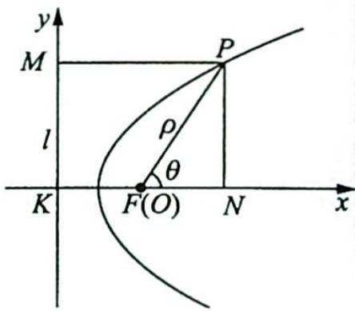

## 17.1 圆锥曲线的极坐标方程

研究密钥

在学习圆锥曲线的定义时,我们知道圆锥曲线有着统一的第二定义,即平面内到定点 $F$ 和定直线 $l$ 的距离之比为定值 $e$ 的点的轨迹.在此基础上,我们可以得出圆锥曲线的统一的极坐标方程 $\rho = \frac{ep}{1 - e\cos\theta}$ ,其中 $e$ 为离心率, $p$ 为焦参数(焦点 $F$ 到准线 $l$ 的距离),具体推导过程如下:如图所示,设点 $F$ 到直线 $l$ 的距离为 $p$ ,点 $F$ 在直线 $l$ 上的射影为点 $K$ ,以 $F$ 为极点,向量 $\overrightarrow{KF}$ 的方向为极轴的正方向建立极坐标系,点 $P(\rho, \theta)$ 为圆锥曲线上任意一点,其在直线 $l$ 上的投影为点 $M$ ,在极轴上的投影为点 $N$ ,则由圆锥曲线的定义知 $\frac{|PF|}{|PM|} = e$ .因为 $|PF| = \rho$ ,

$|PM|=|KF|+|FN|=p+\rho\cos\theta$ ，所以 $\frac{\rho}{p+\rho\cos\theta}=e$ ，化简得 $\rho=$ $\frac{ep}{1-e\cos\theta}.$

(1)当圆锥曲线为椭圆 $\frac{x^{2}}{a^{2}}+\frac{y^{2}}{b^{2}}=1(a>b>0)$ 时, $e=\frac{c}{a}$ , $p=\frac{a^{2}}{c}-c=\frac{b^{2}}{c}$ ，代入 $\rho=\frac{ep}{1-ecos\theta}$ 中，得椭圆的极坐标方程为 $\rho=\frac{b^{2}}{a-c\cos\theta}$ .

(2)当圆锥曲线为双曲线 $\frac{x^{2}}{a^{2}}-\frac{y^{2}}{b^{2}}=1(a>0,b>0)$ 时, $e=\frac{c}{a}$ , $p=c-\frac{a^{2}}{c}=\frac{b^{2}}{c}$ ，代入 $\rho=\frac{ep}{1-e\cos\theta}$ 中，得双曲线的极坐标方程为 $\rho=\frac{b^{2}}{a-c\cos\theta}$ .

(3)当圆锥曲线为抛物线 $y^{2}=2px(p>0)$ 时, e=1, 代入 $\rho=\frac{ep}{1-ecos\theta}$ 中, 得抛物线的极坐标方程为 $\rho=\frac{p}{1-\cos\theta}$ .

例 17.1 (2006 年复旦大学自主招生试题) 对所有满足 $1 \leqslant n \leqslant m \leqslant 5$ 的正整数 $m, n$ , 极坐标方程 $\rho = \frac{1}{1 - C_m^n \cos \theta}$ 表示的不同双曲线的条数为 ( ).

A. 6 B. 9 C. 12 D. 15

分析 ▶ 双曲线的极坐标方程为 $\rho = \frac{ep}{1 - e\cos\theta}$ , 将 $\rho = \frac{1}{1 - C_m^n\cos\theta}$ 向 $\rho = \frac{ep}{1 - e\cos\theta}$ 的形式靠拢, 其中 $e > 1$ . 再由 $m, n$ 的取值确定 $C_m^n$ 的所有可能取值, 取值大于 1 的就是双曲线.

解析 $\triangleright C_{m}^{n}$ 的所有可能取值为 1, 2, 3, 4, 5, 6, 10. 根据双曲线的极坐标方程为 $\rho = \frac{ep}{1 - e\cos\theta}$ , 其中 $e > 1$ , 可得 $\rho = \frac{1}{1 - C_{m}^{n}\cos\theta} = \frac{C_{m}^{n} \cdot \frac{1}{C_{m}^{n}}}{1 - C_{m}^{n}\cos\theta}$ 表示双曲线的充要条件为 $C_{m}^{n} > 1$ , 共有 6 条. 故选 A.
