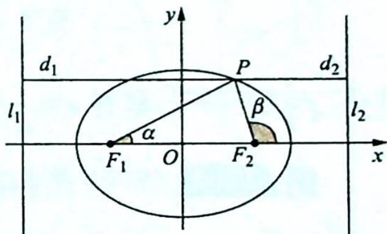
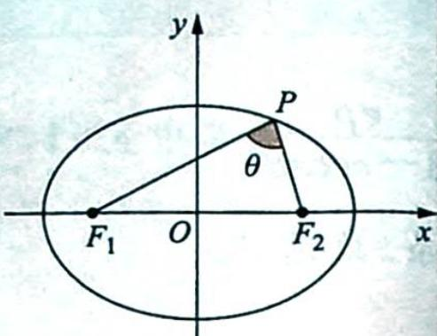

## 17.2 焦半径公式的应用

研究密钥

1. 焦半径: 椭圆上任意一点到焦点的距离叫作椭圆的焦半径. 焦半径公式主要有两种形式:

【代数形式】 $\left|PF_{1}\right|=a+ex,\left|PF_{2}\right|=a-ex.$

如图所示, 已知点 $P(x, y)$ 是椭圆 $\frac{x^2}{a^2} + \frac{y^2}{b^2} = 1 (a > b > 0)$ 上任意一点, 椭圆的左、右两焦点分别为 $F_1, F_2$ , 左、右两准线分别为 $l_1, l_2$ . 设点 $P$ 到直线 $l_1, l_2$ 的距离分别为 $d_1, d_2$ , 则根据椭圆的第二定义可得 $e = \frac{|PF_1|}{d_1} = \frac{|PF_1|}{x - \left(-\frac{a^2}{c}\right)}$ , 由此得 $|PF_1| = a + ex$ . 同理根据 $e = \frac{|PF_2|}{d_2} = \frac{|PF_2|}{\frac{a^2}{c} - x}$ , 可得 $|PF_2| = a - ex$ .

【几何形式】 $\left|PF_{1}\right|=\frac{b^{2}}{a-c\cos\alpha},\left|PF_{2}\right|=\frac{b^{2}}{a+c\cos\beta}.$

【证法一】如图所示, 设 $PF_{1}$ 与 $x$ 轴的正半轴的夹角为 $\alpha$ , $PF_{2}$ 与 $x$ 轴的正半轴的夹角为 $\beta$ , $x$ 轴正方向的单位向量为 $e_{1} = (1,0)$ , 则根据向量的数量积的定义得 $\cos \alpha = \frac{\overrightarrow{F_{1}P} \cdot e_{1}}{|\overrightarrow{F_{1}P}| |e_{1}|} =$

$\frac{(x-(-c),y)\cdot(1,0)}{|PF_1|}=\frac{x+c}{|PF_1|}$ , 将 $x=\frac{|PF_1|-a}{e}$ 代入上式得 $\cos\alpha=\frac{\frac{|PF_1|-a}{e}+c}{|PF_1|}=\frac{|PF_1|-a+ec}{e|PF_1|}$ , $|PF_1|= \frac{b^2}{a-c\cos\alpha}$ , 同理 $|PF_2|= \frac{b^2}{a+c\cos\beta}$ .

【证法二】如图所示, 设 $PF_{1}$ 与 x 轴的正半轴的夹角为 $\alpha$ , $PF_{2}$ 与 x 轴的正半轴的夹角为 $\beta$ , 利用椭圆的极坐标方程可得 $\left|PF_{1}\right|=\frac{b^{2}}{a-c\cos\alpha}$ , 同理可得 $\left|PF_{2}\right|=\frac{b^{2}}{a+c\cos\beta}$ .

2. 焦点弦: 椭圆的经过焦点的弦称为焦点弦.

3. 通径: 过椭圆的焦点的所有弦中, 垂直于两焦点所在直线的弦称为椭圆的通径.

4. 焦点三角形: 如果椭圆上的任意一点 $P(x, y)$ 与两焦点 $F_{1}, F_{2}$ 能构成三角形(如图所示), 那么称 $\triangle PF_{1}F_{2}$ 为焦点三角形.

(只以椭圆举例说明,双曲线和抛物线相应的定义和性质请同学们自己推导.)

例 17.2 (2013 福建卷理 14) 椭圆 $\Gamma: \frac{x^{2}}{a^{2}} + \frac{y^{2}}{b^{2}} = 1 (a > b > 0)$ 的左、右焦点分别为 $F_{1}, F_{2}$ , 焦距为 $2c$ . 若直线 $y = \sqrt{3} (x + c)$ 与椭圆 $\Gamma$ 的一个交点 $M$ 满足 $\angle MF_{1}F_{2} = 2\angle MF_{2}F_{1}$ , 则该椭圆的离心率为 \_\_\_\_.

分析 ▶ 画图分析,由直线倾斜角为 $\frac{\pi}{3}$ 及 $\angle MF_{1}F_{2}=2\angle MF_{2}F_{1}$ 这个条件可知焦点三角形是一个特殊的直角三角形,两条直角边的比为 $\sqrt{3}:1$ 的关系,由焦半径公式写出这两条直角边,化简即得离心率.

解析 由直线 $y = \sqrt{3} (x + c)$ 的倾斜角为 $\frac{\pi}{3}$ ，可得 $\angle MF_1F_2 = \frac{\pi}{3}$ ，由 $\angle MF_1F_2 = 2\angle MF_2F_1$ 可得 $\angle MF_2F_1 = \frac{\pi}{6}$ ，所以 $\angle F_1MF_2 = \frac{\pi}{2}$ ，即 $\triangle F_1MF_2$ 是直角三角形， $|MF_2| = \sqrt{3}|MF_1|$ ，根据椭圆的焦半径公式可得 $\frac{b^2}{a + c\cos\frac{5\pi}{6}} = \frac{\sqrt{3}b^2}{a - c\cos\frac{\pi}{3}}$ ， $a - \frac{1}{2}c = \sqrt{3}\left(a - \frac{\sqrt{3}}{2}c\right)$ ，

$(1-\sqrt{3})a=-c$ , 解得 $e=\frac{c}{a}=\sqrt{3}-1$ .

例 17.3 (2011 年北京大学自主招生考试) 如图所示, 点 $P$ 为双曲线 $\frac{x^{2}}{a^{2}} - \frac{y^{2}}{b^{2}} = 1 (a > 0, b > 0)$ 上任意的一点, 直线 $PQ$ 为双曲线在点 $P$ 处的切线, $F_{1}, F_{2}$ 为双曲线的焦点, 证明: $PQ$ 平分 $\angle F_{1}PF_{2}$ .

分析 ▶ 证明 PQ 平分 $\angle F_{1}PF_{2}$ ，即证明 $\frac{|F_{1}M|}{|MF_{2}|} = \frac{|PF_{1}|}{|PF_{2}|}$ ，用焦半径公式将 $PF_{1}, PF_{2}$ 用 a, c 及 P 点横坐标表示出来， $F_{1}M, MF_{2}$ 也表示出来，证明相等。

证明 不妨设点 $P(x_0, y_0)(x_0 > a)$ 在双曲线的右支上, 且直线 $PQ$ 与 $x$ 轴的交点为 $M$ , 则直线 $PQ$ 的方程为 $\frac{x_0 x}{a^2} - \frac{y_0 y}{b^2} = 1$ , 令 $y = 0$ 得 $x = \frac{a^2}{x_0}$ , 所以 $M\left(\frac{a^2}{x_0}, 0\right)$ .

因为 $0 < \frac{a^2}{x_0} < a$ ，所以 $\frac{|F_1M|}{|MF_2|} = \frac{\frac{a^2}{x_0} + c}{c - \frac{a^2}{x_0}} = \frac{a^2 + cx_0}{cx_0 - a^2}$ .

由双曲线的焦半径公式得 $\left\{ \begin{array}{l} |PF_1| = a + ex_0 = \frac{a^2 + cx_0}{a} \\ |PF_2| = ex_0 - a = \frac{cx_0 - a^2}{a} \end{array} \right.$ ，所以 $\frac{|F_1M|}{|MF_2|} = \frac{|PF_1|}{|PF_2|}$ ，则由三角形的角平分线的判定定理可知 $\angle F_1PM = \angle F_2PM$ ，即 $PQ$ 平分 $\angle F_1PF_2$ 。

例 17.4 (2021 年全国八省联考) 设双曲线 $C: \frac{x^2}{a^2} - \frac{y^2}{b^2} = 1 (a > 0, b > 0)$ 的左顶点为点 $A$ , 右焦点为点 $F$ , 动点 $B$ 在双曲线 $C$ 上. 当 $BF \perp AF$ 时, $|AF| = |BF|$ .

(1) 求双曲线 C 的离心率;

(2) 若点 B 在第一象限, 证明: $\angle BFA = 2\angle BAF$ .

分析 ▶ 思路一: 要证 $\angle BFA = 2\angle BAF$ , 作 $\angle BFA$ 的平分线交 $AB$ 于点 $D$ , 只要证明点 $D$ 在线段 $AF$ 的垂直平分线上即可; 思路二: 利用双曲线的参数方程, 将对 $\angle BFA = 2\angle BAF$ 的证明转化为 $\tan \angle BFA = \tan 2\angle BAF$ , 再转化为三角恒等式的证明.

解析 (1) 当 $BF \perp AF$ 时, $|AF| = a + c$ , $|BF| =$ 通径长的一半 $= \frac{b^2}{a}$ , 所以 $a + c = \frac{b^2}{a}$ , 即 $a + c = \frac{c^2 - a^2}{a}, c^2 - ca - 2a^2 = 0, \left(\frac{c}{a}\right)^2 - \frac{c}{a} - 2 = 0$ , 解得双曲线 $C$ 的离心率 $e = \frac{c}{a} = 2$ .

(2)证法一:如图所示,设 $B(x_{0},y_{0})$ ,作 $\angle BFA$ 的平分线交 $AB$ 于点 $D$ .

因为 $\frac{|BF|}{x_0 - \frac{a^2}{c}} = \frac{c}{a}$ , 所以 $|BF| = \frac{c}{a} x_0 - a$ , 根据角平分线的性质, 可得 $\frac{|BF|}{|AF|} = \frac{|BD|}{|AD|}$ , 即 $\frac{\frac{c}{a} x_0 - a}{a + c} = \frac{x_0 - x_D}{x_D + a}, \left(\frac{c}{a} x_0 - a\right) x_D + cx_0 - a^2 =$

$(-a - c)x_{D} + (a + c)x_{0}$ , 解得 $x_{D} = \frac{ax_{0} + a^{2}}{\frac{c}{a}x_{0} + c}$ , 由(1)可得 $c = 2a$ , 代入可得 $x_{D} = \frac{ax_{0} + a^{2}}{2x_{0} + 2a} = \frac{a}{2} = \frac{c + (-a)}{2}$ , 即点 $D$ 在 $AF$ 的垂直平分线上, 所以 $\frac{1}{2}\angle BFA = \angle DFA = \angle BAF$ , 故 $\angle BFA = 2\angle BAF$ .

证法二:由(1)可得 c=2a, 则 $b=\sqrt{c^{2}-a^{2}}=\sqrt{3}a$ , 所以双曲线的方程为 $\frac{x^{2}}{a^{2}}-\frac{y^{2}}{3a^{2}}=1$ . 设 $B(a\sec\alpha,\sqrt{3}a\tan\alpha)$ , 其中 $\alpha\in\left(0,\frac{\pi}{2}\right)$ .

当 $\alpha = \frac{\pi}{3}$ 时，点 $B$ 的坐标为 $(2a,3a)$ ，此时 $\left\{ \begin{array}{l} \angle BFA = \frac{\pi}{2} \\ \angle BAF = \frac{\pi}{4} \end{array} \right.$ ，所以 $\angle BFA = 2\angle BAF$ 显然成立。当 $\alpha \neq \frac{\pi}{3}$ 时， $\left\{ \begin{array}{l} \tan \angle BFA = -k_{BF} = -\frac{\sqrt{3} a \tan \alpha}{a \sec \alpha - 2a} = \frac{\sqrt{3} \sin \alpha}{2 \cos \alpha - 1} \\ \tan \angle BAF = k_{AB} = \frac{\sqrt{3} a \tan \alpha}{a \sec \alpha + a} = \frac{\sqrt{3} \sin \alpha}{\cos \alpha + 1} \end{array} \right.$ ，所以 $\tan 2\angle BAF = \frac{2\tan\angle BAF}{1 - \tan^2\angle BAF} = \frac{2\times\frac{\sqrt{3}\sin\alpha}{\cos\alpha + 1}}{1 - \left(\frac{\sqrt{3}\sin\alpha}{\cos\alpha + 1}\right)^2} = \frac{2\times\frac{\sqrt{3}\sin\alpha}{\cos\alpha + 1}}{1 - \frac{3(1 - \cos\alpha)(1 + \cos\alpha)}{(\cos\alpha + 1)^2}} = \frac{\sqrt{3}\sin\alpha}{2\cos\alpha - 1}$ ，则 $\tan \angle BFA = \tan 2\angle BAF, \angle BFA = 2\angle BAF.$

综上可得, $\angle {BFA} = 2\angle {BAF}$ 恒成立.

变式(1) (2010年全国高中数学联赛福建省预赛)已知双曲线 $C: \frac{x^2}{a^2} - \frac{y^2}{b^2} = 1 (a > 0, b > 0)$ 的离心率为2, 过点 $P(0, m) (m > 0)$ 的斜率为1的直线 $l$ 交双曲线 $C$ 于 $A, B$ 两点, 且 $\overrightarrow{AP} = 3\overrightarrow{PB}, \overrightarrow{OA} \cdot \overrightarrow{OB} = 3$ .

(1)求双曲线的方程；

(2)设点 $Q$ 为双曲线 $C$ 右支上的动点, 点 $F$ 为双曲线 $C$ 的右焦点, 在 $x$ 轴的负半轴上是否存在定点 $M$ , 使得 $\angle QFM = 2\angle QMF$ ? 若存在, 求出点 $M$ 的坐标; 若不存在, 请说明理由.

解析 ▶ (1)由双曲线离心率为 2 知 $c=2a, b=\sqrt{3}a$ ，于是双曲线方程可化为 $\frac{x^2}{a^2}-\frac{y^2}{3a^2}=1$ 。又直线 $l: y=x+m$ ，与双曲线方程联立得 $2x^2-2mx-m^2-3a^2=0$ ①，设点 $A(x_1, y_1)$ ， $B(x_2, y_2)$ ，则 $x_1+x_2=m, x_1x_2=\frac{-m^2-3a^2}{2}$ ②。因为 $\overrightarrow{AP}=3\overrightarrow{PB}$ ，所以 $(-x_1, m-y_1)=3(x_2, y_2-m)$ ，故 $x_1=-3x_2$ 。结合 $x_1+x_2=m$ ，解得 $x_1=\frac{3}{2}m, x_2=-\frac{1}{2}m$ ，代入式②得 $-\frac{3}{4}m^2=\frac{-m^2-3a^2}{2}\Rightarrow m^2=6a^2$ 。又 $\overrightarrow{OA} \cdot \overrightarrow{OB}=x_1x_2+y_1y_2=x_1x_2+(x_1+m)(x_2+m)=2x_1x_2+m(x_1+x_2)+m^2=m^2-3a^2=3a^2=3$ ，从而 $a^2=1$ 。此时 $m=\sqrt{6}$ 或 $m=-\sqrt{6}$ （舍去），代入式①并整理得 $2x^2-2\sqrt{6}x-9=0$ 。显然，该方程有两个不同的实根，因此， $a^2=1$ 符合要求。故双曲线 C 的方程为 $x^2-\frac{y^2}{3}=1$ 。

(2)解法一:找特殊情况确定点 M 的位置. 令 $QF \perp MF$ , 此时 $\angle QFM = 2\angle QMF = 90^{\circ}$ , 则 $\angle QMF = 45^{\circ}$ , $\triangle QFM$ 是一个等腰直角三角形. 又 $QF = \frac{b^{2}}{a} = 3$ , 所以 MF = 3, 故点 M 的坐标为

$M(-1,0)$ .

下面证明 M 在一般情况下也成立,使得 $\angle QFM = 2\angle QMF$ .

如图所示,作∠QFM的平分线交QM于点D,因为 $\frac{|QF|}{x_{0}-\frac{a^{2}}{c}}=\frac{c}{a}$ ,所以 $|QF|=\frac{c}{a}x_{0}-a$ ,根据角平分线的性质,可得 $\frac{|QF|}{|MF|}=\frac{|QD|}{|MD|}$ ,即 $\frac{\frac{c}{a}x_{0}-a}{a+c}=$

$\frac{x_0 - x_D}{x_D + a}$ , 解得 $x_D = \frac{ax_0 + a^2}{\frac{c}{a}x_0 + c}$ , 由(1)可得 $e = 2, c = 2a$ , 代入上式得 $x_D = \frac{a}{2} = \frac{c + (-a)}{2}$ , 即点 $D$ 在 $MF$ 的垂直平分线上, 所以 $\frac{1}{2}\angle QFM = \angle DFM = \angle QMF$ , 故 $\angle QFM = 2\angle QMF$ , 此时 $M$ 的坐标为 $(-1,0)$ .

综上所述,存在定点 $M(-1,0)$ 满足 $\angle QFM = 2\angle QMF$ .

解法二: 假设点 $M(t,0)$ 存在. 由(1)知双曲线右焦点为 $F(2,0)$ .

设 $Q(x_0, y_0)(x_0 \geqslant 1)$ 为双曲线 $C$ 右支上一点，当 $x_0 \neq 2$ 时， $\tan \angle QFM = -k_{QF} = -\frac{y_0}{x_0 - 2}$ ， $\tan \angle QMF = k_{QM} = \frac{y_0}{x_0 - t}$ .

因为 $\angle QFM = 2\angle QMF$ ，所以 $-\frac{y_0}{x_0 - 2} = \frac{\frac{2y_0}{x_0 - t}}{1 - \left(\frac{y_0}{x_0 - t}\right)^2}, -\frac{1}{x_0 - 2} = \frac{2(x_0 - t)}{(x_0 - t)^2 - y_0^2}$ 将 $y_0^2 = 3x_0^2 -3$ 代入上式整理得 $(4 + 2t)x_0 - 4t = -2tx_0 + t^2 +3\Rightarrow \left\{ \begin{array}{ll}4 + 2t = -2t\\ -4t = t^2 +3 \end{array} \right.\Rightarrow t = -1.$

当 $x_{0}=2$ 时， $\angle QFM=90^{\circ}$ ，而 t=-1 时， $\angle QMF=45^{\circ}$ ，符合 $\angle QFM=2\angle QMF$ 。

所以满足条件的点 $M(-1,0)$ 存在.

变式(2) (2011年清华大学等七校联考自主招生试题)已知双曲线 $C: \frac{x^2}{a^2} - \frac{y^2}{b^2} = 1 (a > 0, b > 0)$ , 点 $F_1, F_2$ 分别为双曲线 $C$ 的左、右焦点. 点 $P$ 为双曲线 $C$ 的右支上一点, 且使 $\angle F_1PF_2 = \frac{\pi}{3}, \triangle F_1PF_2$ 的面积为 $3\sqrt{3} a^2$ .

(1)求双曲线 C 的离心率 e;

(2)设点 $A$ 为双曲线 $C$ 的左顶点, 点 $Q$ 为第一象限内双曲线 $C$ 上的任意一点, 问: 是否存在常数 $\lambda (\lambda > 0)$ , 使得 $\angle QF_{2}A = \lambda \angle QAF_{2}$ 恒成立? 若存在, 求出 $\lambda$ 的值; 若不存在, 请说明理由.

解析 (1) 设 $|PF_1| = m, |PF_2| = n, F_2 (c,0)$ ，则 $\left\{ \begin{array}{l} m - n = 2a \\ \frac{1}{2}\sin \frac{\pi}{3} \cdot mn = 3\sqrt{3} a^2 \end{array} \right.$ ，即 $\left\{ \begin{array}{l} m - n = 2a \\ mn = 12a^2 \end{array} \right.$ . 根据余弦定理得 $(2c)^2 = |F_1F_2|^2 = m^2 + n^2 - mn = 16a^2$ ，于是 $e = \frac{c}{a} = 2$ .

(2) 双曲线方程为 $\frac{x^2}{a^2} - \frac{y^2}{3a^2} = 1$ ，即 $y^2 = 3(x^2 - a^2)$ .

显然 $(c,3a)$ 是双曲线上一点,此时 $\lambda=2$ ,于是若 $\lambda$ 存在,则其值只可能为2.

如图所示, 设 $Q(x_0, y_0)$ , $MN$ 为 $AF_2$ 的垂直平分线, 则 $A(-a, 0)$ , $F_2(2a, 0), M\left(\frac{1}{2}a, 0\right)$ , 于是 $\frac{|AN|}{|NQ|} = \frac{x_N - x_A}{x_Q - x_N} = \frac{\frac{3}{2}a}{x_0 - \frac{1}{2}a} = \frac{3a}{2x_0 - a} = \frac{|AF_2|}{|QF_2|}$ , 其中最后一个等号是因为 $|AF_2| = 3a$ , $|QF_2| = ex_0 - a = 2x_0 - a$ .

又 $\frac{|AN|}{|NQ|}=\frac{|AF_{2}|}{|QF_{2}|}$ ，所以 $|NF_{2}|$ 为 $\angle QF_{2}A$ 的平分线，因此 $\angle QF_{2}A=2\angle NF_{2}A=2\angle QAF_{2}$ ，故 $\lambda$ 的值为2.

变式(3) (2017年全国高中数学联赛甘肃省预赛)设向量 $i, j$ 分别为直角坐标平面内 $x$ 轴， $y$ 轴正方向上的单位向量，若 $a = (x + 2)i + yj, b = (x - 2)i + yj$ ，且 $|a| - |b| = 2$ .

(1)求满足上述条件的点 $P(x, y)$ 的轨迹方程；

(2)设点 $A(-1,0), F(2,0)$ , 问: 是否存在常数 $\lambda (\lambda > 0)$ , 使得 $\angle PFA = \lambda \angle PAF$ 恒成立? 证明你的结论.

解析 (1)由 $|a| - |b| = 2$ 得 $\sqrt{(x + 2)^2 + y^2} -\sqrt{(x - 2)^2 + y^2} = 2$ ，故点 $P$ 的轨迹方程为 $x^{2} - \frac{y^{2}}{3} = 1(x > 0)$

(2)在第一象限内作 $PF \perp x$ 轴, 则 $P(2,3)$ , 此时 $\angle PFA = 90^{\circ}, \angle PAF = 45^{\circ}$ , 即 $\lambda = 2$ . 下面证明 $PF$ 不与 $x$ 轴垂直时, $\angle PFA = 2\angle PAF$ 也成立.

如图所示, 设 $P(x_0, y_0)$ , 作 $\angle PFA$ 的平分线交 $AP$ 于点 $D$ .

因为 $\frac{|PF|}{x_0 - \frac{a^2}{c}} = \frac{c}{a}$ , 所以 $|PF| = \frac{c}{a} x_0 - a$ , 根据角平分线的性质可得 $\frac{|PF|}{|AF|} = \frac{|PD|}{|AD|}$ , 即 $\frac{\frac{c}{a} x_0 - a}{a + c} = \frac{x_0 - x_D}{x_D + a}$ , 解得 $x_D = \frac{ax_0 + a^2}{\frac{c}{a} x_0 + c}$ .

由(1)可得 c=2a，代入上式得 $x_{D}=\frac{a}{2}=\frac{c+(-a)}{2}$ ，即点 D 在 AF 的垂直平分线上，所以 $\frac{1}{2}\angle PFA=\angle DFA=\angle PAF,\angle PFA=2\angle PAF.$

由对称性知, 当点 $P$ 在第四象限时, 结论同样成立, 因此存在常数 $\lambda = 2$ , 使得 $\angle PFA = 2\angle PAF$ 恒成立.
