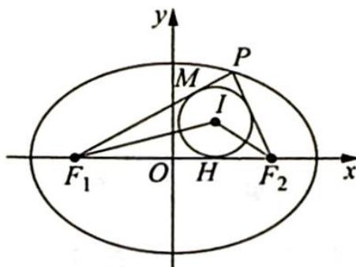
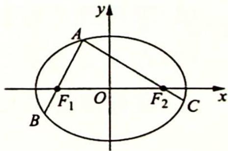
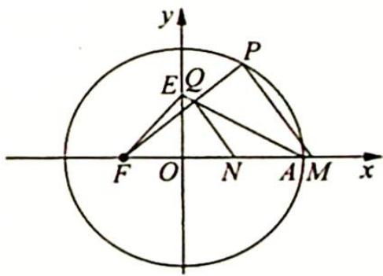

## 17.6 焦点三角形问题

## 研究密钥

在椭圆和双曲线的焦点三角形中,蕴含着很多几何性质,常用定义与解三角形的知识来解决.在全国各地的高考模拟试卷及高考试题中,都曾出现以椭圆和双曲线的焦点三角形为背景的试题,这些试题可以很好地考查考生的逻辑推理能力和运算求解能力.

例 17.17 (2017 年北京大学优特测试数学试题) 设椭圆 $C_{1}: \frac{x^{2}}{a^{2}} + \frac{y^{2}}{b^{2}} = 1 (a > b > 0)$ 的左、右焦点分别为 $F_{1}, F_{2}$ , 离心率为 $\frac{3}{4}$ , 双曲线 $C_{2}: \frac{x^{2}}{m^{2}} - \frac{y^{2}}{n^{2}} = 1 (m, n > 0)$ 的渐近线交椭圆 $C_{1}$ 于点 $P$ , $PF_{1} \perp PF_{2}$ , 则双曲线 $C_{2}$ 的离心率是 ( ).

A. $\sqrt{2}$ B. $\frac{9\sqrt{2}}{8}$ C. $\frac{9\sqrt{2}}{4}$ D. $\frac{3\sqrt{2}}{2}$

分析 ▶ 画图分析,由直角三角形性质可得 $|OP| = \frac{1}{2} |F_1 F_2| = c$ , 根据焦点三角形面积公式, 点 $P$ 的纵坐标也用基本量表示出来, 则渐近线倾斜角的余弦值的倒数可求, 此即双曲线的离心率.

解析 不妨设 a=4, c=3, O 为坐标原点，则 $\left|OP\right|=\frac{1}{2}\left|F_{1}F_{2}\right|=3$ ，记点 P 的纵坐标为 h，根据椭圆的焦点三角形面积公式，有 $\triangle PF_{1}F_{2}$ 的面积 $S=b^{2}\tan\frac{90^{\circ}}{2}=\frac{1}{2}\left|F_{1}F_{2}\right|h$ ，解得 $h=\frac{7}{3}$ ，因此双曲线 $C_{2}$ 的离心率，也即渐近线倾斜角的余弦值的倒数为 $\frac{1}{\sqrt{1-\left(\frac{h}{\left|OP\right|}\right)^{2}}}=$

$\sqrt{\frac{1}{1 - \left(\frac{7}{9}\right)^2}} = \frac{9\sqrt{2}}{8}$ . 故选 B.

变式 1: 已知 $F_{1}, F_{2}$ 是椭圆和双曲线的公共焦点, $P$ 是它们的一个公共点, 且 $\angle F_{1}PF_{2}=\frac{\pi}{3}$ , 则椭圆和双曲线的离心率的倒数之和的最大值为 ( ).

A. $\frac{4\sqrt{3}}{3}$ B. $\frac{2\sqrt{3}}{3}$ C. 3

D. 2

分析 ▶ △ $F_{1}PF_{2}$ 既是椭圆的焦点三角形, 又是双曲线的焦点三角形, 由各自的焦点三角形面积公式可推导出它们离心率之间的关系, 再引入三角变量, 将离心率的倒数之和表示为关于一个角的三角函数式, 这样问题转化为求此三角函数式的最大值.

解析 ▶ 不妨设椭圆的方程为 $\frac{x^{2}}{a_{1}^{2}} + \frac{y^{2}}{b_{1}^{2}} = 1 (a_{1} > b_{1} > 0)$ ，双曲线的方程为 $\frac{x^{2}}{a_{2}^{2}} - \frac{y^{2}}{b_{2}^{2}} = 1 (a_{2} > 0, b_{2} > 0)$ ，根据题目中的已知条件可知 $S_{\triangle PF_{1}F_{2}} = b_{1}^{2} \tan \frac{\pi}{6} = \frac{b_{2}^{2}}{\tan \frac{\pi}{6}}$ ，所以 $b_{1}^{2} = 3b_{2}^{2}$ ，即 $a_{1}^{2} - c^{2} = 3(c^{2} - a_{2}^{2})$ ， $a_{1}^{2} + 3a_{2}^{2} = 4c^{2}$ ， $\frac{1}{e_{1}^{2}} + \frac{3}{e_{2}^{2}} = 4$ 。
设 $\frac{1}{e_{1}} = 2\cos\theta, \frac{\sqrt{3}}{e_{2}} = 2\sin\theta$ ，则 $\frac{1}{e_{1}} + \frac{1}{e_{2}} = 2\cos\theta + \frac{2\sin\theta}{\sqrt{3}} = \frac{4\sqrt{3}}{3}\sin\left(\theta + \frac{\pi}{3}\right)$ ，当 $\theta = \frac{\pi}{6}$ 时， $\frac{1}{e_{1}} + \frac{1}{e_{2}} = \frac{4\sqrt{3}}{3}\sin\left(\theta + \frac{\pi}{3}\right)$ 取得最大值 $\frac{4\sqrt{3}}{3}$ ，且此时由 $\frac{1}{e_{1}} = 2\cos\theta, \frac{\sqrt{3}}{e_{2}} = 2\sin\theta$ ，解得 $e_{1} = \frac{\sqrt{3}}{3}, e_{2} = \sqrt{3}$ ，符合题意。故选 A。

变式(2) 已知椭圆 $\frac{x^{2}}{a^{2}} + \frac{y^{2}}{b^{2}} = 1 (a > b > 0)$ 与双曲线 $\frac{x^{2}}{m^{2}} - \frac{y^{2}}{n^{2}} = 1 (m > 0, n > 0)$ 具有相同焦点 $F_{1}, F_{2}$ ，且在第一象限交于点 P，椭圆与双曲线的离心率分别为 $e_{1}, e_{2}$ ，若 $\angle F_{1}PF_{2} = \frac{\pi}{3}$ ，则 $e_{1}^{2} + e_{2}^{2}$ 的最小值是（）.

A. $\frac{2 + \sqrt{3}}{2}$ B. $2 + \sqrt{3}$ C. $\frac{1 + 2\sqrt{3}}{2}$ D. $\frac{2 + \sqrt{3}}{4}$

分析 ▶ 思路一: 在焦点三角形中利用余弦定理, 将 $e_1^2 + e_2^2$ 表示为关于 $a, m$ 的式子, 应用基本不等式求得最小值; 思路二: $\triangle F_1PF_2$ 既是椭圆也是双曲线的焦点三角形, 由各自的焦点三角形面积公式可推导出它们离心率之间的关系, 再应用基本不等式求最小值.

解析 ▶ 解法一(利用余弦定理): 根据题意, 可知 $|PF_1| + |PF_2| = 2a$ , $|PF_1| - |PF_2| = 2m$ , 解得 $|PF_1| = a + m$ , $|PF_2| = a - m$ .

根据余弦定理, 可知 $(2c)^{2} = (a + m)^{2} + (a - m)^{2} - 2(a + m)(a - m)\cos 60^{\circ}$ , 整理得 $c^{2} = \frac{a^{2} + 3m^{2}}{4}$ , 所以 $e_{1}^{2} + e_{2}^{2} = \frac{c^{2}}{a^{2}} + \frac{c^{2}}{m^{2}} = \frac{a^{2} + 3m^{2}}{4a^{2}} + \frac{a^{2} + 3m^{2}}{4m^{2}} = 1 + \frac{1}{4}\left(\frac{3m^{2}}{a^{2}} + \frac{a^{2}}{m^{2}}\right) \geqslant 1 + \frac{\sqrt{3}}{2} = \frac{2 + \sqrt{3}}{2}$ . 故选 A.

解法二(利用焦点三角形面积公式):根据题目中的已知条件可知 $S_{\triangle PF_{1}F_{2}} = b^{2} \tan \frac{\pi}{6} = \frac{n^{2}}{\tan \frac{\pi}{6}}$ ，所以 $b^{2} = 3n^{2}$ ，即 $a^{2} - c^{2} = 3 (c^{2} - m^{2})$ ， $a^{2} + 3m^{2} = 4c^{2}$ ， $\frac{1}{e_{1}^{2}} + \frac{3}{e_{2}^{2}} = 4$ ，则 $e_{1}^{2} + e_{2}^{2} = \frac{1}{4}(e_{1}^{2} + e_{2}^{2})(\frac{1}{e_{1}^{2}} + \frac{3}{e_{2}^{2}}) = \frac{1}{4}(1 + 3 + \frac{e_{2}^{2}}{e_{1}^{2}} + \frac{3e_{1}^{2}}{e_{2}^{2}}) \geqslant \frac{1}{4}\left(4 + 2\sqrt{\frac{e_{2}^{2}}{e_{1}^{2}} \cdot \frac{3e_{1}^{2}}{e_{2}^{2}}}\right) = \frac{2 + \sqrt{3}}{2}$ .

本题考查的是有关椭圆和双曲线的离心率的问题,涉及的知识点有椭圆和双曲线的定义、余弦定理、椭圆和双曲线的离心率、基本不等式求最小值的问题,正确理解知识点是解题的关键.

例 17.18 设点 P 为椭圆 $C: \frac{x^{2}}{a^{2}} + \frac{y^{2}}{b^{2}} = 1 (a > b > 0)$ 上的动点， $F_{1}, F_{2}$ 为椭圆的两个焦点，点 I 为 $\triangle PF_{1}F_{2}$ 的内心，则直线 $IF_{1}$ 和直线 $IF_{2}$ 的斜率之积（）.
A. 是定值
B. 非定值,但存在最大值
C. 非定值,但存在最小值
D. 非定值,且不存在最值

分析 ▶ 判断直线 $IF_{1}$ 和直线 $IF_{2}$ 的斜率之积的情况, 因此需将此斜率之积的表达式求出来. 圆 $I$ 为 $\triangle PF_{1}F_{2}$ 的内切圆, 借助海伦公式及等面积法, 得出内切圆半径与各切线长之间的关系. 再将 $k_{IF_{1}} \cdot k_{IF_{2}}$ 用各段切线长表示出来, 并进行化简, 看能否进一步转化为基本量之间的关系. 如果用基本量可以表示出来, 则斜率之积为定值; 若表达式中有变化的量, 则斜率之积为非定值.

解析 如图所示, 设 $\triangle PF_{1}F_{2}$ 的内切圆与 $PF_{1}$ 和 $F_{1}F_{2}$ 分别相切于 $M, H$ 两点, 半径为 $r$ , 设 $|PM| = x$ , $|F_{1}H| = y$ , $|F_{2}H| = z$ , 则 $|PF_{1}| = x + y$ , $|PF_{2}| = x + z$ . 由椭圆的定义及题目中条件可得 $|F_{1}F_{2}| = 2c$ , $|PF_{1}| + |PF_{2}| = 2a$ , 所以 $y + z = 2c$ , $2x + y + z = 2a$ , $k_{IF_1} = \tan \angle IF_1H = \frac{r}{y}$ , $k_{IF_2} = -\tan \angle IF_2H = -\frac{r}{z}$ , 即 $k_{IF_1} \cdot k_{IF_2} = -\frac{r^2}{yz}$ .

$\triangle PF_{1}F_{2}$ 的半周长 $p = \frac{1}{2}(2x + 2y + 2z) = x + y + z$ ，根据海伦公式，由等面积法可得

$S_{\triangle PF_{1}F_{2}}=\frac{1}{2}(2x+2y+2z)\cdot r=\sqrt{xyz(x+y+z)}$ ，所以 $r=\sqrt{\frac{xyz}{x+y+z}}$ $k_{IF_{1}} \cdot k_{IF_{2}} = -\frac{r^{2}}{yz} = -\frac{x}{x + y + z} = -\frac{2x}{2x + 2y + 2z} = -\frac{(2x + y + z) - (y + z)}{(2x + y + z) + (y + z)} = -\frac{2a - 2c}{2a + 2c} =$ $-\frac{a-c}{a+c}=-\frac{1-e}{1+e}$ ，其中e为椭圆的离心率.
故选 A.

## 训练 17

1.(2009 重庆卷理 15)已知双曲线 $\frac{x^2}{a^2} - \frac{y^2}{b^2} = 1 (a > 0, b > 0)$ 的左、右焦点分别为 $F_1(-c, 0)$ , $F_2(c, 0)$ , 若双曲线上存在一点 $P$ 使得 $\frac{\sin \angle PF_1 F_2}{\sin \angle PF_2 F_1} = \frac{a}{c}$ , 则该双曲线的离心率的取值范围是 \_\_\_\_.

2.(2012 安徽卷理 9)过抛物线 $y^{2}=4x$ 的焦点 F 作直线交抛物线于 A, B 两点, 点 O 是原点. 若 $|AF|=3$ , 则 $\triangle AOB$ 的面积为 ( ).
A. $\frac{\sqrt{2}}{2}$ B. $\sqrt{2}$ C. $\frac{3\sqrt{2}}{2}$ D. $2\sqrt{2}$

3.(多选)(2015年清华大学自主招生暨领军计划试题)在极坐标系中,下列方程表示的图形是椭圆的有( ).A. $\rho = \frac{1}{\cos\theta + \sin\theta}$ B. $\rho = \frac{1}{2 + \sin\theta}$ C. $\rho = \frac{1}{2 - \cos\theta}$ D. $\rho = \frac{1}{1 + 2\cos\theta}$

4. 如图所示, 设 $F_{1}, F_{2}$ 分别为椭圆 $\frac{x^{2}}{a^{2}} + \frac{y^{2}}{b^{2}} = 1 (a > b > 0)$ 的左、右焦点, 过椭圆上任意一点 $A$ 作椭圆的两条焦点弦 $AB, AC$ , 若 $\overrightarrow{AF_1} = m_1 \overrightarrow{F_1B}, \overrightarrow{AF_2} = m_2 \overrightarrow{F_2C}$ , 求 $m_1 + m_2$ 的值.

5. 如图所示, 已知椭圆 $C: \frac{x^2}{a^2} + \frac{y^2}{b^2} = 1 (a > b > 0)$ 的左、右焦点分别为 $F_1, F_2$ , 过左焦点 $F_1$ 的直线 $l$ 与椭圆 $C$ 相交于 $P, Q$ 两点, 作线段 $PQ$ 的垂直平分线交 $x$ 轴于点 $D$ , 求证: $\frac{|DF_1|}{|PQ|}$ 的值是一个常数.

6.(2018 新课标全国Ⅱ卷理 19)设抛物线 C: $y^{2} = 4x$ 的焦点为 F, 过点 F 且斜率为 k (k > 0) 的直线 l 与抛物线 C 交于 A, B 两点, $|AB| = 8$ .

(1) 求直线 l 的方程；

(2)求过点 $A, B$ 且与抛物线 $C$ 的准线相切的圆的方程.

7.(2013 山东卷理 22)椭圆 $C: \frac{x^2}{a^2} + \frac{y^2}{b^2} = 1 (a > b > 0)$ 的左、右焦点分别是 $F_1, F_2$ , 离心率为 $\frac{\sqrt{3}}{2}$ , 过点 $F_1$ 且垂直于 $x$ 轴的直线被椭圆 $C$ 截得的线段长为 1.

(1)求椭圆 C 的方程;

(2)点 $P$ 是椭圆 $C$ 上除长轴端点外的任意一点, 连接 $PF_{1}, PF_{2}$ , 设 $\angle F_{1}PF_{2}$ 的角平分线 $PM$ 交椭圆 $C$ 的长轴于点 $M(m,0)$ , 求 $m$ 的取值范围.

8.(2016年清华大学夏令营数学试题)已知椭圆的两个焦点为 $F_{1}(-1,0)$ , $F_{2}(1,0)$ ，且椭圆与直线 $y=x-\sqrt{3}$ 相切.

(1)求椭圆的方程；

(2) 过点 $F_{1}$ 作两条互相垂直的直线 $l_{1}, l_{2}$ , 与椭圆分别交于 $P, Q, M, N$ 四点, 求四边形 $PNQM$ 面积的最大值与最小值.

9.(2017 天津卷文 20)如图所示,已知椭圆 $\frac{x^{2}}{a^{2}}+\frac{y^{2}}{b^{2}}=1(a>b>0)$ 的左焦点为 $F(-c,0)$ ,右顶点为A,点E的坐标为(0,c),△EFA的面积为 $\frac{b^{2}}{2}$ .

(1)求椭圆的离心率；

(2)设点 $Q$ 在线段 $AE$ 上, $|FQ| = \frac{3}{2} c$ , 延长线段 $FQ$ 与椭圆交于点 $P$ , 点 $M, N$ 在 $x$ 轴上, $PM \parallel QN$ , 且直线 $PM$ 与直线 $QN$ 间的距离为 $c$ , 四边形 $PQNM$ 的面积为 $3c$ .

(i) 求直线 FP 的斜率；

(ii) 求椭圆的方程.

10.(2016年江西省赣州市高三摸底考试)设椭圆 $C: \frac{x^2}{a^2} + \frac{y^2}{b^2} = 1 (a > b > 0)$ 的左、右焦点分别为 $F_1, F_2$ , 过右焦点 $F_2$ 的直线 $l$ 与椭圆 $C$ 相交于 $P, Q$ 两点, 且 $\triangle PQF_1$ 的周长为短轴长的 $2\sqrt{3}$ 倍.

(1)求椭圆 C 的离心率；

(2)设直线 l 的斜率为 1, 在椭圆 C 上是否存在一点 M, 使得 $\overrightarrow{OM}=2\overrightarrow{OP}+\overrightarrow{OQ}$ ? 若存在, 求出点 M 的坐标; 若不存在, 请说明理由.

# 第 18 讲

# 圆锥曲线中离心率的求解和最值问题

在圆锥曲线中,最值问题和离心率的求解无疑是重要的部分.其中最值问题实质是探求运动变化中的特殊值或临界值,可以与函数、向量、不等式等知识相结合出题,因其考查的知识容量大、分析能力要求高、区分度高而成为高考命题者青睐的热点.除此之外,离心率的求解也是高考的热点问题,多出现在选择题、填空题中,其解题思路灵活,常可多角度多方向求解,同样深受命题者的青睐.

圆锥曲线中的最值与范围问题的类型虽然较多,解法灵活多变,但总体上主要有两种方法:一是利用几何方法,即数形结合,通过利用圆锥曲线的定义、几何性质以及平面几何中的定理、性质等求解;二是利用代数方法,即利用函数方程的思想把需要求解最值的几何量或者代数式表示为某个(些)参数的函数(解析式),然后利用函数、不等式等方法进行求解.在建立函数的过程中要根据题目的其他已知条件,把需要的量都用我们选用的变量表示,有时为了运算方便,在建立关系的过程中也可以采用多个变量,只要在最后结果中将多变量归结为单变量即可,同时要特别注意变量的取值范围.

圆锥曲线中另外一个重点是圆锥曲线离心率的值及其范围. 离心率是反映圆锥曲线几何特征(扁平或开阔程度)的一个数量, 是圆锥曲线的重要几何性质, 也是圆锥曲线“统一定义”的纽带. 这一类试题立意新颖, 构思巧妙, 既有数的本色, 又有形的特性. 解决这类问题, 我们只要抓住圆锥曲线的定义、性质、标准方程及其图形特征, 进行分析、讨论, 就可以很快解决. 除此之外也可用代数的方法, 构造 $a, c$ 的关系 (特别是齐二次式) 求得离心率.

# 圆锥曲线离心率的计算

## 研究密钥

离心率是圆锥曲线中一个重要的几何性质,下面介绍三种常见的解题方向:

(1)构造a,c的齐次式,解出e;

(2) 利用圆锥曲线定义及图形的几何性质求解；

(3)根据圆锥曲线的第二定义 $\frac{|MF_{1}|}{d_{1}}=e,\frac{|MF_{2}|}{d_{2}}=e$ 求解.
