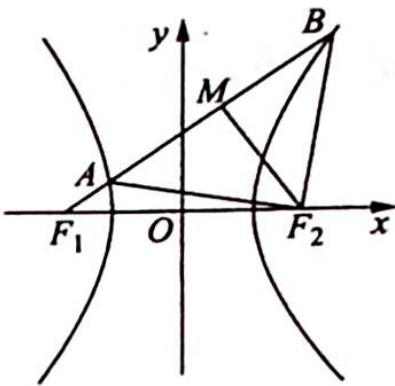

## 18.2 构造齐次式

例 18.2 已知双曲线 $C: \frac{x^2}{a^2} - \frac{y^2}{b^2} = 1 (a > 0, b > 0)$ 的左、右焦点分别为 $F_1, F_2$ ，过 $F_1$ 作斜率为 $\frac{\sqrt{2}}{2}$ 的直线 $l$ 与双曲线 $C$ 的左、右两支分别交于 $A, B$ 两点，若 $|AF_2| = |BF_2|$ ，则双曲线的离心率为（ ）.

A. 2 B. $\sqrt{2}$ C. $\sqrt{5}$ D. $\sqrt{3}$

分析 ▶ 取 AB 中点 M，连接 $F_{2}M$ ，分别找出 $\left|F_{2}M\right|$ 和 $\left|F_{1}M\right|$ 关于 a, b, c 的表达式，再由直线 l 的斜率为 $\frac{\sqrt{2}}{2}$ 得出 a, b, c 的齐次式，即可求出离心率。

解析 如图所示, 因为 $\left|AF_{2}\right|=\left|BF_{2}\right|$ , 则取 AB 中点 M, 连接 $F_{2}M$ , 可得 $F_{2}M \perp AB$ .
设 $\left|AF_{2}\right|=\left|BF_{2}\right|=x$ ，因为 $\left|AF_{2}\right|-\left|AF_{1}\right|=2a$ ，则 $\left|AF_{1}\right|=x-2a$ ，又 $\left|BF_{1}\right|-\left|BF_{2}\right|=$

2a, 则 $\left|BF_{1}\right|=x+2a,\left|AB\right|=\left|BF_{1}\right|-\left|AF_{1}\right|=4a,\left|AM\right|=\left|BM\right|=2a,$ $\left|F_{1}M\right|=x.$

在 Rt△F₁F₂M 中，有 |F₂M| = √4c² - x²；在 Rt△AF₂M 中，有 |F₂M| = √x² - 4a²，所以 √4c² - x² = √x² - 4a²，解得 x² = 2a² + 2c²，又直线 l 的斜率为 √2/2，所以 tan∠MF₁F₂ = |F₂M| / |F₁M| = √2b² / √2a² + 2c² = √2/2，则 c² - a² / a² + c² = 1/2，c² = 3a²。

所以离心率 $e=\sqrt{3}$ ，故选 D.
