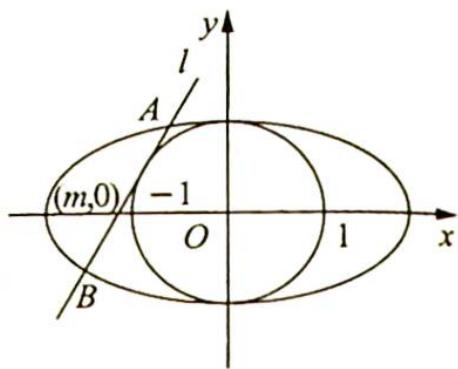

## 18.4 距离最值问题

## 研究密钥

圆锥曲线中有关距离的最值问题一般是利用弦长公式将此距离表示出来,再利用基本不等式或函数的单调性求最值或范围.

弦长公式 $|AB| = \sqrt{1 + k^2} |x_1 - x_2| = \sqrt{1 + k^2}\sqrt{(x_1 + x_2)^2 - 4x_1x_2} = \sqrt{1 + k^2}$ $\sqrt{\left(-\frac{b}{a}\right)^2 - \frac{4c}{a}} = \sqrt{1 + k^2}\frac{\sqrt{\Delta}}{|a|}$ (直线与圆锥曲线联立消去 $y$ 后, 得到的方程记为 $ax^2 + bx + c = 0$ ).

求解时一般利用“曲直联立—消未知数—韦达定理”的解题思路.

例 18.4 已知椭圆 $G: \frac{x^{2}}{4} + y^{2} = 1$ ，过点 $(m,0)$ 作圆 $x^{2} + y^{2} = 1$ 的切线 l 交椭圆 G 于 A, B 两点.

(1) 求椭圆 G 的焦点坐标和离心率；

(2) 将 $\left| AB \right|$ 表示为 m 的函数，并求 $\left| AB \right|$ 的最大值.

分析 ▶ 本题利用“曲直联立—消未知数—韦达定理”的解题套路, 设直线方程为 $l: x = ty + m$ , 结合弦长公式得出 $|AB|$ 关于 $t, m$ 的表达式. 由于 $l$ 为切线, 可得出 $t, m$ 之间的关系, 这样消掉参数 $t$ , 得到 $|AB|$ 关于 $m$ 的表达式, 再求函数最值.

解析 (1) 由已知得 $a = 2, b = 1$ , 所以 $c = \sqrt{a^2 - b^2} = \sqrt{3}$ , 则椭圆 $G$ 的焦点坐标为 $(- \sqrt{3}, 0), (\sqrt{3}, 0)$ , 离心率 $e = \frac{c}{a} = \frac{\sqrt{3}}{2}$ .

(2)如图所示,过点 $(m,0)$ 作圆 $x^{2}+y^{2}=1$ 的切线 $l:x=ty+m,t\in\mathbb{R}$ , $|m|\geqslant1$ ,即x-ty-m=0,d(O,l)= $\frac{|m|}{\sqrt{1+t^{2}}}=1$ ,即 $m^{2}=t^{2}+1$ .

联立 $\left\{ \begin{array}{l} x = ty + m \\ x^2 + 4y^2 = 4 \end{array} \right.$ ，消 $x$ 得 $(ty + m)^2 + 4y^2 - 4 = 0$ ，即 $(t^2 + 4)y^2 +$

$2mty+m^{2}-4=0$ . 设交点 $A(x_{1},y_{1})$ , $B(x_{2},y_{2})$ ，则 $y_{1}+y_{2}=-\frac{2mt}{t^{2}+4}$ , $y_{1}y_{2}=\frac{m^{2}-4}{t^{2}+4}$ , $\Delta=4m^{2}t^{2}-4(t^{2}+4)(m^{2}-4)=16(t^{2}-m^{2}+4)$ .

由弦长公式可得， $|AB|=\sqrt{1+t^{2}}\left|y_{1}-y_{2}\right|=\sqrt{1+t^{2}}\sqrt{(y_{1}+y_{2})^{2}-4y_{1}y_{2}}=\sqrt{1+t^{2}}\frac{\sqrt{\Delta}}{|a|}=$ $\frac{4\sqrt{1+t^{2}}}{t^{2}+4}\sqrt{t^{2}-m^{2}+4}$ .

$$
\text {又} t ^ {2} + 1 = m ^ {2}, \text {故} | A B | = \frac {4 \sqrt {m ^ {2}}}{m ^ {2} + 3} \sqrt {m ^ {2} + 3 - m ^ {2}} = \frac {4 \sqrt {3} | m |}{m ^ {2} + 3} = \frac {4 \sqrt {3}}{| m | + \frac {3}{| m |}}.
$$

$|m|+\frac{3}{|m|}\geqslant2\sqrt{3}$ ，当且仅当 $m=\pm\sqrt{3}$ 时，等号成立，所以 $|AB|\leqslant2$ ，即 $|AB|_{\max}=2$ .

## 解后反思

## 目标函数求最值的处理原则

上述例题中在设直线时用到了两个未知数,通过已知条件得出它们之间的关系,这样就消掉了一个未知数,得到关于一个未知量的目标函数.在设直线方程时,若无直线的任何信息,可以考虑假设 $y = kx + b$ ; 若直线过定点 $(x_0, y_0)$ , 可以考虑利用定点设直线, 且先关注最后需要达到的目标是什么,根据需要达到的目标考虑消参时应该消去 $x$ 还是 $y$ , 这是首要原则. 此外, 在目标不明确的情况下, 若知道直线过定点 $(x_0, 0)$ , 可假设直线为 $x = my + x_0$ ; 若知道直线过定点 $(0, y_0)$ , 可假设直线为 $y = kx + y_0$ , 这是次要原则.

不管何种假设模式,都离不开对参数的讨论.本题的目标函数为“ $\frac{1\text{次}}{2\text{次}}$ ”(分式函数,分子次数为1,分母次数为2)的情形,“ $\frac{1\text{次}}{2\text{次}}$ ”（“ $\frac{2\text{次}}{1\text{次}}$ ”与此类似）型函数求最值处理原则如下:

原则1: 若分子(或分母)以含某一变量的单项式形式出现, 如 $x, x^2$ , 可以考虑直接除以 $x, x^2$ 变形整理, 整理后利用函数单调性或基本不等式解决; 原则2: 若分子(或分母)以含某一变量的一次多项式形式出现, 如 $x + 3, 2x + 1$ 等, 将其视为整体 $t$ , 将目标式转化为关于 $t$ 的式子, 再将分子、分母同时除以 $t$ 后整理, 整理后利用函数单调性或基本不等式解决.

变式(1) 已知椭圆 $C: \frac{x^{2}}{a^{2}} + \frac{y^{2}}{b^{2}} = 1 (a > b > 0)$ 的长轴长是短轴长的 $2\sqrt{2}$ 倍, 且椭圆 $C$ 经过点 $A \left(2, \frac{\sqrt{2}}{2}\right)$ .

(1)求椭圆 C 的方程；

(2)设不与坐标轴平行的直线 l 交椭圆 C 于 M, N 两点, $|MN| = 2\sqrt{2}$ , 记直线 l 在 y 轴上的截距为 m, 求 m 的最值.

解析 (1) 因为 $a = 2\sqrt{2} b$ , 所以椭圆的方程为 $\frac{x^2}{8b^2} + \frac{y^2}{b^2} = 1$ .

把点 $A\left(2, \frac{\sqrt{2}}{2}\right)$ 的坐标代入椭圆的方程，得 $\frac{4}{8b^2} + \frac{1}{2b^2} = 1$ ，所以 $b^2 = 1, a^2 = 8$ ，故椭圆的方程为 $\frac{x^2}{8} + y^2 = 1$ .

(2)设直线 l 的方程为 $y=kx+m(k\neq0)$ , $M(x_{1},y_{1})$ , $N(x_{2},y_{2})$ , 联立方程组 $\left\{\begin{aligned}\frac{x^{2}}{8}+y^{2}&=1\\ y&=kx+m\end{aligned}\right.$ 消去 y 得 $(1 + 8k^{2})x^{2} + 16kmx + 8m^{2} - 8 = 0$ .

由 $256k^{2}m^{2}-32(m^{2}-1)(1+8k^{2})>0$ ，得 $m^{2}<1+8k^{2}$ ，所以 $x_{1}+x_{2}=-\frac{16km}{1+8k^{2}}$ , $x_{1}x_{2}= \frac{8m^{2}-8}{1+8k^{2}}$ ，则 $|MN|=\sqrt{1+k^{2}}\sqrt{(x_{1}+x_{2})^{2}-4x_{1}x_{2}}=\sqrt{1+k^{2}}\sqrt{\left(-\frac{16km}{1+8k^{2}}\right)^{2}-4\times\frac{8m^{2}-8}{1+8k^{2}}}=$ $\frac{4\sqrt{2}\sqrt{1+k^{2}}\sqrt{8k^{2}+1-m^{2}}}{1+8k^{2}}$ 。

由 $\frac{4\sqrt{2}\sqrt{1 + k^2}\sqrt{8k^2 + 1 - m^2}}{1 + 8k^2} = 2\sqrt{2}$ 得， $m^2 = \frac{(8k^2 + 1)(3 - 4k^2)}{4(k^2 + 1)}$ 。

令 $k^2 + 1 = t (t > 1) \Rightarrow k^2 = t - 1$ ，所以 $m^2 = \frac{-32t^2 + 84t - 49}{4t}, m^2 = 21 - \left(8t + \frac{49}{4t}\right) \leqslant 21 - 14\sqrt{2}$ ，即 $\sqrt{7} - \sqrt{14} \leqslant m \leqslant \sqrt{14} - \sqrt{7}$ .

当且仅当 $8t = \frac{49}{4t}$ , 即 $t = \frac{7\sqrt{2}}{8}$ 时, 上式取等号, 此时 $k^2 = \frac{7\sqrt{2} - 8}{8}$ , 满足 $m^2 < 1 + 8k^2$ , 所以 $m$ 的最大值为 $\sqrt{14} - \sqrt{7}$ , 最小值为 $\sqrt{7} - \sqrt{14}$ .

