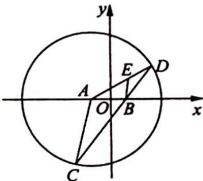

## 18.5 面积最值问题

## 研究密钥

面积的最值问题是圆锥曲线中最常见的一类最值问题. 解题时, 首先需要将面积表达出来, 面积的表达我们以直线与椭圆相交得到的 $\triangle OAB$ 为例, 总结一下高考中常见的三角形面积公式. 对于 $\triangle OAB$ , 有以下四种常见的表达模式:

(1) $S_{\triangle OAB} = \frac{1}{2}|AB||OH|$ (随时随地使用, 需用弦长公式和点到直线距离公式, 因此相对比较繁琐);

(2) $S_{\triangle QAB}=\frac{1}{2}|OM||y_1-y_2|$ (横截距已知的条件下使用, 其中 M 为 AB 与 x 轴的交点);

(3) $S_{\triangle QAB} = \frac{1}{2} |ON||x_1 - x_2|$ (纵截距已知的条件下使用, 其中 $N$ 为 $AB$ 与 $y$ 轴的交点);

(4) $S_{\triangle QAB} = \frac{1}{2} |x_1y_2 - x_2y_1|$ (点的坐标易于表示的条件下使用, 利用正弦定理下的面积公式及向量夹角公式推导可得).

面积表达出来后,接下来就是最值的求解了,需根据表达式的特征分为基本不等式法和函数单调性法,有时还要借助换元和求导法求解.

例 18.5 设过点 $P(0, t) (|t| > 1)$ 的直线与椭圆 $\frac{x^{2}}{3} + \frac{y^{2}}{2} = 1$ 交于点 A, B, 求 $\triangle OAB$ 面积的最大值.

分析 ▶ 既然要求面积的最值,我们先把面积表达出来.因为本题的纵截距已知,所以我们就把面积表示成了 $S_{\triangle OAB} = \frac{1}{2}|t||x_1 - x_2| = \frac{1}{2}|t|\frac{\sqrt{\Delta}}{|a|}$ ,得到面积的函数表达式后再利用基本不等式或函数单调性求最值.

解析 ▶ 由题意知过点 $P(0, t) (|t| > 1)$ 的直线斜率必存在（若不存在，则不构成三角形），故可设其方程为 $y = kx + t$ ，点 $A(x_1, y_1), B(x_2, y_2)$ ，则 $\left\{ \begin{array}{l} y = kx + t \\ 2x^2 + 3y^2 = 6 \end{array} \right.$ ，消去 $y$ 所得方程为 $(3k^2 + 2)x^2 + 6ktx + 3t^2 - 6 = 0$ ①，可得 $\Delta = (6kt)^2 - 4(3k^2 + 2)(3t^2 - 6) = 24(3k^2 + 2 - t^2) > 0$ .

设方程①的两个实数根为 $x_{1}, x_{2}$ , 由韦达定理可得 $x_{1} + x_{2} = -\frac{6kt}{3k^{2} + 2}, x_{1}x_{2} = \frac{3t^{2} - 6}{3k^{2} + 2}$ .

$$
S _ {\triangle O A B} = \frac {1}{2} | t | | x _ {1} - x _ {2} | = \frac {1}{2} | t | \cdot \sqrt {(x _ {1} + x _ {2}) ^ {2} - 4 x _ {1} x _ {2}} = \sqrt {6} \frac {| t | \cdot \sqrt {3 k ^ {2} + 2 - t ^ {2}}}{3 k ^ {2} + 2} \leqslant
$$

$\sqrt{6}\frac{\sqrt{\left(\frac{(3k^{2}+2-t^{2})+t^{2}}{2}\right)^{2}}}{3k^{2}+2}=\frac{\sqrt{6}}{2}$ ，当且仅当 $3k^{2}+2-t^{2}=t^{2}$ ，即 $t^{2}=\frac{3}{2}k^{2}+1$ 时等号成立，所以 $\triangle OAB$ 面积的最大值为 $\frac{\sqrt{6}}{2}$ .

求最值时还可以考虑采用换元的方式处理根号,方法如下:令 $\sqrt{3k^{2}+2-t^{2}}=u>0\Rightarrow3k^{2}+$ $2-t^{2}=u^{2}\Rightarrow3k^{2}+2=t^{2}+u^{2}$ ,则 $S_{\triangle OAB}=\sqrt{6}\frac{|t|\cdot u}{t^{2}+u^{2}}=\frac{\sqrt{6}u}{|t|+\frac{u^{2}}{|t|}}\leqslant\frac{\sqrt{6}u}{2\sqrt{|t|\cdot\frac{u^{2}}{|t|}}}=\frac{\sqrt{6}}{2}$ .

## 关于求面积最值的几点思考

1. 纵观本题, 有两大关键部分: ①面积的表达; ②最值的求解. 其中, 面积表达又有几个关键的小点, 需要同学们认真消化.

(1)判别式的快速书写方法:将椭圆方程 $\frac{x^{2}}{a^{2}}+\frac{y^{2}}{b^{2}}=1$ 与直线 $y=kx+m$ 联立后,得到的关于x的一元二次方程为 $(a^{2}k^{2}+b^{2})x^{2}+(2kma^{2})x+(a^{2}m^{2}-a^{2}b^{2})=0$ ,其中 $\Delta=4a^{2}b^{2}\cdot(a^{2}k^{2}+b^{2}-m^{2})>0$ .

这里需要注意, 直线和曲线的联立没有太多技巧, 而在写判别式的时候, 是可以一步到位的, 因为直线和椭圆联立所得判别式等于“ $4a^{2}b^{2}\cdot$ (二次项系数一直线常数项平方)”。

(2)三角形面积的几种常见表示方法以及使用条件(见研究密钥).

(3)横截距 $\left|x_{1}-x_{2}\right|$ 的公式： $\left|x_{1}-x_{2}\right|=\frac{\sqrt{\Delta}}{\left|a\right|}$ .

2. 本题的结论可以推广到一般情况下: 对于直线 $y = kx + m$ 与椭圆 $\frac{x^2}{a^2} + \frac{y^2}{b^2} = 1$ , 有两个交点 $A, B$ , 则 $(S_{\triangle OAB})_{\max} = \frac{ab}{2}$ . 除了用本题的方法可以证明, 还可以借助“面积叉乘公式+参数方程”来进行处理.

3. 当面积取得最大值的时候, 必有 $x_{1}^{2} + x_{2}^{2}, y_{1}^{2} + y_{2}^{2}$ 为定值, 且 $k_{OA} \cdot k_{OB}$ 为定值 (可以自己去证明, 既可以借助本题的结论, 也可以用参数方程去处理).

4. 注意: 上面所有的公式都是针对三角形有一个顶点在原点的情形. 如果没有顶点在原点, 请同学们根据具体情况, 采取类似的分析方式去得到对应的结果.

例 18.6 已知椭圆 $\frac{x^2}{3} + \frac{y^2}{2} = 1$ 的左、右焦点分别为 $F_1, F_2$ , 过 $F_1$ 的直线交椭圆于 $B, D$ 两点, 过 $F_2$ 的直线交椭圆于 $A, C$ 两点, 且 $AC \perp BD$ , 垂足为 $P$ , 求四边形 $ABCD$ 的面积的最小值.

分析 ▶ 本题已知 $AC \perp BD$ , 所以 $S = \frac{1}{2} |AC||BD|$ , 因此接下来需通过求出 $|AC|$ , $|BD|$ 的长得出面积的目标函数式求最值, 求 $|AC|$ , $|BD|$ 时要分别考虑斜率存在与不存在两种情况.

解析 ▶ 以 $F_{1} F_{2}$ 为直径的圆为 $x^{2} + y^{2} = 1$ , 该圆在椭圆内部, 与椭圆无交点, 所以 $AC \perp$ BD 的垂足 $P$ 必定在椭圆内部.

①当直线 $BD$ 的斜率 $k$ 存在且 $k \neq 0$ 时, 直线 $BD$ 的方程为 $y = k(x + 1)$ , 联立方程 $\left\{ \begin{array}{l} \frac{x^2}{3} + \frac{y^2}{2} = 1 \\ y = k(x + 1) \end{array} \right.$ , 消去 $y$ 整理得 $(3k^2 + 2)x^2 + 6k^2x + 3k^2 - 6 = 0$ .

设 $B(x_{1},y_{1}),D(x_{2},y_{2})$ ，则 $x_{1} + x_{2} = -\frac{6k^{2}}{3k^{2} + 2},x_{1}x_{2} = \frac{3k^{2} - 6}{3k^{2} + 2}$ 故 $|BD| = \sqrt{1 + k^2}$ ： $|x_{1} - x_{2}| = \sqrt{(1 + k^{2})\cdot[(x_{1} + x_{2})^{2} - 4x_{1}x_{2}]} = \frac{4\sqrt{3}(k^{2} + 1)}{3k^{2} + 2}.$

过点 $F_{1}$ 作 $EF \parallel AC$ 交椭圆于 $E, F$ 两点，则 $EF$ 的方程为 $y = -\frac{1}{k} (x + 1)$ ，同理 $|EF| = \frac{4\sqrt{3}\left(\frac{1}{k^2} + 1\right)}{3 \cdot \frac{1}{k^2} + 2} = \frac{4\sqrt{3}(k^2 + 1)}{2k^2 + 3}$ .

因为 EF 与 AC 关于原点中心对称, 所以 $\left|EF\right| = \left|AC\right|$ , 故 $\left|AC\right| = \frac{4\sqrt{3}(k^{2} + 1)}{2k^{2} + 3}$ .

则 $S_{\text{四边形}ABCD} = \frac{1}{2} |BD||AC| = \frac{24(k^2 + 1)^2}{(3k^2 + 2)(2k^2 + 3)} \geqslant \frac{24(k^2 + 1)^2}{\left[\frac{(3k^2 + 2) + (2k^2 + 3)}{2}\right]^2} = \frac{96}{25}$ , 当且仅

当 $3k^{2} + 2 = 2k^{2} + 3$ ，即 $k^2 = 1$ 时取等号.

②当直线 $BD$ 的斜率 $k = 0$ 或斜率不存在时, 易得四边形 $ABCD$ 的面积 $S = \frac{1}{2} \times \frac{4}{\sqrt{3}} \times 2\sqrt{3} = 4$ .

综上所述,四边形 ABCD 面积的最小值为 $\frac{96}{25}$ .

## 评注

面积的最值问题一般有着统一的思路:主要以斜率 k 为变量,根据具体条件建立目标函数,转化为函数的最值问题,然后利用基本不等式、函数单调性等求其最值.在求解过程中,非常关键的一步就是四边形的面积如何表示?四边形的面积可以分解成两个三角形面积之和,也可以用公式 $S=\frac{1}{2}l_{1}l_{2}\sin\alpha$ ,其中 $l_{1}, l_{2}$ 为四边形的对角线, $\alpha$ 为两对角线的夹角.

变式 1 设圆 $x^{2} + y^{2} + 2x - 15 = 0$ 的圆心为 $A$ , 直线 $l$ 过点 $B(1,0)$ 且与 $x$ 轴不重合, $l$ 交圆 $A$ 于 $C, D$ 两点, 过 $B$ 作 $AC$ 的平行线交 $AD$ 于点 $E$ .

(1)证明 $\left| {EA}\right|  + \left| {EB}\right|$ 为定值,并写出点 $E$ 的轨迹方程；

(2)设点 $E$ 的轨迹为曲线 $C_1$ , 直线 $l$ 交 $C_1$ 于 $M, N$ 两点, 过 $B$ 且与 $l$ 垂直的直线与圆 $A$ 交于 $P, Q$ 两点, 求四边形 MPNQ 面积的取值范围.

解析 (1)如图所示,圆A的圆心为A(-1,0),半径R=4.

因为 $BE \parallel AC$ , 所以 $\angle C = \angle EBD$ , 又因为 $AC = AD$ , 所以 $\angle C = \angle EDB$ , 于是 $\angle EBD = \angle EDB$ , 所以 $|EB| = |ED|$ . 故 $|AE| + |EB| = |AE| + |ED| = |AD| = 4$ 为定值.

又 $|AB|=2$ ，点E的轨迹是以A，B为焦点，长轴长为4的椭圆，由c=1，a=2得 $b^{2}=3$ 。

故点 E 的轨迹 $C_{1}$ 的方程为 $\frac{x^{2}}{4} + \frac{y^{2}}{3} = 1$ .

(2) 因为直线 $l$ 与 $x$ 轴不重合, 故可设 $l$ 的方程为 $x = my + 1$ , 过 $B$ 且与 $l$ 垂直的直线方程为 $y = -m(x - 1)$ . 由 $\left\{ \begin{array}{l} \frac{x^2}{4} + \frac{y^2}{3} = 1 \\ x = my + 1 \end{array} \right.$ 得 $(3m^2 + 4)y^2 + 6my - 9 = 0$ .

设 $M(x_{1},y_{1}), N(x_{2},y_{2})$ ，则 $y_{1}+y_{2}=-\frac{6m}{3m^{2}+4}, y_{1}y_{2}=-\frac{9}{3m^{2}+4}$ ，得 $|MN|=\sqrt{m^{2}+1}\cdot\sqrt{\left(-\frac{6m}{3m^{2}+4}\right)^{2}-4\left(-\frac{9}{3m^{2}+4}\right)}=\frac{12(m^{2}+1)}{3m^{2}+4}$ .

由圆的方程 $x^{2}+y^{2}+2x-15=0$ ，得 $(x+1)^{2}+y^{2}=16$ ， $|PQ|=2\sqrt{16-\left(\frac{|-m-m|}{\sqrt{m^{2}+1}}\right)^{2}}=4\sqrt{\frac{3m^{2}+4}{m^{2}+1}}$ .

四边形 MPNQ 的面积 $S=\frac{1}{2}|MN||PQ|=24\sqrt{\frac{m^{2}+1}{3m^{2}+4}}=24\sqrt{\frac{1}{3}-\frac{1}{9m^{2}+12}}$ .

又 $m^2 \geqslant 0$ ，所以 $0 < \frac{1}{9m^2 + 12} \leqslant \frac{1}{12}$ ，故 $12 \leqslant S < 8\sqrt{3}$ ，即四边形 MPNQ 面积的取值范围是 $[12, 8\sqrt{3})$ 。

变式(2) 已知椭圆 $N: \frac{x^{2}}{a^{2}} + \frac{y^{2}}{b^{2}} = 1 (a > b > 0)$ 经过点 $C(0,1)$ , 且离心率为 $\frac{\sqrt{2}}{2}$ .

(1)求椭圆 N 的方程；

(2) 若 $A, B$ 在椭圆 $N$ 上, 且四边形 $CADB$ 是矩形, 求矩形 $CADB$ 面积 $S$ 的最大值.

分析 运用矩形的几何性质将四边形的面积分解成两个三角形面积之和即 $S_{CADB}=2S_{\triangle CAB}$ ，若题设中给出四边形的对角线的弦长的情形下也可以用公式 $S=\frac{1}{2}l_{1}l_{2}\sin\alpha$ 求解，其中 $l_{1}, l_{2}$ 为四边形的对角线，α 为两对角线的夹角。面积的最值问题一般有着统一的思路，主要以斜率 k 为变量，根据具体条件建立目标函数，转化为函数的最值问题，然后利用基本不等式、函数单调性等求其最值。

解析 (1)由题意可得 $b = 1, \frac{c}{a} = \frac{\sqrt{2}}{2}$ ，则 $c = 1, a = \sqrt{2}$ ，所以所求椭圆方程为 $\frac{x^2}{2} + y^2 = 1$ .

(2)由题意知,直线AB不垂直于x轴,设AB:y=kx+m,联立 $\left\{\begin{aligned}y&=kx+m\\ \frac{x^{2}}{2}&+y^{2}=1\end{aligned}\right.$ ,消去y整理得

$$
(2 k ^ {2} + 1) x ^ {2} + 4 k m x + 2 m ^ {2} - 2 = 0, \Delta = 8 (2 k ^ {2} + 1 - m ^ {2}) > 0.
$$

设 $A(x_{1},y_{1}),B(x_{2},y_{2})$ ，则 $x_{1} + x_{2} = \frac{-4km}{2k^{2} + 1},x_{1}x_{2} = \frac{2m^{2} - 2}{2k^{2} + 1}.$

又因为 $\overrightarrow{CA} = (x_1, y_1 - 1), \overrightarrow{CB} = (x_2, y_2 - 1)$ ，所以 $\overrightarrow{CA} \cdot \overrightarrow{CB} = x_1x_2 + (y_1 - 1)(y_2 - 1) = x_1x_2 + (kx_1 + m - 1)(kx_2 + m - 1) = (1 + k^2)x_1x_2 + k(m - 1)(x_1 + x_2) + (m - 1)^2 = (1 + k^2) \cdot \frac{2m^2 - 2}{2k^2 + 1} + k(m - 1) \cdot \frac{-4km}{2k^2 + 1} + (m - 1)^2 = 0.$

化简可得 $(m - 1)(3m + 1) = 0$ ，解得 $m = -\frac{1}{3} (m = 1$ 舍去），所以 $|x_{1} - x_{2}| = \sqrt{(x_{1} + x_{2})^{2} - 4x_{1}x_{2}} = \frac{4}{3}\frac{\sqrt{9k^{2} + 4}}{2k^{2} + 1}.$

设 $\sqrt{9k^2 + 4} = t (t \geqslant 2)$ , 则 $|x_1 - x_2| = \frac{12t}{2t^2 + 1}$ . 令 $f(t) = \frac{12t}{2t^2 + 1} (t \geqslant 2)$ , 因为 $f'(t) = \frac{12 - 24t^2}{(2t^2 + 1)^2} < 0$ , 所以 $f(t)$ 在 $[2, +\infty)$ 上单调递减, $|x_1 - x_2|_{\max} = f(2) = \frac{8}{3}$ .

设直线 $AB: y = kx - \frac{1}{3}$ 与 $y$ 轴交于点 $E$ , 则 $S_{CADB} = 2 \times \frac{1}{2} \times |CE| \cdot |x_1 - x_2| = \frac{4}{3}|x_1 - x_2|$ , 所以矩形 $CADB$ 的面积最大值为 $\frac{4}{3} \times \frac{8}{3} = \frac{32}{9}$ .

## 评注

在求解弦长和面积的最值问题中, 注意解题的灵活性, 当求最值用基本不等式失败时, 应及时回头, 改用函数单调性求解. 比如此题解法中求 $f(t)$ 的最大值, 如果考虑到分子、分母同时除以 $t$ , 再对分母运用基本不等式, 发现等号不能成立. 这时要改变方法, 像解析中通过求导得到单调性, 也可以直接利用对勾函数 $y = x + \frac{k}{x} (k > 0)$ 的性质求解. 这一点需要在平时解题中不断积累经验, 只有不断磨合总结, 才能形成以不变应万变的解题技能.
