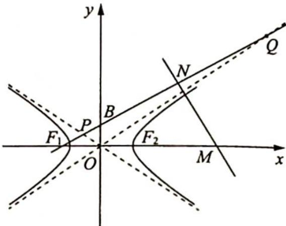
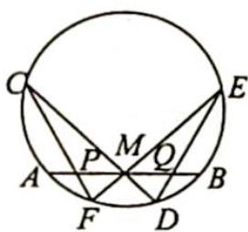
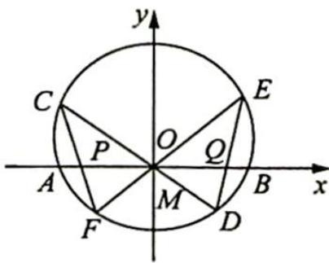

## 19.10 曲线系及其应用

## 研究密钥

圆、椭圆、双曲线、抛物线统称为“二次曲线”，两条相交直线被视为二次曲线的退化形式。二次曲线系的一般形式为： $Ax^{2}+By^{2}+Cxy+Dx+Ey+F=0$ 。

两条直线所组成的二次曲线方程为: $(A_{1}x+B_{1}y+C_{1})(A_{2}x+B_{2}y+C_{2})=0.$

过二次曲线 $f(x, y) = 0$ 和二次曲线 $g(x, y) = 0$ 的交点的二次曲线系，可以记为 $f(x, y) + \lambda g(x, y) = 0$ 或 $\lambda f(x, y) + \mu g(x, y) = 0$ .

例 19.11 已知抛物线 $y^{2}=2x$ 及点 $P(1,1)$ ，过点 P 的不重合的直线 $l_{1}, l_{2}$ 与抛物线分别交于点 A, B, C, D。证明：A, B, C, D 四点共圆的充要条件是直线 $l_{1}, l_{2}$ 的倾斜角互补。

分析 ▶ 充分性: 直线 $l_{1}, l_{2}$ 的倾斜角互补 $\Leftrightarrow$ 直线 $l_{1}, l_{2}$ 的斜率互为相反数, 设 $l_{1,2}: y - 1 =$ ±k(x-1)，则过A，B，C，D的二次曲线可以表示为 $(y-1)^{2}-k^{2}(x-1)^{2}+\lambda(y^{2}-2x)=0$ 。只有满足 $D^{2}+E^{2}-4F>0$ ， $x^{2}+y^{2}+Dx+Ey+F=0$ 才表示圆，所以将 $(y-1)^{2}-k^{2}(x-1)^{2}+\lambda(y^{2}-2x)=0$ 展开，合并同类项，把 $x^{2},y^{2}$ 的系数化为1，计算 $D^{2}+E^{2}-4F$ 。必要性：设 $l_{1,2}$ ： $y-1=k_{i}(x-1)$ ，i=1,2，则过A，B，C，D的二次曲线可以表示为 $[(y-1)-k_{1}(x-1)][(y-1)-k_{2}(x-1)]+\lambda(y^{2}-2x)=0$ ，表示一个圆，即展开以后不含二次交叉项，二次交叉项系数为0，可得直线 $l_{1},l_{2}$ 的斜率的关系。

解析 ▶（充分性）设 $l_{1,2}: y-1=\pm k(x-1)$ ，将其合并为二次曲线，即 $(y-1)^{2}-k^{2}(x-1)^{2}=0$ ，于是 A, B, C, D 所在的二次曲线可写为 $(y-1)^{2}-k^{2}(x-1)^{2}+\lambda(y^{2}-2x)=0$ ，整理得 $y^{2}-2y+1-k^{2}(x^{2}-2x+1)+\lambda y^{2}-2\lambda x=0,(1+\lambda)y^{2}-k^{2}x^{2}+2k^{2}x-2\lambda x-2y+1-k^{2}=0$ ， $(1+\lambda)y^{2}-k^{2}x^{2}+2(k^{2}-\lambda)x-2y+1-k^{2}=0$ .

取 $1 + \lambda = -k^2$ ，即 $\lambda = -1 - k^2$ ，上述方程为 $-k^2 y^2 - k^2 x^2 + 2(2k^2 + 1)x - 2y + 1 - k^2 = 0$ ，即 $k^2 x^2 + k^2 y^2 - 2(2k^2 + 1)x + 2y + k^2 - 1 = 0 (k \neq 0), x^2 + y^2 - 2\left(2 + \frac{1}{k^2}\right)x + \frac{2}{k^2}y + 1 - \frac{1}{k^2} = 0$ ，满足 $D^2 + E^2 - 4F = 4\left(2 + \frac{1}{k^2}\right)^2 + \frac{4}{k^4} - 4\left(1 - \frac{1}{k^2}\right) = \frac{8}{k^4} + \frac{20}{k^2} + 12 > 0.$

因此方程 $x^{2} + y^{2} - 2\left(2 + \frac{1}{k^{2}}\right)x + \frac{2}{k^{2}}y + 1 - \frac{1}{k^{2}} = 0$ 表示一个圆，即 $A, B, C, D$ 四点共圆.

（必要性）设 $l_{1,2}: y - 1 = k_i (x - 1), i = 1, 2$ ，仍将其合并为二次曲线，则 $[(y - 1) - k_1(x - 1)][(y - 1) - k_2(x - 1)] = 0$ .

由共圆可知, 存在 $\lambda \in \mathbf{R}$ , 使得 $[(y - 1) - k_1(x - 1)][(y - 1) - k_2(x - 1)] + \lambda (y^2 - 2x) = 0$ 表示一个圆, 展开得 $(y - 1)^2 + k_1k_2(x - 1)^2 + \lambda (y^2 - 2x) - (k_1 + k_2)(x - 1)(y - 1) = 0$ , 亦即 $k_1k_2(x - 1)^2 + (y - 1)^2 + \lambda (y^2 - 2x) + (k_1 + k_2)(x + y - 1) - (k_1 + k_2)xy = 0$ .

又因圆的方程不含二次交叉项, 故有 $k_{1} + k_{2} = 0$ , 即 $l_{1}, l_{2}$ 的斜率互为相反数, 也即直线 $l_{1}, l_{2}$ 的倾斜角互补. 得证.

例 19.12 $F_{1}, F_{2}$ 分别是双曲线 $C: \frac{x^{2}}{a^{2}} - \frac{y^{2}}{b^{2}} = 1 (a > 0, b > 0)$ 的左、右焦点， $B$ 是虚轴的端点，直线 $F_{1} B$ 与双曲线 $C$ 的两条渐近线分别交于 $P, Q$ 两点，线段 $PQ$ 的垂直平分线与 $x$ 轴交于点 $M$ . 若 $|MF_{2}| = |F_{1} F_{2}|$ ，则 $C$ 的离心率是（ ）.

A. $\frac{2 \sqrt{3}}{3}$ B. $\frac{\sqrt{6}}{2}$ C. $\sqrt{2}$ D. $\sqrt{3}$

分析 ▶ 设 PQ 的中点 $N(x_{0}, y_{0})$ , MN 是直线 PQ 的垂直平分线, 则 $k_{MN} = -\frac{1}{k_{PQ}} = -\frac{1}{k_{BF_{1}}}$ .

由题意可得 $\left|MF_{2}\right|=\left|F_{1}F_{2}\right|=2c$ ，所以 $M(3c,0)$ ，而点N的坐标可以由点P,Q的坐标确定, 因为 $P, Q$ 是直线 $F_{1}B$ 与双曲线的两条渐近线的交点, 将两条渐近线可合并为二次曲线, 与直线 $F_{1}B$ 的方程联立, 由韦达定理可以求出 $x_{P} + x_{Q}$ , 所以 $x_{0} = \frac{x_{P} + x_{Q}}{2}$ , 代入直线 $F_{1}B$ 的方程可得 $y_{0}$ , 根据 $M, N$ 两点的坐标也可以表示出 $k_{MN}$ . 用两种方式表示 $k_{MN}$ 可以得到一个方程, 只要方程两边是齐次的, 就可以求出离心率.

解析 如图所示,由题意设 $c = \sqrt{a^2 + b^2}$ , 直线 $F_1B: \frac{x}{-c} + \frac{y}{b} = 1$ , 设 $P, Q$ 中点为 $N(x_0, y_0)$ 以及 $P(x_1, y_1), Q(x_2, y_2)$ , 则 $k_{MN} = -\frac{c}{b}$ .

不难知道, 两条渐近线 $y = \pm \frac{b}{a} x$ 可合并为二次曲线 $a^2y^2 - b^2x^2 = 0$ , 其与 $F_1B$ 联立, 可得 $a^2\left(\frac{b}{c} x + b\right)^2 - b^2x^2 = 0$ , 化简后即得

$b^{2}x^{2}-2a^{2}cx-a^{2}c^{2}=0$ ，由韦达定理及 $x_{0}=\frac{x_{1}+x_{2}}{2}$ ，可得 $x_{0}=\frac{a^{2}c}{b^{2}}$ ，进而 $y_{0}=\frac{b}{c}x_{0}+b=\frac{c^{2}}{b}$ .

由于点 M 显然不与点 $F_{1}$ 重合, 故由条件有 $M(3c,0)$ , 于是 $k_{MN}=\frac{y_{0}-0}{x_{0}-3c}=\frac{bc}{a^{2}-3b^{2}}$ .

又由 $MN$ 是直线 $PQ$ 的垂直平分线, 可知 $k_{MN} = -\frac{c}{b}$ , 故得 $\frac{bc}{a^2 - 3b^2} = -\frac{c}{b}$ , 解得 $a^2 = 2b^2$ , 因此 $e = \frac{\sqrt{6}}{2}$ , 故选 B.

例 19.13 (蝴蝶定理) 如图所示, 设 AB 是已知圆的弦, M 是 AB 的中点, 弦 CD, EF 过点 M, 弦 CF, ED 与 AB 分别相交于 P, Q 两点. 求证: PM = MQ.

分析 ▶ 以 M 为坐标原点, 弦 AB 所在直线为 x 轴, 建立平面直角坐标系.

则直线 $CD, EF$ 可合并为二次曲线, 再与圆组成二次曲线系方程, 因为 $C, D, E, F$ 四点都在曲线系方程上, 所以四边形 CFDE 的四条边上的点都满足曲线系方程, 将 $y = 0$ 代入曲线系方程, 即可求出 $P, Q$ 的横坐标.

解析 如图所示, 以 $M$ 为坐标原点, 弦 $A B$ 所在直线为 $x$ 轴, 视圆 $O$ 为单位圆, 建立直角坐标系.

设圆 O 的方程为 $x^{2}+(y-a)^{2}=1$ ，直线 CD, EF 的方程为 $y=k_{1}x, y=k_{2}x$ ，由于圆和直线组成的二次曲线系方程为 $\mu[x^{2}+(y-a)^{2}-1]+\lambda(y-k_{1}x)(y-k_{2}x)=0.$

令 $y = 0$ ，则 $x_{P}, x_{Q}$ 满足方程 $(\mu + \lambda k_{1} k_{2}) x^{2} + \mu (a^{2} - 1) = 0$ ，由于 $x$ 的一次项的系数为 0，则 $x_{P} + x_{Q} = 0$ ，即 $x_{P} = -x_{Q}$ ，故 $|PM| = |QM|$ .

变式(1) (蝴蝶定理的推广)在圆锥曲线中, 过弦 $AB$ 的中点 $M$ 任作两条弦 $CD$ 和 $EF$ , 直

线 CE 与 DF 交直线 AB 于点 P, Q, 则有 $\left|MP\right| = \left|MQ\right|$ .

解析 如图所示,以 M 为原点,AB 所在的直线为 y 轴,建立直角坐标系.

设圆锥曲线的方程为: $Ax^{2} + Bxy + Cy^{2} + Dx + Ey + F = 0$ (\*).

设 $A(0, t), B(0, -t)$ , 可知 $t, -t$ 是 $Cy^2 + Ey + F = 0$ 的两个根, 所以 $E = 0$ .

若 $CD, EF$ 有一条斜率不存在, 则点 $P, Q$ 与点 $A, B$ 重合, 结论成立.

若 $CD, EF$ 斜率都存在，设 $C(x_{1}, k_{1}x_{1}), D(x_{2}, k_{1}x_{2}), E(x_{3}, k_{2}x_{3}), F(x_{4}, k_{2}x_{4}), P(0, p)$ ，

$$
Q (0, q)
$$

$$
C E: y = \frac {k _ {2} x _ {3} - k _ {1} x _ {1}}{x _ {3} - x _ {1}} \cdot (x - x _ {1}) + k _ {1} x _ {1}, p = \frac {k _ {2} x _ {3} - k _ {1} x _ {1}}{x _ {3} - x _ {1}} \cdot (0 - x _ {1}) + k _ {1} x _ {1} =
$$

$$
\frac {x _ {1} x _ {3} \left(k _ {1} - k _ {2}\right)}{x _ {3} - x _ {1}}
$$

$$
q = \frac {x _ {2} x _ {4} (k _ {1} - k _ {2})}{x _ {4} - x _ {2}}
$$

$$
p + q = \frac {\left(k _ {1} - k _ {2}\right) \left[ x _ {3} x _ {4} \left(x _ {1} + x _ {2}\right) - x _ {1} x _ {2} \left(x _ {3} + x _ {4}\right) \right]}{\left(x _ {4} - x _ {2}\right) \left(x _ {3} - x _ {1}\right)}
$$

将 $y = k_{1}x$ 代入（ $*$ ）得 $(A + Bk_{1} + Ck_{1}^{2})x^{2} + (D + Ek_{1})x + F = 0$ ，由 $E = 0$ ，得 $x_{1} + x_{2} = \frac{-D}{A + Bk_{1} + Ck_{1}^{2}}, x_{1}x_{2} = \frac{F}{A + Bk_{1} + Ck_{1}^{2}}.$

同理 $x_{3} + x_{4} = \frac{-D}{A + Bk_{2} + Ck_{2}^{2}}, x_{3}x_{4} = \frac{F}{A + Bk_{2} + Ck_{2}^{2}}$ ，所以 $p + q = 0$ ，即 $|MP| = |MQ|$ .

例 19.14 设 b > a > 0，过两定点 A(a,0)，B(b,0)，分别引直线 l 和 m，使与抛物线 $y^{2} = x$ 有四个不同的交点，当这四点共圆时，求 l 和 m 的交点 P 的轨迹。

分析 ▶ 设 $P(x_{0}, y_{0})$ ，已知点 A, B 的坐标可得直线 PA, PB 的方程，将直线 PA, PB 合并为二次曲线，再与抛物线方程合并为二次曲线系方程，要使得曲线系方程表示圆，只要与标准的圆的方程比较系数即可。

解析 设 $P(x_{0}, y_{0})$ ，则 $PA: y = \frac{y_{0}}{x_{0} - a} (x - a)$ ， $PB: y = \frac{y_{0}}{x_{0} - b} (x - b)$ .

将两直线 $PA, PB$ 合并为二次曲线: $\left[y - \frac{y_0}{x_0 - a} (x - a)\right] \cdot \left[y - \frac{y_0}{x_0 - b} (x - b)\right] = 0$ .

又抛物线方程为 $y^{2}-x=0$ ，则过四个点的二次曲线系方程为 $\lambda\left[y-\frac{y_{0}}{x_{0}-a}(x-a)\right]\cdot\left[y-\frac{y_{0}}{x_{0}-b}(x-b)\right]+\mu(y^{2}-x)=0(*)$ .

因为四个交点共圆, 则方程 \* 表示圆, 四点必满足方程: $(x - x_{1})^{2} + (y - y_{1})^{2} - r^{2} = 0(x_{1}, y_{1}, r$ 为常数), 于是 $\lambda \left[y - \frac{y_{0}}{x_{0} - a}(x - a)\right] \cdot \left[y - \frac{y_{0}}{x_{0} - b}(x - b)\right] + \mu (y^{2} - x) = (x - x_{1})^{2} + (y - y_{1})^{2} - r^{2}$ , 对比两侧 $xy$ 项的系数, 可得 $\lambda \left[-\frac{y_{0}}{x_{0} - a} - \frac{y_{0}}{x_{0} - b}\right] = 0$ , 所以 $x_{0} = \frac{a + b}{2}$ , 即点 $P$ 的轨迹是直线 $x = \frac{a + b}{2}$ (除去与 $y = 0$ 和 $y^{2} = x$ 的三个交点).

## 高考数学 培优40讲

## 解析几何

## 评注

本题借助曲线系方程,巧妙利用“四点共圆”的已知条件,成功避开了求交点的繁杂过程.需要注意的是,在对比系数时,不必找出所有项的系数,我们只要找出其中最好用的即可.本例中,由于圆方程的特点:没有 $xy$ 项,即 $xy$ 项系数为 0 ,故对比 $xy$ 项的系数即可得到结果.

## 训练 19

1. 如图所示, 在平面直角坐标系中, 点 $M(x_0, y_0)$ 在椭圆 $C: \frac{x^2}{a^2} + \frac{y^2}{b^2} = 1 (a > b > 0)$ 上, 从原点 $O$ 向圆 $M: (x - x_0)^2 + (y - y_0)^2 = r^2$ 作两条切线分别与椭圆 $C$ 交于点 $P, Q$ , 若直线 $OP, OQ$ 的

$$
k _ {1} k _ {2} = - \frac {b ^ {2}}{a ^ {2}}
$$

$$
k _ {1}, k _ {2}
$$

(1) 求证: $|OP|^2 + |OQ|^2 = a^2 + b^2$ ;

(2) 求证: $r^2 = \frac{a^2b^2}{a^2 + b^2}$ .

2. 已知椭圆 $C: \frac{x^2}{a^2} + \frac{y^2}{b^2} = 1 (a > b > 0)$ 的左、右焦点分别为 $F_1, F_2$ , 离心率为 $\frac{\sqrt{6}}{3}$ , 直线 $x = \sqrt{2}$ 被 $C$ 截得的线段长为 $\frac{2\sqrt{3}}{3}$ .

(1)求 $C$ 的方程；

(2) 若 $A$ 和 $B$ 为椭圆 $C$ 上在 $x$ 轴同侧的两点, 且 $\overrightarrow{AF_2} = \lambda \overrightarrow{BF_1}$ , 求四边形 $ABF_1F_2$ 面积的最大值及此时 $\lambda$ 的值.

3. 已知 $AB, CD$ 是椭圆 $\frac{x^2}{a^2} + \frac{y^2}{b^2} = 1$ 的两条相交弦, 若直线 $AB, CD$ 的倾斜角互补, 求证: $A, B, C$ , $D$ 四点共圆.

4. 已知过椭圆 $\frac{x^{2}}{a^{2}} + \frac{y^{2}}{b^{2}} = 1$ 的一个焦点 F，作两条相互垂直的弦 AB, CD.

(1)证明: $\frac{1}{|FA|} + \frac{1}{|FB|}$ 为定值及 $\frac{1}{|AB|} + \frac{1}{|CD|}$ 为定值;

(2)求 $|AB| + |CD|$ 及 $|AB||CD|$ 的最小值.

5. 如图所示, 椭圆 $x^{2} + \frac{y^{2}}{4} = 1$ 短轴的左右两个端点分别为 $A, B$ , 直线 $l: y = kx + 1$ 与 $x$ 轴, $y$ 轴分别交于两点 $E, F$ , 与椭圆交于两点 $C, D$ .

(1) 若 $\overrightarrow{CE} = \overrightarrow{FD}$ ，求直线 l 的方程；

(2)设直线 $AD, CB$ 的斜率分别为 $k_{1}, k_{2}$ , 若 $k_{1}: k_{2} = 2: 1$ , 求 $k$ 的值.

6. 已知椭圆 $C$ 的左焦点为 $F_{1}(-1,0)$ , 上顶点为 $A$ , 且 $\angle AF_{1}O = 60^{\circ}$ .

(1)求椭圆 C 的方程；

(2)过点 $A$ 作斜率为 $k_{1}, k_{2} (k_{1} \cdot k_{2} \neq 0)$ 的两条直线分别交 $C$ 于 $M, N$ 两点, 证明: 当 $k_{2} = \frac{k_{1}}{k_{1} - 1}$ 时, 直线 $MN$ 过定点.

仿射变换
