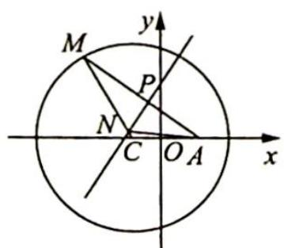
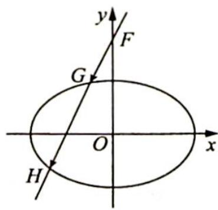

<!-- question-source:start -->
[3]{2}, 2)$ .

变式(1) 已知圆 $C: (x+1)^{2} + y^{2} = 8$ , 定点 $A(1,0), M$ 为圆上一动点, 点 $P$ 为 $A M$ 中点, $A M$ 的垂直平分线 $P N$ 交线段 $C M$ 于点 $N$ .

(1)求点 N 运动轨迹 E 的方程；

(2)若过 $F(0,2)$ 的直线交曲线 $\pmb{E}$ 于不同的两点 $G,H(G$ 在 $F,H$ 之间),且满足 $\overrightarrow{FG} = \lambda \overrightarrow{FH}$ , 求实数 $\lambda$ 的取值范围.

解析 ▶ (1)如图1所示,由题意得 $NC + NA = NM + NC = CM = 2\sqrt{2} > 2 = |CA|$ , 所以点 N 的轨迹是以 A, C 为焦点, $2\sqrt{2}$ 为长轴长的椭圆, 故 $E: \frac{x^{2}}{2} + y^{2} = 1$ .

(2)①当直线 $GH$ 斜率不存在时, $G(0,1), H(0,-1), \overrightarrow{FG} = (0,-1), \overrightarrow{FH} = (0,-3)$ , $\lambda = \frac{1}{3}$ .

②当直线 $GH$ 的斜率存在时, 由椭圆的对称性可设 $y = kx + 2 (k > 0)$ , 代入 $\frac{x^2}{2} + y^2 = 1$ , 消去 $y$ ,

整理得 $(1 + 2k^{2})x^{2} + 8kx + 6 = 0, \Delta = 64k^{2} - 24(1 + 2k^{2}) > 0$ ，解得 $k^{2} > \frac{3}{2}$ .

解法一（设而求）：如图2所示，令 $G(x_{1},y_{1})$

图 1

图2

$H(x_{2},y_{2})$ ，则 $x_{1} = \lambda x_{2}$ ，所以 $\lambda = \frac{x_1}{x_2} = \frac{-8k + \sqrt{16k^2 - 24}}{-8k - \sqrt{16k^2 - 24}} = \frac{2 - \sqrt{1 - \frac{3}{2k^2}}}{2 + \sqrt{1 - \frac{3}{2k^2}}}.$

令 $t = \sqrt{1 - \frac{3}{2k^2}}$ ，则 $t\in (0,1)$ ，所以 $\lambda = \frac{2 - t}{2 + t} = \frac{4}{2 + t} -1\in \left(\frac{1}{3},1\right).$

综上所述， $\lambda \in \left[\frac{1}{3}, 1\right)$ .

解法二(设而不求): 令 $G(x_{1}, y_{1}), H(x_{2}, y_{2})$ , 则 $x_{1} + x_{2} = \frac{-8k}{1 + 2k^{2}}, x_{1}x_{2} = \frac{6}{1 + 2k^{2}}$ . 又 $\overrightarrow{FG} = \lambda \overrightarrow{FH}$ , 故 $x_{1} = \lambda x_{2}, \lambda = \frac{x_{1}}{x_{2}}$ , 所以 $\frac{(x_{1} + x_{2})^{2}}{x_{1}x_{2}} = \frac{x_{1}}{x_{2}} + 2 + \frac{x_{2}}{x_{1}} = \lambda + \frac{1}{\lambda} + 2 = \frac{64k^{2}}{6(1 + 2k^{2})} = \frac{16}{3} - \frac{16}{3(1 + 2k^{2})}$ .

又 $k^{2} > \frac{3}{2}$ , 所以 $1 + 2k^{2} > 4, \frac{(x_{1} + x_{2})^{2}}{x_{1}x_{2}} \in (4, \frac{16}{3})$ , 即 $\lambda + \frac{1}{\lambda} + 2 \in (4, \frac{16}{3})$ , 解得 $\lambda \in (\frac{1}{3}, 1)$ .

综上所述, $\lambda \in [\frac{1}{3}, 1)$ .
<!-- question-source:end -->

![[Q00016413A1]]
