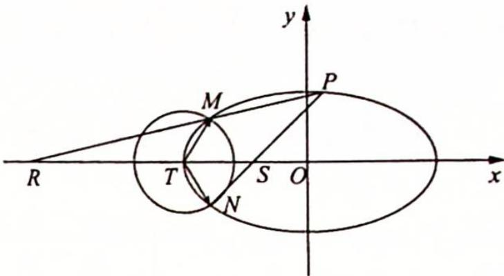
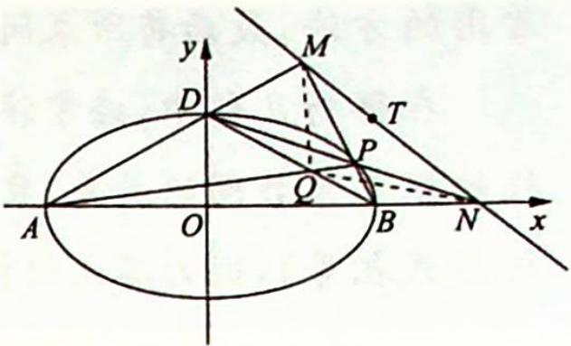

## 19.2 设点消元

## 研究密钥

动点 $P$ 在椭圆 $\frac{x^{2}}{a^{2}}+\frac{y^{2}}{b^{2}}=1(a>b>0)$ 上, 则点 $P$ 一般有以下三种方法消元.

(1) 设 $P(x_0, y_0)$ , 则 $\frac{x_0^2}{a^2} + \frac{y_0^2}{b^2} = 1$ , 故 $y_0^2 = -\frac{b^2}{a^2}(x_0 + a)(x_0 - a)$ , 同时 $\frac{y_0}{x_0 + a} \cdot \frac{y_0}{x_0 - a} = -\frac{b^2}{a^2}, \frac{a^2y_0}{x_0 - a} = \frac{b^2(x_0 + a)}{-y_0}$ ;

(2) $P(a\cos\theta,b\sin\theta),\theta\in[0,2\pi)$ ，三角消元；

(3) $P(\rho\cos\theta,\rho\sin\theta)$ ，极坐标设点，三角消元.

例 19.2 如图所示, 已知椭圆 $C: \frac{x^2}{a^2} + \frac{y^2}{b^2} = 1 (a > b > 0)$ 的离心率为 $\frac{\sqrt{3}}{2}$ , 以椭圆 $C$ 的左顶点 $T$ 为圆心作圆 $T: (x + 2)^2 + y^2 = r^2 (r > 0)$ , 设圆 $T$ 与椭圆 $C$ 交于点 $M, N$ .

(1) 求椭圆 C 的方程；

(2) 求 $\overrightarrow{TM} \cdot \overrightarrow{TN}$ 的最小值，并求此时圆 T 的方程；

(3) 设点 $P$ 是椭圆 $C$ 上异于 $M, N$ 的任意一点, 且直线 $MP, NP$ 分别与 $x$ 轴交于点 $R, S, O$ 为坐标原点, 求证: $|OR||OS|$ 为定值.

分析 |OR||OS|⇔ $x_{R}\cdot x_{S}$ ←直线 PM,PN 的方程⇐P,M,N. 第一步:设出 P,M,N 坐标,并表示直线 PM,PN 的方程;第二步:求得两条直线与 x 轴交点的横坐标 $x_{R},x_{S}$ ;第三步:计算 $x_{R}x_{S}$ .

解析 ▶ 圆 T 的圆心 $T(-2,0)$ ，即 a=2，由 $e=\frac{c}{a}=\frac{\sqrt{3}}{2}$ ，得 $c=\sqrt{3}$ ，故 $b^{2}=a^{2}-c^{2}=1$ ，所以椭圆 C 的方程为 $\frac{x^{2}}{4}+y^{2}=1$ 。

(2)本题关键是点 $M$ 的设取, 一般而言, 椭圆上的点有两种设法: 直角坐标形式 $M(x_0, y_0)$ 或三角参数形式 $M(2\cos \theta, \sin \theta)$ .

解法一(设点的直角坐标形式):由圆与椭圆关于x轴对称可得M,N关于x轴对称.

设 $M(x_0, y_0)$ ，则 $N(x_0, -y_0)$ ，且 $\frac{x_0^2}{4} + y_0^2 = 1$ .

由 $T(-2,0)$ 可得 $\overrightarrow{TM} = (x_0 + 2,y_0),\overrightarrow{TN} = (x_0 + 2, - y_0)$ ，所以 $\overrightarrow{TM}\cdot \overrightarrow{TN} = (x_0 + 2)^2 -$ $y_0^2 = (x_0 + 2)^2 +\frac{x_0^2}{4} -1 = \frac{5}{4} x_0^2 +4x_0 + 3 = \frac{5}{4}\left(x_0 + \frac{8}{5}\right)^2 -\frac{1}{5}.$

因为 M 在椭圆上(非长轴顶点)，所以 $-2 < x_{0} < 2$ ，故当 $x_{0} = -\frac{8}{5}$ 时， $(\overrightarrow{TM} \cdot \overrightarrow{TN})_{\min} = -\frac{1}{5}$ ，
将 $x_{0}=-\frac{8}{5}$ 代入椭圆可得 $y_{0}=\frac{3}{5}$ ，即 $M\left(-\frac{8}{5},\frac{3}{5}\right)$ ，圆的半径 $r=\sqrt{\left(-\frac{8}{5}+2\right)^{2}+\left(\frac{3}{5}\right)^{2}}=\frac{\sqrt{13}}{5}$ .

故圆 T 的方程为 $(x+2)^{2}+y^{2}=\frac{13}{25}$ .

解法二(设点的参数方程形式): 设 $M(2\cos\alpha, \sin\alpha)$ , $\alpha \in (0, \pi)$ , 则 $N(2\cos\alpha, -\sin\alpha)$ .

由 $T(-2,0)$ 可得： $\overrightarrow{TM} \cdot \overrightarrow{TN} = (2\cos\alpha + 2, \sin\alpha) \cdot (2\cos\alpha + 2, -\sin\alpha) = 5\cos^{2}\alpha + 8\cos\alpha + 3.$

当 $\cos \alpha = -\frac{4}{5} \in (-1, 1)$ 时， $(\overrightarrow{TM} \cdot \overrightarrow{TN})_{\min} = -\frac{1}{5}$ ，将 $\cos \alpha = -\frac{4}{5}$ 代入椭圆方程可得 $\sin \alpha = \frac{3}{5}$ ，即 $M\left(-\frac{8}{5}, \frac{3}{5}\right)$ ，圆的半径 $r = \sqrt{\left(-\frac{8}{5} + 2\right)^2 + \left(\frac{3}{5}\right)^2} = \frac{\sqrt{13}}{5}$ .

故圆 T 的方程为 $(x+2)^{2} + y^{2} = \frac{13}{25}$ .

(3)解法一(设点的直角坐标形式): 设 $P(x_{1}, y_{1})$ ，由 $M(x_{0}, y_{0})$ ， $-2 < x_{0} < 2$ ， $N(x_{0}, -y_{0})$ ，得 $MP: y - y_{1} = \frac{y_{1} - y_{0}}{x_{1} - x_{0}} (x - x_{1})$ ，令 y = 0，解得 $x_{R} = \frac{x_{0} y_{1} - x_{1} y_{0}}{y_{1} - y_{0}}$ .

同理可解得 NP 与 x 轴的交点 S 的横坐标 $x_{S}=\frac{x_{0}y_{1}+x_{1}y_{0}}{y_{1}+y_{0}}$ ，所以 $|OR||OS|=$ $\left|x_{R}\right|\left|x_{S}\right|=\left|x_{R}x_{S}\right|=\left|\frac{x_{0}y_{1}-x_{1}y_{0}}{y_{1}-y_{0}}\cdot\frac{x_{0}y_{1}+x_{1}y_{0}}{y_{1}+y_{0}}\right|=\left|\frac{x_{0}^{2}y_{1}^{2}-x_{1}^{2}y_{0}^{2}}{y_{1}^{2}-y_{0}^{2}}\right|$ ①.

因为 $P(x_{1},y_{1})$ , $M(x_{0},y_{0})$ 均在椭圆上，则 $\left\{\begin{aligned}\frac{x_{0}^{2}}{4}+y_{0}^{2}&=1\\ \frac{x_{1}^{2}}{4}+y_{1}^{2}&=1\end{aligned}\right.$ ，即 $\left\{\begin{aligned}x_{0}^{2}&=4-4y_{0}^{2}\\ x_{1}^{2}&=4-4y_{1}^{2}\end{aligned}\right.$ ，代入到①可得 $|OR||OS|=\left|\frac{x_{0}^{2}y_{1}^{2}-x_{1}^{2}y_{0}^{2}}{y_{1}^{2}-y_{0}^{2}}\right|=\left|\frac{(4-4y_{0}^{2})y_{1}^{2}-(4-4y_{1}^{2})y_{0}^{2}}{y_{1}^{2}-y_{0}^{2}}\right|=\left|\frac{4y_{1}^{2}-4y_{0}^{2}}{y_{1}^{2}-y_{0}^{2}}\right|=4.$

所以 $|OR||OS|=4$ ，即为定值。

解法二（设点的参数方程形式）：设 $P(2\cos \beta, \sin \beta), M(2\cos \alpha, \sin \alpha), \alpha \in (0, \pi)$ ， $N(2\cos \alpha, -\sin \alpha)$ ，则 $MP: y - \sin \beta = \frac{\sin \beta - \sin \alpha}{2\cos \beta - 2\cos \alpha} (x - 2\cos \beta)$ .

令 $y = 0$ ，解得 $x_{R} = \frac{2\cos\alpha\sin\beta - 2\cos\beta\sin\alpha}{\sin\beta - \sin\alpha} = \frac{2\sin(\beta - \alpha)}{\sin\beta - \sin\alpha}$ ，同理可解得 $NP$ 与 $x$ 轴的交点 $S$ 的横坐标 $x_{S} = \frac{2\sin(\beta + \alpha)}{\sin\beta + \sin\alpha}$ ，所以 $|OR||OS| = |x_{R}x_{S}| = \left|\frac{2\sin(\beta - \alpha)}{\sin\beta - \sin\alpha} \cdot \frac{2\sin(\beta + \alpha)}{\sin\beta + \sin\alpha}\right| = \left|\frac{4\sin(\beta - \alpha)\sin(\beta + \alpha)}{\sin^2\beta - \sin^2\alpha}\right| = 4.$ （注：利用积化和差公式及二倍角公式可得， $\sin (\beta - \alpha) \cdot \sin (\beta + \alpha) = \sin^2\beta - \sin^2\alpha$ ）

所以 $|OR||OS|=4$ ，即为定值.

变式(1) 设椭圆 $C: \frac{x^2}{a^2} + \frac{y^2}{b^2} = 1 (a > b > 0)$ 的左、右顶点分别为 $A, B$ , 上顶点为 $D$ , 点 $P$ 是椭圆 $C$ 上异于顶点的动点, 已知椭圆的离心率 $e = \frac{\sqrt{3}}{2}$ , 短轴长为 2.

(1)求椭圆 C 的方程；

(2)若直线 $AD$ 与直线 $BP$ 交于点 $M$ , 直线 $DP$ 与 $x$ 轴交于点 $N$ , 求证: 直线 $MN$ 恒过某定点, 并求出该定点.

解析 (1) 因为 $2b = 2$ , 所以 $b = 1$ , 又 $e = \frac{c}{a} = \frac{\sqrt{3}}{2}$ , 所以 $a = 2, c = \sqrt{3}$ , 故椭圆 $C$ 的方程为 $\frac{x^2}{4} + y^2 = 1$ .

(2)如图所示,设 $P(x_0,y_0)$ , 则 $\frac{x_0^2}{4} + y_0^2 = 1 (x_0y_0 \neq 0)$ .

直线 $AD: y = \frac{1}{2} x + 1$ ①; 直线 $BP: y = \frac{y_0}{x_0 - 2} (x - 2)$ ②.

联立①②, 解得 $x_M = \frac{2x_0 + 4y_0 - 4}{2y_0 - x_0 + 2}, y_M = \frac{4y_0}{2y_0 - x_0 + 2}$ , 直线 $DP: y = \frac{y_0 - 1}{x_0} x + 1$ , 令 $y = 0$ , 得 $x_N = \frac{x_0}{1 - y_0}$ .

所以直线 $MN: \frac{y}{x - x_N} = \frac{y_M - y_N}{x_M - x_N} \Leftrightarrow (x_M - x_N)y = (y_M - y_N)(x - x_N)$ ，即 $\left(\frac{2x_0 + 4(y_0 - 1)}{2(y_0 + 1) - x_0} - \frac{x_0}{1 - y_0}\right)y = \frac{4y_0}{2y_0 - x_0 + 2}\left(x - \frac{x_0}{1 - y_0}\right)$ ，又 $x_0^2 + 4y_0^2 = 4$ ，化简得 $(2y_0 + x_0 - 2)y = (y_0 - 1)x + x_0 \Leftrightarrow (y_0 - 1)(2y - x) + x_0(y - 1) = 0$ 。

令 y=1，则 x=2。故直线 MN 恒过点 T(2,1)。

## 评注

本题亦可设线处理: $l_{PB}: y = k_1(x - 2), l_{PD}: y = k_2x + 1$ . 可找 $k_1, k_2$ 的关系. 另利用极点、极线: 连接 $BD, AP$ 交于点 $Q$ , 则 $MN$ 是点 $Q$ 关于椭圆 $C$ 的极线, 因为点 $Q$ 在定直线 $BD: y = -\frac{1}{2}x + 1$ 上, 故直线 $MN$ 过定点 $T$ 为极线 $BD$ 关于椭圆 $C$ 的极点, 即 $\frac{x_0x}{4} + y_0y = 1 \Leftrightarrow x + 2y - 2 = 0$ , 所以 $x_0 = 2, y_0 = 1$ . 故 $T(2,1)$ .

## 对称与非对称
