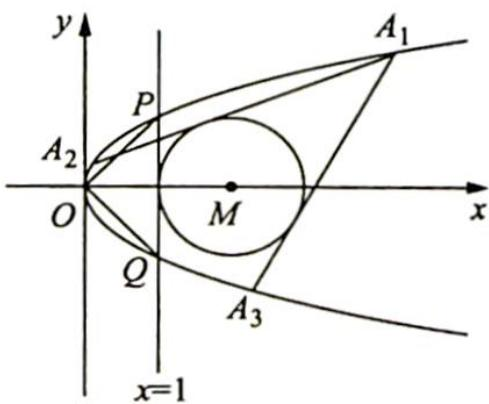

## 19.3 对称结构的简化计算

## 研究密钥

对称是一个数学概念,不仅仅指图形的对称关系,而是泛指某些对象在有些方面如图形、关系、地位等同,彼此相对又相称,对称是一种非常重要的数学思想.很多题目利用对称思想解决,不仅简洁灵巧,而且可以迅速降低题目难度,省去繁杂重复的计算过程.

如果在处于同等地位的两个变量构成的方程组中,各方程的结构都是相同的,那么这两个变量可以看作是同一个方程的两个根,在这种情况下使用韦达定理得到根与系数的关系是常用的方法,最后将所求问题向两根关系转化就可以快速解决问题.

在解析几何中,经常涉及直线与二次曲线的交点问题,在计算过程中往往要用到二次方程的根与系数间的关系,且相应的目标式是二元轮换对称式(将两个变量对调位置以后式子与原式相等),因为二元轮换对称式都可以转换成两个变量的和与积的混合运算.

例 19.3 (2021 新课标全国甲卷理 20) 抛物线 C 的顶点为坐标原点 O，焦点在 x 轴上，直线 l: x=1 交 C 于 P, Q 两点，且 $OP \perp OQ$ . 已知点 $M(2,0)$ ，且 $\odot M$ 与 l 相切.

(1) 求 $C, \odot M$ 的方程；

(2) 设 $A_{1}, A_{2}, A_{3}$ 是 $C$ 上的三个点, 直线 $A_{1}A_{2}, A_{1}A_{3}$ 均与 $\odot M$ 相切, 判断直线 $A_{2}A_{3}$ 与 $\odot M$ 的位置关系, 并说明理由.

分析 ▶ (1)根据题意可得△POQ是等腰直角三角形,所以抛物线 $y^{2}=2px$ 过点(1,1),代入解得p.点M(2,0)到直线l的距离为1,所以⊙M是以(2,0)为圆心,1为半径的圆.(2)设A $(y_{1}^{2},y_{1})$ ,B $(y_{2}^{2},y_{2})$ ,C $(y_{3}^{2},y_{3})$ ,直线A $_{1}$ A $_{2}$ ,A $_{1}$ A $_{3}$ 均与⊙M相切⇔直线A $_{1}$ A $_{2}$ ,A $_{1}$ A $_{3}$ 到圆心M(2,0)的距离为1,可以得到结构相同的两个方程,将结构相同的部分抽象为同一个方程,则y $_{2}$ ,y $_{3}$ 是该方程的两个根,根据韦达定理可得两根关系,代入圆心M(2,0)到直线A $_{2}$ A $_{3}$ 的距离公式中求出距离,与半径作比较就可以判断直线A $_{2}$ A $_{3}$ 与⊙M的位置关系.

解析 (1)抛物线 $y^{2} = 2px$ 过点(1,1)，得 $2p = 1$ ，即抛物线 $C: y^{2} = x, \odot M: (x - 2)^{2} + y^{2} = 1$ .

(2)如图所示,设 $A(y_{1}^{2},y_{1}),B(y_{2}^{2},y_{2}),C(y_{3}^{2},y_{3}),A_{1}A_{3}:x - (y_{1} + y_{3})y + y_{1}y_{3} = 0,A_{1}A_{2}$ $x - (y_{1} + y_{2})y + y_{1}y_{2} = 0,A_{2}A_{3}:x - (y_{2} + y_{3})y + y_{2}y_{3} = 0,d(M,A_{1}A_{2}) = \frac{|2 + y_{1}y_{2}|}{\sqrt{1 + (y_{1} + y_{2})^{2}}} = 1,$

$d(M,A_{1}A_{3}) = \frac{|2 + y_{1}y_{3}|}{\sqrt{1 + (y_{1} + y_{3})^{2}}} = 1$ ，即 $(2 + y_1y_2)^2 = 1 + (y_1 + y_2)^2$

$(2 + y_{1}y_{3})^{2} = 1 + (y_{1} + y_{3})^{2}$ ，则 $y_{2},y_{3}$ 是方程 $(2 + y_1y)^2 = 1 + (y_1 + y)^2$

的两根，即 $(y_{1}^{2} - 1)y^{2} + 2y_{1}y + 3 - y_{1}^{2} = 0,\left\{ \begin{array}{l}y_{2} + y_{3} = \frac{-2y_{1}}{y_{1}^{2} - 1}\\ y_{2}y_{3} = \frac{3 - y_{1}^{2}}{y_{1}^{2} - 1} \end{array} \right.$

因此 $d(M, A_2A_3) = \frac{|2 + y_2y_3|}{\sqrt{1 + (y_2 + y_3)^2}} = \frac{\left|2 + \frac{3 - y_1^2}{y_1^2 - 1}\right|}{\sqrt{1 + \left(\frac{-2y_1}{y_1^2 - 1}\right)^2}} = \frac{\left|\frac{y_1^2 + 1}{y_1^2 - 1}\right|}{\left|\frac{y_1^2 + 1}{y_1^2 - 1}\right|} = 1 = r$ ，故直线

$A_{2}A_{3}$ 与 $\odot M$ 相切.

变式(1) 如图所示,抛物线 $y^{2} = 2px$ 的内接三角形有两边与抛物线 $x^{2} = 2qy$ 相切,证明:

这个三角形的第三边也与 $x^{2}=2qy$ 相切.

解析 ▶ 设 $A_{1}\left(\frac{y_{1}^{2}}{2p},y_{1}\right)$ , $A_{2}\left(\frac{y_{2}^{2}}{2p},y_{2}\right)$ , $A_{3}\left(\frac{y_{3}^{2}}{2p},y_{3}\right)$ ( $y_{1},y_{2},y_{3}$ 均不相同), $A_{1}A_{2}:\frac{y-y_{1}}{y_{2}-y_{1}}=\frac{x-\frac{y_{1}^{2}}{2p}}{\frac{y_{2}^{2}-y_{1}^{2}}{2p}}=\frac{2px-y_{1}^{2}}{y_{2}^{2}-y_{1}^{2}}$ , 即 $(y-y_{1})(y_{2}+y_{1})=2px-y_{1}^{2}$ , 得 $(y_{1}+y_{2})y-y_{1}^{2}-y_{1}y_{2}=2px-y_{1}^{2}$ , 因此 $2px-(y_{1}+y_{2})y+y_{1}y_{2}=0$ , 同理 $A_{1}A_{3}:2px-(y_{1}+y_{3})y+y_{1}y_{3}=0$ , $A_{2}A_{3}:2px-(y_{2}+y_{3})y+y_{2}y_{3}=0$ .

直线 $A_{1}A_{2}$ 与抛物线 $x^{2}=2qy$ 相切，则 $\left\{\begin{aligned}&2px-(y_{1}+y_{2})y+y_{1}y_{2}=0\\&x^{2}=2qy\end{aligned}\right.$ ，消 y 建立关于 x 的一元二次方程，可得 $2px-(y_{1}+y_{2})\cdot\frac{x^{2}}{2q}+y_{1}y_{2}=0,\Delta=4p^{2}+4\times(y_{1}+y_{2})\cdot\frac{1}{2q}\cdot y_{1}y_{2}=0$ ，即 $4p^{2}+\frac{2}{q}\cdot(y_{1}+y_{2})y_{1}y_{2}=0$ ，得 $2p^{2}q+(y_{1}+y_{2})y_{1}y_{2}=0$ 。同理有 $2p^{2}q+(y_{1}+y_{3})y_{1}y_{3}=0$ ，则 $y_{2}$ 和 $y_{3}$ 是方程 $2p^{2}q+(y_{1}+y)y_{1}y=0$ 的两根，也即 $y_{1}y^{2}+y_{1}^{2}y+2p^{2}q=0$ 的两根，那么 $y_{2}+y_{3}=-y_{1},y_{2}y_{3}=\frac{2p^{2}q}{y_{1}}$ 。

则 $2p^{2}q + (y_{2} + y_{3})y_{2}y_{3} = 2p^{2}q + (-y_{1})\cdot \frac{2p^{2}q}{y_{1}} = 0$ ，即 $\Delta = 0$ ，故直线 $A_{2}A_{3}$ 与抛物线 $x^{2} = 2qy$ 相切.
