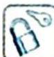
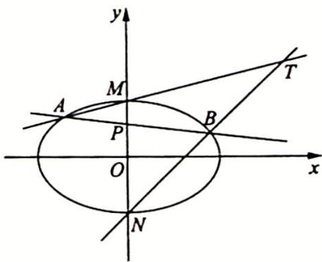

## 19.4 非对称问题的处理策略

## 研究密钥

在解析几何中,时常也会碰到相关的目标式子不是简单的关于 $x_{1}, x_{2}$ (或 $y_{1}, y_{2}$ ) 的和或积的轮换式子,此时就不能通过简单的代换来解决.在这种情况下如何有效地将问题解决,有时就会陷入困境.接下来将尝试通过举例说明解决此类问题的方法.

例 19.4 已知点 A, B 分别是椭圆 $E: \frac{x^{2}}{4} + y^{2} = 1$ 的右、上顶点，与直线 AB 平行的直线 l 交椭圆 E 于点 C, D，记直线 AC, BD 的斜率分别为 $k_{1}, k_{2}$ ，求 $k_{1}k_{2}$ 的值.

分析 ▶ 设点 $C(x_{1}, y_{1})$ , $D(x_{2}, y_{2})$ , $k_{1}k_{2} = \frac{y_{1}}{x_{1}-2} \cdot \frac{y_{2}-1}{x_{2}} = \frac{y_{1}(y_{2}-1)}{(x_{1}-2)x_{2}}$ ，目标式不是轮换对称式，要想求出 $k_{1}k_{2}$ 的值，就需要使得分子和分母可以约分化简。为此可尝试将 $y_{1}, y_{2}$ 用 $x_{1}, x_{2}$ 表示，或将 $x_{1}, x_{2}$ 用 $y_{1}, y_{2}$ 表示，使得分子和分母可以约分化简。

解析 解法一: 设点 $C(x_1, y_1), D(x_2, y_2)$ , 则点 $A(2,0), B(0,1), k_{AB} = -\frac{1}{2} = k_{CD} = \frac{y_1 - y_2}{x_1 - x_2}$ .

由点 $C(x_1, y_1), D(x_2, y_2)$ 均在椭圆 $\frac{x^2}{4} + y^2 = 1$ 上, 可得 $\left\{ \begin{array}{l} \frac{x_1^2}{4} + y_1^2 = 1 \\ \frac{x_2^2}{4} + y_2^2 = 1 \end{array} \right.$ , 两式相减并整理得 $\frac{y_1 - y_2}{x_1 - x_2} \cdot \frac{y_1 + y_2}{x_1 + x_2} = -\frac{1}{4}$ .

又 $\frac{y_1 - y_2}{x_1 - x_2} = -\frac{1}{2}$ , 于是有 $\frac{y_1 + y_2}{x_1 + x_2} = \frac{1}{2}$ , 即有 $\left\{ \begin{array}{l} y_1 - y_2 = -\frac{1}{2}(x_1 - x_2) \\ y_1 + y_2 = \frac{1}{2}(x_1 + x_2) \end{array} \right.$ , 由此解得 $\left\{ \begin{array}{l} y_1 = \frac{1}{2}x_2 \\ y_2 = \frac{1}{2}x_1 \end{array} \right.$ .

因此 $k_1k_2 = \frac{y_1}{x_1 - 2} \cdot \frac{y_2 - 1}{x_2} = \frac{\frac{1}{2}x_2\left(\frac{1}{2}x_1 - 1\right)}{(x_1 - 2)x_2} = \frac{(x_1 - 2)x_2}{4(x_1 - 2)x_2} = \frac{1}{4}$ .

解法二: 依题意得 $k_{AB} = -\frac{1}{2} = k_{CD}$ . 设直线 $CD$ 的方程为 $y = -\frac{1}{2}x + t (t \neq 1)$ , 点 $C(x_1, y_1)$ , $D(x_2, y_2)$ , 则由 $\left\{ \begin{array}{l} y = -\frac{1}{2}x + t \\ \frac{x^2}{4} + y^2 = 1 \end{array} \right.$ , 消去 $y$ 得 $x^2 + 4\left(-\frac{1}{2}x + t\right)^2 - 4 = 0$ , 即 $x^2 - 2tx + 2(t^2 - 1) = 0$ . $x_1 + x_2 = 2t, t = \frac{1}{2}(x_1 + x_2), y_1 = -\frac{1}{2}x_1 + t = -\frac{1}{2}x_1 + \frac{1}{2}(x_1 + x_2) = \frac{1}{2}x_2, y_2 - 1 = (-\frac{1}{2}x_2 + t) - 1 = -\frac{1}{2}x_2 + \frac{1}{2}(x_1 + x_2) - 1 = \frac{1}{2}x_1 - 1 = \frac{1}{2}(x_1 - 2), k_1k_2 = \frac{y_1}{x_1 - 2} \cdot \frac{y_2 - 1}{x_2} = \frac{y_1(y_2 - 1)}{(x_1 - 2)x_2} = \frac{\frac{1}{4}(x_1 - 2)x_2}{(x_1 - 2)x_2} = \frac{1}{4}$ .

解法一是充分利用点 $C(x_{1}, y_{1}), D(x_{2}, y_{2})$ 均在椭圆 $\frac{x^{2}}{4} + y^{2} = 1$ 上的条件以及斜率公式, 类似于“点差法”的操作, 将点 $C, D$ 的纵坐标与横坐标间的关系找到, 由此得出答案. 解法二比较常规, 只是在利用 $x_{1} x_{2}$ 与 $x_{1} + x_{2}$ 间的关系时, 灵活地进行了代换, 从而达到简化运算的目的.

变式(1) 已知 $A, B$ 分别是椭圆 $E: \frac{x^2}{16} + \frac{y^2}{4} = 1$ 的左、右顶点, 过点 $M(-2,0)$ 作斜率为 $k (k \neq 0)$ 的直线 $l$ 交 $E$ 于点 $C, D$ . 记直线 $AC, BD$ 的斜率分别为 $k_1, k_2$ , 求 $\frac{k_1}{k_2}$ 的值.

分析 ▶ 思路一:此类问题在处理时,通常考虑将直线 l 的方程代入椭圆方程,进行消元,再由二次方程的根与系数间的关系,得出两个交点 C,D 的横(或纵)坐标 $x_{1}, x_{2}$ (或 $y_{1}, y_{2}$ ) 间的关系,再结合斜率公式,得到 $\frac{k_{1}}{k_{2}}$ 的表示式,最后通过代换并化简得出结论.思路二:依据点 $C(x_{1}, y_{1})$ 或 $D(x_{2}, y_{2})$ 在椭圆 $\frac{x^{2}}{16} + \frac{y^{2}}{4} = 1$ 上,将 $\frac{x_{2} - 4}{y_{2}}$ 或 $\frac{y_{1}}{x_{1} + 4}$ 进行转化,从而将目标式化为关于 $x_{1}, x_{2}$ (或 $y_{1}, y_{2}$ ) 对称的式子.

解析 ▶ 设点 $C(x_{1},y_{1}),D(x_{2},y_{2})$ ，由已知得直线 $l$ 的方程为 $y = k(x + 2)$

则由 $\left\{\begin{aligned}y=k(x+2)\\x^{2}+4y^{2}=16\end{aligned}\right.$ 消去y得 $x^{2}+4k^{2}(x+2)^{2}=16$ ，即 $(1+4k^{2})x^{2}+16k^{2}x+16(k^{2}-1)=0$ ， $x_{1}+x_{2}=-\frac{16k^{2}}{4k^{2}+1}$ ， $x_{1}x_{2}=\frac{16(k^{2}-1)}{4k^{2}+1}$ ， $\frac{k_{1}}{k_{2}}=\frac{y_{1}}{x_{1}+4}\cdot\frac{x_{2}-4}{y_{2}}=\frac{k(x_{1}+2)(x_{2}-4)}{k(x_{1}+4)(x_{2}+2)}=$ $\frac{x_{1}x_{2}-4x_{1}+2x_{2}-8}{x_{1}x_{2}+2x_{1}+4x_{2}+8}$ （此式就是一个关于 $x_{1},x_{2}$ 非对称的式子，不能简单地将 $x_{1}+x_{2}$ 与 $x_{1}x_{2}$ 代入其中解决问题）.

解法一：设 $x_{1}x_{2} = m(x_{1} + x_{2}) + n$ ，则有 $16(k^{2} - 1) = -16mk^{2} + (4k^{2} + 1)n = (-16m + 4n)k^{2} + n$ ，于是有 $\left\{ \begin{array}{l} - 16m + 4n = 16 \\ n = -16 \end{array} \right.$ ，即 $m = -5, n = -16, x_{1}x_{2} = -5(x_{1} + x_{2}) - 16.$

$$
\frac {k _ {1}}{k _ {2}} = \frac {x _ {1} x _ {2} - 4 x _ {1} + 2 x _ {2} - 8}{x _ {1} x _ {2} + 2 x _ {1} + 4 x _ {2} + 8} = \frac {- 5 (x _ {1} + x _ {2}) - 4 x _ {1} + 2 x _ {2} - 2 4}{- 5 (x _ {1} + x _ {2}) + 2 x _ {1} + 4 x _ {2} - 8} = \frac {- 3 (3 x _ {1} + x _ {2} + 8)}{- (3 x _ {1} + x _ {2} + 8)} = 3, \text {即} \frac {k _ {1}}{k _ {2}} = 3.
$$

解法二： $\frac{k_{1}}{k_{2}}=\frac{\left[x_{1}x_{2}-4\left(x_{1}+x_{2}\right)-8\right]+6x_{2}}{\left[x_{1}x_{2}+2\left(x_{1}+x_{2}\right)+8\right]+2x_{2}}=\frac{\frac{16\left(k^{2}-1\right)+64k^{2}-8\left(4k^{2}+1\right)}{4k^{2}+1}+6x_{2}}{\frac{16\left(k^{2}-1\right)-32k^{2}+8\left(4k^{2}+1\right)}{4k^{2}+1}+2x_{2}}=$

$$
\frac {\frac {2 4 (2 k ^ {2} - 1)}{4 k ^ {2} + 1} + 6 x _ {2}}{\frac {8 (2 k ^ {2} - 1)}{4 k ^ {2} + 1} + 2 x _ {2}} = \frac {3 \left[ \frac {8 (2 k ^ {2} - 1)}{4 k ^ {2} + 1} + 2 x _ {2} \right]}{\frac {8 (2 k ^ {2} - 1)}{4 k ^ {2} + 1} + 2 x _ {2}} = 3.
$$

解法三: 由解法一可知, $-4k^{2}(x_{1}+2)(x_{2}+2)=-4k^{2}[x_{1}x_{2}+2(x_{1}+x_{2})+4]=-4k^{2}\cdot\frac{16(k^{2}-1)-32k^{2}+4(4k^{2}+1)}{4k^{2}+1}=\frac{48k^{2}}{4k^{2}+1}$ .

$$
(x _ {1} + 4) (x _ {2} + 4) = x _ {1} x _ {2} + 4 (x _ {1} + x _ {2}) + 1 6 = \frac {1 6 (k ^ {2} - 1) - 6 4 k ^ {2} + 1 6 (4 k ^ {2} + 1)}{4 k ^ {2} + 1} = \frac {1 6 k ^ {2}}{4 k ^ {2} + 1}.
$$

由点 $D(x_{2},y_{2})$ 在椭圆 $\frac{x^2}{16} +\frac{y^2}{4} = 1$ 上，得 $\frac{x_2^2}{16} +\frac{y_2^2}{4} = 1$ ，即有 $\frac{x_2 - 4}{y_2} = -\frac{4y_2}{x_2 + 4}$ 因此 $\frac{k_1}{k_2} = \frac{y_1}{x_1 + 4}$ $\frac{x_2 - 4}{y_2} = \frac{-4y_1y_2}{(x_1 + 4)(x_2 + 4)} = \frac{-4k^2(x_1 + 2)(x_2 + 2)}{(x_1 + 4)(x_2 + 4)} = \frac{-4k^2[2(x_1 + x_2) + x_1x_2 + 4]}{4(x_1 + x_2) + x_1x_2 + 16} = 3.$

解法一是先找到 $x_{1} x_{2}$ 与 $x_{1} + x_{2}$ 间的关系, 再进行相应的替换, 从而解决问题. 同时, 读者也可以尝试将本题中的直线 $l$ 的方程写为 $x = t y - 2$ . 其中 $t = \frac{1}{k}$ , 再与椭圆的方程联立消元, 再重复本题的类似过程, 可以发现更方便.

解法二是将目标式进行恰当变形, 配凑出 $x_{1} x_{2}$ 与 $x_{1} + x_{2}$ , 同时注意考虑到约分,有意识地让分子与分母均单独剩余相同的 $x_{1}$ (或 $x_{2}$ ) 项, 否则容易“绕圈”.

解法三是利用点 $D(x_{2},y_{2})$ 在椭圆 $\frac{x^2}{16} +\frac{y^2}{4} = 1$ 上，将 $\frac{x_2 - 4}{y_2}$ 进行转化，从而将非对称结构转化为对称结构.

例19.5 已知双曲线 $C: \frac{x^2}{a^2} - \frac{y^2}{b^2} = 1 (a > 0, b > 0)$ 的虚轴长为 4，直线 $2x - y = 0$ 为双曲线 $C$ 的一条渐近线.

(1)求双曲线 C 的标准方程；

(2)记双曲线的左、右顶点分别为 A, B, 斜率为正的直线 l 过点 T(2,0), 交双曲线 C 于点 M, N (点 M 在第一象限), 直线 MA 交 y 轴于点 P, 直线 NB 交 y 轴于点 Q, 记 $\triangle PAT$ 面积为 $S_{1}, \triangle QBT$ 面积为 $S_{2}$ , 求证: $\frac{S_{1}}{S_{2}}$ 为定值.

分析 $\frac{S_1}{S_2} = \frac{\frac{1}{2}\times 3\times|y_P - y_T|}{\frac{1}{2}\times 1\times|y_Q - y_T|} = \frac{3|y_P - y_T|}{|y_Q - y_T|} = \frac{3|y_P|}{|y_Q|}$ , 设法得到 $y_{P}$ 和 $y_{Q}$ , 最后化简求值.

解析 (1)由题意可得 $b = 2$ ，因为一条渐近线方程为 $y = 2x$ ，所以 $\frac{b}{a} = 2$ ，解得 $a = 1$ ，则

双曲线的方程为 $x^{2}-\frac{y^{2}}{4}=1$ .

(2)由(1)可得 $A(-1,0)$ , $B(1,0)$ ，设直线 $l: x = ny + 2$ , $M(x_{1}, y_{1})$ , $N(x_{2}, y_{2})$ .

联立 $\left\{ \begin{array}{l} x^{2} - \frac{y^{2}}{4} = 1 \\ x = ny + 2 \end{array} \right.$ , 整理可得 $(4n^{2} - 1)y^{2} + 16ny + 12 = 0$ , 可得 $y_{1} + y_{2} = -\frac{16n}{4n^{2} - 1}, y_{1}y_{2} = \frac{12}{4n^{2} - 1}$ , 即有 $ny_{1}y_{2} = -\frac{3}{4}(y_{1} + y_{2})$ .

设直线 $MA: y = \frac{y_1}{x_1 + 1} (x + 1)$ , 可得 $P\left(0, \frac{y_1}{x_1 + 1}\right)$ ; 设直线 $NB: y = \frac{y_2}{x_2 - 1} (x - 1)$ , 可得 $Q\left(0, \frac{y_2}{1 - x_2}\right)$ .

又 $|AT|=3,|BT|=1$ ，所以 $\frac{S_{1}}{S_{2}}=\frac{3\left|\frac{y_{1}}{x_{1}+1}\right|}{\left|\frac{y_{2}}{x_{2}-1}\right|}=3\left|\frac{y_{1}(ny_{2}+1)}{y_{2}(ny_{1}+3)}\right|=3\left|\frac{ny_{1}y_{2}+y_{1}}{ny_{1}y_{2}+3y_{2}}\right|=3\left|\frac{-\frac{3}{4}(y_{1}+y_{2})+y_{1}}{-\frac{3}{4}(y_{1}+y_{2})+3y_{2}}\right|=3\left|\frac{y_{1}-3y_{2}}{-3y_{1}+9y_{2}}\right|=1.$

变式(1) 如图所示, $O$ 为坐标原点, 椭圆 $C: \frac{x^{2}}{a^{2}} + \frac{y^{2}}{b^{2}} = 1 (a > b > 0)$ 的焦距等于其长半轴长, $M, N$ 为椭圆 $C$ 的上、下顶点, 且 $|MN| = 2\sqrt{3}$ .

(1)求椭圆 C 的方程；

(2)过点 $P(0,1)$ 作直线 $l$ 交椭圆 $C$ 异于 $M, N$ 的 $A, B$ 两点, 直线 $AM, BN$ 交于点 $T$ . 求证: 点 $T$ 的纵坐标为定值 3.

解析 (1) $2c = a, e = \frac{1}{2}$ , 又 $|MN| = 2b = 2\sqrt{3}, b = \sqrt{3}$ , 所以 $\frac{c}{a} = \frac{1}{2}$ , 得 $a = 2, c = 1, b = \sqrt{3}$ , 故椭圆 $C$ 的方程为 $\frac{x^2}{4} + \frac{y^2}{3} = 1$ .

(2) 设 $A(x_{1}, y_{1}), B(x_{2}, y_{2}), M(0, \sqrt{3}), N(0, -\sqrt{3}), AB: y = kx + 1, AM: y - \sqrt{3} = \frac{y_{1} - \sqrt{3}}{x_{1}} x$ ，即 $y = \frac{y_{1} - \sqrt{3}}{x_{1}} x + \sqrt{3}$ .

同理 $BN:y + \sqrt{3} = \frac{y_2 + \sqrt{3}}{x_2} x,y = \frac{y_2 + \sqrt{3}}{x_2} x - \sqrt{3}.$

要证明直线 AM 与 BN 交于点 T, $y_{T}=3$ , 即证明 $\frac{\frac{y_{1}-\sqrt{3}}{x_{1}}}{\frac{y_{2}+\sqrt{3}}{x_{2}}}=\frac{y_{1}-\sqrt{3}}{x_{1}}\cdot\frac{x_{2}}{y_{2}+\sqrt{3}}=\frac{3-\sqrt{3}}{3+\sqrt{3}}=2-$

$$
\sqrt {3}  , \text { 即 }   \frac {k x _ {1} + 1 - \sqrt {3}}{x _ {1}} \cdot \frac {x _ {2}}{k x _ {2} + 1 + \sqrt {3}} = \frac {k x _ {1} x _ {2} + (1 - \sqrt {3}) x _ {2}}{k x _ {1} x _ {2} + (1 + \sqrt {3}) x _ {1}}.
$$

又 $\left\{ \begin{array}{l} y = kx + 1 \\ 3x^2 + 4y^2 = 12 \end{array} \right.$ ，消 $y$ 得 $3x^{2} + 4 (kx + 1)^{2} - 12 = 0$ ，即 $(4k^{2} + 3)x^{2} + 8kx - 8 = 0$

$\left\{ \begin{array}{l} x_{1} + x_{2} = \frac{-8k}{4k^{2} + 3} \\ x_{1}x_{2} = \frac{-8}{4k^{2} + 3} \end{array} \right.$ 故 $\frac{x_1 + x_2}{x_1x_2} = k.$

$$
\begin{array}{r l} {\text {所以} \frac {\frac {y _ {1} - \sqrt {3}}{x _ {1}}}{\frac {y _ {2} + \sqrt {3}}{x _ {2}}}} & {= \frac {y _ {1} - \sqrt {3}}{x _ {1}} \cdot \frac {x _ {2}}{y _ {2} + \sqrt {3}} = \frac {k x _ {1} + 1 - \sqrt {3}}{x _ {1}} \cdot \frac {x _ {2}}{k x _ {2} + 1 + \sqrt {3}}} \\ & {= \frac {k x _ {1} x _ {2} + (1 - \sqrt {3}) x _ {2}}{k x _ {1} x _ {2} + (1 + \sqrt {3}) x _ {1}} = \frac {x _ {1} + x _ {2} + (1 - \sqrt {3}) x _ {2}}{x _ {1} + x _ {2} + (1 + \sqrt {3}) x _ {1}}} \\ & {= \frac {x _ {1} + (2 - \sqrt {3}) x _ {2}}{(2 + \sqrt {3}) x _ {1} + x _ {2}} = 2 - \sqrt {3}.} \end{array}
$$

因此 $y_{T}=3$ ，得证。

## 参数方程与极坐标
