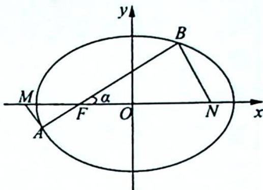
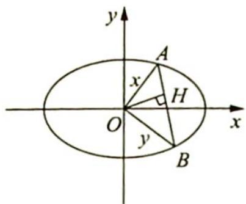
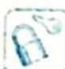

## 19.6 应用极坐标简化

## 研究密钥

利用极坐标系求曲线的方程, 若从直角坐标系考虑, 则计算比较繁琐. 一般来说, 与“角”和“距离”有关的问题可以考虑建立极坐标系求解, 但必须建立“适当”的极坐标系.

例 19.7 设 F 是椭圆 $E: \frac{x^{2}}{3} + y^{2} = 1$ 的左焦点，过点 F 且斜率为正的直线 l 与椭圆 E 相交于 A, B 两点，过点 A, B 分别作直线 AM 和 BN 使其满足 $AM \perp l, BN \perp l$ ，且直线 AM, BN 分别与 x 轴相交于 M 和 N。试求 $|MN|$ 的最小值。

分析 ▶ |MN| = |MF| + |NF| = $\frac{|AF|}{\cos\alpha} + \frac{|BF|}{\cos\alpha}$ ，以 F 为极点、Fx 为极轴建立极坐标

系, 可得 $|AF|$ , $|BF|$ , 代入得 $|MN|$ , 使用均值不等式可求最值.

解析 如图所示, 设过椭圆 E 的左焦点 F 的直线 l 的倾斜角为 $\alpha$ , 则 $0 < \alpha < \frac{\pi}{2}$ .

在 Rt△MAF 中，|MF| = $\frac{|AF|}{\cos\alpha}$ ; 在 Rt△NBF 中，|NF| = $\frac{|BF|}{\cos\alpha}$ .

以左焦点 $F$ 为极点，以过焦点 $F$ 且垂直于准线的右半直线为极轴建立极坐标系，有 $|BF| = \frac{ep}{1 - e\cos\alpha} = \frac{1}{\sqrt{3} - \sqrt{2}\cos\alpha}, |AF| = \frac{ep}{1 - e\cos(\alpha + \pi)} = \frac{1}{\sqrt{3} + \sqrt{2}\cos\alpha}$ ，从而 $|MN| = |MF| + |NF| = \frac{|AF| + |BF|}{\cos\alpha} = \frac{2\sqrt{3}}{(3 - 2\cos^2\alpha)\cos\alpha}$ .

令 $f(\alpha) = (3 - 2\cos^2\alpha)\cos \alpha$ ，则根据均值不等式，有 $(3 - 2\cos^2\alpha)^2 \cdot 4\cos^2\alpha = (3 - 2\cos^2\alpha) \cdot (3 - 2\cos^2\alpha) \cdot 4\cos^2\alpha \leqslant \left[\frac{(3 - 2\cos^2\alpha) + (3 - 2\cos^2\alpha) + 4\cos^2\alpha}{3}\right]^3 = 8$ ，当且仅当 $3 - 2\cos^2\alpha = 4\cos^2\alpha$ ，即 $\alpha = \frac{\pi}{4}$ 时，等号成立。

所以 $f(\alpha)_{\max} = \sqrt{2}$ ，即 $\left|MN\right|_{\min} = \sqrt{6}$

变式(1) 已知点 $A, B$ 在椭圆 $\frac{x^{2}}{a^{2}} + \frac{y^{2}}{b^{2}} = 1 (a > b > 0)$ 上, $OA \perp OB$ , 求 $\triangle AOB$ 面积的最大值和最小值.

解析 ▶ 以原点为极点, $Ox$ 轴正半轴为极轴建立极坐标系, 将 $x = \rho \cos \theta$ , $y = \rho \sin \theta$ 代入 $\frac{x^2}{a^2} + \frac{y^2}{b^2} = 1$ , 得 $\rho^2 = \frac{a^2 b^2}{b^2 \cos^2 \theta + a^2 \sin^2 \theta}$ .

设 $A(\rho_1, \alpha), B\left(\rho_2, \alpha + \frac{\pi}{2}\right)$ ，则 $\rho_1 = \frac{ab}{\sqrt{b^2 \cos^2 \alpha + a^2 \sin^2 \alpha}}$

$$
\rho_ {2} = \frac {a b}{\sqrt {b ^ {2} \cos^ {2} \left(\alpha + \frac {\pi}{2}\right) + a ^ {2} \sin^ {2} \left(\alpha + \frac {\pi}{2}\right)}} = \frac {a b}{\sqrt {b ^ {2} \sin^ {2} \alpha + a ^ {2} \cos^ {2} \alpha}}.
$$

所以 $S_{\triangle AOB} = \frac{1}{2} |OA| |OB| = \frac{1}{2} \rho_{1} \rho_{2} = \frac{1}{2} \frac{ab}{\sqrt{b^{2} \cos^{2}\alpha + a^{2} \sin^{2}\alpha}} \cdot \frac{ab}{\sqrt{b^{2} \sin^{2}\alpha + a^{2} \cos^{2}\alpha}} = \frac{1}{2} \frac{a^{2} b^{2}}{\sqrt{(b^{2} + c^{2} \sin^{2}\alpha)(a^{2} - c^{2} \sin^{2}\alpha)}} = \frac{1}{2} \frac{a^{2} b^{2}}{\sqrt{-c^{4} (\sin^{2}\alpha - \frac{1}{2})^{2} + a^{2} b^{2} + \frac{1}{4} c^{4}}}$ .

当 $\sin^{2}\alpha = 0$ 或 1 时， $S_{\triangle AOB}$ 有最大值为 $\frac{1}{2}ab$ ; 当 $\sin^{2}\alpha = \frac{1}{2}$ 时， $S_{\triangle AOB}$ 有最小值为 $\frac{1}{2}\frac{a^{2}b^{2}}{\sqrt{a^{2}b^{2}+\frac{1}{4}(a^{2}-b^{2})^{2}}}=\frac{1}{2}\frac{a^{2}b^{2}}{\sqrt{\frac{1}{4}(a^{2}+b^{2})^{2}}}=\frac{a^{2}b^{2}}{a^{2}+b^{2}}.$

## 评注

本题还可以从垂直弦模型角度解答:如图所示,设 OA = x, OB = y, (x > 0, y > 0), 则 $AB = \sqrt{x^{2} + y^{2}}$ .

过点 O 作 $OH \perp AB$ 交 AB 于点 H，因为 $OA \perp OB$ ，所以 $\frac{1}{OH^{2}} = \frac{1}{a^{2}} + \frac{1}{b^{2}}$ ，则 $|OH| = \frac{ab}{\sqrt{a^{2} + b^{2}}}$ .

由垂直弦模型可知， $\frac{1}{x^{2}}+\frac{1}{y^{2}}=\frac{1}{a^{2}}+\frac{1}{b^{2}}.$

$$
\left| A B \right| ^ {2} = x ^ {2} + y ^ {2} = (x ^ {2} + y ^ {2}) \cdot \left(\frac {1}{x ^ {2}} + \frac {1}{y ^ {2}}\right) \cdot \frac {1}{\frac {1}{a ^ {2}} + \frac {1}{b ^ {2}}}
$$

$$
= \left(2 + \frac {y ^ {2}}{x ^ {2}} + \frac {x ^ {2}}{y ^ {2}}\right) \cdot \frac {a ^ {2} b ^ {2}}{a ^ {2} + b ^ {2}} \geqslant 4 \cdot \frac {a ^ {2} b ^ {2}}{a ^ {2} + b ^ {2}}.
$$

当且仅当 $x = y$ ，即 $OA = OB$ 时取等号，所以 $\left|AB\right|_{\min} = \frac{2ab}{\sqrt{a^2 + b^2}}.$

$|AB|^{2}=\left(2+\frac{y^{2}}{x^{2}}+\frac{x^{2}}{y^{2}}\right)\cdot\frac{a^{2}b^{2}}{a^{2}+b^{2}}$ ，由对勾函数的单调性可知，当x与y差距越大， $|AB|$ 越大，即当 x=a, y=b 或 x=b, y=a 时， $|AB|$ 有最大值， $|AB|_{\max}=\sqrt{a^{2}+b^{2}}$

又 $S_{\triangle OAB} = \frac{1}{2}|AB||OH| = \frac{ab}{2}\cdot \frac{1}{\sqrt{a^2 + b^2}}\cdot |AB|$ ，所以当 $OA = OB$ 时， $S_{\triangle OAB}$ 取得最小值为 $\frac{a^2b^2}{a^2 + b^2}$

当 $OA = a, OB = b$ 或 $OA = b, OB = a$ 时， $S_{\triangle OAB}$ 取得最大值为 $\frac{1}{2} ab$ .

## 坐标平稳齐次化

## 研究密钥
