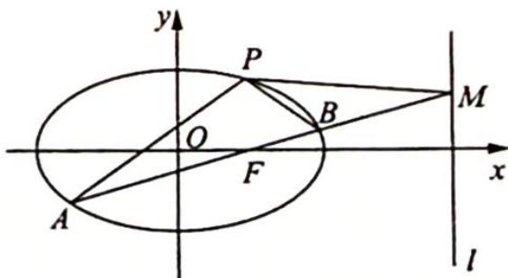

## 19.9 坐标平移化齐次求斜率之和

例 19.10 (2013 江西卷理 20) 如图所示, 椭圆 $C: \frac{x^{2}}{a^{2}} + \frac{y^{2}}{b^{2}} = 1 (a > b > 0)$ 经过点 $P\left(1, \frac{3}{2}\right)$ , 离

心率 $e = \frac{1}{2}$ ，直线 $l$ 的方程为 $x = 4$

(1) 求椭圆 C 的方程；

(2) $AB$ 是经过右焦点 $F$ 的任一弦 (不经过点 $P$ ), 设直线 $AB$ 与

直线 l 相交于点 M，记 PA, PB, PM 的斜率分别为 $k_{1}, k_{2}, k_{3}$ . 问：是否存在常数 $\lambda$ ，使得 $k_{1} + k_{2} = \lambda k_{3}$ ? 若存在，求 $\lambda$ 的值；若不存在，说明理由.

分析▶ 先把坐标原点平移到 $P\left(1,\frac{3}{2}\right)$ ，求出新坐标系下椭圆与直线 $A^{\prime}B^{\prime}$ 的方程，并联立以后转化为关于 $\frac{y^{\prime}}{x^{\prime}}$ 的方程，则 $\frac{y_{1}^{\prime}}{x_{1}^{\prime}},\frac{y_{2}^{\prime}}{x_{2}^{\prime}}$ 为方程的两根，使用韦达定理可得 $k_{1}+k_{2}$ ；再求直线 l 在新坐标系下的方程，与直线 $A^{\prime}B^{\prime}$ 的方程联立可得 $M^{\prime}$ 的坐标，表示出 $P^{\prime}M^{\prime}$ 的斜率 $k_{3}$ 。求 $\frac{k_{1}+k_{2}}{k_{3}}$

可得 $\lambda$ 的值.

解析 (1) 将点 $P\left(1, \frac{3}{2}\right)$ 代入椭圆方程可得 $\frac{1}{a^2} + \frac{9}{4b^2} = 1$ ，离心率 $e = \frac{c}{a} = \frac{1}{2}$ ，再与 $a^2 = b^2 + c^2$ 联立，解得 $\begin{cases} a = 2 \\ b = \sqrt{3} \\ c = 1 \end{cases}$ ，所以椭圆 $C$ 的方程为 $\frac{x^2}{4} + \frac{y^2}{3} = 1$ .

(2)将坐标原点 O 平移到点 P，则 $\left\{\begin{aligned}x&=x'+1\\ y&=y'+\frac{3}{2}\end{aligned}\right.$

在新坐标系中,椭圆方程为 $\frac{(x' + 1)^2}{4} +\frac{(y' + \frac{3}{2})^2}{3} = 1$ ，即 $3x^{\prime 2} + 6x^{\prime} + 4y^{\prime 2} + 12y^{\prime} = 0.$

设直线 $A^{\prime}B^{\prime}:mx^{\prime}+ny^{\prime}=1$ 过点 $F^{\prime}\left(0,-\frac{3}{2}\right)$ ，所以 $n=-\frac{2}{3}$ .

代入椭圆方程得 $3x'^2 + 6x'\left(mx' - \frac{2}{3}y'\right) + 4y'^2 + 12y'\left(mx' - \frac{2}{3}y'\right) = 0$ ，整理得 $-4y'^2 + (12m - 4)x'y' + Cx'^2 = 0$ （注： $x'^2$ 的系数不必算出，减少了运算量），化齐次得 $-4\left(\frac{y'}{x'}\right)^2 + (12m - 4)\frac{y'}{x'} + C = 0$ ，由韦达定理得 $k_1 + k_2 = 3m - 1$ ，直线 $l$ 在新坐标系下的方程为 $x' = 3$ ，所以 $3m - \frac{2}{3}y_{M'} = 1, y_{M'} = \frac{3(3m - 1)}{2}, k_3 = \frac{y_{M'}}{x_{M'}} = \frac{3m - 1}{2}$ .

故存在常数 $\lambda=2$ ，使得 $k_{1}+k_{2}=\lambda k_{3}$ 恒成立。
