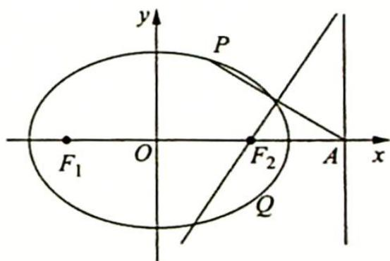

## 1. 焦半径的性质

研究密钥

性质1: 已知点 $P$ 是椭圆 $\frac{x^2}{a^2} + \frac{y^2}{b^2} = 1 (a > b > 0)$ 上任意一点, 椭圆的左、右两焦点分别为 $F_1, F_2$ , 则椭圆的焦半径 $|PF_1|$ , $|PF_2|$ 的取值范围是 $[a - c, a + c]$ , $\overrightarrow{PF_1} \cdot \overrightarrow{PF_2}$ 的取值范围是 $[2b^2 - a^2, b^2]$ , $|PF_1||PF_2|$ 的取值范围是 $[b^2, a^2]$ .

【证明】设 $P(x_0, y_0)$ ，则由 $|PF_1| = a + ex_0, |PF_2| = a - ex_0$ ，且 $-a \leqslant x_0 \leqslant a$ 可得 $|PF_1|$ ， $|PF_2| \in [a - c, a + c]$ 。因为 $F_1(-c, 0), F_2(c, 0)$ ，所以 $\overrightarrow{PF_1} \cdot \overrightarrow{PF_2} = (-c - x_0, -y_0) \cdot (c - x_0, -y_0) = x_0^2 - c^2 + y_0^2 = x_0^2 - c^2 + b^2\left(1 - \frac{x_0^2}{a^2}\right) = \left(1 - \frac{b^2}{a^2}\right)x_0^2 + b^2 - c^2$ 。

又 $0 \leqslant x_0^2 \leqslant a^2$ ，所以 $\overrightarrow{PF_1} \cdot \overrightarrow{PF_2} = \left(1 - \frac{b^2}{a^2}\right)x_0^2 + b^2 - c^2$ 的取值范围是 $[2b^2 - a^2, b^2]$ .

由椭圆的定义可得 $|PF_1| + |PF_2| = 2a$ ，所以 $|PF_1||PF_2| = |PF_1|(2a - |PF_1|) = -|PF_1|^2 + 2a|PF_1|$ ，根据 $|PF_1| \in [a - c, a + c]$ 及二次函数的性质，可得 $|PF_1||PF_2| = -|PF_1|^2 + 2a|PF_1| \in [b^2, a^2]$ .

例 17.5 (2010 四川卷理 9) 如图所示, 椭圆 $\frac{x^{2}}{a^{2}} + \frac{y^{2}}{b^{2}} = 1 (a > b > 0)$ 的右焦点为 $F_{2}$ , 其右准线与 $x$ 轴的交点为 $A$ , 在椭圆上存在点 $P$ 满足线段 $AP$ 的垂直平分线过点 $F_{2}$ , 则椭圆的离心率的取值范围是 ( ).

A. $(0, \frac{\sqrt{2}}{2}]$ B. $(0, \frac{1}{2}]$ C. $[\sqrt{2} - 1, 1)$ D.

$$
\left[ \frac {1}{2}, 1\right)
$$

分析 ▶ 根据中垂线定理, 存在点 P 满足线段 AP 的垂直平分线过点 $F_{2}$ 可转化为在椭圆上存在点 P 使得 $\left|PF_{2}\right|=\left|AF_{2}\right|$ , 而 $\left|AF_{2}\right|=\frac{a^{2}}{c}-c,\left|PF_{2}\right|$ 的取值范围是 $[a-c,a+c]$ , 即$\frac{a^2}{c} - c$ 在 $[a - c, a + c]$ 区间上，由此得离心率的取值范围.

解析 ▶ 易求得 $\left|AF_{2}\right|=\frac{a^{2}}{c}-c=\frac{b^{2}}{c}$ ，在椭圆上存在点 P 满足线段 AP 的垂直平分线过点 $F_{2}$ 的充要条件是在椭圆上存在点 P 使得 $\left|PF_{2}\right|=\left|AF_{2}\right|=\frac{b^{2}}{c}$ 。因为 $\left|PF_{2}\right|$ 的取值范围是 $[a-c,a+c]$ ，且 $\frac{b^{2}}{c}>a-c$ ，所以只需 $\frac{b^{2}}{c}\leqslant a+c$ ，即 $\frac{a^{2}-c^{2}}{c}\leqslant a+c$ ，解得 $e=\frac{c}{a}\geqslant\frac{1}{2}$ 。又因为 $e=\frac{c}{a}<1$ ，故选 D。
