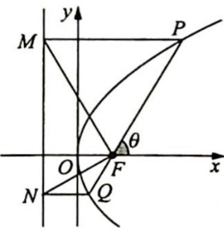
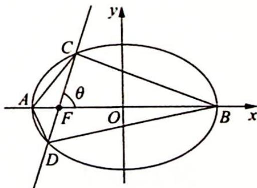

## 2. 圆锥曲线的几何形式的焦半径公式

## 研究密钥

妙用圆锥曲线的几何形式的焦半径公式:在极坐标系中,圆锥曲线有统一的极坐标方程 $\rho=\frac{ep}{1-e\cos\theta}$ , 极径 $\rho$ 事实上就是圆锥曲线的焦半径, 即其极坐标方程可以看成是圆锥曲线的统一的焦半径公式, 所以椭圆的几何形式的焦半径公式为 $\frac{\frac{c}{a}\left(\frac{a^{2}}{c}-c\right)}{1-\frac{c}{a}\cos\theta}=\frac{b^{2}}{a-c\cos\theta}$ ; 双曲线的几何形式的焦半径公式为 $\frac{\frac{c}{a}\left(c-\frac{a^{2}}{c}\right)}{1-\frac{c}{a}\cos\theta}=\frac{b^{2}}{a-c\cos\theta}$ ; 抛物线的几何形式的焦半径公式为 $\frac{ep}{1-e\cos\theta}=\frac{p}{1-\cos\theta}$ .

圆锥曲线的几何形式的焦半径公式形式简单、应用灵活多变,因此在解题时要注意抓住本质,灵活应用.

例 17.11 (2018 年清华大学学科能力综合测试理科数学(三测))已知抛物线 $C: y^{2} = 2px (p > 0)$ , 过焦点 $F$ 且斜率为 $\sqrt{3}$ 的直线与抛物线 $C$ 相交于 $P, Q$ 两点, 且 $P, Q$ 两点在准线上的投影分别为 $M, N$ 两点, 则 $\triangle MFN$ 的面积为 ( ).

A. $\frac{8}{3} p^{2}$ B. $\frac{2\sqrt{3}}{3} p^{2}$ C. $\frac{4\sqrt{3}}{3} p^{2}$ D. $\frac{8\sqrt{3}}{3} p^{2}$

分析 ▶ △MFN 的面积为 $\frac{1}{2}|MN|p$ ，而 $|MN|=|PQ|\sin\theta$ ，问题转化为求 $|PQ|$ 的长. $|PQ|$ 为焦点弦， $|PQ|=|PF|+|QF|$ ，根据抛物线的焦半径公式写出 $|PF|$ 与 $|QF|$ .

解析 如图所示, 直线 PQ 的倾斜角为 $\theta = 60^{\circ}$ , 根据抛物线的焦半径公式得 $|PF| =$

$\frac{p}{1 - \cos\theta} = \frac{p}{1 - \cos60^\circ} = 2p, |QF| = \frac{p}{1 - \cos(60^\circ + 180^\circ)} = \frac{2}{3} p,$ 所以 $|PQ| = |PF| + |QF| = 2p + \frac{2}{3} p = \frac{8}{3} p, |MN| = |PQ|\sin\theta = \frac{8}{3} p \times \sin60^\circ = \frac{4\sqrt{3}}{3} p,$ 又点 $F$ 到抛物线的准线的距离为 $p$ ，所以 $\triangle MFN$ 的面积为 $\frac{1}{2} |MN| \cdot p = \frac{1}{2} \times \frac{4\sqrt{3}}{3} p \cdot p = \frac{2\sqrt{3}}{3} p^2.$ 故选 B.

例 17.12 (2014 新课标全国Ⅱ卷理 20) 设 $F_{1}, F_{2}$ 分别是椭圆 $C: \frac{x^{2}}{a^{2}} + \frac{y^{2}}{b^{2}} = 1 (a > b > 0)$ 的左、右焦点, 点 $M$ 是椭圆 $C$ 上一点, 且 $MF_{2}$ 与 $x$ 轴垂直, 直线 $MF_{1}$ 与椭圆 $C$ 的另一个交点为 $N$ .

(1)若直线 $MN$ 的斜率为 $\frac{3}{4}$ , 求椭圆 $C$ 的离心率;

(2)若直线 ${MN}$ 在 $y$ 轴上的截距为 2,且 $\left| {MN}\right|  = 5\left| {{F}_{1}N}\right|$ ,求 $a,b$ 的值.

分析 (1)已知直线 $MN$ 的斜率求出 $\cos \theta$ , 代入几何形式的焦半径公式, 便可得离心率; (2)根据两个已知条件分别列两个方程, 直线 $MN$ 在 $y$ 轴上的截距为 2 , 即通径的一半为 4 ; 另一方面, $|MN| = 5 |F_1N|$ , 可得 $|MF_1| = 4 |F_1N|$ , 代入焦半径公式, 并用 $a, b$ 表示, 这样得出关于 $a, b$ 的方程组, 解方程组即可.

解析 (1)如图所示, 设 $\angle MF_{1}F_{2}=\theta$ , 因为直线 $MN$ 的斜率为 $\frac{3}{4}$ , 即 $\tan\theta=\frac{3}{4}$ , 所以 $\sin\theta=\frac{|MF_{2}|}{|MF_{1}|}=\frac{3}{5}, \cos\theta=\frac{4}{5}$ . 根据椭圆的焦半径公式可得 $|MF_{2}|=\frac{ep}{1+ecos\frac{\pi}{2}}, |MF_{1}|=\frac{ep}{1-e\cos\theta}$ , 则 $\frac{|MF_{2}|}{|MF_{1}|}=$ $\frac{1 - e\cos\theta}{1 + e\cos\frac{\pi}{2}} = \frac{1 - \frac{4}{5}e}{1} = \frac{3}{5}$ , 解得椭圆的离心率 $e = \frac{1}{2}$ .

(2) 因为 $MF_{2} \parallel y$ 轴， $|F_{1}O| = |OF_{2}|$ ，且直线 MN 在 y 轴上的截距为 2，所以由三角形的中位线的性质可知 $|MF_{2}| = \frac{ep}{1 + e\cos\frac{\pi}{2}} = ep = \frac{b^{2}}{a} = 4$ ①.

由题目中条件 $|MN| = 5|F_1N|$ ，可得 $|MF_1| = 4|F_1N|$ ，即 $\frac{ep}{1 - e\cos\theta} = \frac{4ep}{1 - e\cos(\theta + \pi)}$ ，解得 $e\cos \theta = \frac{3}{5}$ .

又 $\cos\theta=\frac{F_{1}O}{\sqrt{F_{1}O^{2}+2^{2}}}=\frac{c}{\sqrt{c^{2}+4}}$ ，所以 $\frac{c}{a}\cdot\frac{c}{\sqrt{c^{2}+4}}=\frac{a^{2}-b^{2}}{a\sqrt{a^{2}-b^{2}+4}}=\frac{3}{5}$ ②，所以解①②组成的方程组可得 $a=7, b=2\sqrt{7}$ .

例 17.13 (2013 天津卷理 18) 设椭圆 $\Gamma: \frac{x^{2}}{a^{2}} + \frac{y^{2}}{b^{2}} = 1 (a > b > 0)$ 的左焦点为 $F$ , 离心率为 $\frac{\sqrt{3}}{3}$ , 过点 $F$ 且与 $x$ 轴垂直的直线被椭圆截得的线段长为 $\frac{4\sqrt{3}}{3}$ .

(1) 求椭圆的方程；

(2)设 $A, B$ 分别为椭圆的左、右顶点, 过点 $F$ 且斜率为 $k$ 的直线交椭圆 $\Gamma$ 于 $C, D$ 两点. 若 $\overrightarrow{AC} \cdot \overrightarrow{DB} + \overrightarrow{AD} \cdot \overrightarrow{CB} = 8$ , 求 $k$ 的值.

分析 ▶ $\overrightarrow{AC} \cdot \overrightarrow{DB} + \overrightarrow{AD} \cdot \overrightarrow{CB} = 8$ 这个条件如果直接进行数量积计算不太现实. 因为需用弦长公式求弦长, 两组向量的夹角间的关系也未知. 因此将 $\overrightarrow{AC} \cdot \overrightarrow{DB} + \overrightarrow{AD} \cdot \overrightarrow{CB}$ 写为 $(\overrightarrow{AF} + \overrightarrow{FC}) \cdot (\overrightarrow{DF} + \overrightarrow{FB}) + (\overrightarrow{AF} + \overrightarrow{FD}) \cdot (\overrightarrow{CF} + \overrightarrow{FB})$ , 这样可以利用椭圆的焦半径公式进行化简, 从而求出 $\tan\theta$ 即 k.

解析 (1)由题意可知, $e = \frac{c}{a} = \frac{\sqrt{3}}{3},\frac{ep}{1 - e\cos\frac{\pi}{2}} = \frac{\sqrt{3}}{3}\left(\frac{a^2}{c} - c\right) = \frac{\sqrt{3}}{3} \times \frac{b^2}{c} = \frac{2\sqrt{3}}{3}$ ,再结合

$a^{2}=b^{2}+c^{2}$ ，可解得 $a=\sqrt{3},b=\sqrt{2}$ ，所以椭圆的方程为 $\frac{x^{2}}{3}+\frac{y^{2}}{2}=1$ 。

(2)如图所示,设 $\angle CFB=\theta$ ,则 $\overrightarrow{AC}\cdot\overrightarrow{DB}+\overrightarrow{AD}\cdot\overrightarrow{CB}=(\overrightarrow{AF}+\overrightarrow{FC})\cdot(\overrightarrow{DF}+\overrightarrow{FB})+(\overrightarrow{AF}+\overrightarrow{FD})\cdot(\overrightarrow{CF}+\overrightarrow{FB})=\overrightarrow{AF}\cdot\overrightarrow{DF}+2\overrightarrow{AF}\cdot\overrightarrow{FB}+2\overrightarrow{FC}\cdot\overrightarrow{DF}+\overrightarrow{FC}\cdot\overrightarrow{FB}+\overrightarrow{AF}\cdot\overrightarrow{CF}+\overrightarrow{FD}\cdot\overrightarrow{FB}=$

$\left|\overrightarrow{AF}\right|\left|\overrightarrow{DF}\right|\cos\theta+2\left|\overrightarrow{AF}\right|\left|\overrightarrow{FB}\right|+2\left|\overrightarrow{FC}\right|\left|\overrightarrow{DF}\right|+ \left|\overrightarrow{FC}\right|\left|\overrightarrow{FB}\right|\cos\theta-\left|\overrightarrow{AF}\right|\left|\overrightarrow{CF}\right|\cos\theta-$ $\left|\overrightarrow{FD}\right|\left|\overrightarrow{FB}\right|\cos\theta.$

根据椭圆的代数特征及焦半径公式可得 $|\overrightarrow{AF}| = a - c, |\overrightarrow{DF}| = \frac{b^2}{a - c\cos(\theta + \pi)} = \frac{b^2}{a + c\cos\theta}$ , $|\overrightarrow{FB}| = c + a, |\overrightarrow{FC}| = \frac{b^2}{a - c\cos\theta}$ , 代入上面的式子化简可得 $\overrightarrow{AC} \cdot \overrightarrow{DB} + \overrightarrow{AD} \cdot \overrightarrow{CB} = \frac{8\cos^2\theta}{3 - \cos^2\theta} + 4 + \frac{8}{3 - \cos^2\theta} = 8$ , 解得 $\cos^2\theta = \frac{1}{3}$ , 所以 $k = \tan\theta = \pm\sqrt{\frac{1}{\cos^2\theta} - 1} = \pm\sqrt{2}$ .
