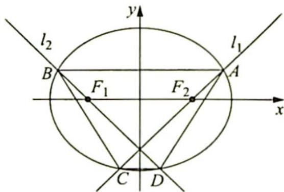
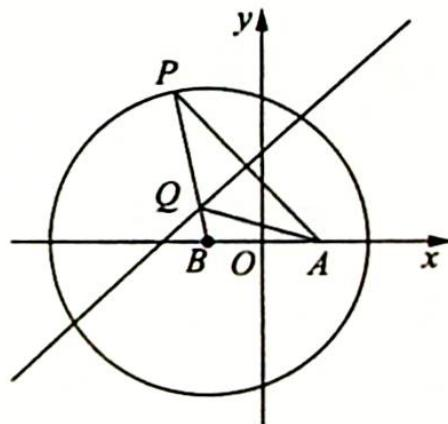
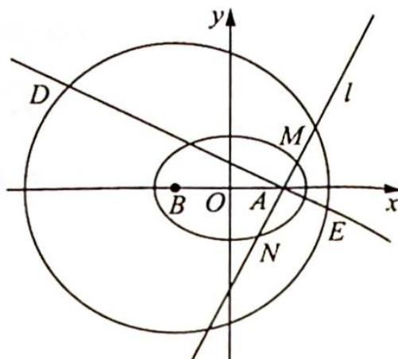

## 3. 圆锥曲线几何形式的焦点弦长

研究密钥

利用圆锥曲线的统一的焦半径公式,可以求得圆锥曲线几何形式的焦点弦长.

椭圆的焦点弦长：

$$
\frac {b ^ {2}}{a - c \cos \theta} + \frac {b ^ {2}}{a - c \cos (\theta + \pi)} = \frac {b ^ {2}}{a - c \cos \theta} + \frac {b ^ {2}}{a + c \cos \theta} = \frac {2 a b ^ {2}}{a ^ {2} - c ^ {2} \cos^ {2} \theta};
$$

双曲线的焦点弦长：

$$
\frac {b ^ {2}}{a - c \cos \theta} + \frac {b ^ {2}}{a - c \cos (\theta + \pi)} = \frac {b ^ {2}}{a - c \cos \theta} + \frac {b ^ {2}}{a + c \cos \theta} = \frac {2 a b ^ {2}}{a ^ {2} - c ^ {2} \cos^ {2} \theta};
$$

抛物线的焦点弦长：

$$
\frac {p}{1 - \cos \theta} + \frac {p}{1 - \cos (\theta + \pi)} = \frac {p}{1 - \cos \theta} + \frac {p}{1 + \cos \theta} = \frac {2 p}{1 - \cos^ {2} \theta} = \frac {2 p}{\sin^ {2} \theta}.
$$

例 17.14 (2016 年清华大学夏令营数学试题) 如图所示, 已知椭圆 $\frac{x^{2}}{3} + \frac{y^{2}}{2} = 1$ 的左、右焦点分别为 $F_{1}, F_{2}$ , 过点 $F_{2}$ 作直线 $l_{1}$ 与椭圆交于 $A, C$ 两点, 直线 $l_{1}$ 的斜率为 1 , 过点 $F_{1}$ 作直线 $l_{2}$ 与椭圆交于 $B, D$ 两点, 且 $AC \perp BD$ , 则四边形 $ABCD$ 的面积是

分析 ▶ 由于 $AC \perp BD$ , 所以四边形 $ABCD$ 的面积为 $\frac{1}{2} \times |AC| \times |BD|$ , 而 $|AC|$ 与 $|BD|$ 可利用椭圆的焦点弦长公式求出, 代入公式求解即可.

解析 ▶ 易知直线 $l_{1}$ 的倾斜角为 $\theta_{1}=45^{\circ}$ , 直线 $l_{2}$ 的倾斜角为 $\theta_{2}=135^{\circ}$ , 所以由椭圆点弦长公式得 $|AC|= \frac{2ab^{2}}{a^{2}-c^{2}\cos^{2}\theta_{1}}=\frac{4\sqrt{3}}{3-\frac{1}{2}}=\frac{8\sqrt{3}}{5}, |BD|= \frac{2ab^{2}}{a^{2}-c^{2}\cos^{2}\theta_{2}}=\frac{4\sqrt{3}}{3-\frac{1}{2}}=\frac{8\sqrt{3}}{5}.$

故四边形 $ABCD$ 的面积 $S_{ABCD} = \frac{1}{2}|AC||BD| = \frac{1}{2}\times \frac{8\sqrt{3}}{5}\times \frac{8\sqrt{3}}{5} = \frac{96}{25}.$

例 17.15 (2016 年全国高中数学联赛江苏赛区预赛试题) 在平面直角坐标系 $xOy$ 中, 双曲线 $C: \frac{x^2}{a^2} - \frac{y^2}{b^2} = 1 (a > 0, b > 0)$ 的右焦点为 $F$ , 过点 $F$ 的直线 $l$ 与双曲线 $C$ 交于 $A, B$ 两点. 若 $|OF||AB| = |FA||FB|$ 时, 求双曲线的离心率 $e$ .

分析 ▶ AB 为焦点弦, FA 与 FB 均为焦半径. 且 $\left|AB\right| = \left|AF\right| + \left|BF\right|$ , 根据双曲线的焦半径公式得出 AB, FA 与 FB, 再代入 $\left|OF\right| \left|AB\right| = \left|FA\right| \left|FB\right|$ , 化简即可得出离心率 e.

解析 ①当直线 l 不与 x 轴重合,且交于双曲线的右支时,不妨设点 A 位于 x 轴上方,且 $\angle AFx = \theta (0^{\circ} < \theta \leqslant 90^{\circ})$ , 则根据双曲线的焦半径公式得 $|AF| = \frac{b^{2}}{a - c\cos\theta}, |BF| = \frac{b^{2}}{a - c\cos(\theta + \pi)} = \frac{b^{2}}{a + c\cos\theta}$ , 所以 $|AB| = |AF| + |BF| = \frac{b^{2}}{a - c\cos\theta} + \frac{b^{2}}{a + c\cos\theta} = \frac{2ab^{2}}{a^{2} - c^{2}\cos^{2}\theta}$ .

根据题目中的已知条件 $|OF||AB|=|FA||FB|$ , 可得 $c \cdot \frac{2ab^2}{a^2 - c^2\cos^2\theta} = \frac{b^2}{a - c\cos\theta}$ $\frac{b^2}{a + c\cos\theta}$ , 化简得 $2ac = b^2$ , 即 $2ac = c^2 - a^2$ , 即 $e^2 - 2e - 1 = 0$ , 解得双曲线的离心率 $e = \sqrt{2} + 1$ .

②当直线 l 不与 x 轴重合, 且交于双曲线的两支时, 此时 $\left|AB\right| = \left|\left|AF\right| - \left|BF\right|\right|$ , 与①方法类似, 也可得 $2ac = b^{2}, e = \sqrt{2} + 1$ .

③当直线 l 与 x 轴重合时,根据题目中的已知条件 $\left|OF\right|\left|AB\right|=\left|FA\right|\left|FB\right|$ 可得 $c \cdot 2a = (c + a)(c - a)$ , 化简得 $2ac = c^{2} - a^{2}$ , 即 $e^{2} - 2e - 1 = 0$ , 同样可得双曲线的离心率 $e = \sqrt{2} + 1$ .

综上所述,双曲线的离心率 $e=\sqrt{2}+1$ .

例 17.16 (2017 年清华大学学科能力综合测试理科数学(一测)) 如图所示, 已知圆 $B: (x + \sqrt{2})^2 + y^2 = 16$ , 定点 $A(\sqrt{2}, 0)$ , $P$ 是圆周上任意一点, 线段 $AP$ 的垂直平分线与 $BP$ 交于点 $Q$ .

(1) 求点 Q 的轨迹 C 的方程;

(2)若直线 l 过点 A 且不与 x 轴重合,交曲线 C 于 M, N 两点,过点 A 且与直线 l 垂直的直线交圆 B 于 D,E 两点,求四边形 MDNE 面积的取值范围.

分析 ▶ (1) 按照椭圆的定义求出轨迹 C 的方程; (2) 由于 $DE \perp MN$ , 所以四边形 MDNE 面积为 $S = \frac{1}{2} |DE| |MN|$ , DE 为圆 B 的弦长, 利用弦心距、半径、半弦长组成的直角三角形可求出, $|MN|$ 由椭圆的焦点弦长公式可以求得. 这样, 将四边形 MDNE 的面积表示出来, 再求值域即可.

解析 (1)根据线段的垂直平分线的性质可知 $|QA| + |QB| = |QP| + |QB| = |PB| = 4 > 2\sqrt{2} = |AB|$ ，所以点 $Q$ 的轨迹是以 $A, B$ 为焦点，长轴长为 4 的椭圆，其方程为 $\frac{x^2}{4} + \frac{y^2}{2} = 1$ .

(2)如图所示,设直线 l 的倾斜角为 $\alpha\left(0<\alpha\leqslant\frac{\pi}{2}\right)$ ，则直线 l 的方程为 $x\sin\alpha-y\cos\alpha-\sqrt{2}\sin\alpha=0$ ，所以直线 DE 的方程可以表示为 $x\cos\alpha+y\sin\alpha-\sqrt{2}\cos\alpha=0$ 。

B 到直线 DE 的距离 $d = \frac{\left| -\sqrt{2} \times \cos \alpha + 0 \times \sin \alpha - \sqrt{2} \cos \alpha \right|}{\sqrt{\cos^{2} \alpha + \sin^{2} \alpha}} = 2\sqrt{2} |\cos \alpha|$ ，则由垂径定理得 $|DE| = 2\sqrt{16 - d^{2}} = 2\sqrt{16 - (2\sqrt{2} |\cos \alpha|)^{2}} = 4\sqrt{2 + 2 \sin^{2} \alpha}$ .

又根据椭圆的焦点弦长公式, 得 $|MN| = \frac{4}{1 + \sin^2\alpha}$ , 所以四边形

MDNE 的面积 $S = \frac{1}{2} |DE||MN| = \frac{1}{2} \times 4\sqrt{2 + 2\sin^2\alpha} \cdot \frac{4}{1 + \sin^2\alpha} = \frac{8\sqrt{2}}{\sqrt{1 + \sin^2\alpha}}$ .

因为 $\sin^2\alpha \in (0,1]$ , 所以四边形 $MDNE$ 的面积的取值范围是 $[8,8\sqrt{2})$ .
