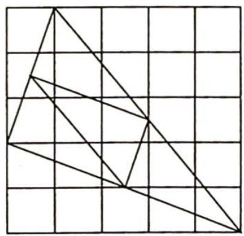
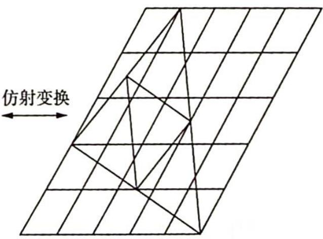

# 第20讲

# 仿射变换

圆锥曲线是高中数学的重要内容,它通常会以压轴题的形式出现在各种考试中,平时学生训练的也不少,但得分率相对其他题型依旧比较低.究其原因,学生的运算能力以及对解析几何方法的深层次认识有待得到进一步的提高.

解析几何最基本的方法是坐标法,即建立一个坐标系,将平面上的点与有序实数对建立起对应关系,从而实现图形与方程的相互转化,使得我们可以通过方程来研究图形的性质.坐标法的优越性在于它利用了数可以运算的特点,把几何问题代数化.

坐标法是解析几何中最基本的方法,也是最重要的方法.但也有其局限性,比如椭圆的任意一对共轭直径把椭圆分成的四部分的面积相等,用普通坐标系证明都比较麻烦,但如果我们把椭圆变成圆,那么椭圆的共轭直径就变成圆的共轭直径,这样处理起来就简单得多.这种方法就是点变换法,常用的点变换包括正交变换和仿射变换等.

如图所示,仿射变换(Affine Transformation)是一种二维坐标到二维坐标之间的线性变换,保持二维图形的“平直性”(即变换后直线还是直线不会打弯,圆弧还是圆弧)和“平行性”(其实是指保持二维图形间的相对位置关系不变,平行线还是平行线,而直线上点的位置顺序不变,另特别注意向量间夹角可能会发生变化).仿射变换可以通过一系列的变换的复合来实现,包括平移、缩放、翻转、旋转等.

仿射变换不会改变直线与圆锥曲线的交点个数,也不会改变共线线段长度的比例关系、平行和直线共点关系等,但是仿射变换会改变线段的长度.在这一讲,我们着重讲述利用仿射变换将椭圆变换为圆,再利用圆的良好几何性质解决问题的方法.

## 仿射变换的概念与性质

## 研究密钥

仿射变换是一种二维坐标到二维坐标的线性变换, 通俗来讲, 就是将一个空间内的图形按照一定的法则变换, 就会在另一个空间内得到与之对应的新图形. 变换保持二维图形间的相对位置关系不发生变化: 平行线还是平行线, 直线还是直线, 并且同一条直线上的点的位置顺序和长度的比例关系不变, 但向量的夹角可能会发生变化, 垂直关系可能会发生变化.

在进行仿射变换的过程中,需要清楚的是什么变了,什么没有变.在圆锥曲线中应用仿射变换,可实现化椭圆为圆,这样就可以借助圆中特有的一些性质解决问题,从而使问题的解决过程大大简化.

![[高中/总复习/专题/高考数学培优40讲/高考数学培优40讲-02-解析几何/04_第20讲/20_1_仿射变换的定义/20_1_仿射变换的定义.md]]
![[高中/总复习/专题/高考数学培优40讲/高考数学培优40讲-02-解析几何/04_第20讲/20_2_仿射变换的基本性质/20_2_仿射变换的基本性质.md]]
![[高中/总复习/专题/高考数学培优40讲/高考数学培优40讲-02-解析几何/04_第20讲/20_3_常用的仿射变换/20_3_常用的仿射变换.md]]
![[高中/总复习/专题/高考数学培优40讲/高考数学培优40讲-02-解析几何/04_第20讲/1__伸缩变换/1__伸缩变换.md]]
![[高中/总复习/专题/高考数学培优40讲/高考数学培优40讲-02-解析几何/04_第20讲/2__伸缩变换下化椭圆为圆/2__伸缩变换下化椭圆为圆.md]]
![[高中/总复习/专题/高考数学培优40讲/高考数学培优40讲-02-解析几何/04_第20讲/20_4_仿射变换性质应用/20_4_仿射变换性质应用.md]]
![[高中/总复习/专题/高考数学培优40讲/高考数学培优40讲-02-解析几何/04_第20讲/20_5_化椭圆为圆/20_5_化椭圆为圆.md]]
![[高中/总复习/专题/高考数学培优40讲/高考数学培优40讲-02-解析几何/04_第20讲/1__妙解以求弦长为背景的解析几何问题/1__妙解以求弦长为背景的解析几何问题.md]]
![[高中/总复习/专题/高考数学培优40讲/高考数学培优40讲-02-解析几何/04_第20讲/2__妙解以求斜率为背景的解析几何题目/2__妙解以求斜率为背景的解析几何题目.md]]
![[高中/总复习/专题/高考数学培优40讲/高考数学培优40讲-02-解析几何/04_第20讲/3__妙解以求面积最值为背景的解析几何题目/3__妙解以求面积最值为背景的解析几何题目.md]]
![[高中/总复习/专题/高考数学培优40讲/高考数学培优40讲-02-解析几何/04_第20讲/20_6_化椭圆为单位圆/20_6_化椭圆为单位圆.md]]
