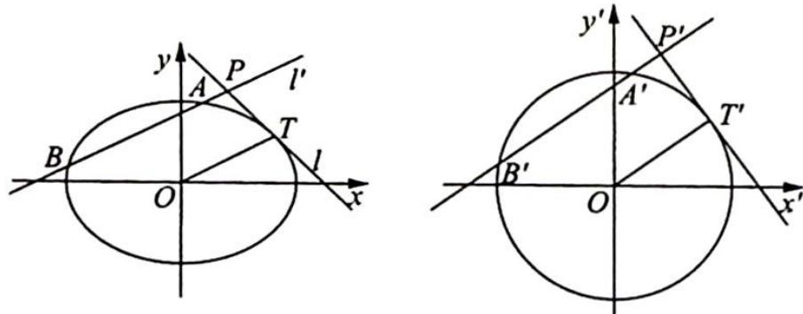

## 1. 妙解以求弦长为背景的解析几何问题

例 20.10 (2016 北京卷理 19) 已知椭圆 $C: \frac{x^{2}}{a^{2}} + \frac{y^{2}}{b^{2}} = 1 (a > b > 0)$ 的离心率为 $\frac{\sqrt{3}}{2}, A(a,0)$ ,

$B(0,b),O(0,0),\triangle OAB$ 的面积为1.

(1)求椭圆 C 的方程；

(2)设点 P 是椭圆 C 上一点, 直线 PA 与 y 轴交于点 M, 直线 PB 与 x 轴交于点 N.

求证： $|AN||BM|$ 为定值.

分析 ▶ 作仿射变换将椭圆变为圆, 证明 $|AN||BM|$ 为定值转化为证明 $|A'N'||B'M'|$ 为定值, 分析图形, 通过角度可以证明 $\triangle A'B'N'\sim\triangle B'M'A'$ , 通过对应边成比例得出 $|A'N'||B'M'|$ 为定值, 即可得 $|AN||BM|$ 为定值.

解析 (1)由已知条件可得 $\frac{c}{a} = \frac{\sqrt{3}}{2}, \frac{1}{2} ab = 1$ ，又因为 $a^2 = b^2 + c^2$ ，解得 $\left\{ \begin{array}{l} a = 2 \\ b = 1 \\ c = \sqrt{3} \end{array} \right.$ ，所以椭圆 $C$ 的方程为 $\frac{x^2}{4} + y^2 = 1$ .

(2)如图所示,在仿射变换 $\left\{\begin{aligned}x^{\prime}&=x\\ y^{\prime}&=2y\end{aligned}\right.$ 下,椭圆C变为圆 $C^{\prime}:x^{\prime2}+y^{\prime2}=4$ .

设点A,B,P,M,N变换后对应的点分别为 $A^{\prime},B^{\prime},P^{\prime},M^{\prime},N^{\prime}$ ,连接 $A^{\prime}B^{\prime},M^{\prime}N^{\prime}$ ,则由于 $\left\{\begin{aligned}\angle A^{\prime}B^{\prime}N^{\prime}&=\angle OB^{\prime}N^{\prime}+45^{\circ}=\angle OB^{\prime}N^{\prime}+\angle P^{\prime}=\angle A^{\prime}M^{\prime}B^{\prime}\\ \angle B^{\prime}A^{\prime}N^{\prime}&=\angle A^{\prime}B^{\prime}M^{\prime}=45^{\circ}\end{aligned}\right.$ ,所以 $\triangle A^{\prime}B^{\prime}N^{\prime}\sim\triangle B^{\prime}M^{\prime}A^{\prime}$ , $\frac{|A^{\prime}N^{\prime}|}{|B^{\prime}A^{\prime}|}=\frac{|A^{\prime}B^{\prime}|}{|B^{\prime}M^{\prime}|}$ ,即 $|A^{\prime}N^{\prime}||B^{\prime}M^{\prime}|=|A^{\prime}B^{\prime}|^{2},|AN|\cdot2|BM|=8$ ,即 $|AN||BM|=4$ ,为定值.

例 20.11 (2016 四川卷理 20) 已知椭圆 $E: \frac{x^{2}}{a^{2}} + \frac{y^{2}}{b^{2}} = 1 (a > b > 0)$ 的两个焦点与短轴的一个端点是直角三角形的三个顶点, 直线 $l: y = -x + 3$ 与椭圆 $E$ 有且只有一个公共点 $T$ .

(1)求椭圆 E 的方程及点 T 的坐标；

(2)设点 O 是坐标原点, 直线 $l'$ 平行于 OT, 与椭圆 E 相交于不同的两点 A, B, 且与直线 l 交于点 P. 证明: 存在常数 $\lambda$ , 使得 $|PT|^{2} = \lambda |PA||PB|$ , 并求 $\lambda$ 的值.

分析 ▶ (1)曲直联立,直线与椭圆有且只有一个公共点,即 $\Delta=0$ ,再结合条件可求出 $a$ , $b$ ;(2)要证明 $|PT|^{2}=\lambda|PA||PB|$ ,作仿射变换将椭圆变为圆,在圆中由圆幂定理可得 $|P^{\prime}T^{\prime}|^{2}=$ $|P'A'||P'B'|$ ，所以接下来的解题方向就是分别求 $\frac{|P'T'|^{2}}{|PT|^{2}}$ 及 $\frac{|P'A'||P'B'|}{|PA||PB|}$ 的数量关系。而这个数量关系可由仿射变换的弦长对应公式得出。

解析 ▶ (1)由已知条件可得 $a = \sqrt{2} b$ , 则椭圆 $E$ 的方程为 $\frac{x^2}{2b^2} + \frac{y^2}{b^2} = 1$ .

联立方程组 $\left\{ \begin{array}{l} \frac{x^2}{2b^2} + \frac{y^2}{b^2} = 1 \\ y = -x + 3 \end{array} \right.$ , 可得 $3x^{2} - 12x + (18 - 2b^{2}) = 0$ (\*), 依题意可知方程 (\*) 的判别式 $\Delta = (-12)^{2} - 4 \times 3 \times (18 - 2b^{2}) = 24(b^{2} - 3) = 0$ , 解得 $b^{2} = 3$ , 此时方程 (\*) 的解为 $x = 2$ , 所以椭圆 $E$ 的方程为 $\frac{x^2}{6} + \frac{y^2}{3} = 1$ , 点 $T$ 的坐标为 (2,1).

(2)如图所示,在仿射变换 $\left\{\begin{aligned}x^{\prime}&=x\\ y^{\prime}&=\sqrt{2}y\end{aligned}\right.$ 下,椭圆变为圆 $x^{\prime2}+y^{\prime2}=6$ ,点P,A,B,T变换后对应的点分别为 $P^{\prime},A^{\prime},B^{\prime},T^{\prime}$ .

由仿射变换的弦长对应公式知， $\frac{\left|P^{\prime}T^{\prime}\right|^{2}}{\left|PT\right|^{2}}=\frac{1+\left(\frac{a}{b}\right)^{2}\cdot k_{l}^{2}}{1+k_{l}^{2}}=\frac{1+2\times(-1)^{2}}{1+(-1)^{2}}=\frac{3}{2}.$

因为 $k_{l'} = k_{OT} = \frac{1}{2}$ ，所以 $\frac{|P'A'| |P'B'|}{|PA||PB|} = \frac{1 + \left(\frac{a}{b}\right)^2 \cdot k_{l'}^2}{1 + k_{l'}^2} = \frac{1 + 2 \times \left(\frac{1}{2}\right)^2}{1 + \left(\frac{1}{2}\right)^2} = \frac{6}{5}$ ，则 $\frac{|PT|^2}{|PA||PB|} \cdot \frac{|P'A'| |P'B'|}{|P'T'|^2} = \frac{4}{5}$ .

又由圆幂定理可得 $|P'T'|^2 = |P'A'| |P'B'|$ ，所以 $\frac{|PT|^2}{|PA||PB|} = \frac{4}{5}$ ，即 $|PT|^2 = \frac{4}{5}|PA||PB|$ ，故 $\lambda = \frac{4}{5}$ 满足题目条件。

