## 20.4 仿射变换性质应用

例 20.1 已知经过椭圆的中心的弦叫作椭圆的直径, 若椭圆 $\frac{x^{2}}{a^{2}} + \frac{y^{2}}{b^{2}} = 1 (a > b > 0)$ 的两条直径的斜率之积为 $-\frac{b^{2}}{a^{2}}$ , 则称这两条直径为共轭直径. 特别地, 当一条直径所在的直线的斜率为 0 , 另一条直径所在的直线斜率不存在时, 我们也称这两条直径为椭圆的共轭直径. 求证: 椭圆的任意一对共轭直径把椭圆分成的四部分的面积相等.

分析 ▶ 在圆中有类似椭圆这样的结论,因此作仿射变换将椭圆变换为圆.变换后圆的直径的斜率之积为-1,因此直径互相垂直,分圆所成的四部分的面积相等,根据变换前图形的面积与变换后图形的面积的比值为定值可得结论.

解析 如图所示,作仿射变换 $\left\{\begin{aligned} x^{\prime}=x \\ y^{\prime}=\frac{a}{b}y \end{aligned}\right.$ ，则椭圆 $\frac{x^{2}}{a^{2}}+\frac{y^{2}}{b^{2}}=1$ 变为圆 $x^{\prime2}+y^{\prime2}=a^{2}$ .

当椭圆的两条直径 AB, CD 的斜率之积为 $-\frac{b^{2}}{a^{2}}$ ，即 $k_{AB} \cdot k_{CD} = -\frac{b^{2}}{a^{2}}$ 时，变换后的圆的直径 $A'B'$ , $C'D'$ 的斜率之积为 $k_{A'B'} \cdot k_{C'D'} = \left(\frac{a}{b} k_{AB}\right) \cdot \left(\frac{a}{b} k_{CD}\right) = \frac{a^{2}}{b^{2}} \cdot \left(-\frac{b^{2}}{a^{2}}\right) = -1$ ，所以直径 $A'B' \perp C'D'$ ，直径 $A'B'$ , $C'D'$ 分圆所成的四部分的面积相等.

根据变换前图形的面积与变换后图形的面积的比值为定值, 可知直径 $A B, C D$ 分椭圆所成的四部分的面积相等.

由椭圆的对称性可得:当椭圆的一条直径所在的直线的斜率为0,另一条直径所在的直线斜率不存在时,这两条直径分椭圆所成的四部分的面积相等.

综上可得原命题成立.

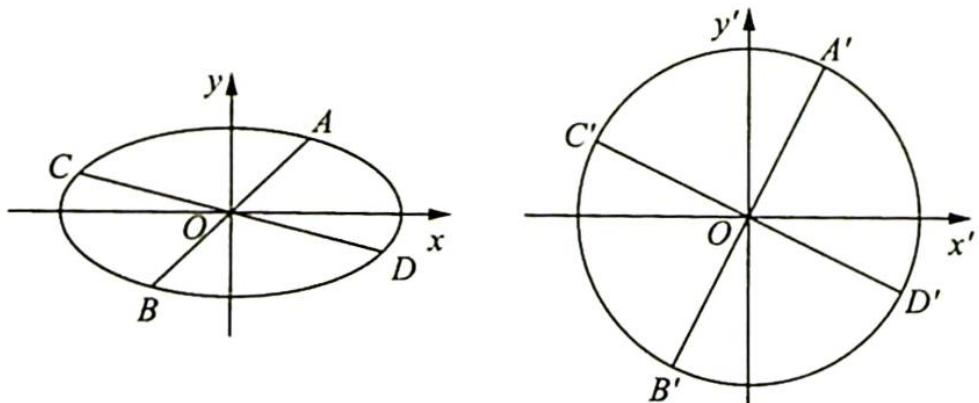

## 探究总结

仿射变换下几何元素的对应关系

在仿射变换下,在几何方面有下列对应关系:

(1)线段的中点在变化后仍然是新的线段的中点.

(2)平行直线变换后仍然保持平行,相交直线变换后仍然相交,且交点互相对应.

(3)椭圆在变换后可以变成圆,而圆在变换后可以变成椭圆.

(4) 直线与曲线的位置关系在变换后保持不变, 特别地, 原来的切点在变换后即成为新的切点.

(5)平行四边形在变换后往往可以变成特殊的平行四边形(菱形、正方形、矩形).

例 20.2 如图 1 所示, 已知椭圆 $C: \frac{x^2}{4} + y^2 = 1, A, B$ 是四条直线 $x = \pm 2, y = \pm 1$ 所围成矩形的两个顶点, 若 $M, N$ 是椭圆 $C$ 上两动点, 且直线 $OM, ON$ 的斜率之积等于直线 $OA, OB$ 的斜率之积, 试求 $\triangle OMN$ 的面积是否为定值, 说明理由.

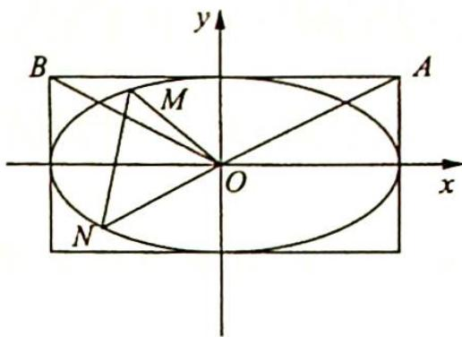
图 1

分析 ▶ 作仿射变换将椭圆变为圆,求出变换后圆中三角形的

面积, 再由性质 8, 椭圆与仿射变换所得圆中对应图形的面积关系求出椭圆中 $\triangle OMN$ 的面积. 其中圆中 $\triangle OM'N'$ 的面积可利用仿射变换后对应半径的垂直关系求出.

解析 如图2所示,作仿射变换 $\left\{\begin{aligned}x^{\prime}&=x\\ y^{\prime}&=2y\end{aligned}\right.$ ，则椭圆 $C:\frac{x^{2}}{4}+y^{2}=1$ 变为圆 $C^{\prime}:x^{\prime2}+y^{\prime2}=4$ ，点A,B,M,N变换后对应的点分别为 $A^{\prime},B^{\prime}$ ， $M^{\prime},N^{\prime}$ ，且 $A^{\prime}(2,2),B^{\prime}(-2,2)$ ，所以 $\left\{\begin{aligned}k_{OA^{\prime}}&\cdot k_{OB^{\prime}}=2k_{OA}\cdot2k_{OB}=-1\\ k_{OM^{\prime}}&\cdot k_{ON^{\prime}}=2k_{OM}\cdot2k_{ON}\end{aligned}\right.$ ，又因为 $k_{OA}\cdot k_{OB}=k_{OM}\cdot k_{ON}$ ，则 $k_{OA^{\prime}}\cdot k_{OB^{\prime}}=k_{OM^{\prime}}\cdot k_{ON^{\prime}}=-1$ ，即 $OM^{\prime}\perp ON^{\prime}$ ，所以 $S_{\triangle OM^{\prime}N^{\prime}}=\frac{1}{2}|OM^{\prime}||ON^{\prime}|=\frac{1}{2}\times2\times2=2$ ，所以 $S_{\triangle OMN}=\frac{1}{2}S_{\triangle OM^{\prime}N^{\prime}}=1$ 。

图 2

例 20.3 如图 1 所示, 已知椭圆 $C: \frac{x^{2}}{9} + \frac{y^{2}}{4} = 1$ , 过点 $M(2,0)$ 且斜率不为 0 的直线 $l$ 交椭圆 $C$ 于 $A, B$ 两点, 在 $x$ 轴上存在定点 $P$ , 使 $PM$ 平分 $\angle APB$ , 则点 $P$ 的坐标为 \_\_\_\_.

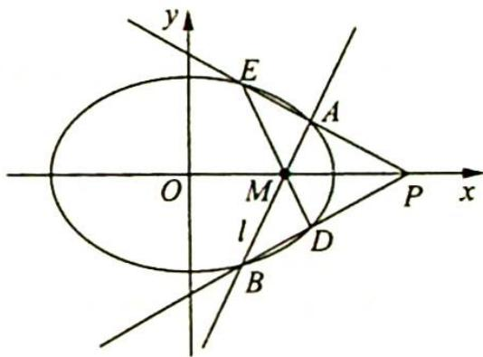

分析 ▶ 作仿射变换将椭圆变为圆, 求出圆中对应点 $P'$ 的坐标, 则可得 $P$ 点坐标. 在圆中, $P'G \cdot P'F = P'A' \cdot P'E' = P'D'$ .

图 1

$P^{\prime}B^{\prime}=P^{\prime}A^{\prime}\cdot P^{\prime}B^{\prime}$ ，再找到 $P^{\prime}A^{\prime}$ 与 $A^{\prime}M^{\prime},P^{\prime}B^{\prime}$ 与 $B^{\prime}M^{\prime}$ 的关系。由相交弦定理有 $A^{\prime}M^{\prime}\cdot B^{\prime}M^{\prime}=GM^{\prime}\cdot FM^{\prime}$ ，由此 $P^{\prime}G\cdot P^{\prime}F$ 可求，这样便可求得 $P^{\prime}$ 的坐标。

解析 如图2所示,作仿射变换 $\left\{\begin{aligned}x^{\prime}&=x\\ y^{\prime}&=\frac{3}{2}y\end{aligned}\right.$ ，则椭圆 $\frac{x^{2}}{9}+\frac{y^{2}}{4}=1$ 变为圆 $x^{\prime2}+y^{\prime2}=9$ ，点

M, A, B, P, D, E 变换后对应的点分别为 $M'$ , $A'$ , $B'$ , $P'$ , $D'$ , $E'$ ，且 $M'(2,0)$ ，直线 l 变为直线 $l'$ . 因为 PM 平分 $\angle APB$ ，且 $\left\{\begin{aligned}k_{P'A'} &= \frac{3}{2}k_{PA}\\ k_{P'B'} &= \frac{3}{2}k_{PB}\end{aligned}\right.$ ，所以 $P'M'$ 平分 $\angle A'P'B'$ .

图2中图形关于x轴对称.因为 $\angle E^{\prime}OF=\angle E^{\prime}A^{\prime}B^{\prime}$ ，所以 $\angle E^{\prime}OM^{\prime}=\angle P^{\prime}A^{\prime}M^{\prime}$ ，又因为 $\angle E^{\prime}M^{\prime}O=\angle P^{\prime}M^{\prime}D^{\prime}=\angle P^{\prime}M^{\prime}A^{\prime}$ ，所以 $\triangle E^{\prime}M^{\prime}O\sim\triangle P^{\prime}M^{\prime}A^{\prime}$ ，所以 $\frac{E^{\prime}O}{OM^{\prime}}=\frac{P^{\prime}A^{\prime}}{A^{\prime}M^{\prime}}=\frac{3}{2},P^{\prime}A^{\prime}=\frac{3}{2}A^{\prime}M^{\prime}$ .由三角形中的角平分线定理,可得 $\frac{P^{\prime}B^{\prime}}{P^{\prime}A^{\prime}}=\frac{B^{\prime}M^{\prime}}{A^{\prime}M^{\prime}}$ ,即 $\frac{P^{\prime}B^{\prime}}{B^{\prime}M^{\prime}}=\frac{P^{\prime}A^{\prime}}{A^{\prime}M^{\prime}}=\frac{3}{2}$ ,所以 $P^{\prime}B^{\prime}=\frac{3}{2}B^{\prime}M^{\prime}$ .

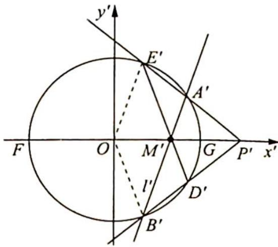
图 2

由圆中的割线定理和相交弦定理可得 $P^{\prime}G \cdot P^{\prime}F = P^{\prime}A^{\prime} \cdot P^{\prime}E^{\prime} = P^{\prime}D^{\prime} \cdot P^{\prime}B^{\prime} = P^{\prime}A^{\prime} \cdot P^{\prime}B^{\prime} = \left(\frac{3}{2}A^{\prime}M^{\prime}\right) \cdot \left(\frac{3}{2}B^{\prime}M^{\prime}\right) = \frac{9}{4}A^{\prime}M^{\prime} \cdot B^{\prime}M^{\prime} = \frac{9}{4}GM^{\prime} \cdot FM^{\prime}$ ，即 $(P^{\prime}O - 3) \cdot (P^{\prime}O + 3) = \frac{9}{4} \times 1 \times 5$ ，所以 $P^{\prime}O = \frac{9}{2}$ 。又点 P 与点 $P^{\prime}$ 的坐标相同，所以点 P 的坐标为 $\left(\frac{9}{2}, 0\right)$ 。

例 20.4 (2011 年全国高中数学联赛试题) 如图 1 所示, 已知斜率为 $\frac{1}{3}$ 的直线 $l$ 与椭圆 $C$ : $\frac{x^{2}}{36} + \frac{y^{2}}{4} = 1$ 交于 $A, B$ 两点并且点 $P(3\sqrt{2}, \sqrt{2})$ 在直线 $l$ 的左上方, 求证: $\triangle PAB$ 的内切圆的圆心在一条定直线上.

分析 ▶ 在椭圆中作点 $P$ 关于 $x$ 轴的对称点 $Q$ , 通过仿射变换将椭圆变为圆, 借助 $A'B'$ 与 $OQ'$ 斜率之积及垂径定理可判断 $Q'$ 为 $\widehat{A'B'}$ 的中点, 从而找到直线 $P'A'$ 与直线 $P'B'$ 的斜率互为相反数的关系. 再对应回椭圆中, 直线 $PA$ 与直线 $PB$ 的斜率也互为相反数, 即 $PQ$ 平分 $\angle APB$ , 这样便得 $\triangle PAB$ 的内切圆的圆心所在直线.

解析 如图1所示,作 $PQ \perp x$ 轴交椭圆于另一点 $Q$ , 则 $Q(3\sqrt{2}, -\sqrt{2})$ , 连接 $OQ$ .

如图2所示, 把 $xOy$ 平面上所有点的横坐标不变, 纵坐标变为原来的 3 倍, 即 $\left\{ \begin{array}{l} x' = x \\ y' = 3y \end{array} \right.$ , 得到 $x'Oy'$ 平面直角坐标系, 于是椭圆 $\frac{x^2}{36} + \frac{y^2}{4} = 1$ 变成圆 $x'^2 + y'^2 = 36$ . 相应地, 任意一条直线的斜率变为原来的 3 倍, 点 $Q'$ 的坐标为 $(3\sqrt{2}, -3\sqrt{2})$ , 所以 $k_{OQ'} = -1$ , 又直线 $A'B'$ 的斜率 $k_{A'B'} = 3k_{AB} = 3 \times \frac{1}{3} = 1$ , 所以 $k_{OQ'} \cdot k_{A'B'} = -1, OQ' \perp A'B'$ .

由垂径定理知点 $Q'$ 平分 $\widehat{A'B'}$ , 所以 $P'Q'$ 平分 $\angle A'P'B'$ .

因为 $P^{\prime}Q^{\prime}\perp x^{\prime}$ 轴, 所以直线 $P^{\prime}A^{\prime}$ 与直线 $P^{\prime}B^{\prime}$ 的斜率互为相反数, 则直线 PA 与直线 PB 的斜率也互为相反数, 即 PQ 平分 $\angle APB$ , 故 $\triangle PAB$ 的内切圆的圆心在定直线 $x=3\sqrt{2}$ 上.

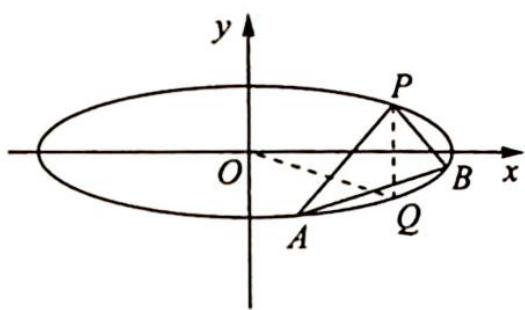
图 1

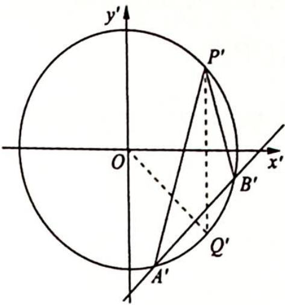
图2

例 20.5 (2009 年清华大学自主招生试题) 如图 1 所示, 已知椭圆 $\frac{x^{2}}{a^{2}} + \frac{y^{2}}{b^{2}} = 1 (a > b > 0)$ , 过椭圆左顶点 $A(-a,0)$ 的直线 $l$ 与椭圆交于点 $Q$ , 与 $y$ 轴交于点 $R$ , 过原点 $O$ 与直线 $l$ 平行的直线与椭圆交于点 $P$ , 求证: $|AQ|, \sqrt{2}|OP|, |AR|$ 成等比数列.

分析 ▶ 作仿射变换将椭圆变为圆, 则 $|AQ|, \sqrt{2}|OP|$ , $|AR|$ 成等比数列 $\Leftrightarrow |AQ||AR| = 2|OP|^2$ , 即在圆中证明 $|A'Q'| |A'R'| = 2|OP'|^2$ . 以下可从两个角度来证明: 思路一: 在圆中应用割线定理及勾股定理, 推导出上述等式; 思路二: 转化为证明 $\frac{|OP'|}{|A'Q'|} = \frac{|A'R'|}{2|OP'|}$ , 即 $\frac{|OA'|}{|A'Q'|} = \frac{|A'R'|}{|T'Q'|}$ , 可通过三角形相似来证明.

解析 如图2所示,作仿射变换 $\left\{\begin{aligned}x^{\prime}&=x\\ y^{\prime}&=\frac{a}{b}y\end{aligned}\right.$ ，(即把xOy平面上所有点横坐标不变,纵坐标变为原来的 $\frac{a}{b}$ 倍,得到 $x^{\prime}Oy^{\prime}$ 平面),则椭圆 $\frac{x^{2}}{a^{2}}+\frac{y^{2}}{b^{2}}=1$ 变为圆 $x^{\prime2}+y^{\prime2}=a^{2}$ ,点A,Q,R,P变换后对应的点分别为 $A^{\prime},Q^{\prime},R^{\prime},P^{\prime}$ ,且 $A^{\prime}(-a,0)$ .

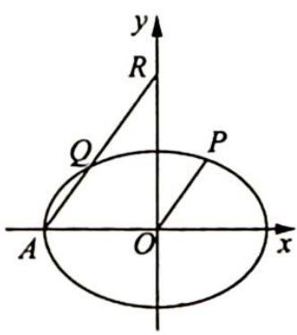
图 1

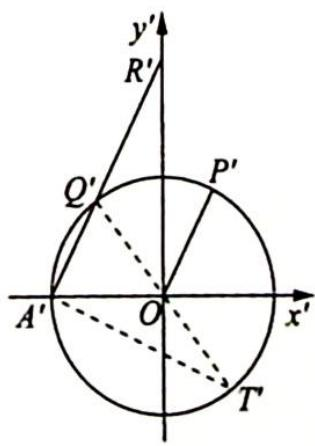
图2

因为 $OP \parallel AR$ ，所以 $\overrightarrow{OP} = \lambda \overrightarrow{AR}$ ，即 $(x_{P}, y_{P}) = \lambda (x_{R} - x_{A}, y_{R})$ ，所以 $\left(x_{P}, \frac{a}{b}y_{P}\right) =$

$\lambda\left(-x_{A},\frac{a}{b}y_{R}\right),\overrightarrow{OP'}=\lambda\overrightarrow{A'R'},\text{则 }OP'//A'R'\text{(或者由仿射变换把平行直线变为平行直线可得).}$

设直线 $AR, A'R'$ 的斜率分别为 $k, k'$ , 则 $|AQ|, \sqrt{2}|OP|, |AR|$ 成等比数列

$$
\Leftrightarrow | A Q | | A R | = 2 | O P | ^ {2}
$$

$$
\Leftrightarrow \sqrt {1 + k ^ {2}} | x _ {Q} + a | \cdot \sqrt {1 + k ^ {2}} | x _ {A} | = 2 (\sqrt {1 + k ^ {2}} | x _ {P} |) ^ {2}
$$

$$
\Leftrightarrow | x _ {Q} + a | | x _ {A} | = 2 | x _ {P} | ^ {2}
$$

$$
\Leftrightarrow \sqrt {1 + k ^ {\prime 2}} | x _ {Q} + a | \cdot \sqrt {1 + k ^ {\prime 2}} | x _ {A} | = 2 (\sqrt {1 + k ^ {\prime 2}} | x _ {P} |) ^ {2}
$$

$$
\Leftrightarrow \left| A ^ {\prime} Q ^ {\prime} \right| \left| A ^ {\prime} R ^ {\prime} \right| = 2 \left| O P ^ {\prime} \right| ^ {2}.
$$

下面证明在图2中,有 $\left|A^{\prime}Q^{\prime}\right|\cdot\left|A^{\prime}R^{\prime}\right|=2\left|OP^{\prime}\right|^{2}$ 成立.

证法一:由圆幂定理及勾股定理,可得

$$
\left\{ \begin{array}{l} {| Q ^ {\prime} R ^ {\prime} | | A ^ {\prime} R ^ {\prime} | = (| O R ^ {\prime} | - a) (| O R ^ {\prime} | + a) = | O R ^ {\prime} | ^ {2} - a ^ {2}} \\ {| A ^ {\prime} Q ^ {\prime} | | A ^ {\prime} R ^ {\prime} | + | Q ^ {\prime} R ^ {\prime} | | A ^ {\prime} R ^ {\prime} | = (| A ^ {\prime} Q ^ {\prime} | + | Q ^ {\prime} R ^ {\prime} |) \cdot | A ^ {\prime} R ^ {\prime} | = | A ^ {\prime} R ^ {\prime} | ^ {2} = | O R ^ {\prime} | ^ {2} + a ^ {2}} \end{array} \right. ①
$$

②-①,得 $|A'Q'||A'R'|=2a^{2}=2|OP'|^{2}$ 成立.

综上可得,原命题成立.

证法二:如图2所示,连接 $Q^{\prime}O$ 并延长交圆O于点 $T^{\prime}$ ,连接 $A^{\prime}T^{\prime}$ .

易知 $\left\{\begin{aligned}\angle O A^{\prime}R^{\prime}&=\angle T^{\prime}Q^{\prime}A^{\prime}\\ \angle A^{\prime}O R^{\prime}&=\angle Q^{\prime}A^{\prime}T^{\prime}=90^{\circ}\end{aligned}\right.$ ，所以 $\triangle O A^{\prime}R^{\prime}\sim\triangle A^{\prime}Q^{\prime}T^{\prime},\frac{|O A^{\prime}|}{|A^{\prime}Q^{\prime}|}=\frac{|A^{\prime}R^{\prime}|}{|T^{\prime}Q^{\prime}|}$ ，即 $\frac{|O P^{\prime}|}{|A^{\prime}Q^{\prime}|}=\frac{|A^{\prime}R^{\prime}|}{2|O P^{\prime}|}$ ，则 $|A^{\prime}Q^{\prime}||A^{\prime}R^{\prime}|=2|O P^{\prime}|^{2}$ .

综上可得,原命题成立.

例 20.6 (2008 年全国 I 卷理 21 改编) 如图 1 所示, 在直角坐标系中, 椭圆方程为 $\frac{x^{2}}{4} + y^{2} = 1, A, B$ 分别为上顶点和右顶点. 过原点 $O$ 的直线 $y = kx (k > 0)$ 与线段 $AB$ 交于点 $D$ , 与椭圆交于 $E, F$ 两点.

(1) 若 $\overrightarrow{FD}=6\overrightarrow{DE}$ ，求 k 的值；

图 1

(2) 求四边形 AEBF 面积的最大值.

分析 (1)求 $k$ , 可通过求 $D$ 点坐标获得, 也即需求 $D'$ 的坐标. 作仿射变换将椭圆变为圆, 在圆中得出 $\overrightarrow{A'D'}$ 与 $\overrightarrow{D'B'}$ 的数量关系, 再由定比分点公式可得 $D'$ 坐标; (2)求四边形 $AEBF$ 面积的最大值, 转化为在圆中求 $A'E'B'F'$ 面积的最大值.

而 $S_{A'E'B'F'} = \frac{1}{2} |E'F'| |A'B'| \sin \angle A'D'E'$ 且 $|E'F'|$ 与 $|A'B'|$ 均为定值, 所以当 $\angle A'D'E' = 90^\circ$ 时, $S_{A'E'B'F'}$ 取得最大值, 在椭圆中对应的 $S_{AEBF}$ 也取得最大值.

解析 如图2所示,作仿射变换 $\left\{\begin{aligned}x^{\prime}&=x\\ y^{\prime}&=2y\end{aligned}\right.$ ，则椭圆 $\frac{x^{2}}{4}+y^{2}=1$ 变为圆 $x^{\prime2}+y^{\prime2}=4$ ，点A,B,D,E,F变换后对应的点分别为 $A^{\prime},B^{\prime},D^{\prime},E^{\prime},F^{\prime}$ ，且 $A^{\prime}(0,2),B^{\prime}(2,0)$ .

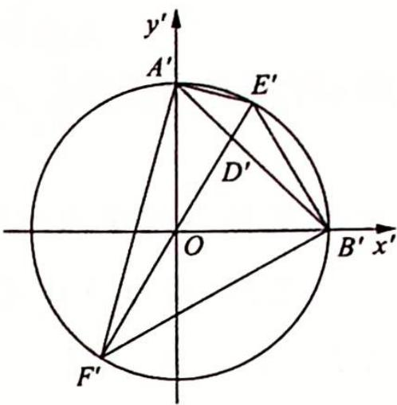

(1) 因为 $\overrightarrow{FD}=6\overrightarrow{DE}$ ，所以 $\overrightarrow{F'D'}=6\overrightarrow{D'E'}$ ，又因为 $|E'F'|=4$ ，所以 $\left\{\begin{aligned}|E'D'|&=\frac{4}{7}\\ |D'F'|&=\frac{24}{7}\end{aligned}\right.$

图 2

由圆中的相交弦定理, 得 $|A'D'| |D'B'| = |E'D'| |D'F'| = \frac{96}{49}$ , 又 $|A'D'| + |D'B'| = |A'B'| = 2\sqrt{2}$ , 所以 $\left\{ \begin{array}{l} |A'D'| = \frac{8\sqrt{2}}{7} \\ |D'B'| = \frac{6\sqrt{2}}{7} \end{array} \right.$ 或 $\left\{ \begin{array}{l} |A'D'| = \frac{6\sqrt{2}}{7} \\ |D'B'| = \frac{8\sqrt{2}}{7} \end{array} \right.$ , 则 $\overrightarrow{A'D'} = \frac{4}{3}\overrightarrow{D'B'}$ 或 $\overrightarrow{A'D'} = \frac{3}{4}\overrightarrow{D'B'}$ .

由定比分点公式可得点 $D'$ 的坐标为 $\left(\frac{8}{7}, \frac{6}{7}\right)$ 或 $\left(\frac{6}{7}, \frac{8}{7}\right)$ , 所以点 $D$ 的坐标为 $\left(\frac{8}{7}, \frac{3}{7}\right)$ 或 $\left(\frac{6}{7}, \frac{4}{7}\right), k = \frac{3}{8}$ 或 $k = \frac{2}{3}$ .

(2) 因为 $S_{A'E'B'F'} = \frac{1}{2} |E'F'| |A'B'| \sin \angle A'D'E'$ 且 $|E'F'| = 4, |A'B'| = 2\sqrt{2}$ 均为定值，所以 $S_{A'E'B'F'} = 4\sqrt{2}\sin \angle A'D'E'$ ，当且仅当 $\angle A'D'E' = 90^\circ$ ，即 $A'B' \perp E'F'$ 时， $S_{A'E'B'F'}$ 取得最大值 $4\sqrt{2}$ ，所以 $S_{AEBF}$ 的最大值为 $\frac{1}{2} \times S_{A'E'B'F'} = \frac{1}{2} \times 4\sqrt{2} = 2\sqrt{2}$ .

例 20.7 (2012 年全国高中数学联赛贵州省预赛试题) 如图 1 所示, 已知 $A, B$ 是椭圆 $\frac{x^2}{a^2} + \frac{y^2}{b^2} = 1 (a > b > 0)$ 的左、右顶点, $P, Q$ 是椭圆上不同于顶点的两点, 直线 $AP$ 与 $QB$ , $PB$ 与 $AQ$ 分别交于点 $M, N$ .

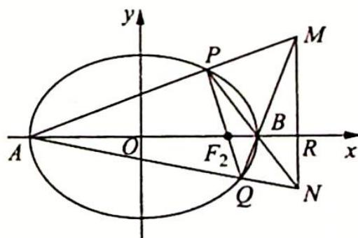
图1

(1) 求证: $MN \perp AB$ ;

(2) 若弦 PQ 过椭圆的右焦点 $F_{2}$ ，求直线 MN 的方程.

分析 ▶ (1)作仿射变换将椭圆变为圆, 将证明 $MN \perp AB$ 转化为证明 $M'N' \perp A'B'$ ; (2)求直线 $MN$ 的方程, 转化为在仿射坐标系中求 $M'N'$ 的方程, 即求 $|OR'|$ , 而 $|OR'|$ 可通过相似三角形对应边成比例求得.

解析 (1) 把 $xOy$ 平面上所有点的横坐标不变, 纵坐标变为原来的 $\frac{a}{b}$ 倍得到 $x'Oy'$ 平面, 即作仿射变换 $\left\{ \begin{array}{l} x' = x \\ y' = \frac{a}{b}y \end{array} \right.$ , 于是椭圆 $\frac{x^2}{a^2} + \frac{y^2}{b^2} = 1$ 变成圆 $x'^2 + y'^2 = a^2$ , 如图 2 所示. 观察图形及伸缩变换不改变点的横坐标可知: $MN \perp AB \Leftrightarrow x_M = x_N \Leftrightarrow x_{M'} = x_{N'} \Leftrightarrow M'N' \perp A'B'$ .

显然, 因为 $A'B'$ 是直径, 所以 $N'P' \perp A'M', M'Q' \perp A'N'$ , 点 $B'$ 是 $\triangle A'M'N'$ 的垂心, $M'N' \perp A'B'$ , 则 $MN \perp AB$ .

(2)如图2所示,设 $M^{\prime}N^{\prime}$ 与 $x^{\prime}$ 轴交于点 $R^{\prime}$ ,连接 $P^{\prime}R^{\prime},OP^{\prime},OQ^{\prime}$ ,设 $\widehat{A^{\prime}Q^{\prime}}$ 为 $\alpha$ 弧度, $\widehat{B^{\prime}P^{\prime}}$ 为 $\beta$ 弧度,则 $\angle P^{\prime}M^{\prime}B^{\prime}=\frac{\alpha-\beta}{2},\angle OP^{\prime}F_{2}^{\prime}=$ $\frac{\alpha-\beta}{2}$ .又 $P^{\prime},B^{\prime},R^{\prime},M^{\prime}$ 四点共圆,所以 $\angle P^{\prime}R^{\prime}B^{\prime}=\angle P^{\prime}M^{\prime}B^{\prime},$ $\angle OP^{\prime}F_{2}^{\prime}=\angle P^{\prime}R^{\prime}B^{\prime},$ 又 $\angle P^{\prime}OF_{2}^{\prime}=\angle R^{\prime}OP^{\prime},$ 所以 $\triangle OP^{\prime}F_{2}^{\prime}\sim$ $\triangle OR^{\prime}P^{\prime}.$

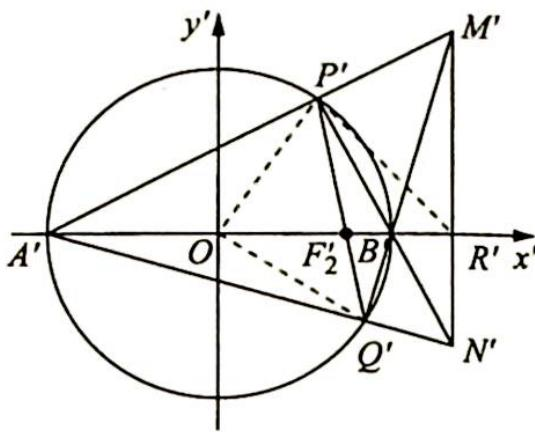
图2

(另证: 因为 $P', B', R', M'$ 四点共圆, 所以 $\angle OP'F_2' = 90^\circ - \frac{1}{2} \angle P'OQ' = 90^\circ - \angle P'A'Q' = \angle A'M'Q' = \angle P'R'B'$ , 又 $\angle P'OF_2' = \angle R'OP'$ , 所以 $\triangle OP'F_2' \sim \triangle OR'P'$ .)
因此, $\frac{|OP'|}{|OR'|} = \frac{|OF_2'|}{|OP'|}$ , 即 $|OP'|^2 = |OF_2'| |OR'|, |OR'| = \frac{a^2}{c}$ , 所以直线 $M'N'$ 的方程为 $x = \frac{a^2}{c}$ , 故直线 $MN$ 的方程为 $x = \frac{a^2}{c}$ .

例 20.8 (椭圆的垂径定理) 如图 1 所示, 已知椭圆的方程为 $\frac{x^{2}}{a^{2}} + \frac{y^{2}}{b^{2}} = 1 (a > b > 0), A, B$ 是椭圆上的两点, 如果点 $M$ 为线段 $AB$ 的中点, 那么 $k_{OM} \cdot k_{AB} = -\frac{b^{2}}{a^{2}}$ , 其中 $k_{OM}, k_{AB}$ 分别表示直线 $OM, AB$ 的斜率; 反之, 如果 $k_{OM} \cdot k_{AB} = -\frac{b^{2}}{a^{2}}$ , 那么点 $M$ 为线段 $AB$ 的中点.

图 1

分析 ▶ (1)作伸缩变换将椭圆变为单位圆,在圆中 $OM'\perp A'B'$ , 所以 $k_{OM'} \cdot k_{A'B'} = -1$ , 再换回原坐标系求 $k_{OM} \cdot k_{AB}$ ; (2)反过来的证明是一个相逆的过程: 若已知 $k_{OM} \cdot k_{AB} = -\frac{b^2}{a^2}$ , 对应到圆中就是 $k_{OM'} \cdot k_{A'B'} = -1$ , 那么 $OM'\perp A'B'$ , 则 $M'$ 为中点, 也即 $M$ 为中点.

解析 ▶ 作仿射变换 $\left\{\begin{aligned}x^{\prime}&=\frac{x}{a}\\ y^{\prime}&=\frac{y}{b}\end{aligned}\right.$ ，则椭圆 $\frac{x^{2}}{a^{2}}+\frac{y^{2}}{b^{2}}=1$ 变为圆 $x^{\prime2}+y^{\prime2}=1$ ，如图 2 所示。

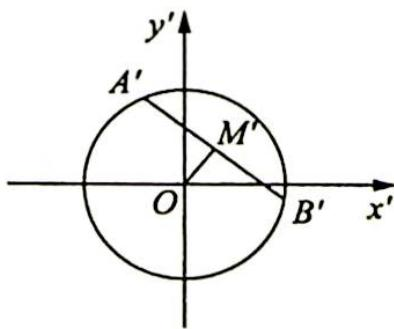
图 2

①因为点 $M$ 是线段 ${AB}$ 的中点,所以变换后的点 ${M}^{\prime }$ 也是线段 ${A}^{\prime }{B}^{\prime }$ 的中点.

由圆中的垂径定理的推论可得 $OM' \perp A'B'$ , 所以 $k_{OM'} \cdot k_{A'B'} = -1$ , 所以变换前的直线 $OM, AB$ 的斜率之积 $k_{OM} \cdot k_{AB} = \left(\frac{b}{a} k_{OM'}\right) \cdot \left(\frac{b}{a} k_{A'B'}\right) = \frac{b^2}{a^2} \times (-1) = -\frac{b^2}{a^2}$ .

②如果直线 $OM, AB$ 的斜率之积 $k_{OM} \cdot k_{AB} = -\frac{b^2}{a^2}$ 时, 那么变换后的直线 $OM', A'B'$ 的斜率之积 $k_{OM'} \cdot k_{A'B'} = \left(\frac{a}{b} k_{OM}\right) \cdot \left(\frac{a}{b} k_{AB}\right) = \frac{a^2}{b^2} \cdot \left(-\frac{b^2}{a^2}\right) = -1$ , 所以 $OM' \perp A'B'$ , 则由圆中的垂径定理可得点 $M'$ 是线段 $A'B'$ 的中点, 故变换前的点 $M$ 也是线段 $AB$ 的中点.

例 20.9 (2013 年全国高中数学联赛湖北省预赛) 如图 1 所示, 设 $P(x_{0}, y_{0})$ 为椭圆 $\frac{x^{2}}{4} + y^{2} = 1$ 内部的一个定点 (不在坐标轴上), 过点 $P$ 的两条直线分别与椭圆交于 $A, C$ 两点和 $B, D$ 两点, 已知 $AB$ 平行于 $CD$ .

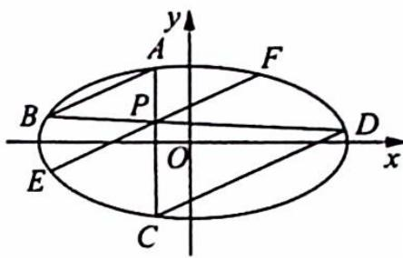
图 1

(1) 求证: 直线 $AB$ 的斜率为定值;

(2) 过点 $P$ 作 $AB$ 的平行线与椭圆交于 $E, F$ 两点, 求证: 点 $P$ 平分线段 $EF$ .

分析 (1)作仿射变换将椭圆变为圆,要证直线 $AB$ 的斜率为定值,转化为在圆中求直线 $A'B'$ 的斜率,再转化为求 $OP'$ 的斜率; (2)要证点 $P$ 平分线段 $EF$ ,即在圆中证 $P'$ 平分线段 $E'F'$ ,根据垂径定理转化为证明 $OP'\perp E'F'$ .

解析 如图2所示, 把 $xOy$ 平面上所有点的横坐标不变, 纵坐标变为原来的 2 倍 $\left\{ \begin{array}{l} \text{即作仿射变换} \left\{ \begin{array}{l} x' = x, \\ y' = 2y \end{array} \right. \end{array} \right.$ , 得到 $x'Oy'$ 平面, 于是椭圆 $\frac{x^2}{4} + y^2 = 1$ 变成圆 $x'^2 + y'^2 = 4$ , 任意一条直线的斜率变为原来的 2 倍, 且 $P'(x_0, 2y_0)$ .

图 2

(1)如图2所示,作直线 $O{P}^{\prime }$ 并连接 ${A}^{\prime }{D}^{\prime },{B}^{\prime }{C}^{\prime }$ ,因为 ${AB}//{CD}$ ,所以

$A^{\prime}B^{\prime}\parallel C^{\prime}D^{\prime}$ ，则 $\angle A^{\prime}C^{\prime}D^{\prime}=\angle B^{\prime}A^{\prime}C^{\prime},\widehat{A^{\prime}D^{\prime}}=\widehat{B^{\prime}C^{\prime}},A^{\prime}D^{\prime}=B^{\prime}C^{\prime}$ ，即四边形 $A^{\prime}B^{\prime}C^{\prime}D^{\prime}$ 为等腰梯形，则 $A^{\prime}P^{\prime}=B^{\prime}P^{\prime}$ ，所以点 $P^{\prime}$ 在 $A^{\prime}B^{\prime}$ 的垂直平分线上。又因为点 O 也在 $A^{\prime}B^{\prime}$ 的垂直平分线上，所以直线 $OP^{\prime}$ 垂直平分弦 $A^{\prime}B^{\prime},k_{A^{\prime}B^{\prime}}=-\frac{1}{k_{OP^{\prime}}}$ 。

又 $P^{\prime}(x_0,2y_0)$ ，所以 $k_{OP^{\prime}} = \frac{2y_0}{x_0}, k_{A'B'} = -\frac{x_0}{2y_0}$ 故 $k_{AB} = \frac{1}{2} k_{A'B'} = -\frac{x_0}{4y_0}$ .

(2) 因为 $OP' \perp A'B', A'B' \parallel E'F'$ , 所以 $OP' \perp E'F'$ , 则根据垂径定理可知点 $P'$ 平分线段 $E'F'$ , 所以点 $P$ 平分线段 $EF$ .

探究总结

## 圆与椭圆之间的“相似”

根据仿射变换的不变性,我们还可以发现圆与椭圆之间存在着很多方面的“相似”,下面不妨列举两者在若干方面的性质进行比对.

<table><tr><td>圆</td><td>椭圆</td></tr><tr><td>圆的方程为  $x^{2} + y^{2} = 1$ </td><td>椭圆的方程为  $\frac{x^{2}}{a^{2}} + \frac{y^{2}}{b^{2}} = 1$ </td></tr><tr><td>圆的面积为  $\pi$ </td><td>椭圆的面积为  $\pi ab$ </td></tr><tr><td>当圆上任意一点与任意一条直径两端点连线的斜率均存在时,其斜率之积为 -1</td><td>当椭圆上任意一点与任意一条“直径”(中心弦)两端点连线的斜率均存在时,其斜率之积为  $-\frac{b^{2}}{a^{2}}$ </td></tr><tr><td>在圆中,当弦的中点与圆心连线的斜率和弦所在直线的斜率均存在时,其斜率之积为 -1</td><td>在椭圆中,当弦的中点与中心连线的斜率和弦所在直线的斜率均存在时,其斜率之积为  $-\frac{b^{2}}{a^{2}}$ </td></tr><tr><td>当圆的切线斜率和过切点的半径所在直线的斜率均存在时,其斜率之积为 -1</td><td>当椭圆的切线斜率和过切点的“半径”所在直线的斜率均存在时,其斜率之积为  $-\frac{b^{2}}{a^{2}}$ </td></tr><tr><td>在圆中,若弦 AB, CD 相交于点 P,则有 |PA||PB|=|PC||PD|</td><td>在椭圆中,若弦 AB, CD 相交于点 P,且其倾斜角互补,则有 |PA||PB|=|PC||PD|</td></tr><tr><td>以圆的任意一对互相垂直的直径为对角线的四边形面积为定值 2,且该值为圆内接四边形面积的最大值</td><td>以椭圆的任意一对斜率之积为  $-\frac{b^{2}}{a^{2}}$  的“直径”(中心弦)为对角线的四边形面积为定值 2ab,且该值为椭圆内接四边形面积的最大值</td></tr></table>

## 巧用仿射变换 椭圆问题圆中解
