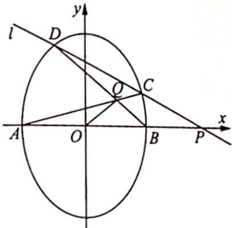
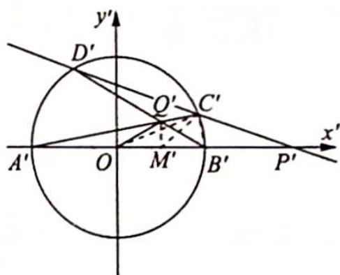
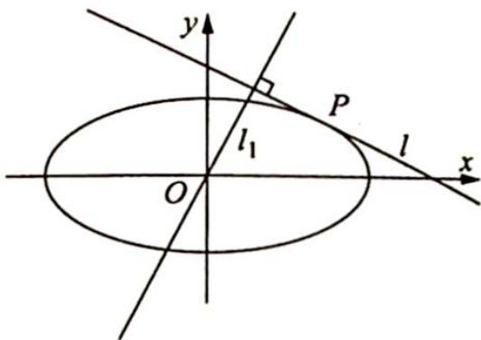
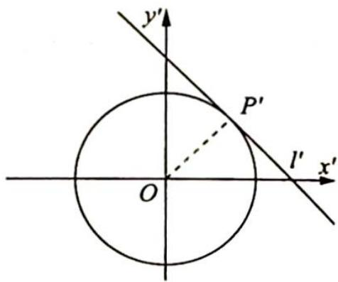
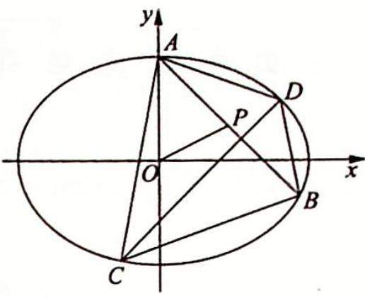
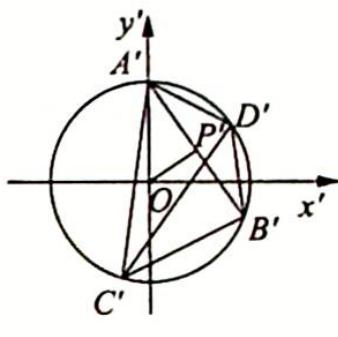
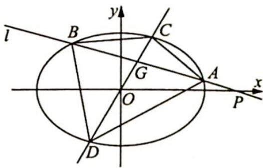
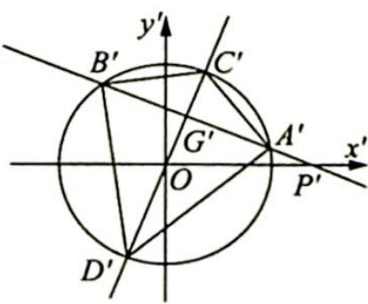
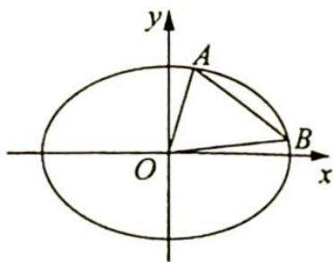

## 20.6 化椭圆为单位圆

研究密钥

椭圆 $\frac{x^{2}}{a^{2}}+\frac{y^{2}}{b^{2}}=1(a>b>0)$ 在伸缩变换 $\varphi:\begin{cases}x'=\frac{x}{a}\\y'=\frac{y}{b}\end{cases}$ 的作用下变成单位圆 $x^{\prime2}+y^{\prime2}=1$ ，圆是学生比较熟悉的几何图形，它的问题主要采用平面几何知识来解决，从而可以回避一些繁杂的计算，降低试题的难度。伸缩变换具有以下几条简单性质。

(1)在伸缩变换 $\varphi$ 的作用下, 直线 $Ax + By + C = 0$ 变为直线 $Aax' + Bby' + C = 0$ , 斜率变为原来的 $\frac{a}{b}$ 倍;

(2) 若 $A, B, C$ 三点共线, 则变换后的 $A', B', C'$ 三点仍然共线, 且对应线段长度的比值不变, 如 $\frac{AB}{BC} = \frac{A'B'}{B'C'}$ (特别地, 当点 $B$ 为线段 $AC$ 的中点时, 点 $B'$ 也为线段 $A'C'$ 的中点);

(3)若伸缩变换前直线与椭圆相切(相交、相离),则伸缩变换后直线仍然与圆相切(相交、相离);

(4)伸缩变换前图形的面积 S 与伸缩变换后图形的面积 $S'$ 满足关系 $S'=\frac{S}{ab}$ .

例 20.19 (2011 四川卷理 21) 如图 1 所示, 过 (0,1) 作直线 $l$ 与椭圆 $x^{2} + \frac{y^{2}}{2} = 1$ 交于 $C, D$ 两点, 与 $x$ 轴交于点 $P, A, B$ 分别是左、右顶点, $AC$ 与 $BD$ 交于点 $Q$ , 求证: $x_{P} \cdot x_{Q}$ 为定值.

  
图 1

分析 ▶ 作仿射变换将椭圆变为圆, 将证明 $x_{P} \cdot x_{Q}$ 为定值转化为在圆中证明 $x_{P}^{\prime} \cdot x_{Q}^{\prime}$ 为定值. 即 $|OM^{\prime}| |OP^{\prime}|$ 为定值. 观察图形, 联想直角三角形射影定理, 由类比推理可得 $|OM^{\prime}| |OP^{\prime}| = |OC^{\prime}|^{2}$ , 因此问题又转化为证明 $\triangle OC'M' \sim \triangle OP'C'$ .

解析 如图2所示,先把 $xOy$ 平面上所有点横坐标不变,纵坐标变为原来的 $\frac{1}{\sqrt{2}}$ ,即作仿射变换 $\left\{ \begin{array}{l} x' = x \\ y' = \frac{1}{\sqrt{2}} y \end{array} \right.$ 得到 $x'Oy'$ 平面,则原问题转化为:在 $x'Oy'$ 平面内,过点 $\left[0, \frac{1}{\sqrt{2}}\right]$ 作直线 $l'$ 与圆 $x'^2 + y'^2 = 1$ 交于 $C'$ , $D'$ 两点,与 $x$ 轴交于点 $P'$ , $A'C'$ 与 $B'D'$ 交于点 $Q'$ .

  
图 2

求证 $x_{P}^{\prime}\cdot x_{Q}^{\prime}$ 为定值.事实上，过点 $\left(0,\frac{1}{\sqrt{2}}\right)$ 是一个多余条件，只要直线 $l^{\prime}$ 与圆 $x^{\prime 2} + y^{\prime 2} = 1$ 相交即可.

作 $Q^{\prime}M^{\prime}\perp A^{\prime}B^{\prime}$ 于 $M^{\prime}$ , 连接 $B^{\prime}C^{\prime}, OC^{\prime}, C^{\prime}M^{\prime}$ . 设 $\widehat{A^{\prime}D^{\prime}}$ 为 $\alpha$ 弧度, $\widehat{B^{\prime}C^{\prime}}$ 为 $\beta$ 弧度, 则 $\angle C^{\prime}P^{\prime}O=\frac{\alpha-\beta}{2}, \angle C^{\prime}Q^{\prime}B^{\prime}=\frac{\alpha+\beta}{2}$ . 又因为 $Q^{\prime}, C^{\prime}, B^{\prime}, M^{\prime}$ 四点共圆, 所以 $\angle C^{\prime}M^{\prime}B^{\prime}=\angle C^{\prime}Q^{\prime}B^{\prime}=\frac{\alpha+\beta}{2}, \angle OC^{\prime}M^{\prime}=\angle C^{\prime}M^{\prime}B^{\prime}-\angle B^{\prime}OC^{\prime}=\frac{\alpha+\beta}{2}-\beta=\frac{\alpha-\beta}{2}$ , 则 $\angle OC^{\prime}M^{\prime}=\angle C^{\prime}P^{\prime}O$ , 又 $\angle M^{\prime}OC^{\prime}=\angle C^{\prime}OP^{\prime}$ , 所以 $\triangle OC^{\prime}M^{\prime}\sim\triangle OP^{\prime}C^{\prime}$ .

另证因为 $Q', C', B', M'$ 四点共圆，所以 $\angle C'M'B' = \angle C'Q'B' = \frac{\alpha + \beta}{2}$ .

又 $\angle OC^{\prime}D^{\prime}=\angle OC^{\prime}A^{\prime}+\angle A^{\prime}C^{\prime}D^{\prime}=\angle OA^{\prime}C^{\prime}+\angle A^{\prime}B^{\prime}D^{\prime}=\frac{\alpha+\beta}{2}$ , 所以 $\angle OM^{\prime}C^{\prime}= \angle OC^{\prime}P^{\prime}$ , 又 $\angle M^{\prime}OC^{\prime}=\angle C^{\prime}OP^{\prime}$ , 所以 $\triangle OC^{\prime}M^{\prime}\sim\triangle OP^{\prime}C^{\prime})$ , $\frac{|OC^{\prime}|}{|OP^{\prime}|}=\frac{|OM^{\prime}|}{|OC^{\prime}|}$ , 即 $|OC^{\prime}|^{2}=$ $|OM'||OP'|$ ，则 $x_{P}' \cdot x_{Q}' = |OM'||OP'| = r^{2} = 1.$

又在伸缩变换中横坐标不变,所以在 $xOy$ 平面上, $x_{P} \cdot x_{Q} = 1$ 为定值.

例20.20 (2014 浙江卷理 21) 如图 1 所示, 设动直线 $l$ 与椭圆 $C$ : $\frac{x^{2}}{a^{2}} + \frac{y^{2}}{b^{2}} = 1 (a > b > 0)$ 只有一个公共点 $P$ 且点 $P$ 在第一象限.

(1)已知直线 l 的斜率为 k，用 a, b, k 表示点 P 的坐标；

(2)若过原点的直线 $l_{1}$ 与直线 $l$ 垂直, 证明: 点 $P$ 到直线 $l_{1}$ 的距离的最大值为 $a - b$ .

图1

分析 ▶ (1)作仿射变换将椭圆变为圆,那么由仿射的性质知 $OP' \perp l'$ , 这样可求出 $OP'$ 的方程,与圆的方程联立便可表示出仿射变换后点 $P'$ 的坐标,再转换回原坐标系表示 $P$ 点坐标; (2)代入点到直线的距离公式化简,问题转化为利用基本不等式求最值.

解析 (1)作仿射变换 $\left\{ \begin{array}{l} x' = \frac{x}{a} \\ y' = \frac{y}{b} \end{array} \right.$ , 则椭圆 $\frac{x^2}{a^2} + \frac{y^2}{b^2} = 1$ 变为圆 $x'^2 + y'^2 = 1$ , 点 $P$ 变换后对应的点为点 $P'$ , 直线 $l$ 变为直线 $l'$ , 如图2所示. 因为直线 $l$ 与椭圆 $\frac{x^2}{a^2} + \frac{y^2}{b^2} = 1$ 相切于点 $P$ , 所以直线 $l'$ 与圆 $x'^2 + y'^2 = 1$ 相切于点 $P'$ , 连接 $OP'$ , 则 $OP' \perp l'$ .

  
图2

因为直线 $l'$ 的斜率为 $\frac{ak}{b}$ ，所以直线 $OP'$ 的斜率为 $-\frac{b}{ak}$ ，方程为 $y' = -\frac{b}{ak} x'$ .

易知 $k < 0$ ，联立方程组 $\left\{ \begin{array}{l} x'^2 + y'^2 = 1 \\ y' = -\frac{b}{ak} x' \end{array} \right.$ ，解得点 $P'$ 的坐标为 $\left[ -\frac{ak}{\sqrt{a^2k^2 + b^2}}, \frac{b}{\sqrt{a^2k^2 + b^2}} \right]$ ，所以点 $P$ 的坐标为 $\left[ -\frac{a^2k}{\sqrt{a^2k^2 + b^2}}, \frac{b^2}{\sqrt{a^2k^2 + b^2}} \right]$ .

(2)因为直线 $l_{1}$ 的斜率为 $-\frac{1}{k}$ , 所以直线 $l_{1}$ 的方程为 $y = -\frac{1}{k} x$ , 点 $P$ 到直线 $l_{1}$ 的距离为 $\left|\frac{-\frac{1}{k} \cdot \left(-\frac{a^2 k}{\sqrt{a^2 k^2 + b^2}}\right) - \frac{b^2}{\sqrt{a^2 k^2 + b^2}}}{\sqrt{1 + \frac{1}{k^2}}}\right| = \frac{a^2 - b^2}{\sqrt{a^2 k^2 + \frac{b^2}{k^2} + a^2 + b^2}} \leqslant \frac{a^2 - b^2}{\sqrt{2ab + a^2 + b^2}} = a - b$ , 当且仅当 $k = -\sqrt{\frac{b}{a}}$ 时等号成立, 所以点 $P$ 到直线 $l_{1}$ 的距离的最大值为 $a - b$ .

例 20.21 (2013 年新课标全国Ⅱ卷理 20) 如图 1 所示, 在平面直角坐标系 $xOy$ 中, 过椭圆

$M:\frac{x^{2}}{a^{2}}+\frac{y^{2}}{b^{2}}=1(a>b>0)$ 右焦点的直线 $x+y-\sqrt{3}=0$ 交椭圆 M 于 A，
B 两点，点 P 为线段 AB 的中点，且直线 OP 的斜率为 $\frac{1}{2}$ .

(1) 若椭圆 M 的方程；

(2) 点 C, D 为椭圆 M 上的两点, 若四边形 ACBD 的对角线 CD ⊥ AB, 求四边形 ACBD 面积的最大值.

图 1

分析 ▶ (1)作仿射变换将椭圆变为圆,由性质得 $k_{A'B'}$ 与 $k_{AB}$ 的关系, $k_{OP'}$ 与 $k_{OP}$ 的关系,代入 $k_{A'B'} \cdot k_{OP'} = -1$ 得出 $a, b$ 的关系; (2)求四边形 ACBD 面积的最大值转化为求伸缩变换后四边形 $A'B'C'D'$ 面积的最大值. 而 $S_{A'B'C'D'} = \frac{1}{2} |A'B'| |C'D'| \sin \alpha$ , 其中 $|A'B'|$ 与 $\sin \alpha$ 为定值, 当 $C'D'$ 最大, 即为圆的直径时四边形 $A'B'C'D'$ 的面积最大.

解析 如图2所示,在伸缩变换 $\left\{ \begin{array}{l} x' = \frac{x}{a} \\ y' = \frac{y}{b} \end{array} \right.$ 的作用下,椭圆 $\frac{x^2}{a^2} + \frac{y^2}{b^2} = 1$ 变成单位圆 $x'^2 + y'^2 = 1$ ,点 $P, A, B, C, D$ 变换后对应的点分别为 $P', A', B', C', D'$ .

  
图 2

(1)由伸缩变换的性质可知 $k_{A'B'} = \frac{a}{b} k_{AB} = -\frac{a}{b}, k_{OP'} = \frac{a}{b} k_{OP} = \frac{a}{2b}$ .

因为点 P 为线段 AB 的中点, 所以点 $P'$ 为线段 $A'B'$ 的中点, 由垂径定理的推论得 $OP' \perp A'B'$ , 即 $k_{A'B'} \cdot k_{OP'} = -\frac{a}{b} \cdot \frac{a}{2b} = -1$ , 即 $a^{2} = 2b^{2}$ , 又直线 $x + y - \sqrt{3} = 0$ 过椭圆 M 的右焦点, 所以 $c = \sqrt{3}$ .

联立方程组 $\left\{\begin{aligned}a^{2}&=2b^{2}\\ c&=\sqrt{3}\\ a^{2}&-b^{2}=c^{2}\end{aligned}\right.$ ，解得 $\left\{\begin{aligned}a&=\sqrt{6}\\ b&=\sqrt{3}\\ c&=\sqrt{3}\end{aligned}\right.$ ，所以椭圆M的方程为 $\frac{x^{2}}{6}+\frac{y^{2}}{3}=1$ .

(2)根据 $CD \perp AB$ 可得 $k_{CD} = -\frac{1}{k_{AB}} = 1$ ，所以 $k_{A'B'} = \frac{\sqrt{6}}{\sqrt{3}} k_{AB} = -\sqrt{2}, k_{C'D'} = \frac{\sqrt{6}}{\sqrt{3}} k_{CD} = \sqrt{2}$ .

设直线 $A^{\prime}B^{\prime}$ 与直线 $C^{\prime}D^{\prime}$ 的夹角为 $\alpha$ ，则 $\tan\alpha=\left|\frac{-\sqrt{2}-\sqrt{2}}{1+(-\sqrt{2})\times\sqrt{2}}\right|=2\sqrt{2}$ ，所以 $\sin\alpha=\frac{2\sqrt{2}}{3}$ .
又直线 $AB: x + y - \sqrt{3} = 0$ 变为直线 $A^{\prime}B^{\prime}: \sqrt{2}x^{\prime} + y^{\prime} - 1 = 0$ ，所以点 O 到直线 $A^{\prime}B^{\prime}$ 的距离 $d = \frac{1}{\sqrt{3}} = \frac{\sqrt{3}}{3}$ .

由垂径定理得 $\left|A^{\prime}B^{\prime}\right|=2\sqrt{1-d^{2}}=2\sqrt{1-\left(\frac{\sqrt{3}}{3}\right)^{2}}=\frac{2\sqrt{6}}{3}$ ，所以 $S_{A^{\prime}B^{\prime}C^{\prime}D^{\prime}}=\frac{1}{2}\left|A^{\prime}B^{\prime}\right|\left|C^{\prime}D^{\prime}\right|\sin\alpha=\frac{4\sqrt{3}}{9}\left|C^{\prime}D^{\prime}\right|\leqslant\frac{4\sqrt{3}}{9}\times2=\frac{8\sqrt{3}}{9}$ ，当且仅当 $C^{\prime}D^{\prime}$ 为圆的直径时等号成立，所以四边形 ACBD 的面积的最大值 $S_{ACBD}=\sqrt{6}\times\sqrt{3}\times S_{A^{\prime}B^{\prime}C^{\prime}D^{\prime}}=\sqrt{6}\times\sqrt{3}\times\frac{8\sqrt{3}}{9}=\frac{8\sqrt{6}}{3}$ .

例 20.22 如图 1 所示, 过点 $P(2,0)$ 作直线 $l$ 交椭圆 $E: \frac{x^2}{2} + y^2 = 1$ 于不同的两点 $A, B$ , 设点 $G$ 为线段 $AB$ 的中点, 直线 $OG$ 交椭圆于 $C, D$ 两点.

(1) 若点 G 的横坐标为 $\frac{2}{3}$ ，求直线 l 的方程；

图1

(2)设 $\triangle ABD$ 和 $\triangle ABC$ 的面积分别为 $S_{1},S_{2}$ ,求 $|S_{1}-S_{2}|$ 的最大值.

分析 ▶ (1)作仿射变换将椭圆变为圆,在圆中求 $P^{\prime}G^{\prime}$ 的斜率,从而求直线 $l$ 的方程; (2)求 $\left|S_{1}-S_{2}\right|$ 的最大值转化为求 $\left|S_{\triangle A^{\prime}B^{\prime}D^{\prime}}-S_{\triangle A^{\prime}B^{\prime}C^{\prime}}\right|$ 的最大值,而 $\left|S_{\triangle A^{\prime}B^{\prime}D^{\prime}}-S_{\triangle A^{\prime}B^{\prime}C^{\prime}}\right|= \frac{1}{2}\left|A^{\prime}B^{\prime}\right|(|G^{\prime}D^{\prime}|-|G^{\prime}C^{\prime}|)=\frac{1}{2}\left|A^{\prime}B^{\prime}\right|\cdot 2\left|OG^{\prime}\right|$ ,将 $\left|A^{\prime}B^{\prime}\right|$ 与 $\left|OG^{\prime}\right|$ 用 $A^{\prime}B^{\prime}$ 的斜率 $k$ 表示,通过求目标函数的最大值来求 $\left|S_{\triangle A^{\prime}B^{\prime}D^{\prime}}-S_{\triangle A^{\prime}B^{\prime}C^{\prime}}\right|$ 的最大值.

解析 如图2所示,在伸缩变换 $\left\{ \begin{array}{l} x' = \frac{x}{\sqrt{2}} \\ y' = y \end{array} \right.$ 的作用下,椭圆 $\frac{x^2}{2} + y^2 = 1$ 变成单位圆 $x'^2 + y'^2 = 1$ ,点 $P, A, B, C, G, D$ 变换后对应的点分别为 $P', A', B', C', G', D'$ ,则线段 $C'D'$ 是单位圆的直径,且 $P'(\sqrt{2}, 0)$ .

(1) 设 $G\left(\frac{2}{3}, y_0\right)$ , 则由伸缩变换的性质可知 $G'\left(\frac{\sqrt{2}}{3}, y_0\right)$ , 且线段 $A'B'$ 依然被点 $G'$ 平分, 所

以 $OG^{\prime} \perp A^{\prime}B^{\prime}, \overrightarrow{OG^{\prime}} \cdot \overrightarrow{P^{\prime}G^{\prime}} = \left(\frac{\sqrt{2}}{3}, y_{0}\right) \cdot \left(\frac{\sqrt{2}}{3} - \sqrt{2}, y_{0}\right) = 0$ ，解得 $y_{0} = \pm \frac{2}{3}$ ，则 $k_{OG^{\prime}} = \pm \sqrt{2}, k_{P^{\prime}G^{\prime}} = \pm \frac{1}{\sqrt{2}}$ ，从而 $k_{PG} = \frac{1}{\sqrt{2}} k_{P^{\prime}G^{\prime}} = \pm \frac{1}{2}$ .

故直线 l 的方程为 $y=\pm\frac{1}{2}(x-2)$ .

图 2

(2)设直线 $P^{\prime}G^{\prime}$ 的方程为 $y^{\prime}=k(x^{\prime}-\sqrt{2})$ ，则由点到直线的距离公式得 $\left|OG^{\prime}\right|=\frac{\sqrt{2k^{2}}}{\sqrt{k^{2}+1}}$ .
因为直线 $P^{\prime}G^{\prime}$ 与圆 $x^{\prime2} + y^{\prime2} = 1$ 相交，所以 $0 \leqslant \left|OG^{\prime}\right| = \frac{\sqrt{2k^{2}}}{\sqrt{k^{2}+1}} < 1$ ，解得 $k^{2} \in [0,1)$ .

根据圆中的垂径定理得 $|A'B'| = 2\sqrt{1 - |OG'|^2} = 2\sqrt{1 - \left(\frac{\sqrt{2k^2}}{\sqrt{k^2 + 1}}\right)^2} = 2\sqrt{\frac{1 - k^2}{k^2 + 1}}$ ，所以 $|S_1' - S_2'| = |S_{\triangle A'B'D'} - S_{\triangle A'B'C'}| = \left|\frac{1}{2} |A'B'| |G'D'| - \frac{1}{2} |A'B'| |G'C'|\right| = \frac{1}{2} |A'B'| \cdot (|G'D'| - |G'C'|) = \frac{1}{2} |A'B'| \cdot 2|OG'| = \frac{1}{2} \times 2\sqrt{\frac{1 - k^2}{k^2 + 1}} \times 2 \times \frac{\sqrt{2k^2}}{\sqrt{k^2 + 1}} = 2\sqrt{\frac{2k^2(1 - k^2)}{(k^2 + 1)^2}}.$ 令 $t = k^2 + 1 \in [1, 2)$ ，则 $|S_1' - S_2'| = 2\sqrt{2}\sqrt{\frac{k^2(1 - k^2)}{(k^2 + 1)^2}} = 2\sqrt{2}\sqrt{-\frac{2}{t^2} + \frac{3}{t} - 1} = 2\sqrt{2}\sqrt{-\frac{2}{t^2} + \frac{3}{t} - 1}$ ，当且仅当 $\frac{1}{t} = \frac{3}{4}$ ，即 $t = \frac{4}{3}$ 时， $|S_1' - S_2'|$ 取得最大值为 1，而 $|S_1 - S_2| = \sqrt{2}|S_1' - S_2'|$ ，所以 $|S_1 - S_2|$ 的最大值为 $\sqrt{2}$ .

椭圆变成单位圆后,主要从圆的几何性质入手解决问题,特别是题目中出现的有关圆的弦的中点、直径、切线等问题,仿射变换求解就可极大体现其优越性,从而化繁为简,达到准确、快速解题的目的.

## 训练 20

1.(2007 江苏卷 10)在平面直角坐标系 $xOy$ 中, 已知平面区域 $A = \{(x, y) | x + y \leqslant 1$ , 且 $x \geqslant 0$ , $y \geqslant 0\}$ , 则平面区域 $B = \{(x + y, x - y) | x, y \in A\}$ 的面积为 (   ). A. 2 B. 1 C. $\frac{1}{2}$ D. $\frac{1}{4}$

2.(2019届成都市高三一诊(理))已知椭圆 $\frac{x^{2}}{a^{2}}+\frac{y^{2}}{b^{2}}=1\left(a>0,b>0,c=\sqrt{a^{2}-b^{2}},e=\frac{c}{a}\right)$ ，其左、右焦点分别为 $F_{1},F_{2}$ ，关于椭圆有以下四种说法：

①设 A 为椭圆上任一点, 其到直线 $l_{1}: x = -\frac{a^{2}}{c}, l_{2}: x = \frac{a^{2}}{c}$ 的距离分别为 $d_{2}, d_{1}$ , 则 $\frac{|AF_{1}|}{d_{1}} = \frac{|AF_{2}|}{d_{2}}$ .

②设 $A$ 为椭圆上任一点， $AF_{1}, AF_{2}$ 分别与椭圆交于 $B, C$ 两点，则 $\frac{|AF_1|}{|F_1B|} + \frac{|AF_2|}{|F_2C|} \geqslant \frac{2(1 + e^2)}{1 - e^2}$ .（当且仅当点 $A$ 在椭圆的顶点时取等号）

③设 A 为椭圆上且不在坐标轴上的任一点, 过 A 的椭圆切线为 l, M 为线段 $F_{1}F_{2}$ 上一点, 且 $\frac{|AF_{1}|}{|AF_{2}|} = \frac{|F_{1}M|}{|MF_{2}|}$ , 则直线 $AM \perp l$ .

④面积为 2ab 的椭圆内接四边形仅有 1 个.
其中正确的有( )。
A. 1 个    B. 2 个    C. 3 个    D. 4 个

3. 如图所示, $A, B$ 是椭圆 $C: \frac{x^2}{3} + y^2 = 1$ 上的两点且 $|AB| = \sqrt{3}$ , 求 $\triangle AOB$ 面积的最大值.

4. (2013年全国高中数学联赛山东省预赛试题)已知椭圆 $\frac{x^2}{4} + \frac{y^2}{3} = 1$ 的内接平行四边形的一组对边分别过椭圆的焦点 $F_1, F_2$ , 求该平行四边形面积的最大值.

5.(2006 浙江卷理 19)椭圆 $\frac{x^{2}}{a^{2}}+\frac{y^{2}}{b^{2}}=1(a>b>0)$ 与过点 $A(2,0), B(0,1)$ 的直线有且只有一个公共点 $T$ , 且椭圆的离心率为 $e=\frac{\sqrt{3}}{2}$ .

(1) 求椭圆的方程；

(2)设 $F_{1}, F_{2}$ 分别为椭圆的焦点, $M$ 为线段 $AF_{2}$ 的中点, 求证: $\angle ATM = \angle AF_{1}T$ .

6. 已知点 $A, B, C$ 是椭圆 $E: \frac{x^2}{a^2} + \frac{y^2}{b^2} = 1 (a > b > 0)$ 上的三点, 其中点 $A(2\sqrt{3}, 0)$ 是椭圆的右顶点, 直线 $BC$ 过椭圆的中心 $O$ 且 $\overrightarrow{AC} \cdot \overrightarrow{BC} = 0$ , $|\overrightarrow{BC}| = 2 |\overrightarrow{AC}|$ .

(1)求点 C 的坐标及椭圆 E 的方程；

(2)若椭圆 E 上存在两点 P, Q, 使得直线 PC 与直线 QC 关于直线 $x = \sqrt{3}$ 对称, 求直线 PQ 的斜率.

7.(2012年浙江卷理21)椭圆 $C: \frac{x^2}{a^2} + \frac{y^2}{b^2} = 1 (a > b > 0)$ 的离心率为 $\frac{1}{2}$ , 其左焦点到点 $P(2,1)$ 的距离为 $\sqrt{10}$ , 不过原点 $O$ 的直线 $l$ 与椭圆 $C$ 相交于 $A, B$ 两点, 且线段 $AB$ 被直线 $OP$ 平分. (1)求椭圆 $C$ 的方程;

(2)求 $\triangle ABP$ 的面积取得最大值时直线l的方程.
