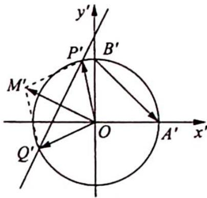
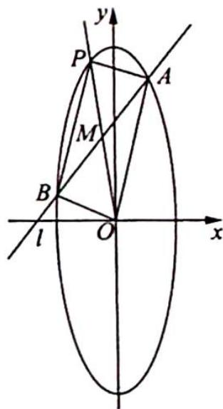
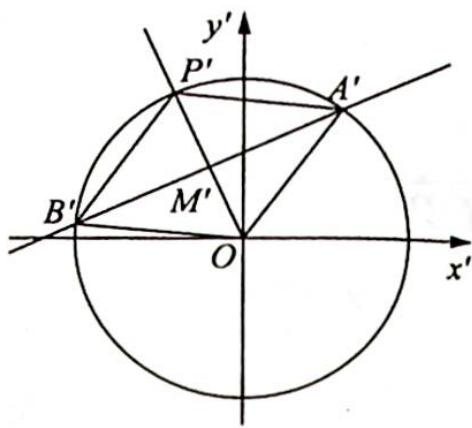

## 2. 妙解以求斜率为背景的解析几何题目

例 20.12 如图 1 所示, 在平面直角坐标系 $xOy$ 中, 经过点 $(0, \sqrt{2})$ 且斜率为 $k$ 的直线 $l$ 与椭圆 $\frac{x^2}{2} + y^2 = 1$ 有两个不同的交点 $P$ 和 $Q$ .

  
图1

(1) 求 k 的取值范围；

(2)设椭圆与 $x$ 轴的正半轴, $y$ 轴的正半轴的交点分别为 $A, B$ , 是否存在常数 $k$ , 使得向量 $\overrightarrow{OP} + \overrightarrow{OQ}$ 与 $\overrightarrow{AB}$ 共线? 如果存在, 求 $k$ 的值; 如果不存在, 请说明理由.

分析 ▶ 作仿射变换将椭圆变为圆。(1) 将直线 l 与椭圆有两个不同的交点转化为直线 $l'$ 与圆有两个不同的交点；(2) 向量 $\overrightarrow{OP} + \overrightarrow{OQ} = \overrightarrow{OM}$ 与 $\overrightarrow{AB}$ 共线等价于向量 $\overrightarrow{OP'} + \overrightarrow{OQ'} = \overrightarrow{OM'}$ 与 $\overrightarrow{A'B'}$ 共线。所以可得 $\overrightarrow{P'Q'}$ 与 $\overrightarrow{A'B'}$ 的垂直关系，由此易求出 k 的值，看是否满足要求。

解析 如图2所示,作仿射变换 $\left\{\begin{aligned}x^{\prime}&=\frac{x}{\sqrt{2}}\\ y^{\prime}&=y\end{aligned}\right.$ ，则椭圆 $\frac{x^{2}}{2}+y^{2}=1$ 变为圆 $x^{\prime2}+y^{\prime2}=1$ ，点A,B,P,Q,M变换后对应的点分别为 $A^{\prime},B^{\prime},P^{\prime},Q^{\prime},M^{\prime}$ ，直线 $l:y=kx+\sqrt{2}$ 变为直线 $l^{\prime}:y^{\prime}=\sqrt{2}kx^{\prime}+\sqrt{2}$ .

(1)因为直线 l 与椭圆 $\frac{x^{2}}{2} + y^{2} = 1$ 有两个不同的交点, 所以直线 $l'$ 与圆 $x'^{2} + y'^{2} = 1$ 有两个不同的交点, 所以 $\frac{\sqrt{2}}{\sqrt{1 + (\sqrt{2}k)^{2}}} < 1$ , 解得 $k \in \left(-\infty, -\frac{\sqrt{2}}{2}\right) \cup \left(\frac{\sqrt{2}}{2}, +\infty\right)$ .

(2)因为仿射变换把平行直线变为平行直线,所以仿射变换把平行四边形 OPMQ 变为平行四边形 $OP^{\prime}M^{\prime}Q^{\prime}$ , 把 $\overrightarrow{OM}$ 变为 $\overrightarrow{OM^{\prime}}$ , 即向量 $\overrightarrow{OP} + \overrightarrow{OQ} = \overrightarrow{OM}$ 与 $\overrightarrow{AB}$ 共线等价于向量 $\overrightarrow{OP^{\prime}} + \overrightarrow{OQ^{\prime}} = \overrightarrow{OM^{\prime}}$ 与 $\overrightarrow{A^{\prime}B^{\prime}}$ 共线. 当向量 $\overrightarrow{OP^{\prime}} + \overrightarrow{OQ^{\prime}} = \overrightarrow{OM^{\prime}}$ 与 $\overrightarrow{A^{\prime}B^{\prime}}$ 共线时, 因为平行四边形 $OP^{\prime}M^{\prime}Q^{\prime}$ 是菱形, 所以 $\overrightarrow{P^{\prime}Q^{\prime}} \perp \overrightarrow{OM^{\prime}}, \overrightarrow{P^{\prime}Q^{\prime}} \perp \overrightarrow{A^{\prime}B^{\prime}}$ , 即 $\sqrt{2}k \times (-1) = -1$ , 则 $k = \frac{\sqrt{2}}{2}$ , 但这与 (1) 中结论矛盾.

所以不存在常数 k，使得向量 $\overrightarrow{OP} + \overrightarrow{OQ}$ 与 $\overrightarrow{AB}$ 共线.

例 20.13 如图所示, 已知椭圆 $C: 9x^{2} + y^{2} = m^{2} (m > 0)$ , 直线 $l$ 不过原点且不平行于坐标轴, 直线 $l$ 与椭圆 $C$ 有两个交点 $A, B$ . 线段 $AB$ 的中点为点 $M$ .

(1) 证明: 直线 OM 的斜率与直线 l 的斜率的乘积为定值;

(2)若直线 l 过点 $\left(\frac{m}{3}, m\right)$ ，延长线段 OM 与椭圆 C 交于点 P，四边形 OAPB 能否为平行四边形？若能，求此时直线 l 的斜率；若不能，说明理由。

分析 ▶ (1)作仿射变换将椭圆变为圆,由仿射变换前后对应直线斜率的关系求 $k_{OM} \cdot k_{AB}$ ; (2)欲使四边形 OAPB 为平行四边形,只需要变换后的四边形 $OA'P'B'$ 为菱形.求出变换后的直线 $l'$ 的方程,再转换为变换前的直线,看能否求出.若能求出,说明四边形 OAPB 能为平行四边形;否则它不能为平行四边形.

解析 (1)如图所示,在仿射变换 $\left\{ \begin{array}{l} x' = x \\ y' = \frac{1}{3} y \end{array} \right.$ 下,椭圆 $C$ 变为半径为 $m' = \frac{m}{3}$ 的圆 $x'^2 + y'^2 =$ $m^{\prime2}$ ，所有直线的斜率变为原来的 $\frac{1}{3}$ 。因为变换后的直线 $OM'$ 与直线 $A'B'$ 垂直，所以 $k_{OM'} \cdot k_{A'B'} = -1$ ，又因为 $k_{OM'} = \frac{1}{3}k_{OM}, k_{A'B'} = \frac{1}{3}k_{AB}$ ，所以 $k_{OM} \cdot k_{AB} = 9k_{OM'} \cdot k_{A'B'} = -9$ 。

(2)欲使四边形 OAPB 为平行四边形, 只需要变换后的四边形

$OA^{\prime}P^{\prime}B^{\prime}$ 为菱形. 因为变换前的直线 $l$ 过点 $\left(\frac{m}{3}, m\right)$ , 所以变换后的直线 $l^{\prime}$ 过点 $\left(\frac{m}{3}, \frac{m}{3}\right)$ , 即 $(m^{\prime}, m^{\prime})$ . 设变换后的直线 $l^{\prime}$ 的方程为 $y^{\prime} - m^{\prime} = k^{\prime}(x^{\prime} - m^{\prime})$ , 则依题意可知: 当四边形 $OA^{\prime}P^{\prime}B^{\prime}$ 为菱形时, 点 $O$ 到直线 $l^{\prime}$ 的距离为圆的半径的一半, 即 $\frac{|-k^{\prime}m^{\prime} + m^{\prime}|}{\sqrt{1 + k'^2}} = \frac{m^{\prime}}{2}$ , 解得 $k^{\prime} = \frac{4 \pm \sqrt{7}}{3}$ , 所以变换前的直线的斜率为 $k = 3k^{\prime} = 4 \pm \sqrt{7}$ , 则当直线 $l$ 的斜率为 $4 + \sqrt{7}$ 或 $4 - \sqrt{7}$ 时, 四边形 $OAPB$ 为平行四边形.

例 20.14 如图 1 所示, 设椭圆 $\frac{x^{2}}{a^{2}} + \frac{y^{2}}{4} = 1 (a > 2)$ 的离心率为 $\frac{\sqrt{3}}{3}$ , 斜率为 $k$ 的直线 $l$ 过点 $E(0,1)$ 且与椭圆交于 $C, D$ 两点.

(1) 求椭圆的方程；

(2) 若直线 l 与 x 轴交于点 G 且 $\overrightarrow{GC} = \overrightarrow{DE}$ ，求 k 的值；

(3)设点 $A$ 是椭圆的下顶点, $k_{AC}, k_{AD}$ 分别为直线 $AC, AD$ 的斜率, 求证: 对于任意的 $k$ , 恒有 $k_{AC} \cdot k_{AD} = -2$ .

图 1

分析 ▶ (1)待定系数法求基本量; (2)作仿射变换将椭圆变为圆, 求直线 $l$ 的斜率转化为求圆中 $C^{\prime}D^{\prime}$ 的斜率; (3)要证 $k_{AC} \cdot k_{AD} = -2$ , 即证 $k_{A^{\prime}C^{\prime}} \cdot k_{A^{\prime}D^{\prime}} = -3$ , 此等式可通过转化为 $\triangle C^{\prime}A^{\prime}D^{\prime}$ 与 $\triangle C^{\prime}B^{\prime}D^{\prime}$ 的面积比为 3 来证明.

解析 (1)根据 $\left\{ \begin{array}{l} \frac{c}{a} = \frac{\sqrt{3}}{3} \\ a^2 - 4 = c^2 \end{array} \right.$ , 易得椭圆的方程为 $\frac{x^2}{6} + \frac{y^2}{4} = 1$ .

(2)如图2所示,把xOy平面上所有点的横坐标变为原来的 $\frac{\sqrt{6}}{3}$ ,纵坐标不变,即作仿射变换 $\left\{\begin{aligned}x^{\prime}&=\frac{\sqrt{6}}{3}x\\ y^{\prime}&=y\end{aligned}\right.$ ，得到 $x'Oy'$ 平面，则椭圆 $\frac{x^{2}}{6}+\frac{y^{2}}{4}=1$ 变成圆 $x^{\prime2}+y^{\prime2}=4$ ，任意一条直线的斜率变为原来的 $\frac{3}{\sqrt{6}}$ 倍.

如图1所示,取GE的中点M,连接OM,因为 $\overrightarrow{GC}=\overrightarrow{DE}$ ,所以点M平分弦CD,将点线位置关系对应到图2中, 有点 $M'$ 平分弦 $C'D'$ , $OM'$ 垂直平分弦 $C'D'$ , 又 $\overrightarrow{G'C'} = \overrightarrow{D'E'}$ , 所以 $OM'$ 垂直平分线段 $G'E'$ , 则在 Rt $\triangle E'OG'$ 中, $\triangle OM'G'$ 是等腰直角三角形, 所以 $\angle M'G'O = \angle M'OG' = 45^\circ$ , $k_{C'D'} = \tan 45^\circ = 1$ .

根据对称性可知直线 $l'$ 的斜率为 $k' = \pm 1$ , 所以直线 $l$ 的斜率为 $k = \frac{\sqrt{6}}{3} k' = \pm \frac{\sqrt{6}}{3}$ .

图 2

(3)根据仿射变换的性质可知 $k_{AC} \cdot k_{AD} = -2 \Leftrightarrow k_{A'C'} \cdot k_{A'D'} = \frac{3}{\sqrt{6}} k_{AC} \cdot \frac{3}{\sqrt{6}} k_{AD} = -3.$

设圆与 $y'$ 轴的交点为 $B'$ , 连接 $B'C', B'D'$ , 延长 $A'C'$ 交 $x'$ 轴于点 $P'$ , 设 $A'D'$ 交 $x'$ 轴于点 $Q'$ , 则 $k_{A'C'} = -\tan \angle A' P'O = -\tan \angle A'B'C' = -\frac{|A'C'|}{|B'C'|}, k_{A'D'} = \tan \angle A' Q'O = \tan \angle A'B'D' = \frac{|A'D'|}{|B'D'|}$ , 所以 $k_{A'C'} \cdot k_{A'D'} = -3 \Leftrightarrow \frac{|A'C'|}{|B'C'|} \cdot \frac{|A'D'|}{|B'D'|} = 3 \Leftrightarrow \frac{\frac{1}{2}|A'C'||A'D'|\sin \angle C'A'D'}{\frac{1}{2}|B'C'||B'D'|\sin \angle C'B'D'} = 3 \Leftrightarrow \frac{S_{\triangle C'A'D'}}{S_{\triangle C'B'D'}} = 3 \Leftrightarrow \frac{|A'E'|}{|B'E'|} = 3.$ 而 $\frac{|A'E'|}{|B'E'|} = 3$ 显然成立, 所以对于任意的 $k$ , 恒有 $k_{AC} \cdot k_{AD} = -2$ .
