## 3. 妙解以求面积最值为背景的解析几何题目

例 20.15 已知 A(0, -2)，椭圆 $E: \frac{x^{2}}{a^{2}} + \frac{y^{2}}{b^{2}} = 1 (a > b > 0)$ 的离心率为 $\frac{\sqrt{3}}{2}$ ，点 F 是椭圆 E 的焦点，直线 AF 的斜率为 $\frac{2\sqrt{3}}{3}$ ，点 O 为坐标原点。

(1) 求椭圆 E 的方程；

(2)设过点 A 的直线 l 与椭圆 E 相交于 P, Q 两点, 当 $\triangle OPQ$ 的面积最大时, 求直线 l 的方程.

分析 ▶ (1)由待定系数法求基本量; (2)作仿射变换将椭圆变为圆, 则这时 $S_{\triangle OP'Q'} = 2S_{\triangle OPQ}$ , 所以求 $\triangle OPQ$ 的面积最大时即是圆中 $\triangle OP'Q'$ 的面积最大时. 因为 $S_{\triangle OP'Q'} = \frac{1}{2} |OP'| |OQ'| \sin \angle P'OQ'$ , 所以当 $\angle P'OQ' = \frac{\pi}{2}$ 时, $S_{\triangle OP'Q'}$ 取得最大值, 求此时直线 $P'Q'$ 的方程, 再转换回原坐标系求直线方程.

解析 (1)如图1所示,设点 $F(c,0)$ ,由题目条件知 $k_{AF}=\frac{2}{c}=\frac{2\sqrt{3}}{3}$ ,解得 $c=\sqrt{3}$ .又 $\frac{c}{a}=$ $\frac{\sqrt{3}}{2}$ ，所以 a=2, $b^{2}=a^{2}-c^{2}=1$ ，故椭圆 E 的方程为 $\frac{x^{2}}{4}+y^{2}=1$ .

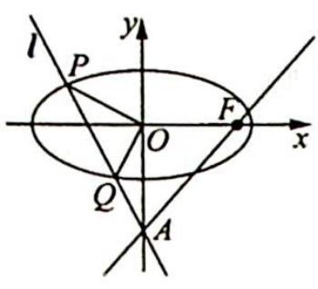
图 1

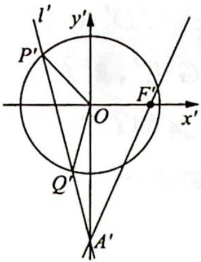
图 2

(2)如图2所示,在仿射变换 $\left\{\begin{aligned}x^{\prime}&=x\\ y^{\prime}&=2y\end{aligned}\right.$ 下,椭圆E变为圆 $x^{\prime2}+y^{\prime2}=4$ ,此时直线 $P^{\prime}Q^{\prime}$ 过定点 $A^{\prime}(0,-4)$ 且 $S_{\triangle OP^{\prime}Q^{\prime}}=2S_{\triangle OPQ}$ .

因为 $\angle P'OQ' \in (0, \pi)$ , $S_{\triangle OP'Q'} = \frac{1}{2} |OP'| |OQ'| \sin \angle P'OQ'$ , 所以当 $\angle P'OQ' = \frac{\pi}{2}$ 时, $S_{\triangle OP'Q'}$ 取得最大值, 此时点 $O$ 到直线 $P'Q'$ 的距离为 $\sqrt{2}$ . 设此时直线 $P'Q'$ 的方程为 $y' = k'x' - 4$ , 则有 $\frac{4}{\sqrt{1 + k'^2}} = \sqrt{2}$ , 解得 $k' = \pm \sqrt{7}$ , 所以直线 $PQ$ 的斜率为 $k = \frac{1}{2} k' = \pm \frac{\sqrt{7}}{2}$ , 则当 $\triangle OPQ$ 的面积最大时, 直线 $l$ 的方程为 $y = \frac{\sqrt{7}}{2} x - 2$ 或 $y = -\frac{\sqrt{7}}{2} x - 2$ .

例20.16 在平面直角坐标系 $xOy$ 中, 已知椭圆 $C: \frac{x^2}{a^2} + \frac{y^2}{b^2} = 1 (a > b > 0)$ 的离心率为 $\frac{\sqrt{3}}{2}$ , 左、右焦点分别是 $F_1, F_2$ . 以点 $F_1$ 为圆心, 3 为半径的圆与以点 $F_2$ 为圆心, 1 为半径的圆相交, 且交点在椭圆 $C$ 上.

(1) 求椭圆 C 的方程；

(2)如图1所示,设椭圆 $E: \frac{x^2}{4a^2} + \frac{y^2}{4b^2} = 1$ , 点 $P$ 为椭圆 $C$ 上任意一点, 过点 $P$ 的直线 $y = kx + m$ 交椭圆 $E$ 于 $A, B$ 两点, 射线 $PO$ 交椭圆 $E$ 于点 $Q$ . ①求 $\frac{|OQ|}{|OP|}$ 的值; ②求 $\triangle ABQ$ 面积的最大值.

分析 ▶ (1)由椭圆定义及离心率的值求出基本量得椭圆方程; (2)作仿射变换将椭圆 $C$ 与椭圆 $E$ 都变为圆. ①椭圆 $E$ 经仿射变换后变为圆, 根据仿射线段长度比不变, 在圆中求 $\frac{|OQ'|}{|OP'|}$ 即可; ②求 $\triangle ABQ$ 面积的最大值, 即求圆中 $\triangle A'B'Q'$ 面积的最大值, 由第①问 $\frac{|OQ'|}{|OP'|}$ 为定值, 所以进一步转化为求 $\triangle A'B'O$ 的最大值. 因为 $S_{\triangle OA'B'} = \frac{1}{2} |OA'| |OB'| \sin \angle A'OB'$ , 所以问题再转化为求 $\sin \angle A'OB'$ 的最大值.

解析 (1)由题意知 $2a = 3 + 1$ ，即 $a = 2$ ，又因为椭圆的离心率为 $\frac{c}{a} = \frac{\sqrt{3}}{2}$ 所以 $c = \sqrt{3}$

$b^{2}=a^{2}-c^{2}=1$ ，故椭圆 C 的方程为 $\frac{x^{2}}{4}+y^{2}=1$ .

(2)由(1)知椭圆 E 的方程为 $\frac{x^{2}}{16} + \frac{y^{2}}{4} = 1$ .

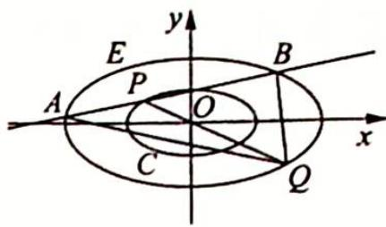
图 1

①作仿射变换 $\left\{\begin{aligned}x^{\prime}=x\\ y^{\prime}=2y\end{aligned}\right.$ ，则椭圆C变为圆 $C^{\prime}:x^{\prime2}+y^{\prime2}=4$ ，椭圆E变为圆 $E^{\prime}:x^{\prime2}+y^{\prime2}=16$ ，如图1所示，观察图像可知 $\frac{|OQ|}{|OP|}=\frac{|OQ^{\prime}|}{|OP^{\prime}|}=\frac{4}{2}=2.$

②由①中的仿射变换可知,变换后的图形如图2所示,根据图形可知,在点 $P'$ 的运动过程中, $\frac{|OQ'|}{|OP'|}=2$ ,所以 $S_{\triangle A'B'Q'}=3S_{\triangle A'B'O}$ ,固定点 $A'$ 不动,当点 $B'$ 在圆 $E'$ 上运动(保持直线 $A'B'$ 与圆 $C'$ 有交点)时, $\angle A'OB'\in\left[\frac{2\pi}{3},\pi\right]$ ,当且仅当直线 $A'B'$ 与圆 $C'$ 相切时, $\angle A'OB'=\frac{2\pi}{3}$ ,所以 $S_{\triangle OA'B'}=\frac{1}{2}|OA'||OB'|\sin\angle A'OB'=8\sin\angle A'OB'$ 的最大值为 $8\sin\frac{2\pi}{3}=4\sqrt{3}$ ,

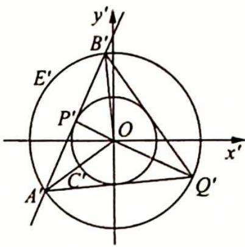
图 2

$S_{\triangle A^{\prime}B^{\prime}Q^{\prime}}=3S_{\triangle OA^{\prime}B^{\prime}}$ 的最大值为 $12\sqrt{3}$ ，故 $S_{\triangle ABQ}=\frac{1}{2}S_{\triangle A^{\prime}B^{\prime}Q^{\prime}}$ 的最大值为 $\frac{1}{2}\times12\sqrt{3}=6\sqrt{3}$ .

例 20.17 一种作图工具如图 1 所示. O 是滑槽 AB 的中点, 短杆 ON 可绕 O 转动, 长杆 MN 通过 N 处铰链与 ON 连接, MN 上的栓子 D 可沿滑槽 AB 滑动, 且 DN = ON = 1, MN = 3. 当栓子 D 在滑槽 AB 内作往复运动时, 带动 N 绕 O 转动一周 (D 不动时, N 也不动), M 处的笔尖画出的曲线记为 C. 以 O 为原点, AB 所在的直线为 x 轴建立如图 2 所示的平面直角坐标系.

(1)求曲线 C 的方程；

(2)设动直线 l 与两定直线 $l_{1}: x - 2y = 0$ 和 $l_{2}: x + 2y = 0$ 分别交于 P, Q 两点. 若直线 l 总与曲线 C 有且只有一个公共点, 试探究: $\triangle OPQ$ 的面积是否存在最小值? 若存在, 求出该最小值; 若不存在, 说明理由.

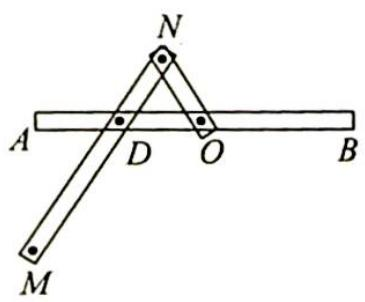
图 1

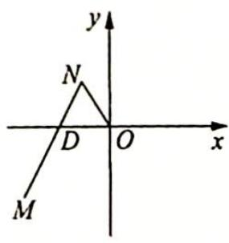
图 2

分析 ▶ (1) 找到 $N$ 点和 $M$ 点坐标之间的关系, $N$ 点在单位圆上运动, 利用相关点法求出 $M$ 点的轨迹方程; (2) 作仿射变换将椭圆变为圆, 求 $\triangle OPQ$ 面积最小时, 即求变换后的 $\triangle OP'Q'$ 的面积最小, 而 $S_{\triangle OP'Q'} = \frac{1}{2} |P'Q'| |OT'| = 2(|P'T'| + |Q'T'|)$ , 接下来用基本不等式及直角三角形中的射影定理求出最小值,再转换回椭圆中求 $\triangle OPQ$ 面积最小值.

解析 (1) 设点 $N(x_0, y_0)$ , $M(x, y)$ , 那么根据 $DN = ON$ 可得 $D(2x_0, 0)$ . 由题意得 $\overrightarrow{MD} = 2\overrightarrow{DN}$ , 所以 $(2x_0 - x, 0 - y) = 2(x_0 - 2x_0, y_0 - 0)$ , 即 $\left\{ \begin{array}{l} x_0 = \frac{1}{4} x \\ y_0 = -\frac{1}{2} y \end{array} \right.$ . 又因为 $ON = 1$ , 所以 $x_0^2 + y_0^2 = 1$ . 将 $\left\{ \begin{array}{l} x_0 = \frac{1}{4} x \\ y_0 = -\frac{1}{2} y \end{array} \right.$ 代入 $x_0^2 + y_0^2 = 1$ 得 $\frac{x^2}{16} + \frac{y^2}{4} = 1$ , 故曲线 $C$ 的方程为 $\frac{x^2}{16} + \frac{y^2}{4} = 1$ .

(2)如图3所示,作仿射变换 $\left\{\begin{aligned}x^{\prime}&=x\\ y^{\prime}&=2y\end{aligned}\right.$ ,则椭圆 $C:\frac{x^{2}}{16}+\frac{y^{2}}{4}=1$ 变为圆 $C^{\prime}:x^{\prime 2}+y^{\prime 2}=16$ ,圆 $C^{\prime}$ 的半径为4,变换前的直线 $l_{1}:x-2y=0$ 和 $l_{2}:x+2y=0$ ,变换后为 $l_{1}^{\prime}:x^{\prime}-y^{\prime}=0$ 和 $l_{2}^{\prime}:x^{\prime}+y^{\prime}=0$ 是互相垂直的直线, $P,Q$ 两点变换后为 $P^{\prime},Q^{\prime}$ 两点.因为直线 $l$ 总与椭圆 $C$ 有且只有一个公共点,所以直线 $l$ 与椭圆 $C$ 相切于点 $T$ ,切点 $T$ 变换后为点 $T^{\prime}$ ,直线 $l^{\prime}$ 与圆 $C^{\prime}$ 相切于点 $T^{\prime}$ ,所以变换后的 $\triangle OP^{\prime}Q^{\prime}$ 的面积为 $S_{\triangle OP^{\prime}Q^{\prime}}=\frac{1}{2}|P^{\prime}Q^{\prime}||OT^{\prime}|=2(|P^{\prime}T^{\prime}|+|Q^{\prime}T^{\prime}|)\geqslant4\sqrt{|P^{\prime}T^{\prime}||Q^{\prime}T^{\prime}|}=4|OT^{\prime}|=16$ (利用了直角三角形 $OP^{\prime}Q^{\prime}$ 中的射影定理: $|P^{\prime}T^{\prime}||Q^{\prime}T^{\prime}|=|OT^{\prime}|^{2}$ ),当且仅当 $|P^{\prime}T^{\prime}|=|Q^{\prime}T^{\prime}|$ ,即直线 $l^{\prime}$ 与坐标轴垂直时等号成立,所以当动直线 $l$ 与椭圆 $C$ 在四个顶点处相切时, $\triangle OPQ$ 的面积取得最小值为 $\frac{1}{2}S_{\triangle OP^{\prime}Q^{\prime}}=8$ .

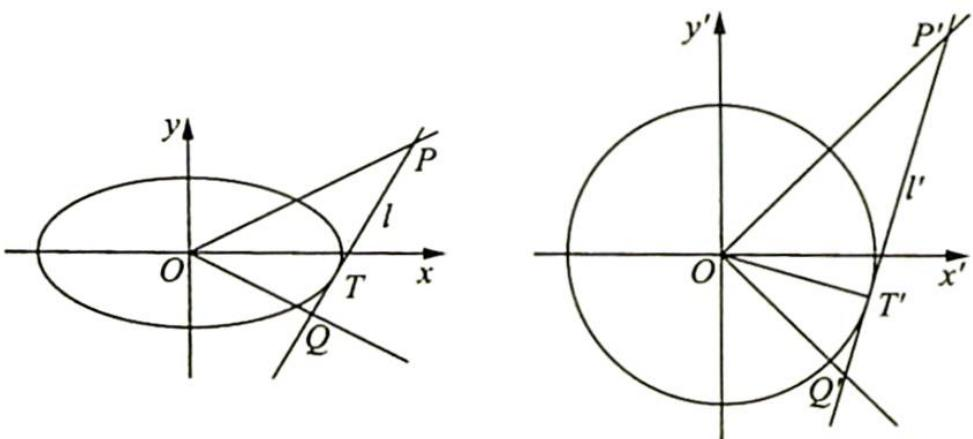
图3

例 20.18 (2011 年全国高中数学联赛河南省预赛试题)以原点 O 为圆心, 分别以 a, b (a > b > 0) 为半径作两个圆, 点 Q 是大圆半径 OP 与小圆的交点. 过点 P 作 $PN \perp x$ 轴, 垂足为点 N; 过点 Q 作 $Q M \perp P N$ , 垂足为点 M, 当半径 OP 绕点 O 旋转时, 点 M 的轨迹记为曲线 E.

(1) 求曲线 E 的方程；

(2)设 $A,B,C$ 为曲线 $E$ 上的三点并且满足 $\overrightarrow{OA} + \overrightarrow{OB} + \overrightarrow{OC} = 0$ ,求 $\triangle ABC$ 的面积.

分析 ▶ (1)点 $M$ 随着 $OP$ 的旋转而动, 所以引入参数 $\angle POx = \theta$ , 求出点 $M$ 的坐标,消参后便得点 $M$ 的轨迹方程; (2)作仿射变换将椭圆变为圆, 通过求仿射变换后 $\triangle A'B'C'$ 的面积来得出 $\triangle ABC$ 的面积. 而 $\triangle A'B'C'$ 的面积可通过分析 $\overrightarrow{OA} + \overrightarrow{OB} + \overrightarrow{OC} = 0$ 这一条件得出其几何特征来求面积.

解析 ▶▶ (1)如图1所示,设 $\angle POx=\theta$ ,则 $P(a\cos\theta,a\sin\theta),Q(b\cos\theta,b\sin\theta)$ ,因为 $QM\perp PN$ ,所以 $M(a\cos\theta,b\sin\theta)$ ,设 $\left\{\begin{aligned}x&=a\cos\theta\\ y&=b\sin\theta\end{aligned}\right.$ ,则消去参数θ得曲线E的方程为 $\frac{x^{2}}{a^{2}}+\frac{y^{2}}{b^{2}}=1$ .

(2)如图2所示,把xOy平面上所有点的横坐标不变,纵坐标变为原来的 $\frac{a}{b}$ 倍,即作仿射变换 $\left\{\begin{aligned} x^{\prime}=x \\ y^{\prime}=\frac{a}{b}y \end{aligned}\right.$ ，得到 $x^{\prime}Oy^{\prime}$ 平面,于是椭圆 $\frac{x^{2}}{a^{2}}+\frac{y^{2}}{b^{2}}=1$ 变成圆 $x^{\prime2}+y^{\prime2}=a^{2}$ ,点A,B,C变换后对应的点分别为 $A^{\prime},B^{\prime},C^{\prime}$ .

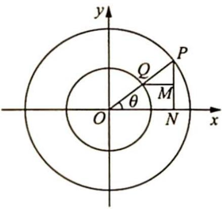
图1

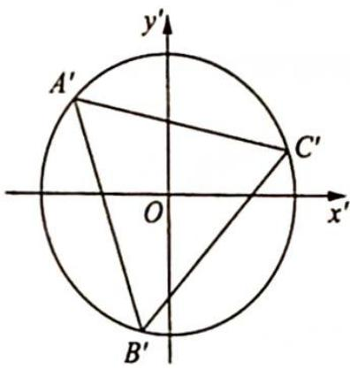
图2

解法一: 因为 $\overrightarrow{OA} + \overrightarrow{OB} + \overrightarrow{OC} = 0$ , 所以 $\triangle ABC$ 的重心是原点 O. 如图 3 所示.

设点 D, E, F 分别是 BC, CA, AB 的中点，则点 $D', E', F'$ 分别是 $B'C', C'A', A'B'$ 的中点，因为点 O 在线段 AD, BE, CF 上，所以点 O 在线段 $A'D', B'E', C'F'$ 上， $\triangle A'B'C'$ 的重心也是原点 O。由垂径定理易证 $\triangle A'B'C'$ 是正三角形，所以 $\triangle A'B'C'$ 的面积为 $\frac{3\sqrt{3}}{4}a^{2}$ ，则 $\triangle ABC$ 的面积为 $\frac{3\sqrt{3}}{4}a^{2} \div \frac{a}{b} = \frac{3\sqrt{3}}{4}ab$ 。

解法二:如图4所示,设 $\overrightarrow{OA}+\overrightarrow{OB}=\overrightarrow{OG}$ ,因为仿射变换把平行四边形OAGB变成平行四边形 $OA^{\prime}G^{\prime}B^{\prime}$ ,所以 $\overrightarrow{OA^{\prime}}+\overrightarrow{OB^{\prime}}=\overrightarrow{OG^{\prime}}$ ,又因为 $\overrightarrow{OG}+\overrightarrow{OC}=\mathbf{0}$ ,即点O为线段GC的中点,所以点O是线段 $G^{\prime}C^{\prime}$ 的中点， $\overrightarrow{OG^{\prime}} + \overrightarrow{OC^{\prime}} = 0$ ，即 $\overrightarrow{OA^{\prime}} + \overrightarrow{OB^{\prime}} + \overrightarrow{OC^{\prime}} = 0$ ，则由拉密定理得 $\frac{|\overrightarrow{OA^{\prime}}|}{\sin\angle B^{\prime}OC^{\prime}} = \frac{|\overrightarrow{OB^{\prime}}|}{\sin\angle C^{\prime}OA^{\prime}} = \frac{|\overrightarrow{OC^{\prime}}|}{\sin\angle A^{\prime}OB^{\prime}}$ ，即 $\angle B^{\prime}OC^{\prime} = \angle C^{\prime}OA^{\prime} = \angle A^{\prime}OB^{\prime} = 120^{\circ}$ ，故 $\triangle A^{\prime}B^{\prime}C^{\prime}$ 是正三角形， $\triangle A^{\prime}B^{\prime}C^{\prime}$ 的面积为 $\frac{3\sqrt{3}}{4}a^{2}$ ， $\triangle ABC$ 的面积为 $\frac{3\sqrt{3}}{4}a^{2} \div \frac{a}{b} = \frac{3\sqrt{3}}{4}ab$ 。

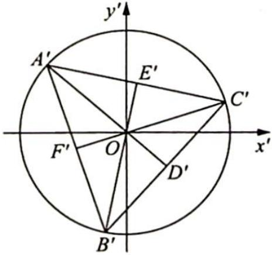
图3

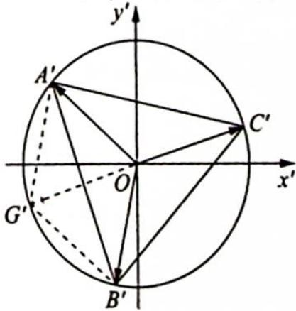
图 4

拉密定理: 在同一个平面内, 当三个共点力 $F_{1}, F_{2}, F_{3}$ 的合力为 0 时, 其中任意一个力的模长与其他两个力夹角正弦值的比值相等, 即

$$
\frac {\left| F _ {1} \right|}{\sin \langle F _ {2} , F _ {3} \rangle} = \frac {\left| F _ {2} \right|}{\sin \langle F _ {3} , F _ {1} \rangle} = \frac {\left| F _ {3} \right|}{\sin \langle F _ {1} , F _ {2} \rangle},
$$

这用正弦定理很容易证明.
