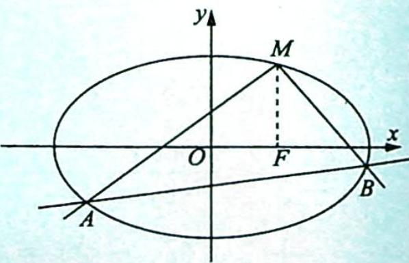
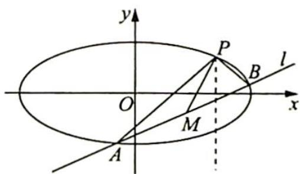
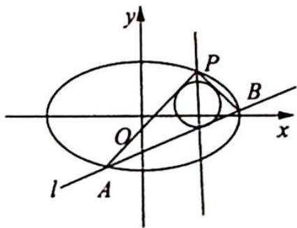

## 1. 斜率之和为 0

研究密钥

设椭圆方程 $\frac{x^{2}}{a^{2}}+\frac{y^{2}}{b^{2}}=1(a>b>0)$ ，在椭圆上取一点 $M\left(c,\frac{b^{2}}{a}\right)$ ，过点M作斜率互为相反数的两条直线交椭圆于A，B两点，则AB连线的斜率为定值，且此定值为椭圆离心率e。

【证明】如图所示,设直线 $MA: y = k(x - c) + \frac{b^2}{a} (k$ 存在且 $k \neq 0)$ ,与椭圆方程联立,得 $(b^2 + a^2 k^2)x^2 + (2ab^2k - 2a^2ck^2)x + b^4 + a^2c^2k^2 - 2ab^2ck - a^2b^2 = 0$ .

利用根与系数关系得 $x_{A} + x_{M} = \frac{2a^{2}ck^{2} - 2ab^{2}k}{b^{2} + a^{2}k^{2}}$ .

又 $x_{M} = c$ ，则 $x_{A} = \frac{a^{2}ck^{2} - 2ab^{2}k - b^{2}c}{b^{2} + a^{2}k^{2}}.$ 同理 $x_{B} = \frac{a^{2}ck^{2} + 2ab^{2}k - b^{2}c}{b^{2} + a^{2}k^{2}}$ ，所以 $k_{AB} = \frac{k(x_A + x_B - 2c)}{x_A - x_B} = \frac{k\left(\frac{2a^2ck^2 - 2b^2c}{b^2 + a^2k^2} - 2c\right)}{\frac{-4ab^2k}{b^2 + a^2k^2}} = \frac{\frac{-4b^2ck}{b^2 + a^2k^2}}{\frac{-4ab^2k}{b^2 + a^2k^2}} = \frac{c}{a} = e.$

显然, 当点 $M$ 在椭圆上运动时, 直线 $A B$ 的斜率有正有负, 那么其斜率是否仍为定值? 与点 $M$ 的坐标有什么关系? 从其他圆锥曲线能否探寻类似性质?

通过演算可以总结出以下性质：

性质1: 过椭圆或双曲线上任意一点 $M$ (不含顶点) 作斜率互为相反数的两条直线与圆锥曲线交于 $A, B$ 两点, 则直线 $AB$ 的斜率为定值. 具体如下:

(以焦点在 x 轴为例)过椭圆上一点 $M(m,n)$ 作斜率互为相反数的两条直线与椭圆交于 A, B 两点，则 $k_{AB} = \frac{b^{2}m}{a^{2}n} = (1 - e^{2}) \cdot \frac{m}{n}$ .

性质2: 过椭圆上任意一点 $M$ (不含顶点) 作斜率互为相反数的两条直线与圆锥曲线交于 $A, B$ 两点, 若点 $M$ 为椭圆通径与其在一、三象限的交点, 则直线 $A B$ 的斜率为椭圆离心率 $e$ . 两条性质是共性与个性的关系, 下面以椭圆为例证明性质1.

【证明】设直线 $MA: y = k(x - m) + n (k$ 存在且 $k \neq 0)$ , 与椭圆方程联立, 得 $(b^2 + a^2 k^2)x^2 - (2a^2 k^2 m - 2a^2 kn)x + a^2 n^2 + a^2 m^2 k^2 - 2a^2 mn k - a^2 b^2 = 0$ , 利用根与系数关系得 $x_A + x_M = \frac{2a^2 k^2 m - 2a^2 kn}{b^2 + a^2 k^2}$ .

又 $x_{M} = m$ ，则 $x_{A} = \frac{a^{2}k^{2}m - 2a^{2}kn - b^{2}m}{b^{2} + a^{2}k^{2}}.$ 同理 $x_{B} = \frac{a^{2}k^{2}m + 2a^{2}kn - b^{2}m}{b^{2} + a^{2}k^{2}}$ ，故 $k_{AB} =$

$$
\frac {k (x _ {A} + x _ {B} - 2 m)}{x _ {A} - x _ {B}} = \frac {k \left(\frac {2 a ^ {2} k ^ {2} m - 2 b ^ {2} m}{b ^ {2} + a ^ {2} k ^ {2}} - 2 m\right)}{\frac {- 4 a ^ {2} k n}{b ^ {2} + a ^ {2} k ^ {2}}} = \frac {\frac {- 4 b ^ {2} m k}{b ^ {2} + a ^ {2} k ^ {2}}}{\frac {- 4 a ^ {2} n k}{b ^ {2} + a ^ {2} k ^ {2}}} = \frac {b ^ {2} m}{a ^ {2} n} = (1 - e ^ {2}) \cdot \frac {m}{n}.
$$

例 21.4 已知椭圆 $C: \frac{x^2}{a^2} + \frac{y^2}{2} = 1$ 过点 $P(2,1)$ .

(1)求椭圆 C 的方程,并求其离心率;

(2)过点 P 作 x 轴的垂线 l，设点 A 为第四象限内一点且在椭圆 C 上（点 A 不在直线 l 上），点 A 关于 l 的对称点 $A'$ ，直线 $A'P$ 与椭圆 C 交于另一点 B，设 O 为原点，判断直线 AB 与直线 OP 的位置关系，并说明理由.

分析 ▶ OP 所在的直线斜率为 $\frac{1}{2}$ . 根据模型结论可得直线 AB 的斜率为 $(1-e^{2})\cdot\frac{m}{n}=$ $\left(1-\frac{3}{4}\right)\cdot\frac{2}{1}=\frac{1}{2}$ ，所以先猜测出结果为直线 AB 与直线 OP 平行，再证明。设直线 PA: y-1=$k(x-2)$ ，联立直线 PA 与椭圆方程，根据韦达定理可以表示出点 A 的横坐标，同理可以表示出点 B 的横坐标，将直线 AB 的斜率表示为关于点 A、点 B 横坐标的式子，代入化简即可求出直线 AB 的斜率.

解析 (1)由椭圆方程过点 $P(2,1)$ 可得 $a^2 = 8$ , 所以 $c^2 = a^2 - 2 = 8 - 2 = 6$ , 则椭圆 $C$ 的方程为 $\frac{x^2}{8} + \frac{y^2}{2} = 1$ , 离心率 $e = \frac{\sqrt{6}}{2\sqrt{2}} = \frac{\sqrt{3}}{2}$ .

(2) 直线 $AB$ 与直线 $OP$ 平行, 证明如下:

OP 所在的直线斜率为 $\frac{1}{2}$ ，设 $A(x_{1}, y_{1})$ ， $B(x_{2}, y_{2})$ ，直线 PA 的斜率为 k，PA: y - 1 = k(x - 2).

联立 $\left\{ \begin{array}{l} y - 1 = k(x - 2) \\ x^2 + 4y^2 = 8 \end{array} \right.$ ，消 $y$ 建立关于 $x$ 的一元二次方程，即 $x^2 + 4[k(x - 2) + 1]^2 = 8$ ，整理得 $(4k^2 + 1)x^2 + (8k - 16k^2)x + 16k^2 - 16k - 4 = 0$ ，则 $x_1 + 2 = \frac{16k^2 - 8k}{4k^2 + 1}, x_1 = \frac{8k^2 - 8k - 2}{4k^2 + 1}$ ，同理可得 $x_2 = \frac{8k^2 + 8k - 2}{4k^2 + 1}$ .

$$
k _ {A B} = \frac {y _ {2} - y _ {1}}{x _ {2} - x _ {1}} = \frac {[ - k (x _ {2} - 2) + 1 ] - [ k (x _ {1} - 2) + 1 ]}{x _ {2} - x _ {1}} = \frac {- k (x _ {1} + x _ {2} - 4)}{x _ {2} - x _ {1}} = \frac {- k \left(\frac {1 6 k ^ {2} - 4}{4 k ^ {2} + 1} - 4\right)}{\frac {1 6 k}{4 k ^ {2} + 1}} =
$$

$\frac{-k\left(\frac{-8}{4k^2 + 1}\right)}{\frac{16k}{4k^2 + 1}} = \frac{1}{2} = k_{OP}$ ，即 $k_{AB} = k_{OP}$ ，因此 $OP / / AB$

变式(7) (2021年江苏省G4联考)如图所示,已知椭圆 $C: \frac{x^2}{a^2} + \frac{y^2}{b^2} = 1 (a > b > 0)$ 经过点 $P(2,1)$ ,且离心率为 $\frac{\sqrt{3}}{2}$ , 直线 $l$ 与椭圆交于 $A$ , $B$ 两点, 线段 $AB$ 的中点为 $M$ .

(1)求椭圆 C 的方程；

(2)若 $\angle APB$ 的角平分线与 $x$ 轴垂直,求 $|PM|$ 长度的最小值.

解析 (1)由题意可知, $e=\frac{c}{a}=\frac{\sqrt{3}}{2}$ ,得 $\frac{b}{a}=\frac{1}{2},\frac{b^{2}}{a^{2}}=\frac{1}{4}$ ,即 $a^{2}=4b^{2}$ ,所以 $\frac{x^{2}}{4b^{2}}+\frac{y^{2}}{b^{2}}=1$ 过点 $P(2,1)$ ，即 $\frac{4}{4b^{2}}+\frac{1}{b^{2}}=1$ ，得 $\frac{2}{b^{2}}=1,b^{2}=2,a^{2}=8$ ，故椭圆C的方程为 $\frac{x^{2}}{8}+\frac{y^{2}}{2}=1$ .

(2)解法一(坐标法:建立目标函数):如图所示,由题意得 $P(2,1)$ , $k_{OP}=k_{AB}=\frac{1}{2}$ , AB:y=$\frac{1}{2} x + m, \left\{ \begin{array}{l} y = \frac{1}{2} x + m \\ x^2 + 4y^2 = 8 \end{array} \right.$ , 消 $y$ 得 $x^2 + 4\left(\frac{1}{4} x^2 + m^2 + mx\right) - 8 = 0$ , 即 $2x^2 + 4mx + 4m^2 - 8 = 0, x^2 + 2mx + 2m^2 - 4 = 0, \Delta = 4m^2 - 4(2m^2 - 4) > 0$ , 亦即 $m^2 - 2m^2 + 4 > 0$ , 所以 $-2 < m < 2$ .

又 $\left\{ \begin{array}{l} x_{1} + x_{2} = -2m \\ x_{1}x_{2} = 2m^{2} - 4 \end{array} \right., M\left(-m, \frac{m}{2}\right), |PM|^{2} = (2 + m)^{2} + \left(1 - \frac{m}{2}\right)^{2} = 4 + m^{2} + 4m + \frac{m^{2}}{4} - m + 1 = \frac{5m^{2}}{4} + 3m + 5.$

对称轴 $m = -\frac{6}{5}, |PM|_{\min}^2 = \frac{5 \times \frac{36}{25}}{4} - \frac{18}{5} + 5 = \frac{9 - 18 + 25}{5} = \frac{16}{5}$ , 所以 $|PM|_{\min} = \frac{4}{\sqrt{5}} = \frac{4\sqrt{5}}{5}$ .

解法二(数形结合:转化为点到直线的距离):同解法一可得 $M\left(-m,\frac{m}{2}\right)$ ,所以 $OM$ 所在的直线方程为 $l':y=-\frac{1}{2}x$ ,即 $x+2y=0$ ,又 $P(2,1)$ , $d(P,l')=\frac{|2+2|}{\sqrt{5}}=\frac{4\sqrt{5}}{5}$ .因此 $|PM|_{\min}=\frac{4}{\sqrt{5}}=\frac{4\sqrt{5}}{5}$ .

变式(2) (2011 高中数学联赛)作斜率为 $\frac{1}{3}$ 的直线 $l$ 与椭圆 $\frac{x^{2}}{36}+\frac{y^{2}}{4}=$ 1交于 $A, B$ 两点(如图所示), 且 $P(3\sqrt{2}, \sqrt{2})$ 在直线 $l$ 的左上方.

(1)证明: $\triangle PAB$ 的内切圆的圆心在一条定直线上;

(2)若 $\angle APB=60^{\circ}$ ,求 $\triangle PAB$ 的面积.

分析 ▶ (1) $\triangle PAB$ 内切圆的圆心一定在 $\angle APB$ 的平分线上, 所以只需要证明 $k_{PA} + k_{PB} = 0$ . (2) 因为 $\angle APB = 60^{\circ}$ , 所以 $k_{PA} = \sqrt{3}, k_{PB} = -\sqrt{3}$ , 可得 $PA: y - \sqrt{2} = \sqrt{3} (x - 3\sqrt{2})$ , 与椭圆方程联立可得弦长 $|PA|$ , 同理可得 $|PB|$ , 则 $\triangle PAB$ 的面积为 $\frac{1}{2} |PA||PB| \sin 60^{\circ}$ .

解析 (1) $\triangle PAB$ 内切圆的圆心一定在 $\angle APB$ 的平分线上, 本题的目的是证明 $k_{PA} + k_{PB} = 0$ .

设 $A(x_{1},y_{1}), B(x_{2},y_{2}), P(3\sqrt{2},\sqrt{2})$ ，将坐标原点平移到点 $P(3\sqrt{2},\sqrt{2})$ ，则新坐标与原坐标的关系为 $\left\{\begin{aligned} x^{\prime}&=x-3\sqrt{2}\\ y^{\prime}&=y-\sqrt{2}\end{aligned}\right.$ ， $\left\{\begin{aligned} x&=x^{\prime}+3\sqrt{2}\\ y&=y^{\prime}+\sqrt{2}\end{aligned}\right.$ ，代入椭圆 $\frac{x^{2}}{36}+\frac{y^{2}}{4}=1$ 中，可得 $\frac{(x^{\prime}+3\sqrt{2})^{2}}{36}+\frac{(y^{\prime}+\sqrt{2})^{2}}{4}=1$ ，即 $(x^{\prime}+3\sqrt{2})^{2}+9(y^{\prime}+\sqrt{2})^{2}=36, x^{\prime2}+9y^{\prime2}+6\sqrt{2}(x^{\prime}+3y^{\prime})=0.$

设 $l: mx' + ny' = 1$ ，则 $y' = -\frac{m}{n} x' + \frac{1}{n}, -\frac{m}{n} = \frac{1}{3} \Rightarrow n + 3m = 0$ ，故 $x'^2 + 9y'^2 + 6\sqrt{2}(x' + 3y') (mx' + ny') = 0, x'^2 + 9y'^2 + 6\sqrt{2} (mx'^2 + nx'y' + 3mx'y' + 3ny'^2) = 0,$

$$
(6 \sqrt {2} m + 1) x ^ {\prime 2} + (1 8 \sqrt {2} n + 9) y ^ {\prime 2} + 6 \sqrt {2} (n + 3 m) x ^ {\prime} y ^ {\prime} = 0, (1 8 \sqrt {2} n + 9) \left(\frac {y ^ {\prime}}{x ^ {\prime}}\right) ^ {2} + 6 \sqrt {2} (n + 3 m) \cdot
$$

$\frac{y'}{x'} + (6\sqrt{2}m + 1) = 0, k_{PA} + k_{PB} = \frac{y_1}{x_1} + \frac{y_2}{x_2} = -\frac{6\sqrt{2}(n + 3m)}{18\sqrt{2}n + 9} = 0$ ，则 $k_{PA} + k_{PB} = 0$ .

所以 $\triangle PAB$ 的内切圆的圆心一定在一条定直线 $l: x=3\sqrt{2}$ 上.

(2)在第(1)问的前提下,求第(2)问 $\triangle PAB$ 的面积.

由题意得 $k_{PA}=\sqrt{3}$ ， $k_{PB}=-\sqrt{3}$ ，PA: $y-\sqrt{2}=\sqrt{3}(x-3\sqrt{2})$ ，即 $y=\sqrt{3}x-3\sqrt{6}+\sqrt{2}$ .

联立方程 $\left\{\begin{aligned}\frac{x^{2}}{36}+\frac{y^{2}}{4}=1\\ y=\sqrt{3}x-3\sqrt{6}+\sqrt{2}\end{aligned}\right.$ ，消y得 $14x^{2}+9\sqrt{6}(1-3\sqrt{3})x+18(13-3\sqrt{3})=0.$

因为上式两根分别是 $x_{1}, 3\sqrt{2}$ , 所以 $x_{1} = \frac{3\sqrt{2}(13 - 3\sqrt{3})}{14}$ , 则 $|PA| = \sqrt{1 + (\sqrt{3})^{2}} \cdot |x_{1} - 3\sqrt{2}| = \frac{3\sqrt{2}(3\sqrt{3} + 1)}{7}$ . 同理 $|PB| = \frac{3\sqrt{2}(3\sqrt{3} - 1)}{7}$ .

$$
S _ {\triangle P A B} = \frac {1}{2} | P A | | P B | \sin 6 0 ^ {\circ} = \frac {1}{2} \times \frac {1 8}{4 9} \times 2 6 \times \frac {\sqrt {3}}{2} = \frac {9 \times 1 3 \sqrt {3}}{4 9} = \frac {1 1 7 \sqrt {3}}{4 9}.
$$

## 变换条件 举一反三

若本题第(2)问中不直接给出 $\angle APB=60^{\circ}$ 的条件,而是直接让大家求 $S_{\triangle PAB}$ 的最值,又该如何计算?试一试.

【分析】先设直线 $AB: y = \frac{1}{3} x + m$ , 求弦长 $|AB|$ , 再求 $d(P, AB)$ , 从而表示出 $\triangle PAB$ 的面积来求最值.

【解析】 $\left\{\begin{aligned}y&=\frac{1}{3}x+m\\ x^{2}&+9y^{2}=36\end{aligned}\right.$ ，消 y 得 $2x^{2}+6mx+9m^{2}-36=0$ ，

$$
\Delta = 3 6 m ^ {2} - 4 \times 2 \times (9 m ^ {2} - 3 6) > 0 \Rightarrow 3 6 m ^ {2} - 7 2 m ^ {2} + 3 6 \times 8 > 0 \Rightarrow m ^ {2} <   8
$$

$$
x _ {1} + x _ {2} = - \frac {6 m}{2} = - 3 m
$$

$$
x _ {1} x _ {2} = \frac {9 m ^ {2} - 3 6}{2}
$$

$$
\vert A B \vert = \sqrt {1 + \left(\frac {1}{3}\right) ^ {2}} \vert x _ {1} - x _ {2} \vert = \sqrt {\frac {1 0}{9}} \sqrt {(x _ {1} + x _ {2}) ^ {2} - 4 x _ {1} x _ {2}} = \frac {\sqrt {1 0}}{3} \sqrt {(- 3 m) ^ {2} - 4 \cdot \frac {9 m ^ {2} - 3 6}{2}} =
$$

$$
\frac {\sqrt {1 0}}{3} \sqrt {9 m ^ {2} - 2 (9 m ^ {2} - 3 6)} = \frac {\sqrt {1 0}}{3} \sqrt {7 2 - 9 m ^ {2}}.
$$

$$
d (P, A B) = \frac {\left| \frac {1}{3} \times 3 \sqrt {2} - \sqrt {2} + m \right|}{\sqrt {1 + \frac {1}{9}}} = \frac {| m |}{\frac {\sqrt {1 0}}{3}} = \frac {3 | m |}{\sqrt {1 0}}, S _ {\triangle P A B} = \frac {1}{2} \cdot \frac {\sqrt {1 0}}{3} \cdot \sqrt {7 2 - 9 m ^ {2}} \cdot \frac {3 | m |}{\sqrt {1 0}} =
$$

$\frac{3|m|}{2}\cdot\sqrt{8-m^{2}}\leqslant\frac{3}{2}\cdot\frac{m^{2}+8-m^{2}}{2}=\frac{3}{2}\times4=6.$ （当且仅当 $|m|=\sqrt{8-m^{2}}$ ，即 $m^{2}=8-m^{2}$ ，
m=±2时取“=”）

因此, $\triangle PAB$ 面积的最大值为6,此时 $m=\pm2$ ,直线 $AB:y=\frac{1}{3}x\pm2$ .

变式(3) (2022 全国新高考 I 卷 21) 已知点 A(2,1) 在双曲线 C: $\frac{x^{2}}{a^{2}} - \frac{y^{2}}{a^{2} - 1} = 1 (a > 1)$ 上, 直线 l 交 C 于 P, Q 两点, 直线 AP, AQ 的斜率之和为 0.

(1) 求 $l$ 的斜率；

(2) 若 $\tan\angle PAQ=2\sqrt{2}$ ，求 $\triangle PAQ$ 的面积.

解析 ▶ 解法一: (1) 因为点 A 在双曲线 C 上, 则 $\frac{4}{a^{2}} - \frac{1}{a^{2} - 1} = 1$ , 解得 $a^{2} = 2$ , 所以 $C: \frac{x^{2}}{2} - y^{2} = 1$ .

设 $P(x_{1},y_{1}),Q(x_{2},y_{2})$ ，直线 $l:y = kx + m$ ，联立直线 $l$ 与双曲线 $C:\left\{ \begin{array}{l}y = kx + m\\ \frac{x^2}{2} -y^2 = 1 \end{array} \right.$ 可得 $(1 - 2k^{2})x^{2} - 4kmx - 2m^{2} - 2 = 0$ ，则 $\left\{ \begin{array}{l}x_1 + x_2 = \frac{4km}{1 - 2k^2}\\ x_1x_2 = \frac{-2m^2 - 2}{1 - 2k^2} \end{array} \right.$

又直线 $AP, AQ$ 的斜率之和为 0 , 则 $k_{AP} + k_{AQ} = \frac{y_1 - 1}{x_1 - 2} + \frac{y_2 - 1}{x_2 - 2} = 0$ , 即 $(kx_1 + m - 1)(x_2 - 2) + (kx_2 + m - 1)(x_1 - 2) = 0$ , 整理得 $2k x_1 x_2 + (m - 1 - 2k)(x_1 + x_2) - 4m + 4 = 0$ , 代入韦达定理, 等式两侧同乘 $1 - 2k^2$ , 可得 $2k(-2m^2 - 2) + 4km(m - 1 - 2k) + (4 - 4m)(1 - 2k^2) = 0$ , 整理得 $2k^2 + km + k + m - 1 = 0$ . 方程等价于 $2k^2 + km - k + 2k + m - 1 = 0$ , 即 $(k + 1)(2k + m - 1) = 0$ , 解得 $k = -1$ 或 $2k + m - 1 = 0$ .

若 $2k + m - 1 = 0$ ，直线 $l: y = kx + 1 - 2k$ ，过定点 $A(2,1)$ ，不合题意，舍去.

综上，k=-1，所以 l 的斜率为 -1。

(2)因为直线 $AP, AQ$ 的斜率之和为 0 , 则 $x = 2$ 是 $\angle PAQ$ 的角平分线, 设 $\angle PAQ = 2\theta$ , 则 $\tan 2\theta = \frac{2\tan\theta}{1 - \tan^2\theta} = 2\sqrt{2}$ , 即 $\sqrt{2}\tan^2\theta + \tan\theta - \sqrt{2} = 0$ .

又 $\tan \theta > 0$ ，解得 $\tan \theta = \frac{\sqrt{2}}{2}$ ，则直线 $AP$ 的倾斜角为 $\frac{\pi}{2} - \theta$ ，斜率 $k_{1} = \tan \left(\frac{\pi}{2} - \theta\right) = \frac{1}{\tan \theta} = \sqrt{2}$ ，

故 $l_{AP}:y=\sqrt{2}(x-2)+1.$

联立直线 $AP$ 与双曲线 $C$ 的方程, 可得 $x_{A}x_{1}=2x_{1}=\frac{2(10-4\sqrt{2})}{3}$ , 则 $x_{1}=\frac{10-4\sqrt{2}}{3}, y_{1}=\sqrt{2}(x_{1}-2)+1=\frac{4\sqrt{2}-5}{3}$ . 因为直线 $l: y=-x+m$ , 代入点 $P$ 可得 $\frac{4\sqrt{2}-5}{3}=\frac{4\sqrt{2}-10}{3}+m, m=\frac{5}{3}$ , 联立 $\left\{\begin{aligned}&\frac{x^{2}}{2}-y^{2}=1\\&y=-x+\frac{5}{3}\end{aligned}\right.$ , 消 $y$ 得 $x^{2}-\frac{20}{3}x+\frac{68}{9}=0$ , 则 $\left\{\begin{aligned}&x_{1}+x_{2}=\frac{20}{3}\\&x_{1}x_{2}=\frac{68}{9}\end{aligned}\right.$ .

因为 $|AP| = \sqrt{1 + k_1^2}\left|x_1 - 2\right| = \sqrt{3}\left|x_1 - 2\right|$ ，同理可得 $|AQ| = \sqrt{3}\left|x_2 - 2\right|$ 。又 $\tan 2\theta = 2\sqrt{2}$ ，所以 $\sin 2\theta = \frac{2\sqrt{2}}{3}$ ，所以 $S_{\triangle PAQ} = \frac{1}{2}|AP||AQ|\sin 2\theta = \sqrt{2}\left|x_1x_2 - 2(x_1 + x_2) + 4\right| = \frac{16\sqrt{2}}{9}$ 。

解法二:(1) $\frac{4}{a^{2}}-\frac{1}{a^{2}-1}=1\Rightarrow4a^{2}-4-a^{2}=a^{4}-a^{2}$ ，所以 $(a^{2}-2)^{2}=0,a^{2}=2$ ，故 $C:\frac{x^{2}}{2}-y^{2}=1$ .

如图所示, 坐标平移齐次化, 建立新坐标系 $x^{\prime} A y^{\prime}$ , 可得 $\left\{ \begin{array}{l} x = x^{\prime} + 2 \\ y = y^{\prime} + 1 \end{array} , C: \frac{(x^{\prime} + 2)^{2}}{2} - (y^{\prime} + 1)^{2} = 1, x^{\prime 2} + 4 x^{\prime} - 2 y^{\prime 2} - 4 y^{\prime} = 0. \right.$

令 $PQ: mx' + ny' = 1, P(x_{1}', y_{1}')$ , $Q(x_{2}', y_{2}')$ , $x'^{2} + 4x'(mx' + ny') - 2y'^{2} - 4y'(mx' + ny') = 0 \Leftrightarrow (2 + 4n)\left(\frac{y'}{x'}\right)^{2} + (4m - 4n)\frac{y'}{x'} - 4m - 1 = 0.$

因为 $k_{AP} + k_{AQ} = 0$ ，所以 $\frac{4m - 4n}{2 + 4n} = 0$ ，即 m = n, $k_{l} = -\frac{m}{n} = -1$ .

(2) 设 $y'$ 轴与 $x$ 轴交点为 $B$ ，令 $\angle PAB = \theta$ ，则 $\tan 2\theta = 2\sqrt{2} = \frac{2\tan\theta}{1 - \tan^2\theta}$ ，解得 $\tan \theta = \frac{\sqrt{2}}{2}$ ，所以 $k_{AP} = \sqrt{2}, k_{AQ} = -\sqrt{2}$ ，直线 $AP: \begin{cases} y' = \sqrt{2}x' \\ x'^2 + 4x' - 2y'^2 - 4y' = 0 \end{cases}$ ，消 $y'$ 得 $-3x'^2 + (4 - 4\sqrt{2})x' = 0$ ， $x_1' = \frac{4 - 4\sqrt{2}}{3}$ .

$|PA|=\sqrt{1+2}\cdot|x_{1}^{\prime}|=\sqrt{3}\times\frac{4\sqrt{2}-4}{3}=\frac{4\sqrt{6}-4\sqrt{3}}{3}$ ，同理 $x_{2}^{\prime}=\frac{4+4\sqrt{2}}{3}$ ， $|AQ|=\sqrt{1+2}|x_{2}^{\prime}|=$ $\sqrt{3}\times\frac{4\sqrt{2}+4}{3}=\frac{4\sqrt{6}+4\sqrt{3}}{3}.$

所以 $S_{\triangle PAQ} = \frac{1}{2}|AP||AQ|\sin 2\theta = \frac{1}{2}\times \frac{4\sqrt{6} - 4\sqrt{3}}{3}\times \frac{4\sqrt{6} + 4\sqrt{3}}{3}\times \frac{2\sqrt{2}}{3} = \frac{16\sqrt{2}}{9}.$
