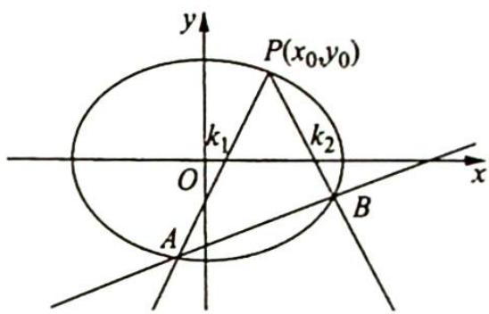

## 21.1 直线定向或过定点模型及延伸

在解析几何中, 定点与定值问题常常是伴随状态, 如两相交直线的斜率乘积为定值 $\lambda \left( \lambda \neq \frac{b^{2}}{a^{2}} \right)$ 时, 第三条直线过定点; 若两相交直线斜率之和为定值 $\lambda (\lambda \neq 0)$ 时, 第三条直线也过定点. 反之, 亦成立. 除特例外, 我们可将两个模型统一研究, 实际上是定点问题的两个侧面. 以椭圆为例, 我们将二者统一.

如图所示, 已知 $P(x_0, y_0)$ 是椭圆 $C: \frac{x^2}{a^2} + \frac{y^2}{b^2} = 1 (a > b > 0)$ 上一点, 过 $P$ 作斜率为 $k_1, k_2$ 的两条直线分别与椭圆交于 $A, B$ 两点.

(1) 若 $k_{1}k_{2} = \lambda \left( \lambda \neq \frac{b^{2}}{a^{2}} \right)$ ，则直线 AB 过定点 $\left( \frac{\lambda a^{2} + b^{2}}{\lambda a^{2} - b^{2}} x_{0}, -\frac{\lambda a^{2} + b^{2}}{\lambda a^{2} - b^{2}} y_{0} \right)$ .

(2) 若 $k_{1} + k_{2} = \lambda (\lambda \neq 0)$ , 则直线 $AB$ 过定点 $\left(x_{0} - \frac{2y_{0}}{\lambda}, -y_{0} - \frac{2x_{0}b^{2}}{\lambda a^{2}}\right)$ .
